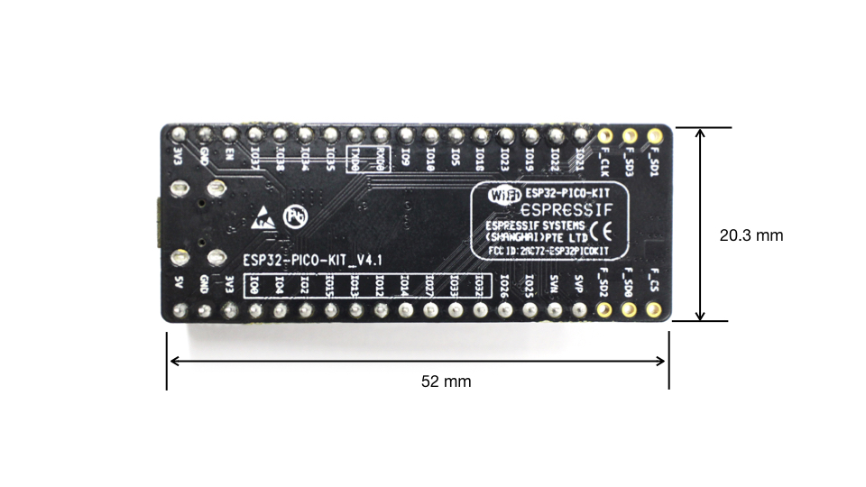

ESP32-PICO-KIT V4 入门指南
============================
:link_to_translation:`en:[English]`

本指南介绍了如何开始使用 ESP32-PICO-KIT V4 迷你开发板。有关 ESP32-PICO-KIT 其他版本的介绍，请见 :doc:`../hw-reference/index`。

准备工作
--------

* 1 × :ref:`ESP32-PICO-KIT V4 迷你开发板 <get-started-pico-kit-v4-board-front>`
* 1 × USB A/Micro USB B 电缆
* 1 × PC（Windows、Linux 或 Mac OS 操作系统）

如果您希望直接开始使用 ESP32-PICO-KIT，请见章节 `应用程序开发`_.

简介
----

ESP32-PICO-KIT V4 是一款来自 `乐鑫 <https://espressif.com>`_ 的开发板，其核心采用了具有完整 Wi-Fi 和蓝牙功能的 ESP32 系列 SIP 模组 ESP32-PICO-D4。与其他 ESP32 系列模组相比，ESP32-PICO-D4 模组已将 40 MHz 晶体振荡器、4 MB flash、滤波电容及射频匹配链路等所有外围器件无缝集成进封装内，无需外围元器件即可工作。这将大大降低了用户额外采购元器件的数量和成本，及额外组装测试的复杂度。

ESP32-PICO-KIT V4  集成了一个 USB-UART 桥接电路，可连接至 PC 的 USB 端口进行下载和调试。

为了便于连接，ESP32-PICO-D4 上的所有 IO 信号和系统电源管脚均通过开发板两侧焊盘（每侧 20 个 x 0.1 英寸间隔）引出。为了方便杜邦线的使用，ESP32-PICO-KIT V4 开发板每侧的 20 个焊盘中，有 17 个引出至排母，另外 3 个靠近天线的焊盘未引出，可供用户日后焊接使用。

.. note::

    1. 每排未引出至排母的 3 个管脚已连接至 ESP32-PICO-D4 SIP 模组的内置 flash 模块。更多信息，请见 `相关文档`_ 中的模组技术规格书。
    2. 较早版本的 ESP32-PICO-D4 开发板默认采用排针。

ESP32-PICO-KIT V4 开发板的尺寸为 52 x 20.3 x 10 mm (2.1" x 0.8" x 0.4")，具体请见 `开发板尺寸`_ 章节。本迷你开发板的功能框图如下图所示。

.. figure:: ../../_static/esp32-pico-kit-v4-functional-block-diagram.png
    :align: center
    :alt: ESP32-PICO-KIT V4 功能框图
    :figclass: align-center

    ESP32-PICO-KIT V4 功能框图

功能说明
--------

ESP32-PICO-KIT V4 开发板的主要元件、接口及控制方式如下文所示。

ESP32-PICO-D4
    ESP32-PICO-KIT V4 开发板上焊接的标准 ESP32-PICO-D4 模组，集成了 ESP32 芯片的完整系统，仅需连接天线、LC 匹配电路、退耦电容和 EN 信号上拉电阻即可正常工作。

LDO
    5V-to-3.3V 低压差稳压器

USB-UART 桥接器
    单芯片 USB-UART 桥接器，可提供高达 1 Mbps 的传输速率。

Micro USB 接口
    USB 接口，可用作电路板的供电电源及连接 PC 端的通信接口。

LED 电源指示灯
    当开发板通电后（USB 或外部 5 V），该指示灯将亮起。更多信息，请见 `相关文档`_ 中的原理图。
        
I/O
    ESP32-PICO-D4 上的所有管脚均通过开发板的排母引出。用户可以对 ESP32 进行编程，实现 PWM、ADC、DAC、I2C、I2S、SPI 等多种功能。更多信息，请见章节 `管脚说明`_。

BOOT 键
    按下 BOOT 键并保持，同时按一下 EN 键（此时不要松开 BOOT 键）进入固件下载模式，通过串口下载固件。
    
EN 键
    复位键，可重置系统。

.. _get-started-pico-kit-v4-board-front:

.. figure:: ../../_static/esp32-pico-kit-v4.1-f-layout.jpeg
    :align: center
    :alt: ESP32-PICO-KIT V4 开发板布局
    :figclass: align-center

    ESP32-PICO-KIT V4 开发板布局

电源选项
--------

ESP32-PICO-KIT V4 支持以下几种供电模式：

1. Micro USB 接口供电（默认）
2. 5V/GND 管脚供电
3. 3V3/GND 管脚供电

.. warning::

    上述供电模式不可同时连接，否则可能会损坏电路板和/或电源。

应用程序开发
------------

在 ESP32-PICO-KIT V4 上电前，请首先确认电路板完好无损。

有关应用程序开发的具体步骤，请见章节 :doc:`index`：

* :ref:`设置 Toolchain <get-started-setup-toolchain>`，以便用 C 语言开发应用
* :ref:`连接 <get-started-connect>` 模组至 PC，并确认访问状态
* :ref:`构建并向 ESP32 烧录 example <get-started-build-and-flash>`
* :ref:`即刻监测 <get-started-monitor>` 应用程序的动作

管脚说明
--------

下表介绍了开发板 I/O 管脚的 **名称** 和 **功能**，具体布局请见 `相关文档`_ 中的原理图。请参考 :ref:`get-started-pico-kit-v4-board-front` 。

Header J2
"""""""""

======  =================  ======  ======================================================
编号     名称                类型     功能
======  =================  ======  ======================================================
1       FLASH_SD1 (FSD1)   I/O     | GPIO8, SD_DATA1, SPID, HS1_DATA1 :ref:`(1) <get-started-pico-kit-v4-pin-notes>` , U2CTS
2       FLASH_SD3 (FSD3)   I/O     | GPIO7, SD_DATA0, SPIQ, HS1_DATA0 :ref:`(1) <get-started-pico-kit-v4-pin-notes>` , U2RTS
3       FLASH_CLK (FCLK)   I/O     | GPIO11, SD_CMD, SPICS0, HS1_CMD :ref:`(1) <get-started-pico-kit-v4-pin-notes>` , U1RTS
4       IO21               I/O     | GPIO21, VSPIHD, EMAC_TX_EN
5       IO22               I/O     | GPIO22, VSPIWP, U0RTS, EMAC_TXD1
6       IO19               I/O     | GPIO19, VSPIQ, U0CTS, EMAC_TXD0
7       IO23               I/O     | GPIO23, VSPID, HS1_STROBE
8       IO18               I/O     | GPIO18, VSPICLK, HS1_DATA7
9       IO5                I/O     | GPIO5, VSPICS0, HS1_DATA6, EMAC_RX_CLK
10      IO10               I/O     | GPIO10, SD_DATA3, SPIWP, HS1_DATA3, U1TXD
11      IO9                I/O     | GPIO9, SD_DATA2, SPIHD, HS1_DATA2, U1RXD
12      RXD0               I/O     | GPIO3, U0RXD :ref:`(4) <get-started-pico-kit-v4-pin-notes>` , CLK_OUT2
13      TXD0               I/O     | GPIO1, U0TXD :ref:`(4) <get-started-pico-kit-v4-pin-notes>` , CLK_OUT3, EMAC_RXD2
14      IO35               I       | ADC1_CH7, RTC_GPIO5
15      IO34               I       | ADC1_CH6, RTC_GPIO4
16      IO38               I       | GPIO38, ADC1_CH2, ADC_PRE_AMP :ref:`(2b) <get-started-pico-kit-v4-pin-notes>` , RTC_GPIO2
17      IO37               I       | GPIO37, ADC_PRE_AMP :ref:`(2a) <get-started-pico-kit-v4-pin-notes>` , ADC1_CH1, RTC_GPIO1
18      EN                 I       | CHIP_PU
19      GND                P       | Ground
20      VDD33 (3V3)        P       | 3.3V 电源
======  =================  ======  ======================================================

Header J3
"""""""""

======  =================  ======  ======================================================
编号     名称                类型     功能
======  =================  ======  ======================================================
1       FLASH_CS (FCS)     I/O     | GPIO16, HS1_DATA4 :ref:`(1) <get-started-pico-kit-v4-pin-notes>` , U2RXD, EMAC_CLK_OUT
2       FLASH_SD0 (FSD0)   I/O     | GPIO17, HS1_DATA5 :ref:`(1) <get-started-pico-kit-v4-pin-notes>` , U2TXD, EMAC_CLK_OUT_180
3       FLASH_SD2 (FSD2)   I/O     | GPIO6, SD_CLK, SPICLK, HS1_CLK :ref:`(1) <get-started-pico-kit-v4-pin-notes>` , U1CTS 
4       SENSOR_VP (FSVP)   I       | GPIO36, ADC1_CH0, ADC_PRE_AMP :ref:`(2a) <get-started-pico-kit-v4-pin-notes>` , RTC_GPIO0
5       SENSOR_VN (FSVN)   I       | GPIO39, ADC1_CH3, ADC_PRE_AMP :ref:`(2b) <get-started-pico-kit-v4-pin-notes>` , RTC_GPIO3
6       IO25               I/O     | GPIO25, DAC_1, ADC2_CH8, RTC_GPIO6, EMAC_RXD0
7       IO26               I/O     | GPIO26, DAC_2, ADC2_CH9, RTC_GPIO7, EMAC_RXD1
8       IO32               I/O     | 32K_XP :ref:`(3a) <get-started-pico-kit-v4-pin-notes>` , ADC1_CH4, TOUCH9, RTC_GPIO9
9       IO33               I/O     | 32K_XN :ref:`(3b) <get-started-pico-kit-v4-pin-notes>` , ADC1_CH5, TOUCH8, RTC_GPIO8
10      IO27               I/O     | GPIO27, ADC2_CH7, TOUCH7, RTC_GPIO17
                                   | EMAC_RX_DV
11      IO14               I/O     | ADC2_CH6, TOUCH6, RTC_GPIO16, MTMS, HSPICLK,
                                   | HS2_CLK, SD_CLK, EMAC_TXD2
12      IO12               I/O     | ADC2_CH5, TOUCH5, RTC_GPIO15, MTDI :ref:`(5) <get-started-pico-kit-v4-pin-notes>` , HSPIQ,
                                   | HS2_DATA2, SD_DATA2, EMAC_TXD3
13      IO13               I/O     | ADC2_CH4, TOUCH4, RTC_GPIO14, MTCK, HSPID,
                                   | HS2_DATA3, SD_DATA3, EMAC_RX_ER
14      IO15               I/O     | ADC2_CH3, TOUCH3, RTC_GPIO13, MTDO, HSPICS0
                                   | HS2_CMD, SD_CMD, EMAC_RXD3
15      IO2                I/O     | ADC2_CH2, TOUCH2, RTC_GPIO12, HSPIWP,
                                   | HS2_DATA0, SD_DATA0
16      IO4                I/O     | ADC2_CH0, TOUCH0, RTC_GPIO10, HSPIHD,
                                   | HS2_DATA1, SD_DATA1, EMAC_TX_ER
17      IO0                I/O     | ADC2_CH1, TOUCH1, RTC_GPIO11, CLK_OUT1
                                   | EMAC_TX_CLK
18      VDD33 (3V3)        P       | 3.3V 电源
19      GND                P       | Ground
20      EXT_5V (5V)        P       | 5V 电源
======  =================  ======  ======================================================

.. _get-started-pico-kit-v4-pin-notes:

**备注**  

    1. 该管脚已连接至 ESP32-PICO-D4 的内置 flash 管脚。
    2. 当用作 ADC_PRE_AMP 时，请在以下位置增加 270 pF 电容：(a) SENSOR_VP 和 IO37 之间；(b) SENSOR_VN 和 IO38 之间。
    3. 32.768 kHz 晶振：(a) 输入；(b) 输出。
    4. 该管脚已连接至开发板的 USB 桥接器芯片。
    5. ESP32-PICO-KIT 内置 SPI flash 的工作电压为 3.3V。因此，strapping 管脚 MTDI 在模组重启过程中应保持低电平。

开发板尺寸
----------

    ESP32-PICO-KIT V4 尺寸图 - 背面

相关文档
-----------------

* `ESP32-PICO-KIT V4 原理图 <https://dl.espressif.com/dl/schematics/esp32-pico-kit-v4_schematic.pdf>`_ (PDF)
* `ESP32-PICO-D4 技术规格书 <http://espressif.com/sites/default/files/documentation/esp32-pico-d4_datasheet_cn.pdf>`_ (PDF)
* :doc:`../hw-reference/index`

.. toctree::
    :hidden:

    get-started-pico-kit-v3	
