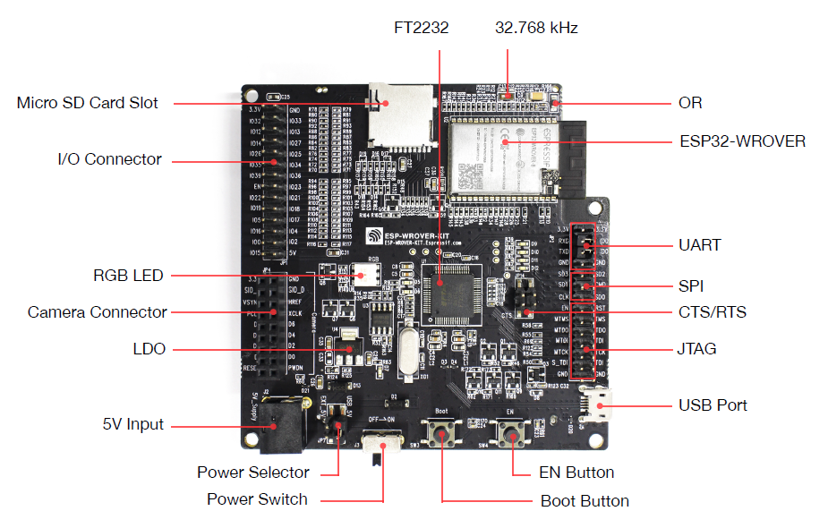
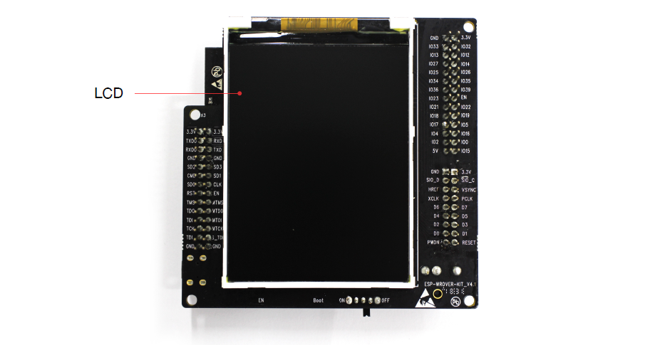
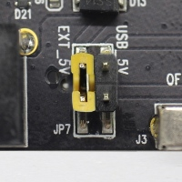
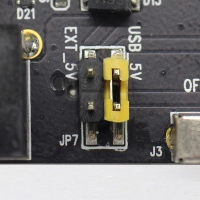
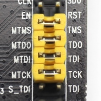
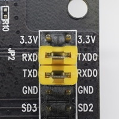
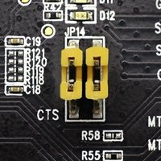

ESP-WROVER-KIT V4.1 入门指南
=========================================
:link_to_translation:`en:[English]`

本指南介绍了如何开始使用 ESP-WROVER-KIT V4.1 开发板。有关 ESP-WROVER-KIT 其他版本的介绍，请见：:doc:`../hw-reference/index`。

如果你希望开始 ESP-WROVER-KIT V4.1 的应用开发，请直接前往章节 :ref:`应用程序开发 <get-started-esp-wrover-kit-v4.1-start-development>`。

准备工作
-------------

* 1 × :ref:`ESP-WROVER-KIT V4.1 开发板 <get-started-esp-wrover-kit-v4.1-board-front>`
* 1 × USB A / micro USB B 电缆 
* 1 × PC（Windows、Linux 或 Mac OS）

简介
--------

ESP-WROVER-KIT 是一款来自 `乐鑫 <https://espressif.com>`_ 的开发板，板上模组的绝大部分管脚均已引出，可根据用户需求，轻松连接多种外围器件。本开发板搭配一块 LCD 显示器，支持 MicroSD 卡槽拓展，还搭载一款先进多协议 USB 桥接器 (FTDI FT2232HL)，允许开发者直接通过 USB 接口，使用 JTAG 对 ESP32 进行调试，便利用户的二次开发。 

ESP-WROVER-KIT V4.1 开发板可兼容 ESP32-WROOM-32、ESP32-WROVER 和 ESP32-WROVER-B 模组，默认贴 ESP32-WROVER-B 模组。

功能框图
-------------------

ESP-WROVER-KIT 开发板的主要组件和连接方式如下图所示。

.. figure:: ../../_static/esp-wrover-kit-block-diagram.png
    :align: center
    :alt: ESP-WROVER-KIT block diagram
    :figclass: align-center

    ESP-WROVER-KIT 功能框图

功能描述
--------------------

ESP-WROVER-KIT 开发板的主要组件、接口及控制方式如下文所示。

32.768 kHz 晶振
    32.768 kHz 晶振，可提供 Deep-sleep 下使用的低功耗时钟。
USB-UART 桥接器
    单芯片 USB-UART 桥接器 (FT2232)，可提供高达 3 Mbps 的传输速率。开发者可通过 USB 接口对 FT2232 芯片进行控制和编程，与 ESP32 建立连接。FT2232 芯片可在通道 A 提供 USB-to-JTAG 接口功能，并在通道 B 提供 USB-to-serial 接口功能。ESP-WROVER-KIT 的内置 FT2232 芯片功能强大，是这款开发板的特色之一，可显著便利用户的应用开发与调试。此外，用户无需单独购买 JTAG 调试器，可降低应用开发成本。具体请见 `ESP-WROVER-KIT V4.1 原理图`_ 。

0 欧电阻
    ESP-WROVER-KIT 开发板设计了一个 0 欧电阻，可在测量 ESP32 系列模组在不同功耗模式下的电流时，直接移除或替换为分流器。
    
ESP32-WROVER 模组
    ESP-WROVER-KIT V4.1 默认贴 ESP-WROVER-B 模组，内置 8 MB PSRAM，可提供灵活的额外存储空间和数据处理能力。本开发板支持的其他模组的信息，请见 :ref:`esp-wroom-solo-wrover-modules`。

    .. note::

        GPIO16 和 GPIO17 用于为 PSRAM 提供 CS 和时钟信号，因此并未引出。

诊断 LED 信号灯
    本开发板 FT2232 芯片的 GPIO 管脚连接了 4 个 LED 信号灯，以备后用。
    
UART
    FT2232HL 和 ESP32 的串行 TX/RX 信号已引出至 JP2 的两端。默认情况下，这两路信号由跳线帽连接。如果仅需使用 ESP32 模组串口，则可移除相关跳线帽，将模组连接至其他外部串口设备。    

SPI
    该 SPI 接口可用于 ESP32 访问模组 flash 和 PSRAM 内存。注意，该接口的电压取决于开发板上贴的模组。
    
CTS/RTS
    串口流控信号。管脚默认不连接至电路。为了使能该功能，必须用跳线帽断路掉 JP14 连接器的相应管脚。

JTAG
    FT2232HL 和 ESP32 的串口 JTAG 信号已引出至 JP2 连接器的两端。默认情况下，这两路信号不连接。如需使能 JTAG，请按照 :ref:`设置选项 <get-started-esp-wrover-kit-v4.1-setup-options>` 中的介绍，连接跳线帽。 
    
USB 端口
    USB 端口，可用作电路板的供电电源或连接 PC 端的通信接口。

EN 按键
    复位键，可重置系统。

Boot 按键
    下载按键。按下 **Boot** 键并保持，同时按一下 **EN** 键（此时不要松开 **Boot** 键）进入固件下载模式，通过串口下载固件。
    
电源开关
    拨置右侧，开发板上电；拨置左侧，开发板掉电。

电源选择开关
    ESP-WROVER-KIT 开发板可通过 USB 端口或 5V 输入端口供电。用户可使用跳线帽在两种供电模式中进行选择。更多详细信息，请见章节 :ref:`设置选项 <get-started-esp-wrover-kit-v4.1-setup-options>` 中有关 JP7 连接器的描述。
    
5V 输入
    5V 电源接口仅用于全负荷工作下的后备电源。
    
5V LED 电源指示灯
    当开发板通电后（USB 或外部 5V 供电），该指示灯将亮起。
LDO
   5V-to-3.3V LDO NCP1117(1 A)（也可选 Pin-to-Pin LDO LM317DCY，最高输出电流为 1.5 A）。NCP1117 最大电流输出为 1 A。LDO 解决方案同时支持固定输出电压和可变输出电压。更多信息，请见 `ESP-WROVER-KIT V4.1 原理图`_。

摄像头连接器
    摄像头接口：支持标准 OV7670 摄像头模块。

RGB LED
    红绿蓝发光二极管，由 PMW 控制。
    
I/O 连接器
    ESP32 系列模组的所有管脚均引出至 ESP-WROVER-KIT 的排针。用户可对 ESP32 进行编程，实现 PWM、ADC、DAC、I2C、I2S、SPI 等多种功能。

Micro SD 卡槽
    可用于一些使用 Micro SD 卡，扩充数据存储空间或进行备份的应用开发。

LCD 显示器
    ESP-WROVER-KIT 支持贴装一款 3.2” 的 SPI（标准四线串行外设接口）LCD 显示器，请见 :ref:`get-started-esp-wrover-kit-v4.1-board-back`。

.. _get-started-esp-wrover-kit-v4.1-board-front:

    ESP-WROVER-KIT 开发板 - 正面

.. _get-started-esp-wrover-kit-v4.1-board-back:

    ESP-WROVER-KIT 开发板 - 背面

.. _get-started-esp-wrover-kit-v4.1-setup-options:

设置选项
-------------

用户可通过 3 组排针，设置开发板功能，详见下表：

====  ==============  ===============
排针     跳线设置       功能描述
====  ==============  ===============
JP7     |jp7-ext_5v|  使用外部电源为 ESP-WROVER-KIT 开发板供电
JP7     |jp7-usb_5v|  使用 USB 端口为 ESP-WROVER-KIT 开发板供电
JP2     |jp2-jtag|    使能 JTAG 功能
JP2     |jp2-tx-rx|   使能 UART 功能
JP14    |jp14|        使能 RTS/CTS 串口流控
====  ==============  ===============

ESP32 管脚分配
------------------------

ESP32 模组的多个管脚已分配给开发板的硬件使用，部分支持多个功能，比如 GPIO0 和 GPIO2。如果某管脚对应的特定硬件未连接，则该管脚可用作他用。比如，摄像头/JP4 排针未连接相应硬件，则这些 GPIO 可用于其他用途。

主要 I/O 连接器 / JP1
^^^^^^^^^^^^^^^^^^^^^^^^

JP1 连接器可见下表中部的 “I/O” 列，GPIO 共用描述可见下表两侧的 “共用” 列：

=====================  ======  ====== =====================
      共用              I/O      I/O         共用
=====================  ======  ====== =====================
 --                    3.3 V    GND         --              
 NC/XTAL               IO32     IO33       NC/XTAL
 JTAG, MicroSD         IO12     IO13     JTAG, MicroSD
 JTAG, MicroSD         IO14     IO27       Camera
 Camera                IO26     IO25     Camera, LCD
 Camera                IO35     IO34       Camera
 Camera                IO39     IO36       Camera
 JTAG                  EN       IO23     Camera, LCD          
 Camera, LCD           IO22     IO21  Camera, LCD, MicroSD
 Camera, LCD           IO19     IO18     Camera, LCD          
 Camera, LCD           IO5      IO17       PSRAM                
 PSRAM                 IO16     IO4   LED, Camera, MicroSD 
 Camera, LED, Boot     IO0      IO2      LED, MicroSD              
 JTAG, MicroSD         IO15     5 V          --
=====================  ======  ====== =====================

说明：

* NC/XTAL - :ref:`32.768 kHz Oscillator <get-started-esp-wrover-kit-v4.1-xtal>`
* JTAG - :ref:`JTAG / JP8 <get-started-esp-wrover-kit-v4.1-jtag-header>`
* Boot - Boot button / SW2
* Camera - :ref:`Camera / JP4 <get-started-esp-wrover-kit-v4.1-camera-header>`
* LED - :ref:`RGB LED <get-started-esp-wrover-kit-v4.1-rgb-led-connections>`
* MicroSD - :ref:`MicroSD Card / J4 <get-started-esp-wrover-kit-v4.1-microsd-card-slot>`
* LCD - :ref:`LCD / U5 <get-started-esp-wrover-kit-v4.1-lcd-connector>`
* PSRAM - 适用于贴装 ESP32-WROVER 模组（带有 PSRAM）的情况

.. _get-started-esp-wrover-kit-v4.1-xtal:

32.768 kHz 晶振
^^^^^^^^^^^^^^^^^^^^^

=== ============
No. ESP32 管脚
=== ============
1   GPIO32   
2   GPIO33
=== ============

.. note::

    管脚 GPIO32 和 GPIO33 已连接至晶振，为了保证信号的完整性，并未连接至 JP1 I/O 扩展连接器。用户可通过移除 R11/R23 位置处的 0 欧电阻，并将这些 0 欧电阻安装至 R12/R24 位置，从而从晶振换至 JP1 I/O 扩展连接器。

.. _get-started-esp-wrover-kit-v4.1-spi-flash-header:

SPI Flash / JP2
^^^^^^^^^^^^^^^

=== =============
No.  ESP32 管脚
=== =============
 1  CLK / GPIO6  
 2  SD0 / GPIO7
 3  SD1 / GPIO
 4  SD2 / GPIO9
 5  SD3 / GPIO10
 6  CMD / GPIO11
=== =============

.. important::

    模组的 flash 总线已通过 0 欧电阻 R140 ~ R145 连接至排针 JP2。如果需要将 flash 的工作频率控制在 80 MHz（比如为了保证总线信号完整性），建议将 R140 ~ R145 电阻焊掉。此时，模组的 flash 总线与排针 JP2 断开连接。

.. _get-started-esp-wrover-kit-v4.1-jtag-header:

JTAG / JP2
^^^^^^^^^^

=== ============== ==========
No.  ESP32 管脚     JTAG 信号
=== ============== ==========
1        EN         TRST_N
2    MTMS / GPIO14  TMS         
3    MTDO / GPIO15  TDO
4    MTDI / GPIO12  TDI
5    MTCK / GPIO13  TCK
=== ============== ==========

.. _get-started-esp-wrover-kit-v4.1-camera-header:

摄像头 / JP4
^^^^^^^^^^^^
=== ============== ===============================
No.  ESP32 管脚     摄像头信号
=== ============== ===============================
1      n/a           3.3V
2      n/a           Ground
3     GPIO27         SIO_C / SCCB 时钟
4     GPIO26         SIO_D / SCCB 数据
5     GPIO25         VSYNC / 垂直同步
6     GPIO23         HREF / 水平参考
7     GPIO22         PCLK / 像素时钟
8     GPIO21         XCLK / 系统时钟
9     GPIO35         D7 / 像素数据第 7 位
10    GPIO34         D6 / 像素数据第 6 位
11    GPIO39         D5 / 像素数据第 5 位
12    GPIO36         D4 / 像素数据第 4 位
13    GPIO19         D3 / 像素数据第 3 位
14    GPIO18         D2 / 像素数据第 2 位
15    GPIO5          D1 / 像素数据第 1 位
16    GPIO4          D0 / 像素数据第 0 位
17    GPIO0          RESET / 摄像头复位
18    n/a            PWDN / 摄像头掉电
=== ============== ===============================

*  信号 D0 .. D7 为摄像头数据总线

.. _get-started-esp-wrover-kit-v4.1-rgb-led-connections:

RGB LED
^^^^^^^

=== ============== ==========
No.  ESP32 管脚     RGB LED
=== ============== ==========
 1    GPIO0          红
 2    GPIO2          绿
 3    GPIO4          蓝     
=== ============== ==========

.. _get-started-esp-wrover-kit-v4.1-microsd-card-slot:

MicroSD 卡 / J4
^^^^^^^^^^^^^^^^^
=== ============== =============
No.  ESP32 管脚     MicroSD 信号
=== ============== =============
1   MTDI / GPIO12   DATA2  
2   MTCK / GPIO13   CD / DATA3
3   MTDO / GPIO15   CMD
4   MTMS / GPIO14   CLK
5   GPIO2           DATA0
6   GPIO4           DATA1
7   GPIO21          CD
=== ============== =============

.. _get-started-esp-wrover-kit-v4.1-lcd-connector:

LCD / U5
^^^^^^^^

=== ============== =============
No.  ESP32 管脚     LCD 信号
=== ============== =============
 1   GPIO18         RESET 
 2   GPIO19         SCL
 3   GPIO21         D/C
 4   GPIO22         CS 
 5   GPIO23         SDA
 6   GPIO25         SDO
 7   GPIO5          背光
=== ============== =============

.. _get-started-esp-wrover-kit-v4.1-start-development:

应用程序开发
-----------------------------

ESP-WROVER-KIT 上电前，请首先确认电路板完好无损。

初始设置
^^^^^^^^^^^^^

通过排针 JP7 选择开发板的供电模式：**USB** 端口供电或外部 **5V Input** 供电，请见下表：

=============== ===============
USB 供电         使能 UART 通信
=============== ===============
|jp7-usb_5v|    |jp2-tx-rx|
=============== ===============

在本应用中，USB 供电已经足够。用户可通过 JP2 处的跳线设置，使能 UART 通信。

.. 注意::

    1. 不要安装任何其他跳线。
    2. 打开 **电源开关**，**5V LED 指示灯** 也应亮起。

开始开发
^^^^^^^^^^^^^^^^^^

有关 ESP-WROVER-KIT 应用程序开发的具体步骤，请见章节 :doc:`index`：

* :ref:`设置 Toolchain <get-started-setup-toolchain>`，以便用 C 语言开发应用
* :ref:`连接 <get-started-connect>` 模组至 PC，并确认访问状态
* :ref:`构建并向 ESP32 烧录示例 <get-started-build-and-flash>`
* :ref:`即刻监测 <get-started-monitor>` 应用程序的动作

相关文档
-----------------

* `ESP-WROVER-KIT V4.1 原理图`_ (PDF)
* `ESP32 技术规格书 <https://www.espressif.com/sites/default/files/documentation/esp32_datasheet_cn.pdf>`_ (PDF)
* `ESP32-WROVER-B 技术规格书 <https://espressif.com/sites/default/files/documentation/esp32-wrover-b_datasheet_cn.pdf>`_ (PDF)
* :doc:`../api-guides/jtag-debugging/index`
* :doc:`../hw-reference/index`

.. _ESP-WROVER-KIT V4.1 原理图: https://dl.espressif.com/dl/schematics/ESP-WROVER-KIT_V4_1.pdf

.. toctree::
    :hidden:

    get-started-wrover-kit-v3.rst
    get-started-wrover-kit-v2.rst