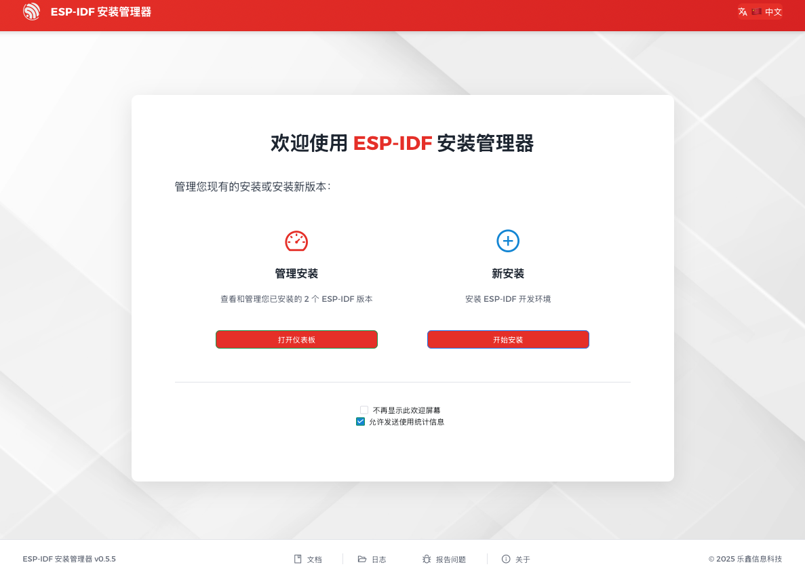
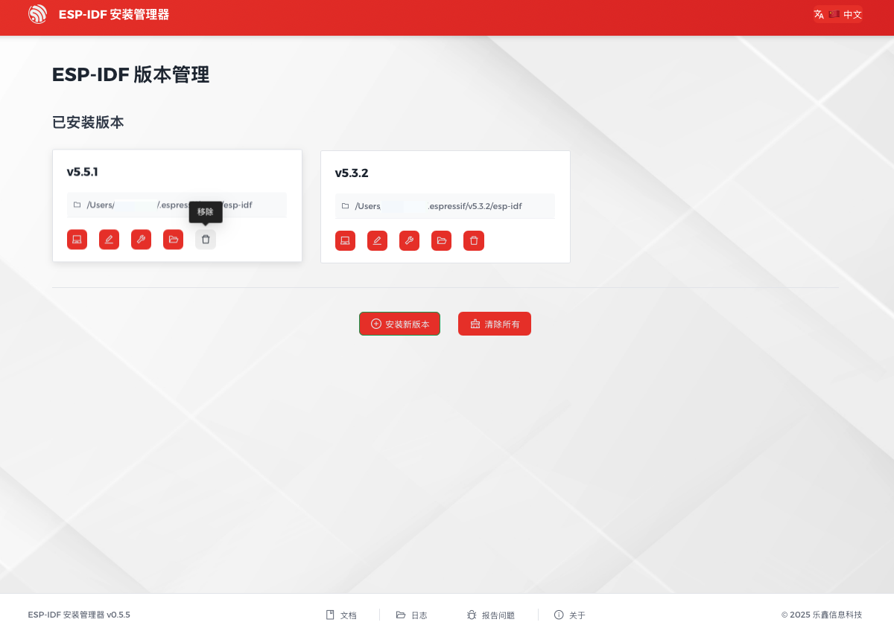

***********
快速入门
***********

:link_to_translation:`en:[English]`

.. 请保证 README.md 文件与该文件保持同步

本文档旨在指导用户搭建 {IDF_TARGET_NAME} 硬件开发的软件环境，通过一个简单的示例展示如何使用 ESP-IDF (Espressif IoT Development Framework) 配置菜单，并编译、下载固件至 {IDF_TARGET_NAME} 开发板等步骤。

.. include-build-file:: inc/version-note.inc

概述
============

{IDF_TARGET_NAME} SoC 芯片支持以下功能：

.. only:: esp32

    * 2.4 GHz Wi-Fi
    * 蓝牙
    * 高性能 Xtensa® 32 位 LX6 双核处理器
    * 超低功耗协处理器
    * 多种外设

.. only:: esp32s2

    * 2.4 GHz Wi-Fi
    * 高性能 Xtensa® 32 位 LX7 单核处理器
    * 运行 RISC-V 或 FSM 内核的超低功耗协处理器
    * 多种外设
    * 内置安全硬件
    * USB OTG 接口

.. only:: esp32s3

    * 2.4 GHz Wi-Fi
    * 低功耗蓝牙
    * 高性能 Xtensa® 32 位 LX7 双核处理器
    * 运行 RISC-V 或 FSM 内核的超低功耗协处理器
    * 多种外设
    * 内置安全硬件
    * USB OTG 接口
    * USB 串口/JTAG 控制器

.. only:: esp32c3

    * 2.4 GHz Wi-Fi
    * 低功耗蓝牙
    * 高性能 32 位 RISC-V 单核处理器
    * 多种外设
    * 内置安全硬件

.. only:: esp32c2

    * 2.4 GHz Wi-Fi
    * 低功耗蓝牙
    * 高性能 32 位 RISC-V 单核处理器
    * 多种外设
    * 适用于较简单、大批量生产的物联网应用

.. only:: esp32c5

    * 2.4 & 5 GHz 双频 Wi-Fi 6
    * 低功耗蓝牙
    * 802.15.4，支持 Thread 和 Zigbee 协议
    * 高性能 32 位 RISC-V 单核处理器
    * 多种外设
    * 内置安全硬件

.. only:: esp32c6

    * 2.4 GHz Wi-Fi 6
    * 低功耗蓝牙
    * 802.15.4，支持 Thread 和 Zigbee 协议
    * 高性能 32 位 RISC-V 单核处理器
    * 多种外设
    * 内置安全硬件

.. only:: esp32c61

    * 2.4 GHz Wi-Fi 6
    * 低功耗蓝牙
    * 高性能 32 位 RISC-V 单核处理器
    * 多种外设
    * 内置安全硬件

.. only:: esp32h2

    * 低功耗蓝牙
    * 802.15.4，支持 Thread 和 Zigbee 协议
    * 高性能 32 位 RISC-V 单核处理器
    * 多种外设
    * 内置安全硬件

.. only:: esp32p4

    * 搭载 RISC-V 32 位双核处理器的高性能 MCU
    * 强大的图像与语音处理能力
    * 支持单精度 FPU 和 AI 扩展
    * 外设丰富包括 MIPI、USB、SDIO、以太网等
    * 内置安全硬件

.. only:: esp32p4

    {IDF_TARGET_NAME} 采用 40 nm 工艺制成，具有最佳的功耗性能、安全性和可靠性，适用于各种应用场景和不同功耗需求。

.. only:: not esp32p4

    {IDF_TARGET_NAME} 采用 40 nm 工艺制成，具有最佳的功耗性能、射频性能、安全性和可靠性，适用于各种应用场景和不同功耗需求。

乐鑫为用户提供完整的软、硬件资源，进行 {IDF_TARGET_NAME} 硬件设备的开发。其中，乐鑫的软件开发环境 ESP-IDF 旨在协助用户快速开发物联网 (IoT) 应用，可满足用户对 Wi-Fi、蓝牙、低功耗等方面的要求。

准备工作
=============

硬件：
~~~~~~~~~~~~~~~~

* 一款 **{IDF_TARGET_NAME}** 开发板
* **USB 数据线** （A 转 Micro-B）
* 电脑（Windows、Linux 或 macOS）

.. note:: 目前一些开发板使用的是 USB Type C 接口。请确保使用合适的数据线来连接开发板！

以下是 {IDF_TARGET_NAME} 官方开发板，点击链接可了解更多硬件信息。

.. only:: esp32

    .. toctree::
        :maxdepth: 1

        ESP32-DevKitC <https://docs.espressif.com/projects/esp-dev-kits/zh_CN/latest/esp32/esp32-devkitc/index.html>
        ESP32-DevKitM-1 <https://docs.espressif.com/projects/esp-dev-kits/zh_CN/latest/esp32/esp32-devkitm-1/index.html>
        ESP32-Ethernet-Kit <https://docs.espressif.com/projects/esp-dev-kits/zh_CN/latest/esp32/esp32-ethernet-kit/index.html>
        ESP32-PICO-KIT-1 <https://docs.espressif.com/projects/esp-dev-kits/zh_CN/latest/esp32/esp32-pico-kit-1/index.html>
        ESP32-PICO-DevKitM-2 <https://docs.espressif.com/projects/esp-dev-kits/zh_CN/latest/esp32/esp32-pico-devkitm-2/index.html>
        ESP32-LCDKit <https://docs.espressif.com/projects/esp-dev-kits/zh_CN/latest/esp32/esp32-lcdkit/index.html>

.. only:: esp32s2

    .. toctree::
        :maxdepth: 1

        ESP32-S2-DevKitM-1 <https://docs.espressif.com/projects/esp-dev-kits/zh_CN/latest/esp32s2/esp32-s2-devkitm-1/index.html>
        ESP32-S2-DevKitC-1 <https://docs.espressif.com/projects/esp-dev-kits/zh_CN/latest/esp32s2/esp32-s2-devkitc-1/index.html>

.. only:: esp32c3

    .. toctree::
        :maxdepth: 1

        ESP32-C3-DevKitC-02 <https://docs.espressif.com/projects/espressif-esp-dev-kits/zh_CN/latest/esp32c3/esp32-c3-devkitc-02/index.html>
        ESP32-C3-DevKitM-1 <https://docs.espressif.com/projects/espressif-esp-dev-kits/zh_CN/latest/esp32c3/esp32-c3-devkitm-1/index.html>
        ESP32-C3-LCDkit <https://docs.espressif.com/projects/esp-dev-kits/zh_CN/latest/esp32c3/esp32-c3-lcdkit/index.html>

.. only:: esp32s3

    .. toctree::
        :maxdepth: 1

        ESP32-S3-DevKitC-1 <https://docs.espressif.com/projects/esp-dev-kits/zh_CN/latest/esp32s3/esp32-s3-devkitc-1/index.html>
        ESP32-S3-DevKitM-1 <https://docs.espressif.com/projects/esp-dev-kits/zh_CN/latest/esp32s3/esp32-s3-devkitm-1/index.html>
        ESP32-S3-USB-OTG <https://docs.espressif.com/projects/esp-dev-kits/zh_CN/latest/esp32s3/esp32-s3-usb-otg/index.html>
        ESP32-S3-LCD-EV-Board <https://docs.espressif.com/projects/esp-dev-kits/zh_CN/latest/esp32s3/esp32-s3-lcd-ev-board/index.html>
        EchoEar <https://docs.espressif.com/projects/esp-dev-kits/zh_CN/latest/esp32s3/echoear/index.html>
        ESP-DualKey <https://docs.espressif.com/projects/esp-dev-kits/zh_CN/latest/esp32s3/esp-dualkey/index.html>

.. only:: esp32c2

    .. toctree::
        :maxdepth: 1

        ESP8684-DevKitM-1 <https://docs.espressif.com/projects/espressif-esp-dev-kits/zh_CN/latest/esp8684/esp8684-devkitm-1/index.html>
        ESP8684-DevKitC-02 <https://docs.espressif.com/projects/esp-dev-kits/en/latest/esp32c2/esp8684-devkitc-02/index.html>

.. only:: esp32c5

    .. toctree::
        :maxdepth: 1

        ESP32-C5-DevKitC-1 <https://docs.espressif.com/projects/esp-dev-kits/zh_CN/latest/esp32c5/esp32-c5-devkitc-1/index.html>

.. only:: esp32c6

    .. toctree::
        :maxdepth: 1

        ESP32-C6-DevKitC-1 <https://docs.espressif.com/projects/espressif-esp-dev-kits/zh_CN/latest/esp32c6/esp32-c6-devkitc-1/index.html>
        ESP32-C6-DevKitM-1 <https://docs.espressif.com/projects/espressif-esp-dev-kits/zh_CN/latest/esp32c6/esp32-c6-devkitm-1/index.html>

.. only:: esp32c61

    .. toctree::
        :maxdepth: 1

        ESP32-C61-DevKitC-1 <https://docs.espressif.com/projects/espressif-esp-dev-kits/zh_CN/latest/esp32c61/esp32-c61-devkitc-1/index.html>

.. only:: esp32p4

    .. toctree::
        :maxdepth: 1

        ESP32-P4-Function-EV-Board <https://docs.espressif.com/projects/esp-dev-kits/zh_CN/latest/esp32p4/esp32-p4-function-ev-board/index.html>
        ESP32-P4-EYE <https://docs.espressif.com/projects/esp-dev-kits/zh_CN/latest/esp32p4/esp32-p4-eye/index.html>

.. _get-started-get-prerequisites:

软件：
~~~~~~~~

如需在 **{IDF_TARGET_NAME}** 上使用 ESP-IDF，请安装以下软件：

    * 设置 **工具链**，用于编译 {IDF_TARGET_NAME} 代码；
    * **编译构建工具** —— CMake 和 Ninja 编译构建工具，用于编译 {IDF_TARGET_NAME} **应用程序**；
    * 获取 **ESP-IDF** 软件开发框架。该框架已经基本包含 {IDF_TARGET_NAME} 使用的 API（软件库和源代码）和运行 **工具链** 的脚本；

.. figure:: ../../_static/what-you-need.png
    :align: center
    :alt: Development of applications for {IDF_TARGET_NAME}
    :figclass: align-center

.. _get-started-step-by-step:
.. _get-started-how-to-get-esp-idf:
.. _get-started-set-up-tools:

安装
====

请使用 ESP-IDF 安装管理器 (EIM) 来安装 ESP-IDF、构建工具和相关工具链，该管理器支持多种操作系统。

EIM 提供两种安装方式：

- **图形用户界面 (GUI)**：用户友好，适合大多数用户。
- **命令行界面 (CLI)**：适用于 CI/CD 流水线和自动化安装。

.. toctree::
    :maxdepth: 1

    windows-setup
    linux-setup
    macos-setup

.. _get-started-build:

构建首个项目
============

安装 ESP-IDF 后，您可选择在集成开发环境 (IDE) 中或通过命令行来构建首个项目。

在 IDE 中构建
~~~~~~~~~~~~~

通过 EIM 安装的 ESP-IDF 版本可搭配以下 IDE 使用，获得图形化开发体验：

- 基于 Eclipse CDT 的 `Espressif-IDE <https://docs.espressif.com/projects/espressif-ide/zh_CN/latest/>`_

    该 IDE 已集成 IDF Eclipse 插件、必备 Eclipse CDT 插件和其他 Eclipse 平台插件，可支持 ESP-IDF 应用的开发和构建。
- 安装 `ESP-IDF 拓展 <https://docs.espressif.com/projects/vscode-esp-idf-extension/zh_CN/latest/index.html>`_ 的 Visual Studio Code

    通过安装拓展，您可直接在 Visual Studio Code 中开发、构建、烧录和监视 ESP-IDF 应用程序。

关于 IDE 的具体配置与使用方法，请参阅上述对应的文档。

通过命令行构建
~~~~~~~~~~~~~~~~

如果使用命令行构建项目、构建、烧录至 {IDF_TARGET_NAME}、监视设备输出，请根据您的操作系统参考以下说明：

.. toctree::
    :maxdepth: 1

    windows-start-project
    linux-macos-start-project

.. note::

    如果尚未安装 ESP-IDF，请跳转至 :ref:`get-started-step-by-step`，按照说明先安装所有必需的软件。

卸载 ESP-IDF
============

如需卸载通过 EIM 安装的 ESP-IDF 及相关工具，可使用图形用户界面 (GUI) 或命令行界面 (CLI) 两种方式。

使用 EIM GUI 卸载
~~~~~~~~~~~~~~~~~

启动 ESP-IDF 安装管理器。在 ``管理安装`` 下，点击 ``打开仪表板``。

    EIM 打开仪表板

如需删除特定 ESP-IDF 版本，请在该版本下点击 ``移除`` 按键。

如果删除所有 ESP-IDF 版本，请点击页面底部的 ``清除所有`` 按键。

    EIM 卸载 ESP-IDF

使用 EIM CLI 卸载
~~~~~~~~~~~~~~~~~

如需删除特定 ESP-IDF 版本，例如 v5.4.2，请在终端中运行以下命令：

.. code-block:: bash

    eim uninstall v5.4.2

如需删除所有 ESP-IDF 版本，请在终端中运行以下命令：

.. code-block:: bash

    eim purge

相关文档
=========

* `ESP-IDF 安装管理器 (EIM) 文档 <https://docs.espressif.com/projects/idf-im-ui/en/latest/>`_
* `Espressif-IDE (ESP-IDF Eclipse 插件) GitHub 仓库 <https://github.com/espressif/idf-eclipse-plugin/tree/master>`_
* `VSCode ESP-IDF 扩展 GitHub 仓库 <https://github.com/espressif/vscode-esp-idf-extension/tree/master>`_

.. _稳定版本: https://docs.espressif.com/projects/esp-idf/zh_CN/stable/
