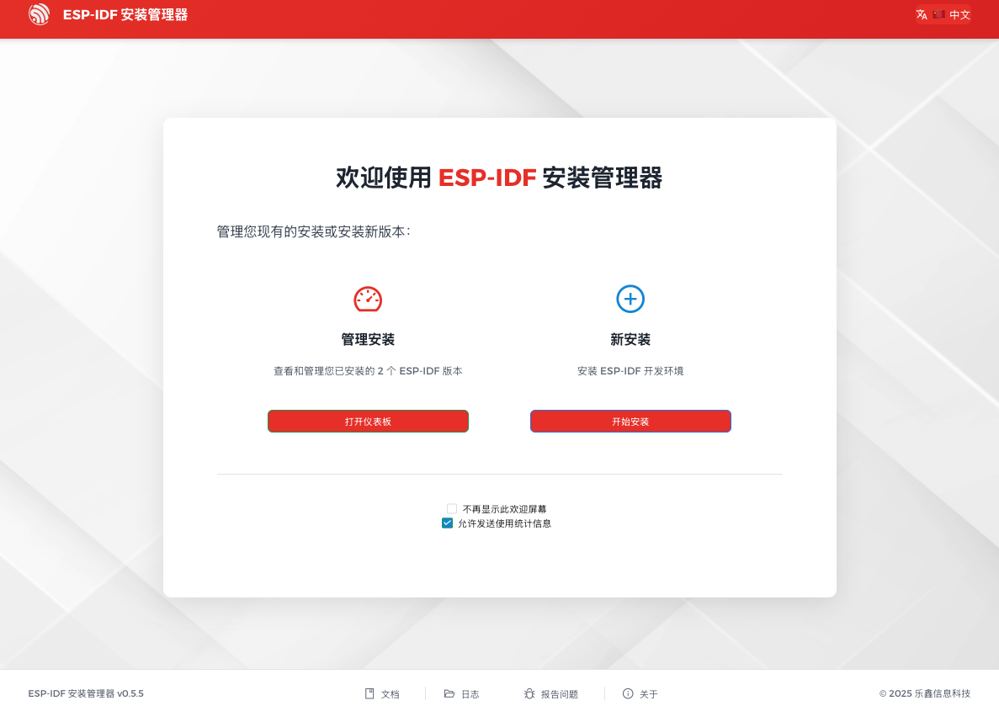
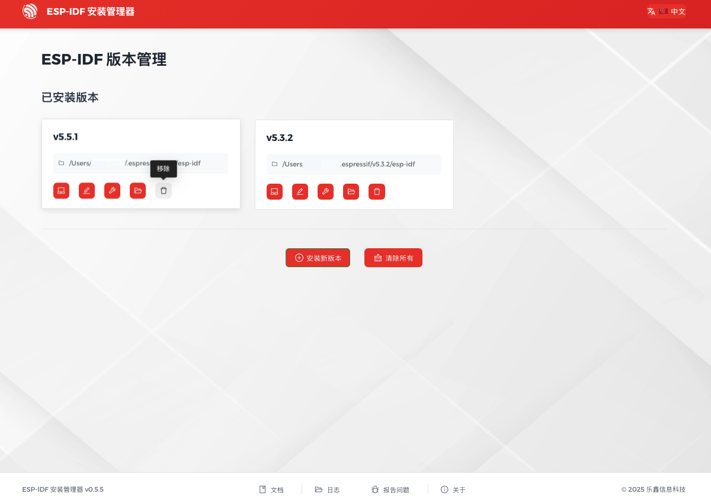

使用 EIM GUI 卸载 ESP-IDF
=========================

:link_to_translation:`en:[English]`

启动 ESP-IDF 安装管理器。在 ``管理安装`` 下，点击 ``打开仪表板``。

    EIM 打开仪表板

如需删除特定 ESP-IDF 版本，请在该版本下点击 ``移除`` 按键。

如需删除所有 ESP-IDF 版本，请点击页面底部的 ``清除所有`` 按键。

    EIM 卸载 ESP-IDF

使用 EIM CLI 卸载 ESP-IDF
=========================

如需删除特定 ESP-IDF 版本，例如 v5.4.2，请在终端中运行以下命令：

.. code-block:: bash

    eim remove v5.4.2

如需删除所有 ESP-IDF 版本，请在终端中运行以下命令：

.. code-block:: bash

    eim purge
