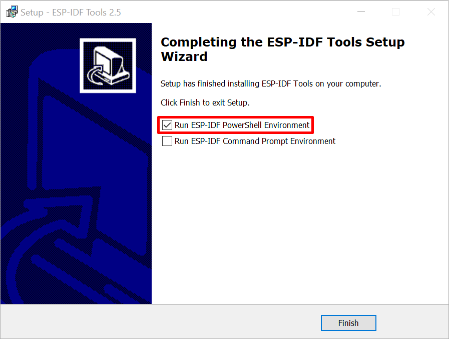
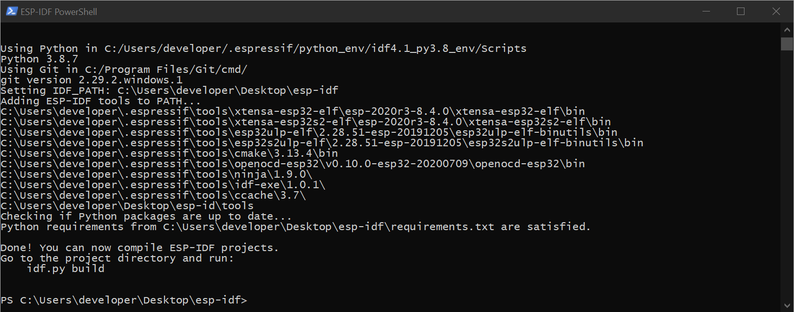
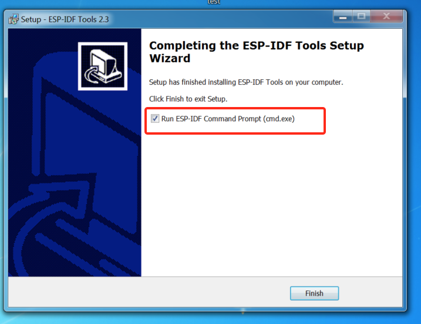
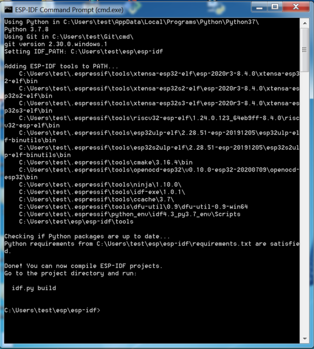

***********************************************
Windows 平台工具链的标准设置
***********************************************

:link_to_translation:`en:[English]`

.. only:: esp32

    .. 注解::
	    目前，基于 CMake 的构建系统仅支持 64 位 Windows 版本。32 位 Windows 版本的用户可根据 :doc:`传统 GNU Make 构建系统<../get-started-legacy/windows-setup>` 中的介绍进行操作。

概述
============

ESP-IDF 需要安装一些必备工具，才能围绕 {IDF_TARGET_NAME} 构建固件，包括 Python、Git、交叉编译器、CMake 和 Ninja 编译工具等。

在本入门指南中，我们通过 **命令提示符** 进行有关操作。不过，您在安装 ESP-IDF 后还可以使用 :doc:`Eclipse <eclipse-setup>` 或其他支持 CMake 的图形化工具 IDE。

.. only:: esp32

    .. 注解::
	    较早 ESP-IDF 版本使用 :doc:`传统 GNU Make 构建系统<../get-started-legacy/windows-setup>` 和 MSYS2_ Unix 兼容环境。但如今已非必需，用户可直接通过 Windows 命令提示符使用 ESP-IDF。

.. 注解::
    限定条件：Python 或 ESP-IDF 的安装路径中一定不能包含空格或括号。与此同时，除非操作系统配置为支持 Unicode UTF-8，否则 Python 或 ESP-IDF 的安装路径中也不能包括特殊字符（非 ASCII 码字符）

    系统管理员可以通过如下方式将操作系统配置为支持 Unicode UTF-8：控制面板-更改日期、时间或数字格式-管理选项卡-更改系统地域-勾选选项 “Beta：使用 Unicode UTF-8 支持全球语言”-点击确定-重启电脑。

.. _get-started-windows-tools-installer:

ESP-IDF 工具安装器
=======================

安装 ESP-IDF 必备工具最简易的方式是从 https://dl.espressif.com/dl/esp-idf/?idf=4.2 中下载 ESP-IDF 工具安装器。

在线安装与离线安装的区别
-----------------------------------------

在线安装程序非常小，可以安装 ESP-IDF 的所有版本。在安装过程中，安装程序只下载必要的依赖文件，包括 `Git For Windows`_ 安装器。在线安装程序会将下载的文件存储在缓存目录 ``%userprofile%/espressif`` 中。

离线安装程序不需要任何网络连接。安装程序中包含了所有需要的依赖文件，包括 `Git For Windows`_ 安装器。

安装内容
------------

安装程序会安装以下组件：

- 内置的 Python
- 交叉编译器
- OpenOCD
- CMake_ 和 Ninja_ 编译工具
- ESP-IDF

安装程序允许将程序下载到现有的 ESP-IDF 目录。推荐将 ESP-IDF 下载到 ``%userprofile%\Desktop\esp-idf`` 目录下，其中 ``%userprofile%`` 代表家目录。

启动 ESP-IDF 环境
------------------

安装结束时，如果勾选了 ``Run ESP-IDF PowerShell Environment`` 或 ``Run ESP-IDF Command Prompt (cmd.exe)``，安装程序会在选定的提示符窗口启动 ESP-IDF。

``Run ESP-IDF PowerShell Environment``:

    完成 ESP-IDF 工具安装向导时运行 Run ESP-IDF PowerShell Environment

    ESP-IDF PowerShell

``Run ESP-IDF Command Prompt (cmd.exe)``:

    完成 ESP-IDF 工具安装向导时运行 Run ESP-IDF Command Prompt (cmd.exe)

    ESP-IDF 命令提示符窗口

使用命令提示符
========================

在后续步骤中，我们将使用 Windows 的命令提示符进行操作。

ESP-IDF 工具安装器可在“开始”菜单中，创建一个打开 ESP-IDF 命令提示符窗口的快捷方式。本快捷方式可以打开 Windows 命令提示符（即 cmd.exe），并运行 ``export.bat`` 脚本以设置各环境变量（比如 ``PATH``，``IDF_PATH`` 等）。此外，您可还以通过 Windows 命令提示符使用各种已经安装的工具。

注意，本快捷方式仅适用 ESP-IDF 工具安装器中指定的 ESP-IDF 路径。如果您的电脑上存在多个 ESP-IDF 路径（比如您需要不同版本的 ESP-IDF），您有以下两种解决方法：

1. 为 ESP-IDF 工具安装器创建的快捷方式创建一个副本，并将新快捷方式的 ESP-IDF 工作路径指定为您希望使用的 ESP-IDF 路径。

2. 或者，您可以运行 ``cmd.exe``，并切换至您希望使用的 ESP-IDF 目录，然后运行 ``export.bat``。注意，这种方法要求 ``PATH`` 中存在 Python 和 Git。如果您在使用时遇到有关“找不到 Python 或 Git”的错误信息，请使用第一种方法。

后续步骤
============

当 ESP-IDF 工具安装器安装成功后，开发环境设置也到此结束。后续开发步骤，请前往 :ref:`get-started-start-project` 查看。

相关文档
=================

想要自定义安装流程的高阶用户可参照：

.. toctree::
    :maxdepth: 1

    windows-setup-update

.. _MSYS2: https://www.msys2.org/
.. _CMake: https://cmake.org/download/
.. _Ninja: https://ninja-build.org/
.. _Python: https://www.python.org/downloads/windows/
.. _Git for Windows: https://gitforwindows.org/
.. _Github Desktop: https://desktop.github.com/
