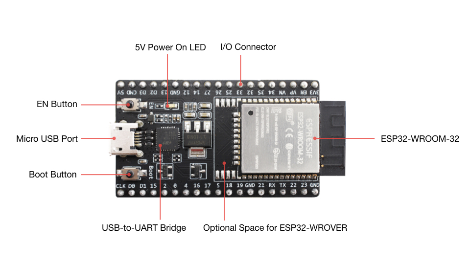
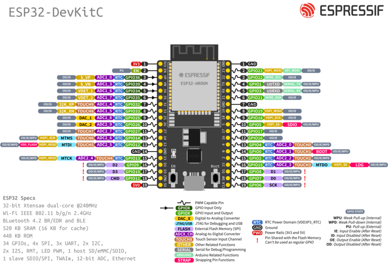
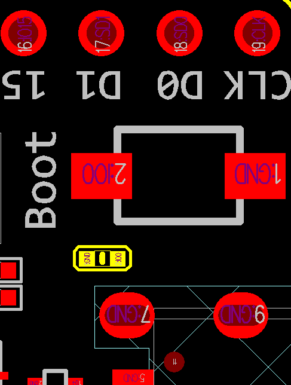
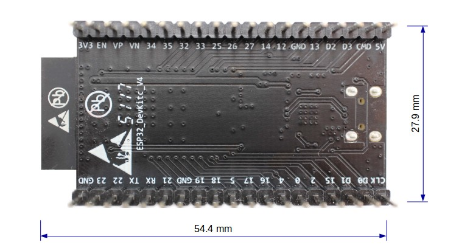

ESP32-DevKitC V4 入门指南
=============================================

:link_to_translation:`en: [English]`

本指南介绍了如何开始使用 ESP32-DevKitC V4 开发板。

准备工作
-----------

* :ref:`ESP32-DevKitC V4 开发板 <get-started-esp32-devkitc-board-front>`
* USB A / micro USB B 数据线
* PC（Windows、Linux 或 Mac OS）

你可以跳过介绍部分，直接前往 `应用程序开发`_ 章节。

.. _DevKitC-Overview:

概述
----

ESP32-DevKitC V4 是 `乐鑫 <https://espressif.com>`_ 一款基于 ESP32 的小型开发板，板上模组的绝大部分管脚均已引出，开发人员可根据实际需求，轻松通过跳线连接多种外围器件，或将开发板插在面包板上使用。

为了更好地满足不同用户需求，ESP32-DevKitC V4 还支持以下不同配置：

- 可选多款 ESP32 模组

   - `ESP32-WROOM-32E <https://www.espressif.com/sites/default/files/documentation/esp32-wroom-32e_esp32-wroom-32ue_datasheet_cn.pdf>`_
   - `ESP32-WROOM-32UE <https://www.espressif.com/sites/default/files/documentation/esp32-wroom-32e_esp32-wroom-32ue_datasheet_cn.pdf>`_
   - `ESP32-WROOM-32D <https://www.espressif.com/sites/default/files/documentation/esp32-wroom-32d_esp32-wroom-32u_datasheet_cn.pdf>`_
   - `ESP32-WROOM-32U <https://www.espressif.com/sites/default/files/documentation/esp32-wroom-32d_esp32-wroom-32u_datasheet_cn.pdf>`_
   - `ESP32-SOLO-1 <https://www.espressif.com/sites/default/files/documentation/esp32-solo-1_datasheet_en.pdf>`_
   - `ESP32-WROVER-E <https://www.espressif.com/sites/default/files/documentation/esp32-wrover-e_esp32-wrover-ie_datasheet_cn.pdf>`_
   - `ESP32-WROVER-IE <https://www.espressif.com/sites/default/files/documentation/esp32-wrover-e_esp32-wrover-ie_datasheet_cn.pdf>`_
   - `ESP32-WROOM-DA <https://www.espressif.com/sites/default/files/documentation/esp32-wroom-da_datasheet_cn.pdf>`_

- 可选排针或排母

详情请见 `乐鑫产品选型工具 <https://products.espressif.com/#/product-selector?names=>`__。

功能说明
---------

ESP32-DevKitC V4 开发板的主要组件、接口及控制方式见下。

.. _get-started-esp32-devkitc-board-front:

    ESP32-DevKitC V4（板载 ESP32-WROOM-32）

.. list-table::
    :widths: 25 75
    :header-rows: 1

    * - 主要组件
      - 基本介绍
    * - ESP32-WROOM-32
      - 基于 ESP32 的模组。更多详情，请见 `《ESP32-WROOM-32 技术规格书》`_。
    * - EN
      - 复位按键。
    * - Boot
      - 下载按键。按下 **Boot** 键并保持，同时按一下 **EN** 键（此时不要松开 **Boot** 键）进入“固件下载”模式，通过串口下载固件。
    * - USB-to-UART 桥接器
      - 单芯片 USB-UART 桥接器，可提供高达 3 Mbps 的传输速率。
    * -  Micro USB 接口。
      - USB 接口，可用作电路板的供电电源，或连接 PC 和 ESP32-WROOM-32 模组的通信接口。
    * - 5V Power On LED
      - 开发板通电后（USB 或外部 5 V），该指示灯将亮起。更多信息，请见 `相关文档`_ 中的原理图。
    * - I/O
      - 板上模组的绝大部分管脚均已引出至开发板的排针。用户可以对 ESP32 进行编程，实现 PWM、ADC、DAC、I2C、I2S、SPI 等多种功能。

电源选项
--------

开发板可从以下三种供电方式中任选其一：

* Micro USB 供电（默认）
* 5V/GND 管脚供电
* 3V3/GND 管脚供电

.. warning::

  上述供电模式 **不可同时连接**，否则可能会损坏开发板和/或电源。

排针
------------

下表列出了开发板两侧排针（J1 和 J3）的名称和功能，排针名称如图 :ref:`get-started-esp32-devkitc-board-front` 中所示。

J2
^^^
====  ====  ==========  ===========================================
编号  名称   类型 [1]_    功能
====  ====  ==========  ===========================================
1     3V3   P           3.3 V 电源
2     EN    I           CHIP_PU, Reset
3     VP    I           GPIO36, ADC1_CH0, S_VP
4     VN    I           GPIO39, ADC1_CH3, S_VN
5     IO34  I           GPIO34, ADC1_CH6, VDET_1
6     IO35  I           GPIO35, ADC1_CH7, VDET_2
7     IO32  I/O         GPIO32, ADC1_CH4, TOUCH_CH9, XTAL_32K_P
8     IO33  I/O         GPIO33, ADC1_CH5, TOUCH_CH8, XTAL_32K_N
9     IO25  I/O         GPIO25, ADC1_CH8, DAC_1
10    IO26  I/O         GPIO26, ADC2_CH9, DAC_2
11    IO27  I/O         GPIO27, ADC2_CH7, TOUCH_CH7
12    IO14  I/O         GPIO14, ADC2_CH6, TOUCH_CH6, MTMS
13    IO12  I/O         GPIO12, ADC2_CH5, TOUCH_CH5, MTDI
14    GND   G           接地
15    IO13  I/O         GPIO13, ADC2_CH4, TOUCH_CH4, MTCK
16    D2    I/O         GPIO9, D2 [2]_
17    D3    I/O         GPIO10, D3 [2]_
18    CMD   I/O         GPIO11, CMD [2]_
19    5V    P           5 V 电源
====  ====  ==========  ===========================================

J3
^^^
====  ====  ==========  ===========================================
编号  名称   类型 [1]_    功能
====  ====  ==========  ===========================================
1     GND   G           接地
2     IO23  I/O         GPIO23
3     IO22  I/O         GPIO22
4     TX    I/O         GPIO1, U0TXD
5     RX    I/O         GPIO3, U0RXD
6     IO21  I/O         GPIO21
7     GND   G           接地
8     IO19  I/O         GPIO19
9     IO18  I/O         GPIO18
10    IO5   I/O         GPIO5
11    IO17  I/O         GPIO17 [3]_
12    IO16  I/O         GPIO16 [3]_
13    IO4   I/O         GPIO4, ADC2_CH0, TOUCH_CH0
14    IO0   I/O         GPIO0, ADC2_CH1, TOUCH_CH1, Boot
15    IO2   I/O         GPIO2, ADC2_CH2, TOUCH_CH2
16    IO15  I/O         GPIO15, ADC2_CH3, TOUCH_CH3, MTDO
17    D1    I/O         GPIO8, D1 [2]_
18    D0    I/O         GPIO7, D0 [2]_
19    CLK   I/O         GPIO6, CLK [2]_
====  ====  ==========  ===========================================

.. [1] P：电源；I：输入；O：输出。
.. [2] 管脚 D0、D1、D2、D3、CMD 和 CLK 用于 ESP32 芯片与 SPI flash 间的内部通信，集中分布在开发板两侧靠近 USB 端口的位置。通常而言，这些管脚最好不连，否则可能影响 SPI flash/SPI RAM 的工作。
.. [3] 管脚 GPIO16 和 GPIO17 仅适用于板载 ESP32-WROOM 系列和 ESP32-SOLO-1 的开发板，板载 ESP32-WROVER 系列开发板的管脚 GPIO16 和 GPIO17 保留内部使用。

管脚布局
^^^^^^^^^^^

    ESP32-DevKitC 管脚布局（点击放大）

有关 C15 的提示
--------------------

较早版本 ESP32-DevKitC 开发板上的 C15 可能存在以下问题：

* 开发板上电后可能进入下载模式；
* 如果用户通过 GPIO0 输出时钟，C15 可能会影响信号。

用户如果认为 C15 可能影响开发板的使用，则可以将 C15 完全移除。C15 在开发板上的具体位置见下图黄色部分。

    C15（黄色）在 ESP32-DevKitC V4 开发板上的位置

应用程序开发
-----------------

ESP32-DevKitC V4 上电前，请首先确认开发板完好无损。

现在，请前往 :doc:`../../get-started/index` 中的 :ref:`get-started-step-by-step` 章节，查看如何设置开发环境，并尝试将示例项目烧录至你的开发板。

开发板尺寸
-------------

    ESP32-DevKitC 开发板尺寸（板载 ESP32-WROOM-32 模组）-- 仰视图

相关文档
-----------

* `ESP32-DevKitC V4 原理图 <https://dl.espressif.com/dl/schematics/esp32_devkitc_v4-sch.pdf>`_ (PDF)
* `《ESP32 技术规格书》 <https://www.espressif.com/sites/default/files/documentation/esp32_datasheet_cn.pdf>`_ (PDF)
* `《ESP32-WROOM-32 技术规格书》 <https://espressif.com/sites/default/files/documentation/esp32-wroom-32_datasheet_cn.pdf>`_ (PDF)
* `《ESP32-WROOM-32D & ESP32-WROOM-32U 技术规格书》 <https://www.espressif.com/sites/default/files/documentation/esp32-wroom-32d_esp32-wroom-32u_datasheet_cn.pdf>`_ (PDF)
* `《ESP32-WROOM-32E & ESP32-WROOM-32UE 技术规格书》 <https://www.espressif.com/sites/default/files/documentation/esp32-wroom-32e_esp32-wroom-32ue_datasheet_cn.pdf>`_ (PDF)
* `《ESP32-WROOM-DA 技术规格书》 <https://www.espressif.com/sites/default/files/documentation/esp32-wroom-da_datasheet_cn.pdf>`_ (PDF)
* `《ESP32-WROVER 技术规格书》 <https://espressif.com/sites/default/files/documentation/esp32-wrover_datasheet_cn.pdf>`_ (PDF)
* `《ESP32-WROVER-B 技术规格书》 <https://www.espressif.com/sites/default/files/documentation/esp32-wrover-b_datasheet_cn.pdf>`_ (PDF)
* `乐鑫产品选型工具 <https://products.espressif.com/#/product-selector?names=>`_

有关本开发板的更多设计文档，请联系我们的商务部门 `sales@espressif.com <sales@espressif.com>`_。

.. toctree::
  :hidden:

  get-started-devkitc-v2
