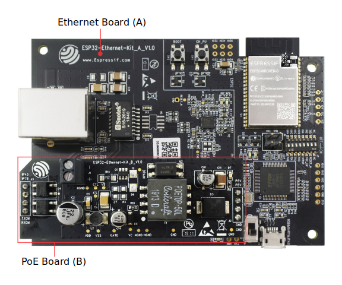
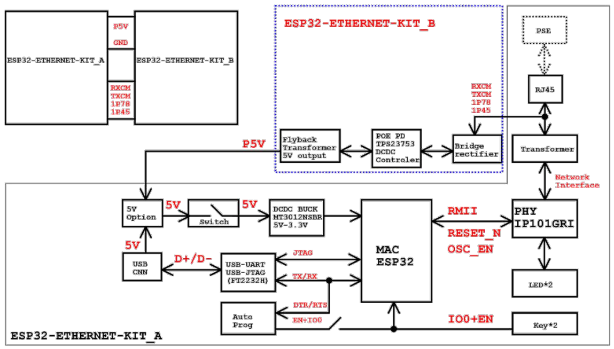
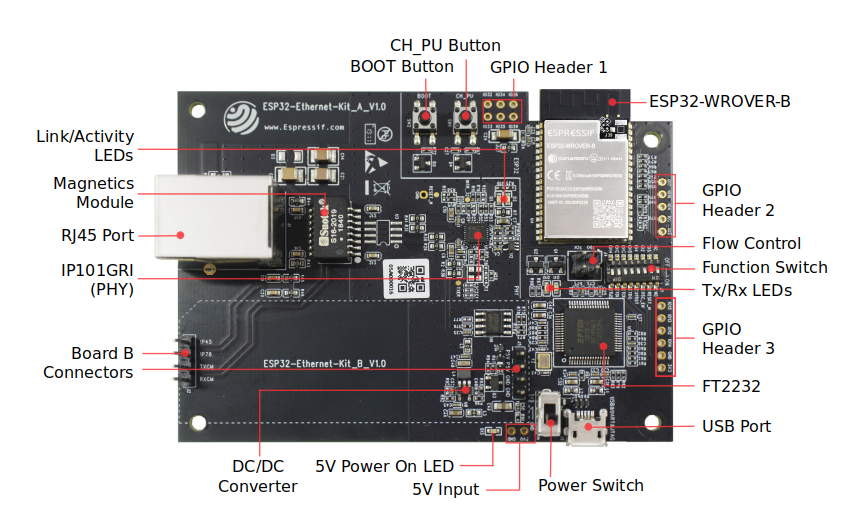
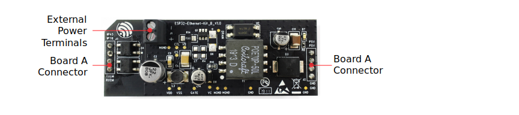

ESP32-Ethernet-Kit V1.0 入门指南
=============================================

:link_to_translation:`en:[English]`

本指南介绍了如何使用 ESP32-Ethernet-Kit 开发板以及配置相关功能。

:ref:`ESP32-Ethernet-Kit <get-started-esp32-ethernet-kit-b-v1.0>` 是一款以太网转 Wi-Fi 开发板，可为以太网设备赋予 Wi-Fi 连接功能。为了提供更灵活的电源选项，ESP32-Ethernet-Kit 也同时支持以太网供电 (PoE)。

准备工作
-------------

* :ref:`ESP32-Ethernet-Kit V1.0 开发板 <get-started-esp32-ethernet-kit-b-v1.0>`
* USB 数据线（A 转 Micro-B）
* PC（Windows、Linux 或 macOS）

你可以跳过介绍部分，直接前往 `应用程序开发`_ 章节。

概述
--------

ESP32-Ethernet-Kit 是一款来自 `乐鑫 <https://espressif.com>`_ 的开发板。

该开发板由以太网母板（A 板）和 PoE 子板（B 板）两部分组成。其中 :ref:`以太网母板（A 板）<get-started-esp32-ethernet-kit-a-v1.0-layout>` 贴蓝牙/Wi-Fi 双模 ESP32-WROVER-B 模组和单端口 10/100 快速以太网收发器 (PHY) IP101GRI。:ref:`PoE 子板（B 板） <get-started-esp32-ethernet-kit-b-v1.0-layout>` 提供以太网供电功能。ESP32-Ethernet-Kit 的 A 板可在不连接 B 板的情况下独立工作。

.. _get-started-esp32-ethernet-kit-b-v1.0:

    ESP32-Ethernet-Kit V1.0

为了实现程序下载和监控，A 板还集成了一款先进多协议 USB 桥接器（FTDI FT2232H 芯片），进而允许开发人员直接通过 USB 接口，使用 JTAG 对 ESP32 进行调试，无需额外的 JTAG 适配器。

功能概述
-----------

ESP32-Ethernet-Kit 开发板的主要组件和连接方式见下。

    ESP32-Ethernet-Kit 功能框图（点击放大）

功能说明
-----------

ESP32-Ethernet-Kit 开发板的主要组件、接口及控制方式见下。

.. _get-started-esp32-ethernet-kit-a-v1.0-layout:

以太网母板（A 板）
^^^^^^^^^^^^^^^^^^

    ESP32-Ethernet-Kit - 以太网母板（A 板）布局（点击放大）

下表将从图片右上角开始，以顺时针顺序介绍图中的主要组件。

=======================  ==================================================================================================================================================================================================================================================================================================================================================================================================================================================================================================================================================================================================================================================================================================
主要组件                  基本介绍
=======================  ==================================================================================================================================================================================================================================================================================================================================================================================================================================================================================================================================================================================================================================================================================================
ESP32-WROVER-B 模组       这款 ESP32 模组内置 64-Mbit PSRAM，可提供灵活的额外存储空间和数据处理能力。

GPIO Header 2             由 5 个未引出通孔组成，可连接至 ESP32 的部分 GPIO。具体介绍，请见 `GPIO Header 2`_。

流控                      跳线帽，可接入开发板信号。具体介绍，请见 `流控`_。

功能选择开关               DIP 开关，可配置 ESP32 部分 GPIO 的功能。具体介绍，请见 `功能选择开关`_。

Tx/Rx LED                2 个 LED，可显示 UART 传输的状态。

GPIO Header 3            可连接至 ESP32 的部分 GPIO，根据 `功能选择开关`_ 的位置有不同功能。

FT2232H                    FT2232H 多协议 USB 转串口桥接器。开发人员可通过 USB 接口对 FT2232H 芯片进行控制和编程，与 ESP32 建立连接。FT2232H 芯片可在通道 A 提供 USB-to-JTAG 接口功能，并在通道 B 提供 USB-to-Serial 接口功能，便利开发人员的应用开发与调试。见 `ESP32-Ethernet-Kit V1.0 以太网母板（A 板）原理图`_。

USB 端口                  USB 接口。可用作开发板的供电电源，或连接 PC 和开发板的通信接口。

电源开关                  电源开关。拨向 **Boot** 按键一侧，开发板上电；拨离 **Boot** 按键一侧，开发板掉电。

5V Input                 5V 电源接口建议仅在开发板自动运行（未连接 PC）时使用。仅用于全负荷工作下的后备电源。

5V Power On LED           当开发板通电后（USB 或外部 5V 供电），该红色指示灯将亮起。

DC/DC 转换器               直流 5 V 转 3.3 V，输出电流高达 2 A。

B 板连接器                 1 对 2 针排针，用于连接 :ref:`PoE 子板（B 板）<get-started-esp32-ethernet-kit-b-v1.0-layout>`。

IP101GRI (PHY)            物理层 (PHY) 单端口 10/100 快速以太网收发器 `IP101GRI`_ ，允许开发人员实现与以太网线缆的物理层连接。PHY 与 ESP32 通过简化媒体独立接口 (RMII) 实现连接。RMII 是 `媒体独立接口 (MII)`_ 的简化版本。PHY 可在 10/100 Mbps 速率下支持 IEEE 802.3/802.3u 标准。

RJ45 端口                  以太网数据传输端口。

网络变压器                  网络变压器属于以太网物理层的一部分，可保护电路免受故障和电压瞬变影响，包括防止收发器芯片和线缆之间产生共模信号。同时它也可以在收发器与以太网设备之间提供电流隔绝。

Link/Activity LED          2 个 LED（绿色和红色），可分别显示 PHY 处于 "Link" 状态或 "Activity" 状态。

BOOT 按键                  下载按键。按下 **BOOT** 键并保持，同时按一下 **EN** 键（此时不要松开 **BOOT** 键）进入“固件下载”模式，通过串口下载固件。

CH_PU 按键                  复位按键。

GPIO Header 1              由 6 个未引出通孔组成，可连接至 ESP32 的备用 GPIO。具体介绍，请见 `GPIO Header 1`_。

=======================  ==================================================================================================================================================================================================================================================================================================================================================================================================================================================================================================================================================================================================================================================================================================

.. _get-started-esp32-ethernet-kit-b-v1.0-layout:

PoE 子板（B 板）
^^^^^^^^^^^^^^^^^^^^^^^^^^

PoE 子板通过以太网电缆传输电能 (PoE)，为以太网母板（A 板）提供电源。PoE 子板（B 板）的主要组件见 `功能概述`_ 中的功能框图。

PoE 子板（B 板）具有以下特性：

* 支持 IEEE 802.3at
* 电源输出：5 V，1.4 A

如需使用 PoE 功能，请用以太网线缆将以太网母板（A 板）上的 **RJ45 端口** 连接至 PoE 的交换机。太网母板（A 板）检测到来自 PoE 子板（B 板）的 5 V 供电后，将从 USB 供电自动切换至 PoE 供电。

    ESP32-Ethernet-Kit -  PoE 子板（B 板）布局（点击放大）

==========================  =================================================================================================================================
主要组件                      基本介绍
==========================  =================================================================================================================================
A 板连接器                    1 个 4 针排母，用于将 B 板连接至 :ref:`以太网母板（A 板）<get-started-esp32-ethernet-kit-a-v1.0-layout>`。

外部电源终端                   PoE 子板（B 板）备用电源。

==========================  =================================================================================================================================

.. _get-started-esp32-ethernet-kit-b-v1.0-setup-options:

设置选项
-------------

本节介绍用于 ESP32-Ethernet-Kit 开发板的硬件配置选项。

功能选择开关
^^^^^^^^^^^^^^^

用户可使用 **功能选择开关** 配置特定 GPIO 管脚的功能。

=======  ================  ================================================================
DIP SW    GPIO 管脚          管脚功能（ DIP SW 开启状态）
=======  ================  ================================================================
1.        GPIO14            连接至 FT2232H，提供 JTAG 功能
2.        GPIO12            连接至 FT2232H，提供 JTAG 功能
3.        GPIO13            连接至 FT2232H，提供 JTAG 功能
4.        GPIO15            连接至 FT2232H，提供 JTAG 功能
5.        GPIO4             连接至 FT2232H，提供 JTAG 功能
6.        GPIO2             连接至板上 25 MHz 晶振
7.        GPIO5             连接至 IP101GRI 的 RESET_N 输入
8.        n/a
=======  ================  ================================================================

用户还可以关闭 DIP DW，将部分 GPIO 用于其他用途。

流控
^^^^^^^^^^^^

2 x 2 跳线连接器，可用于 UART 流控功能。

====  =======  =================================================
.     信号      备注
====  =======  =================================================
1.    MTDO     GPIO13，见 `功能选择开关`_。
2.    MTCK     GPIO15，见 `功能选择开关`_。
3.    RTS      FT2232H 的 RTS 信号
4.    CTS      FT2232H 的 CTS 信号
====  =======  =================================================

GPIO 分配
---------------

本节介绍了 ESP32-Ethernet-Kit 开发板特定接口或功能的 GPIO 分配情况。

IP101GRI (PHY) 接口
^^^^^^^^^^^^^^^^^^^^^^^^

ESP32 (MAC) 与 IP101GRI (PHY) 的管脚对应关系见下。ESP32-Ethernet-Kit 开发板默认使用媒体独立接口 (RMII)。

====  ================  ===============
.     ESP32 管脚 (MAC)   IP101GRI (PHY)
====  ================  ===============
*RMII 接口*
---------------------------------------
1.    GPIO21            TX_EN
2.    GPIO19            TXD[0]
3.    GPIO22            TXD[1]
4.    GPIO25            RXD[0]
5.    GPIO26            RXD[1]
6.    GPIO27            CRS_DV
7.    GPIO0             REF_CLK
----  ----------------  ---------------
*串行管理接口*
---------------------------------------
8      GPIO23            MDC
9      GPIO18            MDIO
----  ----------------  ---------------
*PHY 复位*
---------------------------------------
10    GPIO5             Reset_N
====  ================  ===============

.. note::

    除了 REF_CLK 之外，*RMII 接口* 下的所有管脚分配都是固定的，不能通过 IOMUX 或 GPIO 矩阵进行更改。

GPIO Header 1
^^^^^^^^^^^^^

本连接器包括 ESP32-Ethernet-Kit 开发板上部分不用做他用的 GPIO。

====  ================
.      ESP32 管脚
====  ================
1.    GPIO32
2.    GPIO33
3.    GPIO34
4.    GPIO35
5.    GPIO36
6.    GPIO39
====  ================

GPIO Header 2
^^^^^^^^^^^^^

本连接器包括具有特定 MII 功能的 GPIO（GPIO2 除外）。根据具体情况，部分以太网应用程序可能需要使用此功能。

====  ==========  =================  ==================
.     ESP32 管脚   MII 功能           说明
====  ==========  =================  ==================
1.    GPIO17      EMAC_CLK_180       见说明 1。
2.    GPIO16      EMAC_CLK_OUT       见说明 1。
3.    GPIO4       EMAC_TX_ER
4.    GPIO2       n/a                见说明 2。
5.    GPIO5       EMAC_RX_CLK        见说明 2。
====  ==========  =================  ==================

.. note::

    1. ESP32 芯片的 GPIO16 和 GPIO17 管脚没有引出至 ESP32-WROVER-B 模组的管脚，因此无法使用。如需使用 ESP32 的 GP1016 和 GPIO17 管脚，建议更换其他不含 SPIRAM 的模组，比如 ESP32-WROOM-32D 或 ESP32-SOLO-1。
    2. 具体功能取决于 `功能选择开关`_ 的设置。

GPIO Header 3
^^^^^^^^^^^^^

本连接器中 GPIO 的功能取决于 `功能选择开关`_ 的设置。

====  ===========
.     ESP32 管脚
====  ===========
1.    GPIO15
2.    GPIO13
3.    GPIO12
4.    GPIO14
5.    GND
6.    3V3
====  ===========

GPIO 管脚分配
^^^^^^^^^^^^^^^^^^^^^^^

.. csv-table::
    :header: ESP32-WROVER-B,IP101GRI,UART,JTAG,GPIO,说明

    S_VP,,,,IO36,
    S_VN,,,,IO39,
    IO34,,,,IO34,
    IO35,,,,IO35,
    IO32,,,,IO32,
    IO33,,,,IO33,
    IO25,RXD[0],,,,
    IO26,RXD[1],,,,
    IO27,CRS_DV,,,,
    IO14,,,TMS,IO14,
    IO12,,,TDI,IO12,
    IO13,,RTS,TCK,IO13,
    IO15,,CTS,TDO,IO15,
    IO2,,,,IO2,见下方说明 1 和说明 3。
    IO0,REF_CLK,,,,见下方说明 2 和说明 3。
    IO4,,,nTRST,IO4,
    IO16,,,,IO16 (NC),见下方说明 4。
    IO17,,,,IO17 (NC),见下方说明 4。
    IO5,Reset_N,,,IO5,
    IO18,MDIO,,,,
    IO19,TXD[0],,,,
    IO21,TX_EN,,,,
    RXD0,,RXD,,,
    TXD0,,TXD,,,
    IO22,TXD[1],,,,
    IO23,MDC,,,,

.. note::

    1. GPIO2 用于使能 PHY 的外部振荡器。
    2. GPIO0 用于为 PHY 提供 50 MHz 基准时钟源。为了防止传输线路延迟对时钟相位带来的影响，该时钟信号将首先被反相，而后提供给 PHY。
    3. 为防止 PHY 端 GPIO0 的上电状态受到时钟输出的影响，PHY 的外部晶振将在 ESP32 上电后通过 GPIO2 使能。
    4. ESP32 芯片的 GPIO16 和 GPIO17 管脚没有引出至 ESP32-WROVER-B 模组的管脚，因此无法使用。如需使用 ESP32 的 GP1016 和 GPIO17 管脚，建议更换其他不含 SPIRAM 的模组，比如 ESP32-WROOM-32D 或 ESP32-SOLO-1。

应用程序开发
-----------------------------

ESP32-Ethernet-Kit 上电前，请首先确认开发板完好无损。

初始设置
^^^^^^^^^^^^^

1. 首先，请将 :ref:`以太网母板（A 板）<get-started-esp32-ethernet-kit-a-v1.0-layout>` 上的所有开关均拨至 **ON** 状态，即使 **功能选择开关** 处于默认状态。
2. 为了方便应用程序的下载和测试，此时请不要在开发板安装任何跳线帽，也不要为开发板接入任何信号。
3. 此时可以连接 :ref:`PoE 子板（B 板） <get-started-esp32-ethernet-kit-b-v1.0-layout>`，但不要向 B 板连接任何外部电源。
4. 使用 USB 数据线将 :ref:`以太网母板（A 板） <get-started-esp32-ethernet-kit-a-v1.0-layout>` 连接至 PC。
5. 将 **电源开关** 从 GND 拨至 5V0 一侧。此时，**5V Power On LED** 应点亮。

正式开始开发
^^^^^^^^^^^^^^^^^^

现在，请前往 :doc:`../../get-started/index` 中的 :ref:`get-started-step-by-step` 章节，查看如何设置开发环境，并尝试将示例项目烧录至开发板。

如需使用较早 GNU Make 编译系统，则请参考 :ref:`get-started-step-by-step` 章节。

在进入下一步前，请确保已完成上述所有步骤。

配置与加载以太网示例
^^^^^^^^^^^^^^^^^^^^^^^^^^^^^^^^^^^^^^^

在完成开发环境设置和开发板测试后，即可配置并烧录 :example:`ethernet/basic` 示例。本示例专门用于测试以太网功能，支持不同 PHY，包括 :ref:`ESP32-Ethernet-Kit V1.0 开发板 <get-started-esp32-ethernet-kit-b-v1.0>` 使用的 **IP101GRI**。

相关文档
-----------------

* `ESP32-Ethernet-Kit V1.0 以太网母板（A 板）原理图`_ (PDF)
* `ESP32-Ethernet-Kit V1.0 PoE 子板（B 板）原理图`_ (PDF)
* `《ESP32 技术规格书》 <https://www.espressif.com/sites/default/files/documentation/esp32_datasheet_cn.pdf>`_ (PDF)
* `《ESP32-WROVER-B 技术规格书》 <https://espressif.com/sites/default/files/documentation/esp32-wrover-b_datasheet_cn.pdf>`_ (PDF)
* :doc:`../../api-guides/jtag-debugging/index`
* :doc:`../../hw-reference/index`

有关本开发板的更多设计文档，请联系我们的商务部门 sales@espressif.com。

.. _ESP32-Ethernet-Kit V1.0 以太网母板（A 板）原理图: https://dl.espressif.com/dl/schematics/SCH_ESP32-ETHERNET-KIT_A_V1.0_20190517.pdf
.. _ESP32-Ethernet-Kit V1.0 PoE 子板（B 板）原理图: https://dl.espressif.com/dl/schematics/SCH_ESP32-ETHERNET-KIT_B_V1.0_20190517.pdf
.. _IP101GRI: http://www.bdtic.com/DataSheet/ICplus/IP101G_DS_R01_20121224.pdf
.. _媒体独立接口 (MII): https://en.wikipedia.org/wiki/Media-independent_interface
