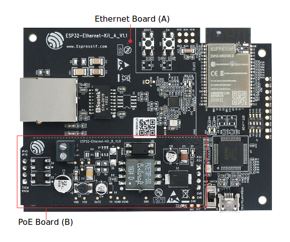
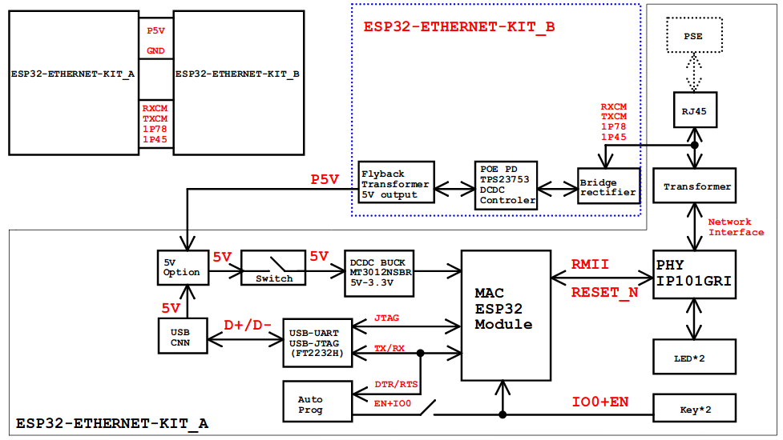
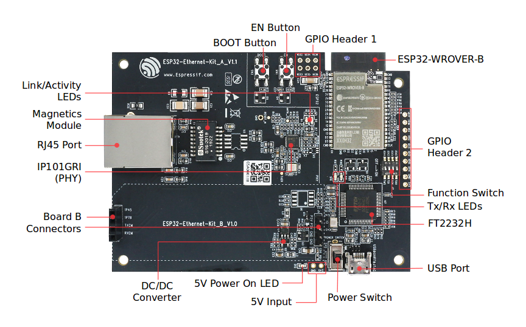
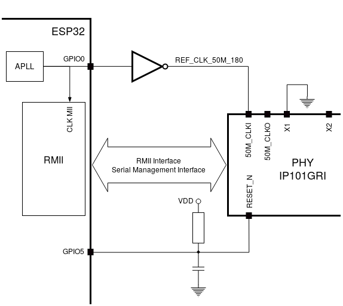

ESP32-Ethernet-Kit V1.1 入门指南
=================================

:link_to_translation:`en:[English]`

本指南将介绍 ESP32-Ethernet-Kit 开发板的配置以及相关功能的使用。

:ref:`ESP32-Ethernet-Kit <get-started-esp32-ethernet-kit-v1.1>` 是一款以太网转 Wi-Fi 开发板，可为以太网设备赋予 Wi-Fi 连接功能。为了提供更灵活的电源选项，ESP32-Ethernet-Kit 同时也支持以太网供电 (PoE)。

准备工作
--------

* :ref:`ESP32-Ethernet-Kit V1.1 开发板 <get-started-esp32-ethernet-kit-v1.1>`
* USB 数据线（A 转 Micro-B）
* PC（Windows、Linux 或 macOS）

你可以跳过介绍部分，直接前往 `应用程序开发`_ 章节。

概述
----

ESP32-Ethernet-Kit 是一款来自 `乐鑫 <https://espressif.com>`_ 的开发板。

它由 :ref:`以太网母板（A 板）<get-started-esp32-ethernet-kit-a-v1.1-layout>` 和 `PoE 子板（B 板）`_ 两部分组成。其中 :ref:`以太网母板（A 板）<get-started-esp32-ethernet-kit-a-v1.1-layout>` 集成蓝牙/Wi-Fi 双模 ESP32-WROVER-B 模组和单端口 10/100 Mbps 快速以太网收发器 (PHY) IP101GRI。`PoE 子板（B 板）`_ 提供以太网供电功能。ESP32-Ethernet-Kit 的 A 板可在不连接 B 板的情况下独立工作。

.. _get-started-esp32-ethernet-kit-v1.1:

    ESP32-Ethernet-Kit V1.1

为了实现程序下载和监控，A 板还集成了一款先进多协议 USB 桥接器（FTDI FT2232H 芯片）。FTDI FT2232H 芯片使得开发人员无需额外的 JTAG 适配器，通过 USB 桥接器使用 JTAG 接口便可对 ESP32 直接进行调试。

功能概述
---------

ESP32-Ethernet-Kit 开发板的主要组件和连接方式如下。

    ESP32-Ethernet-Kit 功能框图（点击放大）

功能说明
--------

有关 ESP32-Ethernet-Kit 开发板的主要组件、接口及控制方式，请见下方的图片和表格。

.. _get-started-esp32-ethernet-kit-a-v1.1-layout:

以太网母板（A 板）
^^^^^^^^^^^^^^^^^^^^^

    ESP32-Ethernet-Kit - 以太网母板（A 板）布局（点击放大）

下表将从图片右上角开始，以顺时针顺序介绍图中的主要组件。

.. list-table:: 表格1  组件介绍
  :widths: 40 150
  :header-rows: 1

  * - 主要组件
    - 基本介绍
  * - ESP32-WROVER-B 模组
    - 这款 ESP32 模组内置 64-Mbit PSRAM，可提供灵活的额外存储空间和数据处理能力。
  * - GPIO Header 2
    - 由 5 个未引出通孔组成，可连接至 ESP32 的部分 GPIO。具体介绍，请见 `GPIO Header 2`_。
  * - 功能选择开关
    -  一个 4 位拨码开关，可配置 ESP32 部分 GPIO 的功能。请注意，拨码开关旁边开发板的丝印层上的 GPIO 管脚标记的位置是不正确的。有关详细信息和正确的管脚分配，请见 `功能选择开关`_。
  * - Tx/Rx LEDs
    - 2 个 LED，可显示 UART 传输的状态。
  * - FT2232H
    - FT2232H 多协议 USB 转串口桥接器。开发人员可通过 USB 接口对 FT2232H 芯片进行控制和编程，与 ESP32 建立连接。FT2232H 芯片可在通道 A 提供 USB-to-JTAG 接口功能，并在通道 B 提供 USB-to-Serial 接口功能，便利开发人员的应用开发与调试。见 `ESP32-Ethernet-Kit V1.1 以太网母板（A 板）原理图`_。
  * - USB 端口
    - USB 接口。可用作开发板的供电电源，或连接 PC 和开发板的通信接口。
  * - 电源开关
    - 电源开关。拨向 **5V0** 按键侧，开发板上电；拨向 **GND** 按键一侧，开发板掉电。
  * - 5V Input
    - 5 V 电源接口建议仅在开发板自动运行（未连接 PC）时使用。
  * - 5V Power On LED
    - 当开发板通电后（USB 或外部 5 V 供电），该红色指示灯将亮起。
  * - DC/DC 转换器
    - 直流 5 V 转 3.3 V，输出电流最高可达 2 A。
  * - Board B 连接器
    - 1 对 排针和排母，用于连接 `PoE 子板（B 板）`_。
  * - IP101GRI (PHY)
    - 物理层 (PHY) 单端口 10/100 快速以太网收发器 `IP101GRI <http://www.bdtic.com/DataSheet/ICplus/IP101G_DS_R01_20121224.pdf>`_ 芯片，允许开发人员实现与以太网线缆的物理层连接。PHY 与 ESP32 通过简化媒体独立接口 (RMII) 实现连接。RMII 是 `媒体独立接口 (MII) <https://en.wikipedia.org/wiki/Media-independent_interface>`_ 的标准简化版本。PHY 可在 10/100 Mbps 速率下支持 IEEE 802.3 / 802.3u 标准。
  * - RJ45 端口
    - 以太网数据传输端口。
  * - 网络变压器
    - 网络变压器属于以太网物理层的一部分，可保护电路，使其免受故障和电压瞬变影响，包括防止收发器芯片和线缆之间产生共模信号。同时它也可以在收发器与以太网设备之间提供电流隔绝。
  * - Link/Activity LED
    - 2 个 LED（绿色和红色），可分别显示 PHY 处于 “Link” 状态或 “Activity” 状态。
  * - BOOT Button
    - 下载按键。按下 **BOOT** 键并保持，同时按一下 **EN** 键（此时不要松开 **BOOT** 键）进入“固件下载”模式，通过串口下载固件。
  * - EN 按键
    - 复位按键。
  * - GPIO Header 1
    - 由 6 个未引出通孔组成，可连接至 ESP32 的备用 GPIO。具体介绍，请见 `GPIO Header 1`_。

PoE 子板（B 板）
^^^^^^^^^^^^^^^^^^^

PoE 子板转换以太网电缆传输的电能 (PoE)，为以太网母板（A 板）提供电源。PoE 子板（B 板）的主要组件见 `功能概述`_ 中的功能框图。

PoE 子板（B 板）具有以下特性：

* 支持 IEEE 802.3at 标准
* 电源输出：5 V，1.4 A

如需使用 PoE 功能，请用以太网线缆将以太网母板（A 板）上的 **RJ45 Port** 连接至 PoE 的交换机。以太网母板（A 板）检测到来自 PoE 子板（B 板）的 5 V 供电后，将从 USB 供电自动切换至 PoE 供电。

.. figure:: ../../../_static/esp32-ethernet-kit-b-v1.0-layout.png
    :align: center
    :scale: 80%
    :alt: ESP32-Ethernet-Kit - PoE board (B)
    :figclass: align-center

    ESP32-Ethernet-Kit - PoE 子板（B 板）布局（点击放大）

.. list-table:: 表格2  PoE 子板（B 板）
  :widths: 40 150
  :header-rows: 1

  * - 主要组件
    - 基本介绍
  * - A 板连接器
    - 4 个排针（左侧）和排母（右侧），用于将 PoE 子板（B 板）连接至 :ref:`Ethernet board (A) <get-started-esp32-ethernet-kit-a-v1.1-layout>`。左侧的管脚接受来自 PoE 交换机的电源。右侧的管脚为 以太网母板（A 板）提供 5 V 电源。
  * - 外部电源终端
    - PoE 子板（B 板）可选电源 (26.6 ~ 54 V)。

.. _get-started-esp32-ethernet-kit-v1.1-setup-options:

设置选项
--------

本节介绍用于 ESP32-Ethernet-Kit 开发板的硬件配置选项。

功能选择开关
^^^^^^^^^^^^^^

拨码开关打开时，拨码开关将列出的 GPIO 路由到 FT2232H 以提供 JTAG 功能。拨码开关关闭时，GPIO 可以用于其他目的。

=========   ==========
拨码开关      GPIO 管脚
=========   ==========
 1          GPIO13
 2          GPIO12
 3          GPIO15
 4          GPIO14
=========   ==========

.. note::

    拨码开关旁边开发板的丝印层上的 GPIO 管脚标记的位置是不正确的。请以表格中的顺序为准。

RMII 时钟源选择
^^^^^^^^^^^^^^^^

RMII 工作模式下的以太网 MAC 和 PHY 需要一个公共的 50 MHz 同步时钟（即 RMII 时钟），它既可以由外部提供，也可以由内部的 ESP32 APLL 产生。

.. note::

    有关 RMII 时钟源选择的更多信息，请参见 `ESP32-Ethernet-Kit V1.1 以太网母板（A 板）原理图`_，第 2 页的位置 D2。

PHY 侧提供 RMII 时钟
"""""""""""""""""""""""""""""

ESP32-Ethernet-Kit 默认配置为 IP101GRI 的 50M_CLKO 信号线提供 RMII 时钟，该时钟信号由 PHY 外侧连接的 25 MHz 无源晶振经过倍频产生。详情请参见下图。

.. figure:: ../../../_static/esp32-ethernet-kit-rmii-clk-from-phy.png
    :align: center
    :scale: 80%
    :alt: RMII Clock from IP101GRI PHY
    :figclass: align-center

    PHY 侧提供 RMII 时钟

请注意，系统上电时 RESET_N 旁的下拉电阻会将 PHY 置于复位状态，ESP32 需要通过 GPIO5 将 RESET_N 拉高才能启动 PHY，只有这样才能保证系统的正常上电，否则 ESP32 会存在一定几率进入下载模式（当 REF_CLK_50M 时钟信号在 GPIO0 上电采样阶段刚好处于高电平）。

ESP32 APLL 内部提供的 RMII 时钟
""""""""""""""""""""""""""""""""""""

另一种选择是从 ESP32 APLL 内部获取 RMII 时钟，请参见下图。来自 GPIO0 的时钟信号首先被反相，以解决传输线延迟的问题，然后提供给 PHY。

    ESP32 APLL 内部提供的 RMII 时钟

要实现此选项，用户需要在板子上移除或添加一些阻容元器件。有关详细信息，请参见 `ESP32-Ethernet-Kit V1.1 以太网母板（A 板）原理图`_，第 2 页，位置 D2。请注意，如果 APLL 已经用于其他用途（如 I2S 外设），那么只能使用外部 RMII 时钟。

GPIO 分配
---------

本节介绍了 ESP32-Ethernet-Kit 开发板特定接口或功能的 GPIO 分配情况。

IP101GRI (PHY) 接口
^^^^^^^^^^^^^^^^^^^^^^^^^

下表显示了 ESP32 (MAC) 与 IP101GRI (PHY) 的管脚对应关系。ESP32-Ethernet-Kit 的实现默认设置为简化媒体独立接口。

====  ================  ===============
.     ESP32 管脚 (MAC)   IP101GRI (PHY)
====  ================  ===============
*RMII 接口*
---------------------------------------
 1    GPIO21            TX_EN
 2    GPIO19            TXD[0]
 3    GPIO22            TXD[1]
 4    GPIO25            RXD[0]
 5    GPIO26            RXD[1]
 6    GPIO27            CRS_DV
 7    GPIO0             REF_CLK
----  ----------------  ---------------
*串行管理接口*
---------------------------------------
 8    GPIO23            MDC
 9    GPIO18            MDIO
----  ----------------  ---------------
*PHY 复位*
---------------------------------------
10    GPIO5             Reset_N
====  ================  ===============

.. Note::

    除了 REF_CLK 之外，ESP32 的 *RMII 接口* 下的所有管脚分配都是固定的，不能通过 IOMUX 或 GPIO 矩阵进行更改。

GPIO Header 1
^^^^^^^^^^^^^

本连接器包括 ESP32-Ethernet-Kit 开发板上部分不用做他用的 GPIO。

====  ================
.     ESP32 管脚
====  ================
 1    GPIO32
 2    GPIO33
 3    GPIO34
 4    GPIO35
 5    GPIO36
 6    GPIO39
====  ================

GPIO Header 2
^^^^^^^^^^^^^

根据“说明"描述的不同情形，本连接器包含可用做他用的 GPIO。

====  ==========  ====================
.     ESP32 管脚   说明
====  ==========  ====================
 1    GPIO17      见下方说明 1
 2    GPIO16      见下方说明 1
 3    GPIO4
 4    GPIO2
 5    GPIO13      见下方说明 2
 6    GPIO12      见下方说明 2
 7    GPIO15      见下方说明 2
 8    GPIO14      见下方说明 2
 9    GND         Ground
10    3V3         3.3 V 电源
====  ==========  ====================

.. note::

    1. ESP32 芯片的 GPIO16 和 GPIO17 管脚没有引出至 ESP32-WROVER-B 模组的管脚，因此无法使用。如需使用 ESP32 的 GP1016 和 GPIO17 管脚，建议更换其他不含 PSRAM 的模组，比如 ESP32-WROOM-32D 或 ESP32-SOLO-1。

    2. 具体功能取决于 `功能选择开关`_ 的设置。

GPIO 管脚分配总结
^^^^^^^^^^^^^^^^^^^

.. csv-table::
    :header: ESP32-WROVER-B,IP101GRI,UART,JTAG,GPIO,Comments

    S_VP,,,,IO36,
    S_VN,,,,IO39,
    IO34,,,,IO34,
    IO35,,,,IO35,
    IO32,,,,IO32,
    IO33,,,,IO33,
    IO25,RXD[0],,,,
    IO26,RXD[1],,,,
    IO27,CRS_DV,,,,
    IO14,,,TMS,IO14,
    IO12,,,TDI,IO12,
    IO13,,RTS,TCK,IO13,
    IO15,,CTS,TDO,IO15,
    IO2,,,,IO2,
    IO0,REF_CLK,,,,See note 1
    IO4,,,,IO4,
    IO16,,,,IO16 (NC),See note 2
    IO17,,,,IO17 (NC),See note 2
    IO5,Reset_N,,,,See note 1
    IO18,MDIO,,,,
    IO19,TXD[0],,,,
    IO21,TX_EN,,,,
    RXD0,,RXD,,,
    TXD0,,TXD,,,
    IO22,TXD[1],,,,
    IO23,MDC,,,,

.. note::

    1. 为防止 ESP32 侧 GPIO0 的上电状态受 PHY 侧时钟输出的影响，PHY 侧 RESET_N 默认为低，以关闭 PHY 侧时钟输出。上电后，可以通过 GPIO5 控制 RESET_N 以打开该时钟输出。参见 `PHY 侧提供 RMII 时钟`_。对于无法通过 RESET_N 关闭时钟输出的 PHY，PHY 侧建议使用可在外部禁用/使能的有源晶振。与使用 RESET_N 类似，默认情况下晶振模块应禁用，并在上电后由 ESP32 开启。有关参考设计，请参见 `ESP32-Ethernet-Kit V1.1 以太网母板（A 板）原理图`_。

    2. ESP32 芯片的 GPIO16 和 GPIO17 管脚没有引出至 ESP32-WROVER-B 模组的管脚，因此无法使用。如需使用 ESP32 的 GP1016 和 GPIO17 管脚，建议更换其他不含 PSRAM 的模组，比如 ESP32-WROOM-32D 或 ESP32-SOLO-1。

应用程序开发
-------------

ESP32-Ethernet-Kit 上电前，请首先确认开发板完好无损。

初始设置
^^^^^^^^^^

1. 首先，请将 :ref:`以太网母板（A 板）<get-started-esp32-ethernet-kit-a-v1.1-layout>` 上的所有开关均拨至 **ON** 状态，使 **功能选择开关** 处于默认状态。
2. 为了方便应用程序的下载和测试，不要为开发板输入任何信号。
3. 此时可以连接 `PoE 子板（B 板）`_ ，但不要向 B 板连接任何外部电源。
4. 使用 USB 数据线将 :ref:`以太网母板（A 板）<get-started-esp32-ethernet-kit-a-v1.1-layout>` 连接至 PC。
5. 将 **电源开关** 从 GND 拨至 5V0 一侧。此时，**5V Power On LED** 应点亮。

正式开始开发
^^^^^^^^^^^^^

现在，请前往 :doc:`../../get-started/index` 中的 :ref:`get-started-step-by-step` 章节，查看如何设置开发环境，并尝试将示例项目烧录至你的开发板。

在进入下一步前，请确保已完成上述所有步骤。

配置与加载以太网示例
^^^^^^^^^^^^^^^^^^^^^^^

在完成开发环境设置和开发板测试后，即可配置并烧录 :example:`ethernet/basic` 示例。本示例专门用于测试以太网功能，支持不同 PHY，包括 :ref:`get-started-esp32-ethernet-kit-v1.1` 开发板使用的 **IP101GRI** 。

针对 ESP32-Ethernet-Kit V1.0 的主要修改
-----------------------------------------

* 原 GPIO0 反相后时钟提供给 PHY 方案改为由 PHY 侧外接无源晶振，提供时钟给 GPIO0。原用于控制有源晶振的 OSC_EN 的 IO2 释放，可用作其他用途。
* 为防止 ESP32 侧 GPIO0 的上电状态受到 PHY 侧时钟输出的影响，PHY 侧 RESET_N 默认为低，关闭 PHY 侧时钟输出。而后可通过 GPIO5 控制 RESET_N 打开该时钟输出。
* 移除 FT2232H 芯片的外部 SPI flash U6。
* 移除流控的测试排针 J4。
* 移除 nTRST JTAG 信号，相应的 GPIO4 可用作其他用途。
* GPIO15 线上的上拉电阻 R68 移至 JTAG 的 MTDO 侧。
* 为了加强 A 板和 B 板连接间的防呆设计（减少反向插入 B 板的机会），将原先 A 板上的 2 排 4 针排针改为 1 排 4 针排母和 1 排 4 针排针。相应的 4 针排针排和排母排则安装在 B 板上。

ESP32-Ethernet-Kit 的其他版本
-------------------------------

* :doc:`get-started-ethernet-kit-v1.0`

相关文档
----------

* `ESP32-Ethernet-Kit V1.1 以太网母板（A 板）原理图`_ (PDF)
* `ESP32-Ethernet-Kit V1.0 PoE 子板（B 板）原理图`_ (PDF)
* `ESP32 技术规格书 <https://www.espressif.com/sites/default/files/documentation/esp32_datasheet_cn.pdf>`_ (PDF)
* `ESP32-WROVER-B 技术规格书 <https://espressif.com/sites/default/files/documentation/esp32-wrover-b_datasheet_cn.pdf>`_ (PDF)
* :doc:`../../api-guides/jtag-debugging/index`
* :doc:`../../hw-reference/index`

有关本开发板的更多设计文档，请联系我们的商务部门 sales@espressif.com。

.. _ESP32-Ethernet-Kit V1.1 以太网母板（A 板）原理图: https://dl.espressif.com/dl/schematics/SCH_ESP32-ETHERNET-KIT_A_V1.1_20190711.pdf
.. _ESP32-Ethernet-Kit V1.0 PoE 子板（B 板）原理图: https://dl.espressif.com/dl/schematics/SCH_ESP32-ETHERNET-KIT_B_V1.0_20190517.pdf
.. _ESP32-Ethernet-Kit V1.0 以太网母板（A 板）原理图: https://dl.espressif.com/dl/schematics/SCH_ESP32-ETHERNET-KIT_A_V1.0_20190517.pdf

.. toctree::
    :hidden:

    get-started-ethernet-kit-v1.0.rst
