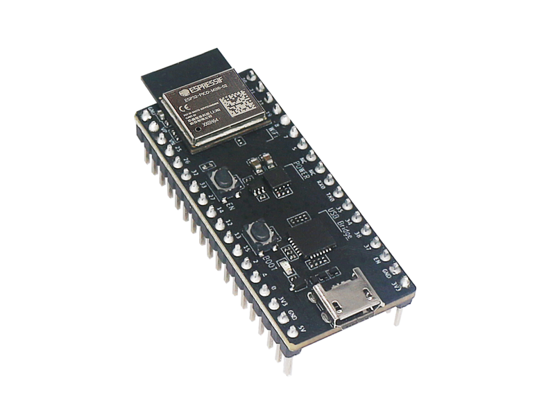
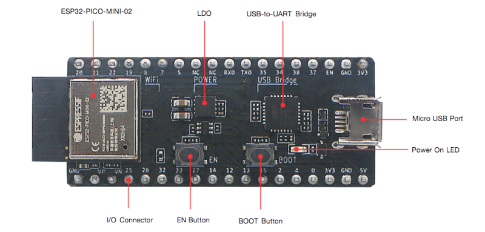
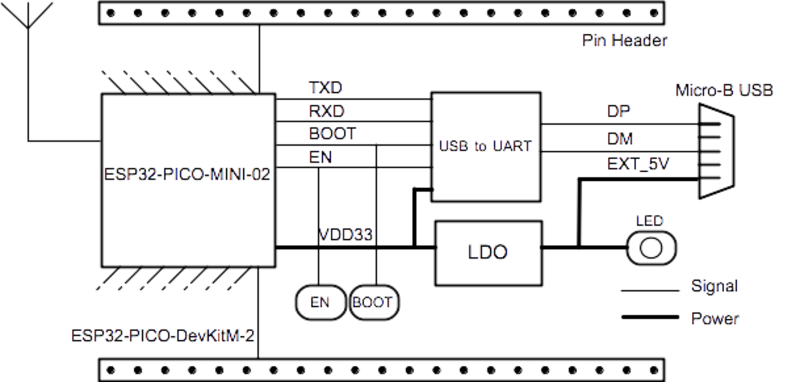
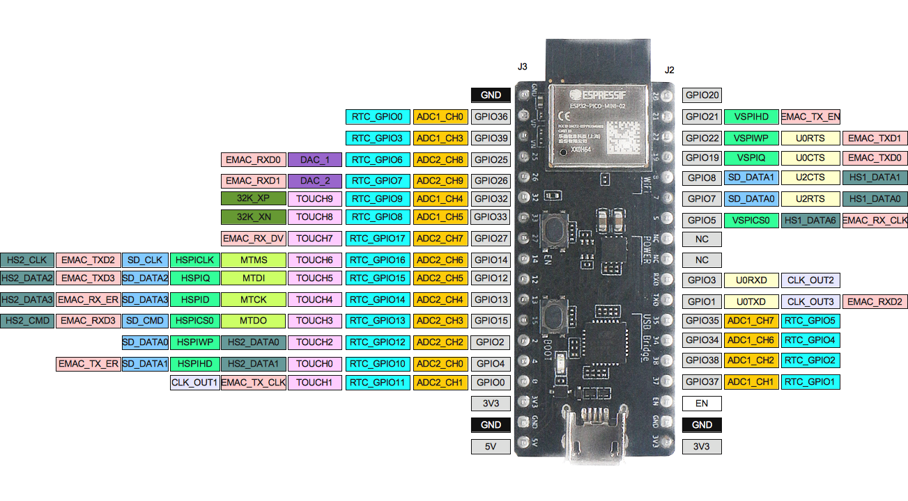

ESP32-PICO-DevKitM-2
**********************

:link_to_translation:`en:[English]`

概述
======

ESP32-PICO-DevKitM-2 是一款基于 `ESP32 <https://www.espressif.com/zh-hans/products/socs/esp32>`_ 的乐鑫开发板，板上搭载 `ESP32-PICO-MINI-02/02U <https://www.espressif.com/zh-hans/products/modules>`_ 模组。ESP32-PICO-MINI-02/02U 模组具备完整的 Wi-Fi 和蓝牙功能。

ESP32-PICO-DevKitM-2 开发板同时集成了 USB-to-UART 桥接电路，方便开发人员直接通过 PC 的 USB 端口直接进行固件烧录和调试。

为方便硬件连接，ESP32-PICO-MINI-02/02U 上的所有 IO 信号和系统电源管脚均引出至开发板两侧焊盘 (18 x 0.1")。上述 18 个焊盘也均引出至排针，可使用杜邦线连接。

.. note::

    ESP32-PICO-DevKitM-2 开发板默认采用排针。

ESP32-PICO-DevKitM-2 为用户提供了基于 ESP32 芯片应用开发的硬件，更加方便用户探索 ESP32 芯片的功能。

    ESP32-PICO-DevKitM-2 外观图（点击放大）

本指南包括以下几个章节：

- `快速入门`_：简要介绍 ESP32-PICO-DevKitM-2 开发板，以及上手这款开发板所需的软件配置；
- `内含组件和包装方式`_：介绍零售订单和批量订单所提供的组件及包装方式；
- `硬件参考`_：提供 ESP32-PICO-DevKitM-2 开发板硬件详细信息；
- `硬件版本`_：介绍硬件历史版本（如有），已知问题（如有），并提供链接至历史版本开发板的入门指南（如有）；
- `相关文档`_：提供相关文档的链接。

快速入门
=========

本节介绍了如何快速上手 ESP32-PICO-DevKitM-2。首先对 ESP32-PICO-DevKitM-2 开发板进行了简要介绍，然后在 `应用开发`_ 小节介绍如何将固件烧录至开发板。

.. _get-started-pico-devkitm-2-board-front:

组件描述
----------

ESP32-PICO-DevKitM-2 开发板的主要组件、接口及控制方式见下图。下文以板载 ESP32-PICO-MINI-02 的开发板为例进行说明。

    ESP32-PICO-DevKitM-2 开发板组件布局 - 正面（点击放大）

从左上角开始，按顺时针顺序，开发板主要组件的描述见下表。

.. list-table::
   :widths: 10 25
   :header-rows: 1

   * - 主要组件
     - 描述
   * - ESP32-PICO-MINI-02
     - ESP32-PICO-DevKitM-2 开发板的板载模组，搭载 ESP32 SoC 芯片。用户也可选择板载 ESP32-PICO-MINI-02U 的开发板。
   * - LDO
     - 5V 转 3.3V 低压差稳压器
   * - USB-to-UART
     - CP2102N：单芯片 USB-to-UART 桥接器，数据传输速率可达 3 Mbps。
   * - Micro-B USB 接口
     - USB 接口。可为开发板供电，或连接 PC 进行 USB 通信。
   * - 5V Power On LED
     - 开发板上电后，红色指示灯亮起。更多信息，见 `相关文档`_ 中提供的原理图。
   * - I/O Connector
     - ESP32-PICO-MINI-02 上的管脚均已引出至开发板排针。用户可对 ESP32 进行编程，实现 PWM、ADC、DAC、I2C、I2S、SPI 等功能。更多信息，见章节 `管脚描述`_。
   * - BOOT 按键
     - 下载按键。按下 **Boot** 键并保持，同时按下 **EN** 键将进入固件下载模式，通过串口下载固件。
   * - EN 按键
     - 复位按键。

应用开发
---------

上电前，请确保 ESP32-PICO-DevKitM-2 完好无损。

所需硬件
"""""""""""

- 1 x ESP32-PICO-DevKitM-2 开发板
- 1 x USB 2.0 A 转 Micro B 数据线
- 1 x PC，运行 Windows、Linux 或 macOS 系统

.. _user-guide-pico-devkitm-2-software-setup:

软件配置
"""""""""""

请前往 :doc:`../../get-started/index`，在 :ref:`get-started-step-by-step` 一节查看如何快速配置开发环境，将应用程序烧录至 ESP32-PICO-DevKitM-2 开发板。

内含组件和包装方式
===================

零售订单
----------

如购买样品，每个 ESP32-PICO-DevKitM-2 将单独包装。

零售订单，请前往 https://www.espressif.com/en/contact-us/get-samples。

批量订单
-----------

如批量购买，ESP32-PICO-DevKitM-2 开发板将以大纸板箱包装。

批量订单请前往 https://www.espressif.com/zh-hans/contact-us/sales-questions。

硬件参考
=============

功能框图
-----------

ESP32-PICO-DevKitM-2 的主要组件和连接方式如下图所示。

    ESP32-PICO-DevKitM-2 功能框图（点击放大）

供电方式
------------

开发板提供以下三种供电方式，可任意选择一种：

* Micro USB 供电（默认）
* 5V/GND 管脚供电
* 3V3/GND 管脚供电

.. warning::

    上述供电方式只能选择一种方式，不能同时选择，否则可能会损坏开发板和/或电源。

管脚描述
---------

:ref:`get-started-pico-devkitm-2-board-front` 中所示的开发板两侧 I/O 管脚，其具体名称和功能见下表。管脚名称和编号与 `相关文档`_ 中原理图保持一致。

Header J2
""""""""""""

.. list-table::
   :widths: 5 5 5 35
   :header-rows: 1

   * - 编号
     - 名称
     - 类型
     - 功能
   * - 1
     - IO20
     - I/O
     - GPIO20
   * - 2
     - IO21
     - I/O
     - GPIO21, VSPIHD, EMAC_TX_EN
   * - 3
     - IO22
     - I/O
     - GPIO22, VSPIWP, U0RTS, EMAC_TXD1
   * - 4
     - IO19
     - I/O
     - GPIO19, VSPIQ, U0CTS, EMAC_TXD0
   * - 5
     - IO8
     - I/O
     - GPIO8, SD_DATA1, HS1_DATA1, U2CTS
   * - 6
     - IO7
     - I/O
     - GPIO7, SD_DATA0, HS1_DATA0, U2RTS
   * - 7
     - IO5
     - I/O
     - GPIO5, VSPICS0, HS1_DATA6, EMAC_RX_CLK
   * - 8
     - NC
     - \-
     - NC
   * - 9
     - NC
     - \-
     - NC
   * - 10
     - RXD0
     - I/O
     - GPIO3, U0RXD :ref:`（见注解 1） <get-started-pico-devkitm-2-pin-notes>`, CLK_OUT2
   * - 11
     - TXD0
     - I/O
     - GPIO1, U0TXD :ref:`（见注解 1） <get-started-pico-devkitm-2-pin-notes>`, CLK_OUT3, EMAC_RXD2
   * - 12
     - IO35
     - I
     - ADC1_CH7, RTC_GPIO5
   * - 13
     - IO34
     - I
     - ADC1_CH6, RTC_GPIO4
   * - 14
     - IO38
     - I
     - GPIO38, ADC1_CH2, RTC_GPIO2
   * - 15
     - IO37
     - I
     - GPIO37, ADC1_CH1, RTC_GPIO1
   * - 16
     - EN
     - I
     - CHIP_PU
   * - 17
     - GND
     - P
     - 接地
   * - 18
     - VDD33 (3V3)
     - P
     - 3.3 V 供电

Header J3
"""""""""""""

.. list-table::
   :widths: 5 5 5 35
   :header-rows: 1

   * - 编号
     - 名称
     - 类型
     - 功能
   * - 1
     - GND
     - P
     - 接地
   * - 2
     - SENSOR_VP (FSVP)
     - I
     - GPIO36, ADC1_CH0, RTC_GPIO0
   * - 3
     - SENSOR_VN (FSVN)
     - I
     - GPIO39, ADC1_CH3, RTC_GPIO3
   * - 4
     - IO25
     - I/O
     - GPIO25, DAC_1, ADC2_CH8, RTC_GPIO6, EMAC_RXD0
   * - 5
     - IO26
     - I/O
     - GPIO26, DAC_2, ADC2_CH9, RTC_GPIO7, EMAC_RXD1
   * - 6
     - IO32
     - I/O
     - 32K_XP :ref:`（见注解 2a） <get-started-pico-devkitm-2-pin-notes>`, ADC1_CH4, TOUCH9, RTC_GPIO9
   * - 7
     - IO33
     - I/O
     - 32K_XN :ref:`（见注解 2b） <get-started-pico-devkitm-2-pin-notes>`, ADC1_CH5, TOUCH8, RTC_GPIO8
   * - 8
     - IO27
     - I/O
     - GPIO27, ADC2_CH7, TOUCH7, RTC_GPIO17, EMAC_RX_DV
   * - 9
     - IO14
     - I/O
     - ADC2_CH6, TOUCH6, RTC_GPIO16, MTMS, HSPICLK, HS2_CLK, SD_CLK, EMAC_TXD2
   * - 10
     - IO12
     - I/O
     - ADC2_CH5, TOUCH5, RTC_GPIO15, MTDI :ref:`（见注解 3）<get-started-pico-devkitm-2-pin-notes>`, HSPIQ, HS2_DATA2, SD_DATA2, EMAC_TXD3
   * - 11
     - IO13
     - I/O
     - ADC2_CH4, TOUCH4, RTC_GPIO14, MTCK, HSPID, HS2_DATA3, SD_DATA3, EMAC_RX_ER
   * - 12
     - IO15
     - I/O
     - ADC2_CH3, TOUCH3, RTC_GPIO13, MTDO, HSPICS0, HS2_CMD, SD_CMD, EMAC_RXD3
   * - 13
     - IO2
     - I/O
     - ADC2_CH2, TOUCH2, RTC_GPIO12, HSPIWP, HS2_DATA0, SD_DATA0
   * - 14
     - IO4
     - I/O
     - ADC2_CH0, TOUCH0, RTC_GPIO10, HSPIHD, HS2_DATA1, SD_DATA1, EMAC_TX_ER
   * - 15
     - IO0
     - I/O
     - ADC2_CH1, TOUCH1, RTC_GPIO11, CLK_OUT1, EMAC_TX_CLK
   * - 16
     - VDD33 (3V3)
     - P
     - 3.3V 供电
   * - 17
     - GND
     - P
     - 接地
   * - 18
     - EXT_5V (5V)
     - P
     - 5V 供电

.. _get-started-pico-devkitm-2-pin-notes:

.. note::

    1. 该管脚已连接至板上 USB 桥接器芯片；
    2. 32.768 kHz 晶振输入输出管脚：
        (a) 输入管脚；
        (b) 输出管脚；
    3. ESP32-PICO-DevKitM-2 内置 SPI flash 的工作电压为 3.3 V。因此，Strapping 管脚 MTDI 在上电复位过程中应拉低。如果连接了该管脚，请确保该管脚在复位中不要拉高。

管脚布局
""""""""""""

    ESP32-PICO-DevKitM-2 管脚布局（点击放大）

硬件版本
==========

该开发板为最新硬件，尚未有历史版本。

相关文档
=========

* `ESP32-PICO-MINI-02 & ESP32-PICO-MINI-02U 技术规格书 <https://www.espressif.com/sites/default/files/documentation/esp32-pico-mini-02_datasheet_cn.pdf>`_ (PDF)
* `乐鑫产品选型工具 <https://products.espressif.com/#/product-selector?names=>`_
* `ESP32-PICO-DevKitM-2 原理图 <https://dl.espressif.com/dl/schematics/SCH_ESP32-PICO-DEVKITM-2_V1_0_20200812A.pdf>`_ (PDF)
* `ESP32-PICO-DevKitM-2 PCB 布局图 <https://dl.espressif.com/dl/schematics/PCB_ESP32-PICO-DevKitM-2_V1.0_20200812.pdf>`_ (PDF)

有关本开发板的更多设计文档，请联系我们的商务部门 sales@espressif.com。
