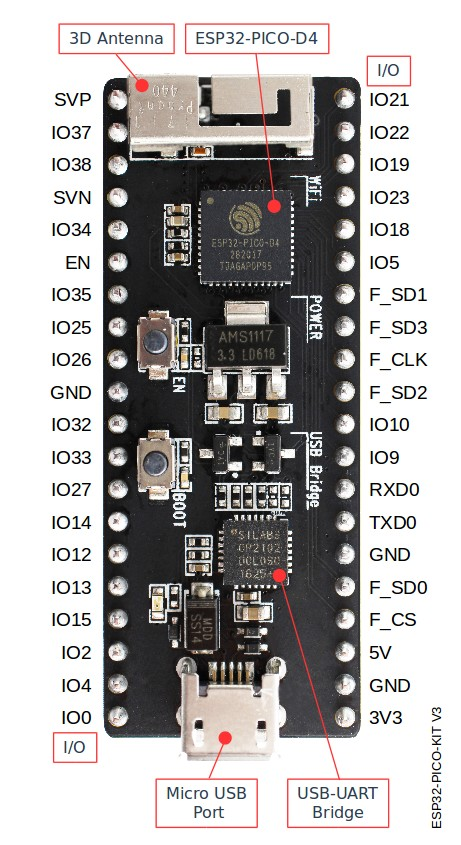

ESP32-PICO-KIT V3 入门指南
=======================================

:link_to_translation:`en:[English]`

本指南介绍了如何开始使用 ESP32-PICO-KIT V3 迷你开发板。有关 ESP32-PICO-KIT 其他版本的介绍，请见：:doc:`../../hw-reference/index`。

准备工作
--------

* ESP32-PICO-KIT V3 迷你开发板
* USB 2.0 线（A 型转 Micro-B 型）
* PC（Windows、Linux 或 macOS）

你可以跳过介绍部分，直接前往 `应用程序开发`_ 章节。

概述
----

ESP32-PICO-KIT V3 是一款来自 `乐鑫 <https://espressif.com>`_ 的迷你开发板，其核心是具有完整 Wi-Fi 和蓝牙功能的 ESP32 系列 SiP 模组 ESP32-PICO-D4。

ESP32-PICO-KIT 集成了 USB 转 UART 桥接电路，允许开发人员直接通过 PC 的 USB 端口进行下载和调试。

为了便于连接，ESP32-PICO-D4 上的所有 IO 信号和系统电源管脚均通过开发板两侧焊盘（每侧 20 个 x 0.1 英寸间隔）引出。

功能说明
--------

ESP32-PICO-KIT V3 开发板的主要组件、接口及控制方式见下。

    ESP32-PICO-KIT V3 开发板布局

ESP32-PICO-KIT 开发板的主要组件描述见下表。

.. list-table::
    :widths: 25 75
    :header-rows: 1

    * - 主要组件
      - 基本介绍
    * - ESP32-PICO-D4
      - ESP32-PICO-KIT V3 开发板上焊接的标准 ESP32-PICO-D4 模组，集成了 ESP32 芯片的完整系统，仅需连接天线、LC 匹配电路、退耦电容和一个 EN 信号上拉电阻即可正常工作。
    * - LDO
      - 5V-to-3.3V 低压差稳压器。
    * - USB-to-UART 桥接器
      - 单芯片 USB-to-UART 桥接器，可提供高达 1 Mbps 的传输速率。
    * - Micro USB 端口
      - USB 接口。可用作开发板的供电电源，或连接 PC 和开发板的通信接口。
    * - Power On LED
      - 开发板通电后，该红色指示灯将亮起。
    * - I/O
      - ESP32-PICO-D4 的所有管脚均已引出至开发板的排针。用户可以对 ESP32 进行编程，实现 PWM、ADC、DAC、I2C、I2S、SPI 等多种功能。
    * - BOOT
      - 下载按键。按下 **Boot** 键并保持，同时按一下 **EN** 键（此时不要松开 **Boot** 键）进入“固件下载”模式，通过串口下载固件。
    * - EN
      - 复位按键。

应用程序开发
------------

ESP32-PICO-KIT V3 上电前，请首先确认开发板完好无损。

现在，请前往 :doc:`../../get-started/index` 中的 :ref:`get-started-step-by-step` 章节，查看如何设置开发环境，并尝试将示例项目烧录至你的开发板。

相关文档
-----------------

* `ESP32-PICO-KIT V3 原理图 <https://dl.espressif.com/dl/schematics/esp32-pico-kit-v3_schematic.pdf>`_ (PDF)
* `《ESP32-PICO-D4 技术规格书》 <https://espressif.com/sites/default/files/documentation/esp32-pico-d4_datasheet_cn.pdf>`_ (PDF)
* :doc:`../../hw-reference/index`
