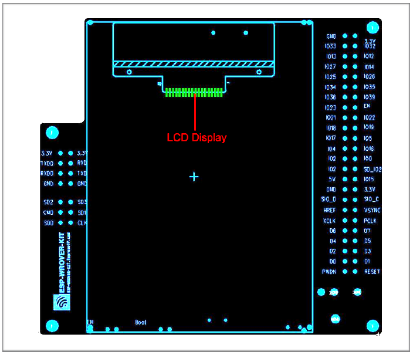

ESP-WROVER-KIT V2 入门指南
===========================================

:link_to_translation:`en:[English]`

本指南介绍了如何开始使用 ESP-WROVER-KIT V2 开发板及其功能和相关配置。有关 ESP-WROVER-KIT 其他版本的介绍，请见 :doc:`../../hw-reference/index`。

准备工作
-------------

* ESP-WROVER-KIT V2 开发板
* USB 数据线（A 转 Micro-B）
* PC（Windows、Linux 或 macOS）

你可以跳过介绍部分，直接前往 `应用程序开发`_ 章节。

概述
--------

ESP-WROVER-KIT 是 `乐鑫 <https://espressif.com>`_ 一款基于 ESP32 的开发板，集成了 LCD 屏幕和 microSD 卡槽。

ESP-WROVER-KIT 可选贴以下 ESP32 模组：

- ESP32-WROOM-32
- ESP32-WROVER 系列模组

此外，ESP-WROVER-KIT 的独特之处在于集成了一款先进多协议 USB 桥接器 (FTDI FT2232HL)，允许开发人员直接通过 USB 接口，使用 JTAG 对 ESP32 进行调试，无需额外的 JTAG 调试器。ESP-WROVER-KIT 可为开发人员提供简单、便捷且极具成本效益的开发体验。

为了便于使用，板上模组的绝大部分管脚均已引出至开发板的引脚。

.. note::

    ESP-WROVER-KIT V2 板载 ESP32-WROVER 模组的 GPIO16 和 GPIO17 管脚用作 PSRAM 的片选和时钟信号。默认情况下，为了给用户提供可靠的性能，这两个 GPIO 管脚不引出至开发板引脚。

功能概述
----------------------

ESP-WROVER-KIT 开发板的主要组件和连接方式如下图所示。

.. figure:: ../../../_static/esp-wrover-kit-block-diagram.png
    :align: center
    :alt: ESP-WROVER-KIT 功能框图
    :figclass: align-center

    ESP-WROVER-KIT 功能框图

功能说明
----------------------

ESP-WROVER-KIT 开发板的主要组件、接口及控制方式见下。

.. _get-started-esp-wrover-kit-v2-board-front:

.. figure:: ../../../_static/esp-wrover-kit-v2-layout-front.png
    :align: center
    :alt: ESP-WROVER-KIT 开发板布局 -- 俯视图
    :figclass: align-center

    ESP-WROVER-KIT 开发板布局 -- 俯视图

.. _get-started-esp-wrover-kit-v2-board-back:

    ESP-WROVER-KIT 开发板布局 -- 仰视图

下表介绍了开发板的主要组件，顺序如下：

- 从图片右上角开始，以顺时针顺序介绍了图 1 中的主要组件
- 然后以同样的顺序介绍了图 2 中的主要组件

.. list-table::
    :widths: 25 75
    :header-rows: 1

    * - 主要组件
      - 基本介绍
    * - 32.768 kHz
      - 外接 32.768 kHz 晶振，可提供 Deep-sleep 下使用的低功耗时钟。
    * - ESP32 模组
      - 可选贴 ESP32-WROOM-32 或 ESP32-WROVER。ESP32-WROVER 模组完整集成了 ESP32-WROOM-32 的所有功能，且内置 32-Mbit PSRAM，可提供灵活的额外存储空间和数据处理能力。
    * - CTS/RTS
      - 串口流控信号。管脚默认不连接至电路。为了使能该功能，必须用跳线帽短路掉 JP14 的相应管脚。
    * - UART
      - 串口。FT2232HL 和 ESP32 的串行 TX/RX 信号已引出至 JP11 的两端。默认情况下，这两路信号由跳线帽连接。如果要跳过 FT2232 使用 ESP32 模组串口，则可移除相关跳线帽，将模组连接至其他外部串口设备。
    * - SPI
      - 默认情况下，ESP32 使用 SPI 接口访问内置 flash 和 PSRAM。使用这些引脚连接 ESP32 和其他 SPI 设备。这种情况下，需增加额外的片选 (CS) 信号。注意，选贴 ESP32-WROVER 模组时，该接口的工作电压为 1.8 V；选贴 ESP32-WROOM-32 时，该接口的工作电压为 3.3 V。
    * - JTAG
      - JTAG 接口。FT2232HL 和 ESP32 的 JTAG 信号已引出至 JP8 的两端。默认情况下，这两路信号不连接。如需使能 JTAG，请按照 `设置选项`_ 的介绍，连接跳线帽。
    * - FT2232
      - FT2232 多协议 USB 转串口桥接器。开发人员可通过 USB 接口对 FT2232 芯片进行控制和编程，与 ESP32 建立连接。FT2232 具有 USB-to-UART 和 USB-to-JTAG 功能。
    * - EN
      - 复位按键。
    * - Boot
      - 下载按键。按下 **Boot** 键并保持，同时按一下 **EN** 键（此时不要松开 **Boot** 键）进入“固件下载”模式，通过串口下载固件。
    * - USB
      - USB 接口。可用作开发板的供电电源，或连接 PC 和开发板的通信接口。
    * - 电源选择开关
      - ESP-WROVER-KIT 开发板可通过 USB 端口或 5 V 输入接口供电。用户可使用跳线帽在两种供电模式中进行选择。更多详细信息，请见章节 `设置选项`_ 中有关 JP7 连接器的描述。
    * - 电源开关
      - 拨向 **USB** 按键一侧，开发板上电；拨离 **USB** 按键一侧，开发板掉电。
    * - 5V Input
      - 5 V 电源接口建议仅在开发板自动运行（未连接 PC）时使用。仅用于全负荷工作下的后备电源。
    * - LDO
      - 5V-to-3.3V 低压差线型稳压器 NCP1117(1A)。NCP1117 最大电流输出为 1 A。板上 LDO 为固定输出电压，但用户也可以选用具有可变输出电压的 LDO。更多信息，请见 `ESP-WROVER-KIT V2 原理图`_。
    * - 摄像头
      - 摄像头接口，支持标准 OV7670 摄像头模块。
    * - RGB LED
      - 红绿蓝发光二极管，可由 PWM（脉冲宽度调制）控制。
    * - I/O
      - 板上模组的所有管脚均已引出至开发板的排针。用户可以对 ESP32 进行编程，实现 PWM、ADC、DAC、I2C、I2S、SPI 等多种功能。
    * - microSD 卡槽
      - microSD 卡槽，可扩充存储空间：当 ESP32 进入下载模式时，GPIO2 不可处于高电平。然而，为了使能 microSD 卡功能，需为 GPIO2 增加一个上拉电阻。默认情况下，GPIO2 和上拉电阻 R153 处于断开状态。为了使能 microSD 卡，请按照 `设置选项`_ 章节的要求，连接 JP1 连接器。
    * - LCD 显示屏
      - 支持贴装一款 3.2” 的 SPI（标准四线串行外设接口）LCD 显示器，请见 :ref:`get-started-esp-wrover-kit-v2-board-back`。

.. _get-started-esp-wrover-kit-v2-setup-options:

设置选项
-------------

用户可通过 5 组排针，设置开发板功能，其中常见功能见下表：

=======  ================  =====================================================================================
排针      跳线设置           功能描述
=======  ================  =====================================================================================
JP1      |jp1-sd_io2|      使能 microSD Card 功能的上拉电阻
JP1      |jp1-both|        确保开发板处于下载模式时，GPIO2 时钟处于低位（将 JP1 连接至 GPIO0）
JP7      |jp7-ext_5v|      使用外部电源为 ESP-WROVER-KIT 开发板供电
JP7      |jp7-usb_5v|      使用 USB 端口为 ESP-WROVER-KIT 开发板供电
JP8      |jp8|             使能 JTAG 功能
JP11     |jp11-tx-rx|      使能 UART 通信
JP14     |jp14|            使能 RTS/CTS 串口流控
=======  ================  =====================================================================================

.. _get-started-esp-wrover-kit-v2-start-development:

应用程序开发
-----------------------------

ESP-WROVER-KIT 上电前，请首先确认开发板完好无损。

初始设置
^^^^^^^^^^^^^

请严格按照下图所示连接跳线帽，注意不要额外连接其他跳线帽。

- 使用 JP7 连接器，选择 USB 为开发板供电。

- 使用 JP11 连接器，使能 UART 通信。

========================  ==========================
USB 供电                   使能 UART 通信
========================  ==========================
|jp7-usb_5v|              |jp11-tx-rx|
========================  ==========================

注意不要连接其他跳线帽。

打开 **电源开关**，**5V Power On LED** 应点亮。

正式开始开发
^^^^^^^^^^^^^^^^^^

现在，请前往 :doc:`../../get-started/index` 中的 :ref:`get-started-step-by-step` 章节，查看如何设置开发环境，并尝试将示例项目烧录至你的开发板。

相关文档
-----------------

* `ESP-WROVER-KIT V2 原理图`_ (PDF)
* `《ESP32 技术规格书》 <https://www.espressif.com/sites/default/files/documentation/esp32_datasheet_cn.pdf>`_ (PDF)
* `《ESP32-WROVER 技术规格书》 <https://espressif.com/sites/default/files/documentation/esp32-wrover_datasheet_cn.pdf>`_ (PDF)
* `《ESP32-WROOM-32 技术规格书》 <https://espressif.com/sites/default/files/documentation/esp32-wroom-32_datasheet_cn.pdf>`_ (PDF)
* :doc:`../../api-guides/jtag-debugging/index`
* :doc:`../../hw-reference/index`

.. |jp1-sd_io2| image:: ../../../_static/wrover-jp1-sd_io2.png
.. |jp1-both| image:: ../../../_static/wrover-jp1-both.png
.. |jp7-ext_5v| image:: ../../../_static/wrover-jp7-ext_5v.png
.. |jp7-usb_5v| image:: ../../../_static/wrover-jp7-usb_5v.png
.. |jp8| image:: ../../../_static/wrover-jp8.png
.. |jp11-tx-rx| image:: ../../../_static/wrover-jp11-tx-rx.png
.. |jp14| image:: ../../../_static/wrover-jp14.png

.. _ESP-WROVER-KIT V2 原理图: https://dl.espressif.com/dl/schematics/ESP-WROVER-KIT_SCH-2.pdf
