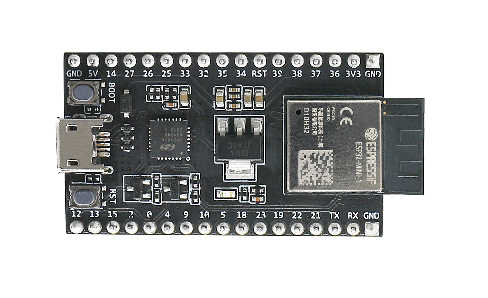
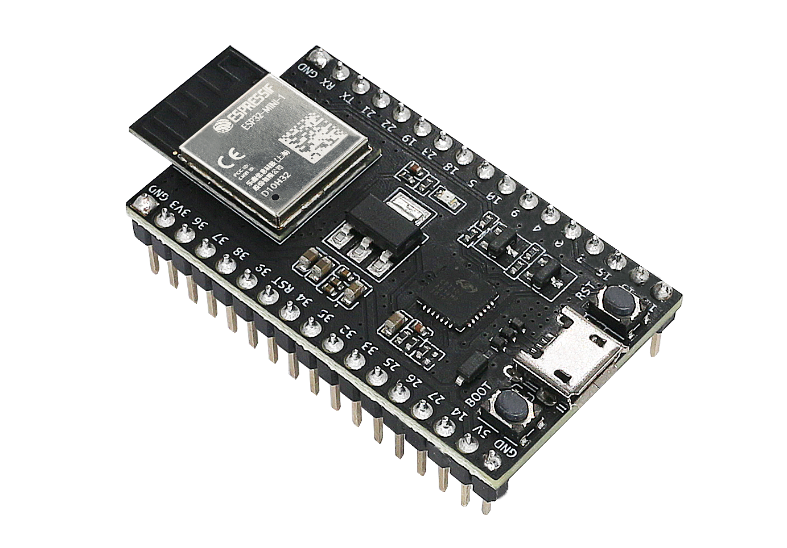
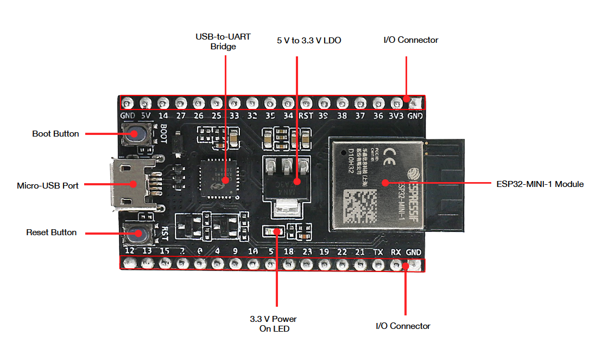
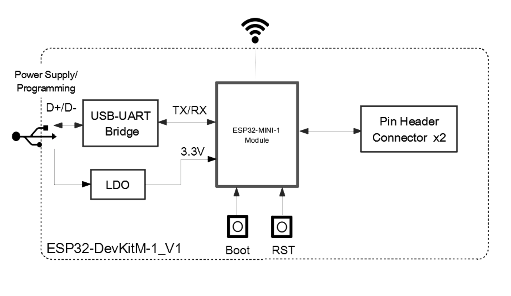
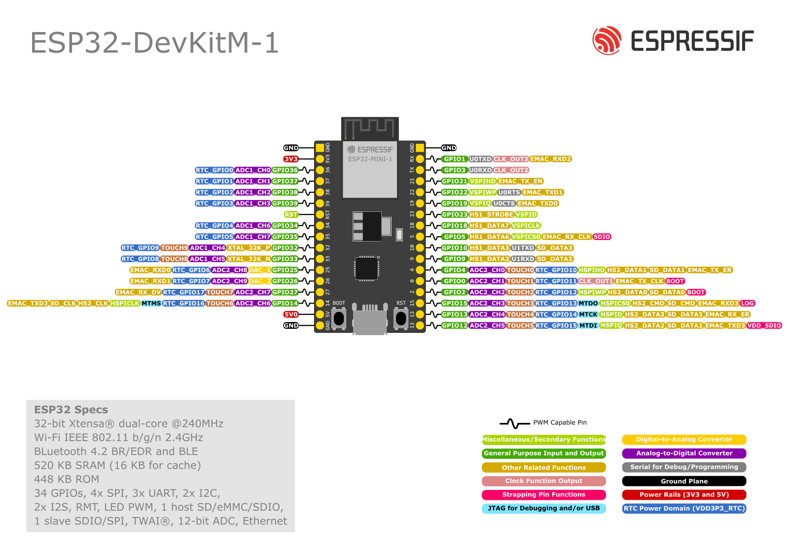

===================
ESP32-DevKitM-1
===================

:link_to_translation:`en: [English]`

本指南将介绍如何使用 ESP32-DevKitM-1，并提供更多关于此开发板的信息。

ESP32-DevKitM-1 是乐鑫推出的一款基于 ESP32-MINI-1/1U 模组的入门级开发板。板上模组大部分管脚均已引出至两侧排针，用户可根据实际需求，通过跳线轻松连接多种外围设备，同时也可将开发板插在面包板上使用。

+------------------------+-------------------------+
| |ESP32-DevKitM-1-正面| | |ESP32-DevKitM-1-侧面|  |
+------------------------+-------------------------+
|  ESP32-DevKitM-1-正面  |  ESP32-DevKitM-1-侧面   |
+------------------------+-------------------------+

本指南包括：

- `快速入门`_：提供 ESP32-DevKitM-1 的简要概述及必要的硬件和软件信息。
- `硬件参考`_：提供 ESP32-DevKitM-1 的详细硬件信息。
- `相关文档`_：提供相关文档的链接。

快速入门
===========

本节介绍如何开始使用 ESP32-DevKitM-1，主要包括三大部分：首先，介绍一些关于 ESP32-DevKitM-1 的基本信息，然后在 `应用程序开发`_ 章节介绍如何进行硬件初始化，最后介绍如何为 ESP32-DevKitM-1 烧录固件。

概述
-------

ESP32-DevKitM-1 开发板是一款小巧实用的开发板，具备以下特色功能：

- 集成了 `ESP32-MINI-1 或 ESP32-MINI-1U <https://www.espressif.com/sites/default/files/documentation/esp32-mini-1_datasheet_cn.pdf>`_ 模组
- USB 转串口编程接口同时可为开发板供电
- 设有排针
- 设有重置按钮和固件下载模式激活按钮
- 以及其他组件

内含组件和包装
---------------

零售订单
^^^^^^^^^^^

如购买样品，每个 ESP32-DevKitM-1 开发板将以防静电袋或零售商选择的其他方式包装。

零售订单请前往 https://www.espressif.com/zh-hans/company/contact/buy-a-sample。

批量订单
^^^^^^^^^^^

如批量购买，ESP32-DevKitM-1 开发板将以大纸板箱包装。

批量订单请前往 https://www.espressif.com/zh-hans/contact-us/sales-questions。

组件介绍
-----------

ESP32-DevKitM-1 开发板的主要组件、接口及控制方式见下图。下文以板载 ESP32-MINI-1 的开发板为例进行说明。

    ESP32-DevKitM-1 - 正面

.. list-table::
    :widths: 25 75
    :header-rows: 1

    * - 主要组件
      - 基本介绍
    * - 板载模组
      - ESP32-MINI-1 模组或 ESP32-MINI-1U 模组。ESP32-MINI-1 带有板载 PCB 天线；ESP32-MINI-1U 带有外部天线连接器。两款模组内置的芯片均叠封 4 MB flash。更多详情，请见 `《ESP32-MINI-1 & ESP32-MINI-1U 技术规格书》 <https://www.espressif.com/sites/default/files/documentation/esp32-mini-1_datasheet_cn.pdf>`_
    * - 5 V 转 3.3 V LDO
      - 电源转换器，输入 5 V，输出 3.3 V
    * - Boot 键
      - 下载按键。按下 **Boot** 键的同时按一下 **Reset** 键进入“固件下载”模式，通过串口下载固件
    * - Reset 键
      - 复位按键
    * - Micro-USB 接口
      - USB 接口，可用作开发板的供电电源或 PC 和 ESP32 芯片的通信接口
    * - USB 至 UART 桥接器
      - 单芯片 USB 至 UART 桥接器，可提供高达 3 Mbps 的传输速率
    * - 3.3 V 电源指示灯
      - 开发板连接 USB 电源后，该指示灯亮起。更多信息，请见 `相关文档`_ 中的原理图
    * - I/O 连接器
      - 所有可用 GPIO 管脚（除 Flash 的 SPI 总线）均已引出至开发板的排针。用户可对 ESP32 芯片编程，开发多种功能

应用程序开发
---------------

ESP32-DevKitM-1 上电前，请首先确认开发板完好无损。

硬件准备
^^^^^^^^^^^^

- ESP32-DevKitM-1 开发板
- USB A / micro USB B 数据线
- PC（Windows、Linux 或 macS）

软件设置
^^^^^^^^^^^

现在，请前往 :doc:`../../get-started/index` 中的 :ref:`get-started-step-by-step` 章节，查看如何设置开发环境，并尝试将示例项目烧录至你的开发板。

.. attention::

  对于 2021 年 12 月 2 日之前生产的 ESP32-DevKitM-1，其搭载的模组为单核 MCU 模组。请查看 `PCN-2021-021 <https://www.espressif.com/sites/default/files/pcn_downloads/PCN-2021-021%20ESP32-U4WDH%20%E5%8D%87%E7%BA%A7%E4%B8%BA%E5%8F%8C%E6%A0%B8%E5%A4%84%E7%90%86%E5%99%A8%E4%BA%A7%E5%93%81.pdf>`_ 以确定开发板上搭载的模组是否为单核模组。对于搭载单核模组的开发板，烧录应用程序前，需要在 :ref:`menuconfig <get-started-configure>` 中启用单核模式 (:ref:`CONFIG_FREERTOS_UNICORE`)。

硬件参考
===========

功能框图
----------

ESP32-DevKitM-1 的主要组件和连接方式如下图所示。

    ESP32-DevKitM-1

电源选项
----------

开发板可从以下三种供电方式中任选其一：

* Micro USB 供电（默认）
* 5V / GND 管脚供电
* 3V3 / GND 管脚供电

.. warning::

  - 上述供电模式 **不可同时连接**，否则可能会损坏开发板和/或电源。
  - 建议选择第一种供电方式：Micro USB 端口供电。

管脚描述
----------

开发板两侧 I/O 管脚，其具体名称和功能见下表。外设管脚分配请参考 `《ESP32 技术规格书》`_。

.. list-table::
   :header-rows: 1
   :widths: 10 12 12 66

   * - 编号
     - 名称
     - 类型 [1]_
     - 功能
   * - 1
     - GND
     - P
     - 接地
   * - 2
     - 3V3
     - P
     - 3.3 V 电源
   * - 3
     - I36
     - I
     - GPIO36, ADC1_CH0, RTC_GPIO0
   * - 4
     - I37
     - I
     - GPIO37, ADC1_CH1, RTC_GPIO1
   * - 5
     - I38
     - I
     - GPIO38, ADC1_CH2, RTC_GPIO2
   * - 6
     - I39
     - I
     - GPIO39, ADC1_CH3, RTC_GPIO3
   * - 7
     - RST
     - I
     - 复位；高电平：使能；低电平：关闭
   * - 8
     - I34
     - I
     - GPIO34, ADC1_CH6, RTC_GPIO4
   * - 9
     - I35
     - I
     - GPIO35, ADC1_CH7, RTC_GPIO5
   * - 10
     - IO32
     - I/O
     - GPIO32, XTAL_32K_P (32.768 kHz crystal oscillator input), ADC1_CH4, TOUCH9, RTC_GPIO9
   * - 11
     - IO33
     - I/O
     - GPIO33, XTAL_32K_N (32.768 kHz crystal oscillator output), ADC1_CH5, TOUCH8, RTC_GPIO8
   * - 12
     - IO25
     - I/O
     - GPIO25, DAC_1, ADC2_CH8, RTC_GPIO6, EMAC_RXD0
   * - 13
     - IO26
     - I/O
     - GPIO26, DAC_2, ADC2_CH9, RTC_GPIO7, EMAC_RXD1
   * - 14
     - IO27
     - I/O
     - GPIO27, ADC2_CH7, TOUCH7, RTC_GPIO17, EMAC_RX_DV
   * - 15
     - IO14
     - I/O
     - GPIO14, ADC2_CH6, TOUCH6, RTC_GPIO16, MTMS, HSPICLK, HS2_CLK, SD_CLK, EMAC_TXD2
   * - 16
     - 5V
     - P
     - 5 V 电源
   * - 17
     - IO12
     - I/O
     - GPIO12, ADC2_CH5, TOUCH5, RTC_GPIO15, MTDI [2]_, HSPIQ, HS2_DATA2, SD_DATA2, EMAC_TXD3
   * - 18
     - IO13
     - I/O
     - GPIO13, ADC2_CH4, TOUCH4, RTC_GPIO14, MTCK, HSPID, HS2_DATA3, SD_DATA3, EMAC_RX_ER
   * - 19
     - IO15
     - I/O
     - GPIO15, ADC2_CH3, TOUCH3, RTC_GPIO13, MTDO [2]_, HSPICS0, HS2_CMD, SD_CMD, EMAC_RXD3
   * - 20
     - IO2
     - I/O
     - GPIO2 [2]_, ADC2_CH2, TOUCH2, RTC_GPIO12, HSPIWP, HS2_DATA0, SD_DATA0
   * - 21
     - IO0
     - I/O
     - GPIO0 [2]_, ADC2_CH1, TOUCH1, RTC_GPIO11, CLK_OUT1, EMAC_TX_CLK
   * - 22
     - IO4
     - I/O
     - GPIO4, ADC2_CH0, TOUCH0, RTC_GPIO10, HSPIHD, HS2_DATA1, SD_DATA1, EMAC_TX_ER
   * - 23
     - IO9
     - I/O
     - GPIO9, HS1_DATA2, U1RXD, SD_DATA2
   * - 24
     - IO10
     - I/O
     - GPIO10, HS1_DATA3, U1TXD, SD_DATA3
   * - 25
     - IO5
     - I/O
     - GPIO5 [2]_, HS1_DATA6, VSPICS0, EMAC_RX_CLK
   * - 26
     - IO18
     - I/O
     - GPIO18, HS1_DATA7, VSPICLK
   * - 27
     - IO23
     - I/O
     - GPIO23, HS1_STROBE, VSPID
   * - 28
     - IO19
     - I/O
     - GPIO19, VSPIQ, U0CTS, EMAC_TXD0
   * - 29
     - IO22
     - I/O
     - GPIO22, VSPIWP, U0RTS, EMAC_TXD1
   * - 30
     - IO21
     - I/O
     - GPIO21, VSPIHD, EMAC_TX_EN
   * - 31
     - TXD0
     - I/O
     - GPIO1, U0TXD, CLK_OUT3, EMAC_RXD2
   * - 32
     - RXD0
     - I/O
     - GPIO3, U0RXD, CLK_OUT2

.. [1] P：电源；I：输入；O：输出。
.. [2] MTDI、GPIO0、GPIO2、MTDO 和 GPIO5 为 Strapping 管脚。在芯片上电和系统复位过程中，Strapping 管脚根据管脚的二进制电压值控制芯片功能。Strapping 管脚的具体描述和应用，请参考 `《ESP32 技术规格书》`_ > 章节 Strapping 管脚。

管脚布局
^^^^^^^^

    ESP32-DevKitM-1 （点击放大）

硬件修订历史
===============

尚无版本升级历史。

相关文档
============

* `《ESP32-MINI-1 & ESP32-MINI-1U 技术规格书》 <https://www.espressif.com/sites/default/files/documentation/esp32-mini-1_datasheet_cn.pdf>`_ (PDF)
* `ESP32-DevKitM-1 原理图 <https://dl.espressif.com/dl/schematics/SCH_ESP32-DEVKITM-1_V1_20200910A.pdf>`_ (PDF)
* `ESP32-DevKitM-1 PCB 布局图 <https://dl.espressif.com/dl/schematics/PCB_ESP32-DevKitM-1_V1_20200910AE.pdf>`_ (PDF)
* `ESP32-DevKitM-1 布局图 <https://dl.espressif.com/dl/schematics/ESP32-DevKitM-1_V1.dxf>`_ (DXF) - 可使用 `Autodesk Viewer <https://viewer.autodesk.com/>`_ 查看
* `乐鑫产品选型工具 <https://products.espressif.com/#/product-selector?names=>`_
* `《ESP32 技术规格书》 <https://www.espressif.com/sites/default/files/documentation/esp32_datasheet_cn.pdf>`_ (PDF)

有关本开发板的更多设计文档，请联系我们的商务部门 sales@espressif.com。
