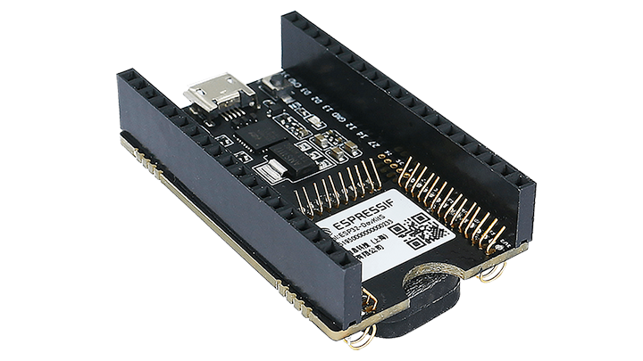
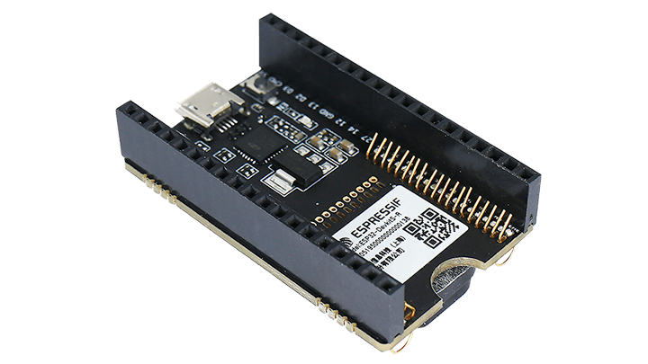
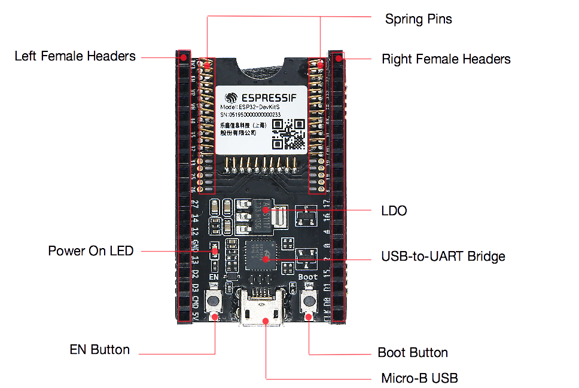
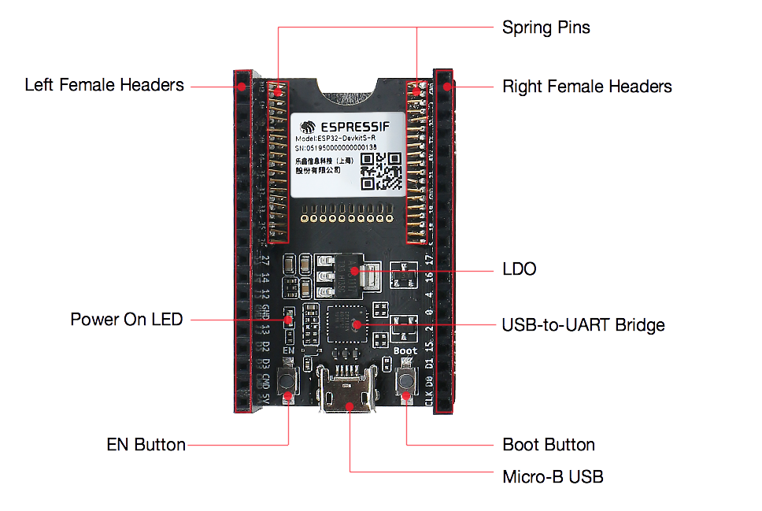
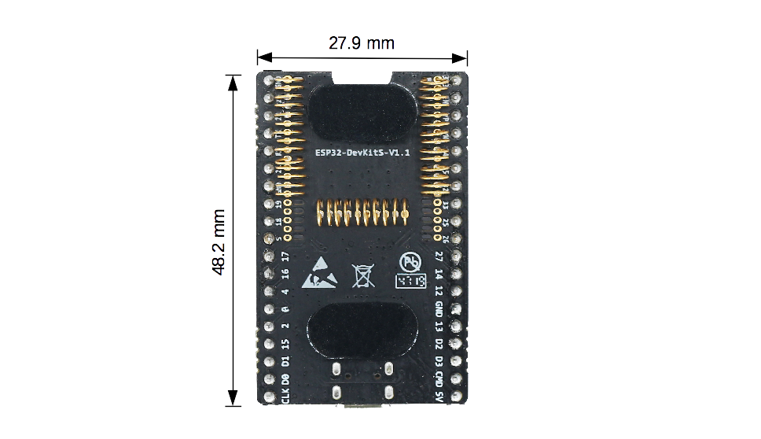
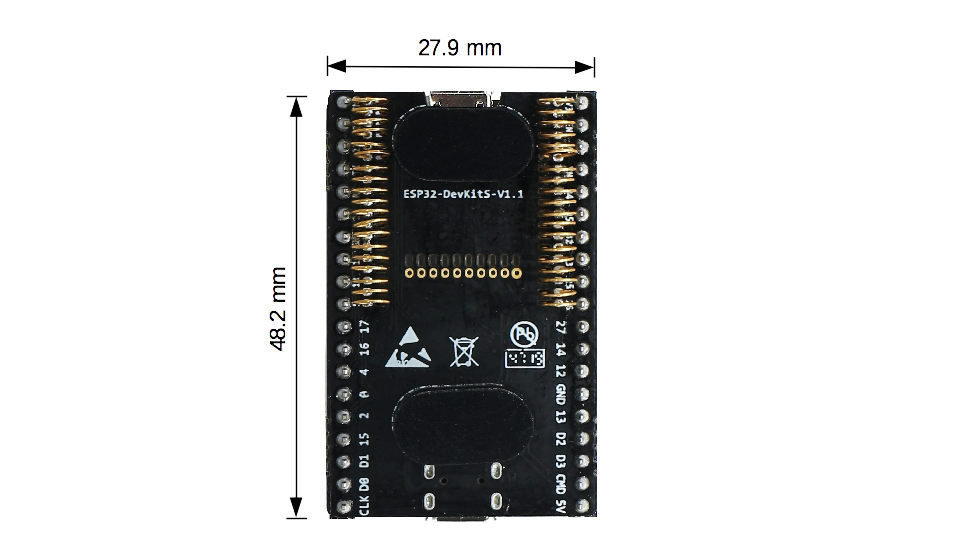
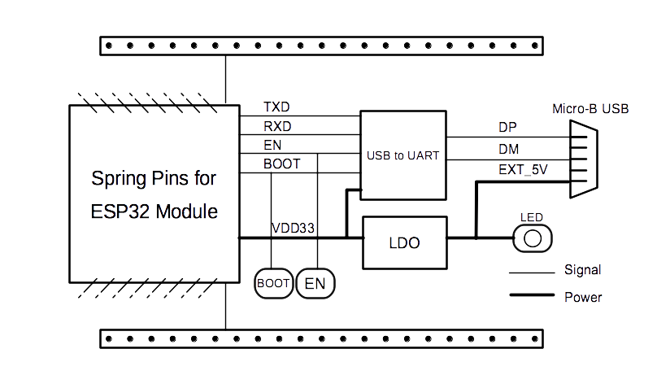

=================
ESP32-DevKitS(-R)
=================

:link_to_translation:`en: [English]`

本指南介绍了乐鑫专为 ESP32 设计的烧录底板 ESP32-DevKitS(-R)。

ESP32-DevKitS(-R) 包括两款开发板，分别是 ESP32-DevKitS 和 ESP32-DevKitS-R。S 代表弹簧 (spring)，R 代表 WROVER 模组。

+-----------------+-------------------+
| |ESP32-DevKitS| | |ESP32-DevKitS-R| |
+-----------------+-------------------+
|  ESP32-DevKitS  |  ESP32-DevKitS-R  |
+-----------------+-------------------+

本指南包括如下内容：

- `入门指南`_: 简要介绍了 ESP32-DevKitS(-R) 和硬件、软件设置指南。
- `硬件参考`_: 详细介绍了 ESP32-DevKitS(-R) 的硬件。
- `相关文档`_: 列出了相关文档的链接。

入门指南
========

本节介绍了如何快速上手 ESP32-DevKitS(-R)。 开头部分介绍了 ESP32-DevKitS(-R)，`如何烧录开发板`_ 小节介绍了怎样在 ESP32-DevKitS(-R) 上安装模组、配置及烧录固件。

概述
----

ESP32-DevKitS(-R) 是乐鑫专为 ESP32 设计的烧录底板，无需将 ESP32 模组与电源和信号线焊接便可进行烧录。ESP32-DevKitS(-R) 搭载模组后，可作为类似 ESP32-DevKitC 的小型开发板使用。

ESP32-DevKitS 和 ESP32-DevKitS-R 仅在弹簧布局上有所不同，用于适配不同的 ESP32 模组。

- ESP32-DevKitS:
   - ESP32-WROOM-32
   - ESP32-WROOM-32D
   - ESP32-WROOM-32U
   - ESP32-SOLO-1
   - ESP32-WROOM-32E
   - ESP32-WROOM-32UE
- ESP32-DevKitS-R:
   - ESP32-WROVER (PCB & IPEX)
   - ESP32-WROVER-B (PCB & IPEX)
   - ESP32-WROVER-E
   - ESP32-WROVER-IE

有关上述模组的详细信息，请参考 `ESP32 系列模组 <https://www.espressif.com/zh-hans/products/modules?id=ESP32>`_。

组件介绍
--------

    ESP32-DevKitS - 正面

    ESP32-DevKitS-R - 正面

.. list-table::
   :widths: 30 70
   :header-rows: 1

   * - 主要组件
     - 介绍
   * - 引脚弹簧
     - 适配模组上的邮票孔，用于连接和固定模组。
   * - 2.54 mm 排母
     - 连接板上搭载模组的引脚。关于排母的描述，请见 `针座`_ 小节。
   * - USB-to-UART 桥接器
     - 单芯片 USB 转 UART 桥接器，可提供高达 3 Mbps 的传输速率。
   * - LDO
     - 5V-to-3.3V 低压差线型稳压器 (LDO)。
   * - Micro-USB 连接器/Micro USB 端口
     - USB 接口。可用作开发板的供电电源或连接电脑和开发板的通信接口。
   * - EN 键
     - 复位按键。
   * - Boot 键
     - 下载按键。按住 **Boot** 键的同时按一下 **EN** 键进入“固件下载”模式，通过串口下载固件。
   * - 电源指示 LED
     - 开发板通电后（USB 或供电电源），该指示灯亮起。

如何烧录开发板
--------------

通电前，请确保 ESP32-DevKitS(-R) 完好无损。

必备硬件
^^^^^^^^

- 任选一款 ESP32 模组
- USB 2.0 数据线（标准 A 型转 Micro-B 型）
- 电脑（Windows、Linux 或 macOS）

硬件设置
^^^^^^^^

请按照下列步骤将模组安装到 ESP32-DevKitS(-R) 烧录底板上：

- 将模组轻放到 ESP32-DevKitS(-R) 烧录底板上。确保模组上方的邮票孔与底板上的引脚弹簧对齐。
- 将模组向下压，听到“咔哒”一声即说明模组已经压入底板。
- 检查所有引脚弹簧是否均已卡进邮票孔中。如发现错位，可使用镊子将引脚弹簧拨入邮票孔中。

软件设置
^^^^^^^^

首选方式
++++++++
使用 ESP-IDF 开发框架是将二进制文件 (\*.bin) 烧录到 ESP32-DevKitS(-R) 的首选方式。请前往 :doc:`../../get-started/index`，在 :ref:`get-started-step-by-step` 一节查看如何快速设置开发环境，将应用程序烧录至 ESP32-DevKitS(-R)。

备选方式
++++++++

Windows 用户也可以使用 `flash 下载工具 <https://www.espressif.com/zh-hans/support/download/other-tools?keys=FLASH+>`_ 烧录二进制文件。请下载该工具、解压并参照 *doc* 文件夹内的使用指南。

    .. 注解::
         1. 烧录二进制文件时需将 ESP32 芯片设置成固件下载模式。这一步骤可由烧录工具自动执行，也可按住 Boot 按键并点按 EN 按键手动执行。
         2. 烧录完成后，烧录工具默认情况下会重启模组，运行已烧录的程序。

底板尺寸
--------

    ESP32-DevKitS 尺寸 - 背面

    ESP32-DevKitS-R 尺寸 - 背面

内含组件和包装
--------------

零售订单
^^^^^^^^

如购买样品，每个 ESP32-DevKitS(-R) 底板将以防静电袋或零售商选择的其他方式包装。

零售订单请前往 https://www.espressif.com/zh-hans/company/contact/buy-a-sample。

批量订单
^^^^^^^^

如批量购买，ESP32-DevKitS(-R) 烧录底板将以大纸板箱包装。

批量订单请前往 https://www.espressif.com/zh-hans/contact-us/sales-questions。

硬件参考
========

功能框图
--------

ESP32-DevKitS(-R) 的主要组件和连接方式如下图所示。

    ESP32-DevKitS(-R)（点击放大）

电源选项
^^^^^^^^

以下任一供电方式均可给 ESP32-DevKitS(-R) 供电：

- Micro USB 端口供电（默认）
- 5V 和 GND 管脚供电
- 3V3 和 GND 管脚供电

建议选择第一种供电方式：Micro USB 端口供电。

针座
----

=======  ================  ================================
.        标签               信号
=======  ================  ================================
L1       3V3               VDD 3V3
L2       EN                CHIP_PU
L3       VP                SENSOR_VP
L4       VN                SENSOR_VN
L5       34                GPIO34
L6       35                GPIO35
L7       32                GPIO32
L8       33                GPIO33
L9       25                GPIO25
L10      26                GPIO26
L11      27                GPIO27
L12      14                GPIO14
L13      12                GPIO12
L14      GND               GND
L15      13                GPIO13
L16      D2                SD_DATA2
L17      D3                SD_DATA3
L18      CMD               SD_CMD
L19      5V                External 5V
R1       GND               GND
R2       23                GPIO23
R3       22                GPIO22
R4       TX                U0TXD
R5       RX                U0RXD
R6       21                GPIO21
R7       GND               GND
R8       19                GPIO19
R9       18                GPIO18
R10      5                 GPIO5
R11      17                GPIO17
R12      16                GPIO16
R13      4                 GPIO4
R14      0                 GPIO0
R15      2                 GPIO2
R16      15                GPIO15
R17      D1                SD_DATA1
R18      D0                SD_DATA0
R19      CLK               SD_CLK
=======  ================  ================================

针座图片请参照 `组件介绍`_。

相关文档
========
- `ESP32-DevKitS(-R) 原理图 <https://dl.espressif.com/dl/ESP32_DEVKITS_20190621.pdf>`_ (PDF)
- `ESP32 技术规格书 <https://www.espressif.com/sites/default/files/documentation/esp32_datasheet_cn.pdf>`_ (PDF)
- `ESP32-WROOM-32 技术规格书 <https://espressif.com/sites/default/files/documentation/esp32-wroom-32_datasheet_cn.pdf>`_ (PDF)
- `ESP32-WROOM-32D & ESP32-WROOM-32U 技术规格书 <https://www.espressif.com/sites/default/files/documentation/esp32-wroom-32d_esp32-wroom-32u_datasheet_cn.pdf>`_ (PDF)
- `ESP32-SOLO-1 技术规格书 <https://www.espressif.com/sites/default/files/documentation/esp32-solo-1_datasheet_cn.pdf>`_ (PDF)
- `ESP32-WROVER 技术规格书 <https://espressif.com/sites/default/files/documentation/esp32-wrover_datasheet_cn.pdf>`_ (PDF)
- `ESP32-WROVER-B 技术规格书 <https://www.espressif.com/sites/default/files/documentation/esp32-wrover-b_datasheet_cn.pdf>`_ (PDF)
- `乐鑫产品选型工具 <https://products.espressif.com/#/product-selector?names=>`__
