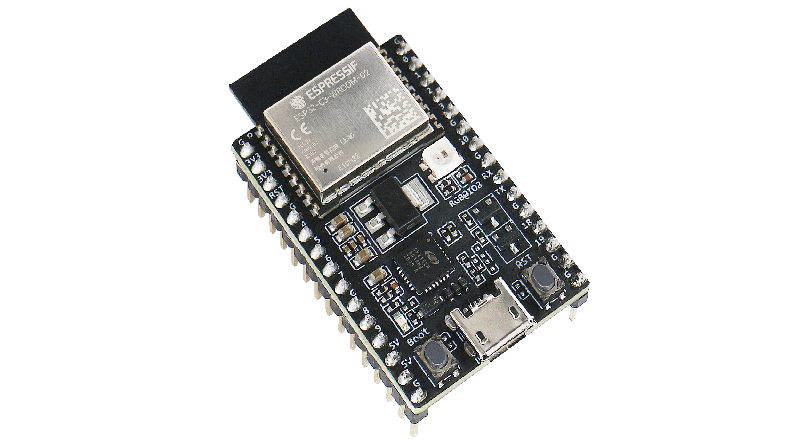
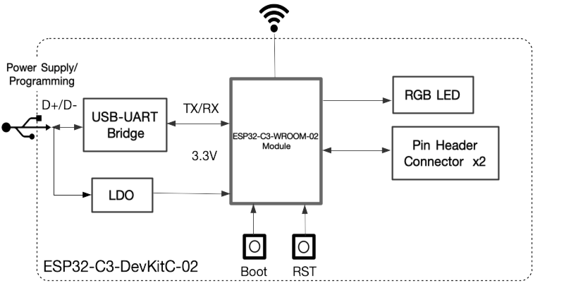
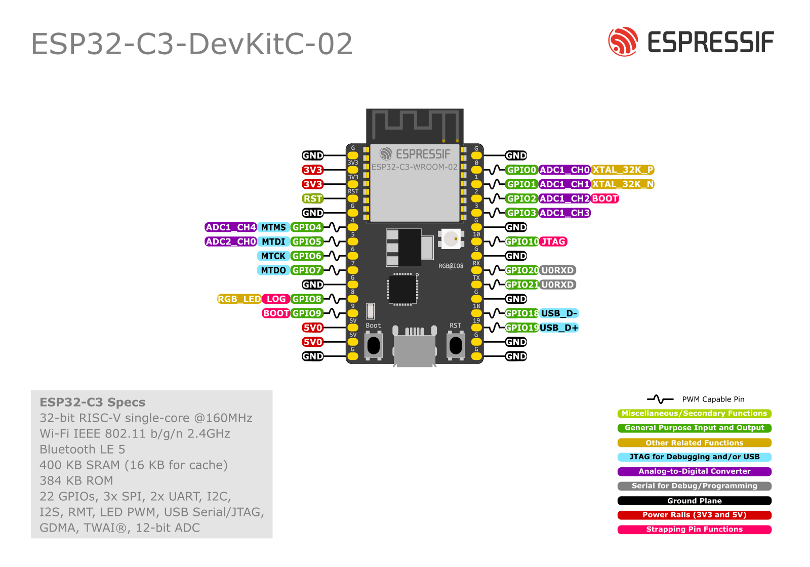

===================
ESP32-C3-DevKitC-02
===================

:link_to_translation:`en: [English]`

本指南将帮助你快速上手 ESP32-C3-DevKitC-02，并提供该款开发板的详细信息。

ESP32-C3-DevKitC-02 是一款入门级开发板，使用配置 4 MB SPI flash 的通用型模组 `ESP32-C3-WROOM-02 <https://www.espressif.com/sites/default/files/documentation/esp32-c3-wroom-02_datasheet_cn.pdf>`_。该款开发板具备完整的 Wi-Fi 和低功耗蓝牙功能。

板上模组大部分管脚均已引出至两侧排针，开发人员可根据实际需求，轻松通过跳线连接多种外围设备，同时也可将开发板插在面包板上使用。

    ESP32-C3-DevKitC-02

本指南包括如下内容：

- `入门指南`_：简要介绍了 ESP32-C3-DevKitC-02 和硬件、软件设置指南。
- `硬件参考`_：详细介绍了 ESP32-C3-DevKitC-02 的硬件。
- `硬件版本`_：介绍硬件历史版本和已知问题，并提供链接至历史版本开发板的入门指南（如有）。
- `相关文档`_：列出了相关文档的链接。

入门指南
========

本小节将简要介绍 ESP32-C3-DevKitC-02，说明如何在 ESP32-C3-DevKitC-02 上烧录固件及相关准备工作。

组件介绍
--------

.. _user-guide-c3-devkitc-02-v1-board-front:

.. figure:: ../../../_static/esp32-c3-devkitc-02-v1-annotated-photo.png
    :align: center
    :alt: ESP32-C3-DevKitC-02 - 正面
    :figclass: align-center

    ESP32-C3-DevKitC-02 - 正面

以下按照逆时针的顺序依次介绍开发板上的主要组件。

.. list-table::
   :widths: 30 70
   :header-rows: 1

   * - 主要组件
     - 介绍
   * - ESP32-C3-WROOM-02
     - ESP32-C3-WROOM-02 是乐鑫推出的一款通用型 Wi-Fi 和低功耗蓝牙双模模组，功能强大。该模组采用 PCB 板载天线，配置了 4 MB SPI flash。
   * - 5 V to 3.3 V LDO（5 V 转 3.3 V LDO）
     - 电源转换器，输入 5 V，输出 3.3 V。
   * - 5 V Power On LED（5 V 电源指示灯）
     - 开发板连接 USB 电源后，该指示灯亮起。
   * - Pin Headers（排针）
     - 所有可用 GPIO 管脚（除 Flash 的 SPI 总线）均已引出至开发板的排针。请查看 :ref:`user-guide-c3-devkitc-02-v1-header-blocks` 获取更多信息。
   * - Boot Button（Boot 键）
     - 下载按键。按住 **Boot** 键的同时按一下 **Reset** 键进入“固件下载”模式，通过串口下载固件。
   * - Micro-USB Port（Micro-USB 接口）
     - USB 接口。可用作开发板的供电电源或 PC 和 ESP32-C3 芯片的通信接口。
   * - Reset Button（Reset 键）
     - 复位按键。
   * - USB-to-UART Bridge（USB 至 UART 桥接器）
     - 单芯片 USB 至 UART 桥接器，可提供高达 3 Mbps 的传输速率。
   * - RGB LED
     - 可寻址 RGB 发光二极管，由 GPIO8 驱动。

开始开发应用
------------

通电前，请确保 ESP32-C3-DevKitC-02 完好无损。

必备硬件
^^^^^^^^

- ESP32-C3-DevKitC-02
- USB 2.0 数据线（标准 A 型转 Micro-B 型）
- 电脑（Windows、Linux 或 macOS）

.. 注解::

  请确保使用适当的 USB 数据线。部分数据线仅可用于充电，无法用于数据传输和编程。

软件设置
^^^^^^^^

请前往 :doc:`../../get-started/index`，在 :ref:`get-started-step-by-step` 小节查看如何快速设置开发环境，将应用程序烧录至 ESP32-C3-DevKitC-02。

内含组件和包装
--------------

零售订单
^^^^^^^^

如购买样品，每个 ESP32-C3-DevKitC-02 开发板将以防静电袋或零售商选择的其他方式包装。

零售订单请前往 https://www.espressif.com/zh-hans/company/contact/buy-a-sample。

批量订单
^^^^^^^^

如批量购买，ESP32-C3-DevKitC-02 开发板将以大纸板箱包装。

批量订单请前往 https://www.espressif.com/zh-hans/contact-us/sales-questions。

硬件参考
========

功能框图
--------

ESP32-C3-DevKitC-02 的主要组件和连接方式如下图所示。

    ESP32-C3-DevKitC-02（点击放大）

电源选项
^^^^^^^^

以下任一供电方式均可为 ESP32-C3-DevKitC-02 供电：

- Micro-USB 接口供电（默认）
- 5V 和 GND 排针供电
- 3V3 和 GND 排针供电

建议选择第一种供电方式：Micro-USB 接口供电。

.. _user-guide-c3-devkitc-02-v1-header-blocks:

排针
----

下表列出了开发板两侧排针（J1 和 J3）的 **名称** 和 **功能**，排针的名称如图 :ref:`user-guide-c3-devkitc-02-v1-board-front` 所示，排针的序号与 `ESP32-C3-DevKitC-02 原理图`_ (PDF) 一致。

J1
^^^

====  ====  ==========  ================================
序号  名称   类型 [1]_    功能
====  ====  ==========  ================================
1     G     G            接地
2     3V3   P            3.3 V 电源
3     3V3   P            3.3 V 电源
4     RST   I            CHIP_PU
5     G     G            接地
6     4     I/O/T        GPIO4, ADC1_CH4, FSPIHD, MTMS
7     5     I/O/T        GPIO5, ADC2_CH0, FSPIWP, MTDI
8     6     I/O/T        GPIO6, FSPICLK, MTCK
9     7     I/O/T        GPIO7, FSPID, MTDO
10    G     G            接地
11    8     I/O/T        GPIO8 [2]_, RGB LED
12    9     I/O/T        GPIO9 [2]_
13    5V    P            5 V 电源
14    5V    P            5 V 电源
15    G     G            接地
====  ====  ==========  ================================

J3
^^^

====  ====  ==========  ================================
序号  名称   类型 [1]_     功能
====  ====  ==========  ================================
1     G     G            接地
2     0     I/O/T        GPIO0, ADC1_CH0, XTAL_32K_P
3     1     I/O/T        GPIO1, ADC1_CH1, XTAL_32K_N
4     2     I/O/T        GPIO2 [2]_, ADC1_CH2, FSPIQ
5     3     I/O/T        GPIO3, ADC1_CH3
6     G     G            接地
7     10    I/O/T        GPIO10, FSPICS0
8     G     G            接地
9     RX    I/O/T        GPIO20, U0RXD
10    TX    I/O/T        GPIO21, U0TXD
11    G     G            接地
12    18    I/O/T        GPIO18
13    19    I/O/T        GPIO19
14    G     G            接地
15    G     G            接地
====  ====  ==========  ================================

.. [1] P：电源；I：输入；O：输出；T：可设置为高阻。
.. [2] GPIO2、GPIO8、GPIO9 为 ESP32-C3 芯片的 Strapping 管脚。在芯片上电和系统复位过程中，Strapping 管脚根据管脚的二进制电压值控制芯片功能。Strapping 管脚的具体描述和应用，请参考 `ESP32-C3 技术规格书`_ 的 Strapping 管脚章节。

管脚布局
^^^^^^^^

    ESP32-C3-DevKitC-02 管脚布局（点击放大）

硬件版本
==========

该开发板为最新硬件，尚未有历史版本。

相关文档
========

* `使用 ESP32-C3 构建安全高性价比的互联设备 <http://c3.espressif.com/>`_
* `ESP32-C3 技术规格书`_ (PDF)
* `ESP32-C3-WROOM-02 规格书`_ (PDF)
* `ESP32-C3-DevKitC-02 原理图`_ (PDF)
* `ESP32-C3-DevKitC-02 PCB 布局图 <https://dl.espressif.com/dl/schematics/PCB_ESP32-C3-DevKitC-02_V1_1_20210121AA.pdf>`_ (PDF)
* `ESP32-C3-DevKitC-02 尺寸图 <https://dl.espressif.com/dl/schematics/DXF_ESP32-C3-DevKitC-02_V1_1_20210121AA.pdf>`_ (PDF)
* `ESP32-C3-DevKitC-02 尺寸图源文件 <https://dl.espressif.com/dl/schematics/DXF_ESP32-C3-DevKitC-02_V1_1_20210121AA.dxf>`_ (DXF) - 可使用 `Autodesk Viewer <https://viewer.autodesk.com/>`_ 查看

有关本开发板的更多设计文档，请联系我们的商务部门 `sales@espressif.com <sales@espressif.com>`_。

.. _ESP32-C3 技术规格书: https://www.espressif.com/sites/default/files/documentation/esp32-c3_datasheet_cn.pdf
.. _ESP32-C3-WROOM-02 规格书: https://www.espressif.com/sites/default/files/documentation/esp32-c3-wroom-02_datasheet_cn.pdf
.. _ESP32-C3-DevKitC-02 原理图: https://dl.espressif.com/dl/schematics/SCH_ESP32-C3-DEVKITC-02_V1_1_20210126A.pdf
