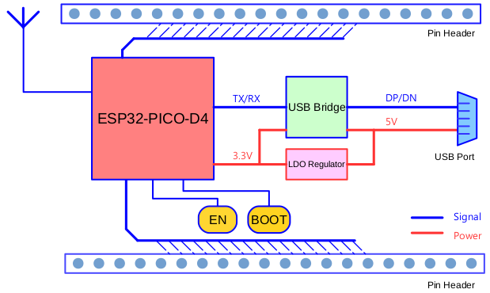
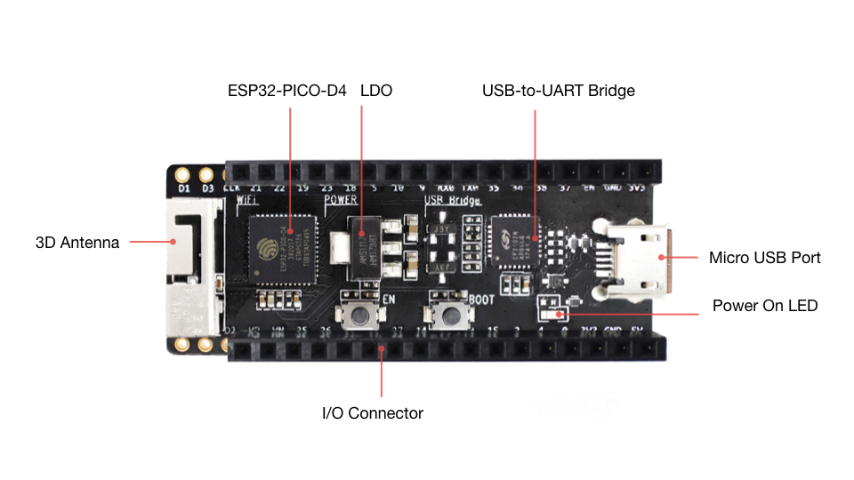
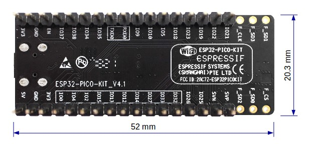
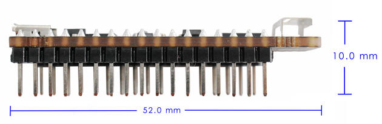

ESP32-PICO-KIT V4/V4.1 入门指南
=======================================================
:link_to_translation:`en:[English]`

本指南介绍了如何开始使用 ESP32-PICO-KIT V4 / V4.1 迷你开发板。有关 ESP32-PICO-KIT 其他版本的介绍，请见：:doc:`../hw-reference/index`。

本指南仅适用于 ESP32-PICO-KIT V4 和 V4.1。ESP32-PICO-KIT V4.1 与 V4 的最大差别在于桥接器，其中 V4 搭载的 CP2102 USB-to-UART 桥接器最高速率为 1 Mbps，V4.1 搭载的 CP2102N 桥接器最高传输速率 3 Mbps。

准备工作
--------

* :ref:`ESP32-PICO-KIT 迷你开发板 <get-started-pico-kit-v4-board-front>`
* USB 2.0 线（A 型转 Micro-B 型）
* PC（Windows、Linux 或 Mac OS）

您可以跳过介绍部分，直接前往 `应用程序开发`_ 章节。

概述
----

ESP32-PICO-KIT 是一款来自 `乐鑫 <https://espressif.com>`_ 的迷你开发板，其核心是具有完整 Wi-Fi 和蓝牙功能的 ESP32 系列 SiP 模组 ESP32-PICO-D4。与其他 ESP32 系列模组相比，ESP32-PICO-D4 模组已完整集成以下外围器件：

- 40 MHz 晶体振荡器
- 4 MB flash
- 滤波电容
- 射频匹配网络等

这大大降低了用户额外采购和安装这些元器件的数量和成本，及额外组装测试的复杂度，并增加了可用性。

ESP32-PICO-KIT 集成了 USB 转 UART 桥接电路，允许开发人员直接通过 PC 的 USB 端口进行下载和调试。

为了便于连接，ESP32-PICO-D4 上的所有 IO 信号和系统电源管脚均通过开发板两侧焊盘（每侧 20 个 x 0.1 英寸间隔）引出。为了方便杜邦线的使用，ESP32-PICO-KIT 开发板每侧的 20 个焊盘中，有 17 个引出至排针，另外 3 个靠近天线的焊盘未引出，可供用户日后焊接使用。

.. note::

    1. 每排未引出至排针的 3 个管脚已连接至 ESP32-PICO-D4 SiP 模组的内置 flash 模块。更多信息，请见 `相关文档`_ 中的模组技术规格书。
    2. ESP32-PICO-D4 开发板默认采用排针。

功能概述
--------

ESP32-PICO-KIT 开发板的主要组件和连接方式见下。

    ESP32-PICO-KIT 框图

功能说明
--------

ESP32-PICO-KIT 开发板的主要组件、接口及控制方式见下。

.. _get-started-pico-kit-v4-board-front:

    ESP32-PICO-KIT 开发板布局

ESP32-PICO-KIT 开发板的主要组件描述见下表（从左上角起顺时针顺序）。

.. list-table:: 
    :widths: 25 75
    :header-rows: 1

    * - 主要组件
      - 基本介绍
    * - ESP32-PICO-D4
      - ESP32-PICO-KIT 开发板上焊接的标准 ESP32-PICO-D4 模组，集成了 ESP32 芯片的完整系统，仅需连接天线、LC 匹配电路、退耦电容和一个 EN 信号上拉电阻即可正常工作。
    * - LDO
      - 5V-to-3.3V 低压差稳压器
    * - USB-to-UART 桥接器
      - 单芯片 USB-to-UART 桥接器。V4 版本搭载的 CP2102 可提供高达 1 Mbps 的传输速率，V4.1 版本搭载的 CP2102N 可提供高达 3 Mbps 的传输速率。
    * - Micro USB 端口       
      - USB 接口。可用作开发板的供电电源，或连接 PC 和开发板的通信接口。
    * - 5V Power On LED
      - 开发板通电后，该红色指示灯将亮起。更多信息，请见 `相关文档`_ 中的原理图。
    * - I/O
      - ESP32-PICO-D4 的所有管脚均已引出至开发板的排针。用户可以对 ESP32 进行编程，实现 PWM、ADC、DAC、I2C、I2S、SPI 等多种功能。更多详情，请见章节 `管脚说明`_。
    * - BOOT
      - 下载按键。按下 **Boot** 键并保持，同时按一下 **EN** 键（此时不要松开 **Boot** 键）进入“固件下载”模式，通过串口下载固件。
    * - EN
      - 复位按键。

电源选项
--------

开发板可任一选用以下三种供电方式：

* Micro USB 供电（默认）
* 5V / GND 管脚供电
* 3V3 / GND 管脚供电

.. warning::

    上述供电模式 **不可同时连接**，否则可能会损坏开发板和/或电源。

管脚说明
----------

下表介绍了开发板 I/O 管脚的 **名称** 和 **功能**，具体布局请见 `相关文档`_ 中的原理图。请参考 :ref:`get-started-pico-kit-v4-board-front`。

Header J2
"""""""""

======  =================  ======  ======================================================
编号     名称               类型     功能
======  =================  ======  ======================================================
1       FLASH_SD1 (FSD1)   I/O     | GPIO8, SD_DATA1, SPID, HS1_DATA1 :ref:`（见说明 1） <get-started-pico-kit-v4-pin-notes>` , U2CTS
2       FLASH_SD3 (FSD3)   I/O     | GPIO7, SD_DATA0, SPIQ, HS1_DATA0 :ref:`（见说明 1） <get-started-pico-kit-v4-pin-notes>` , U2RTS
3       FLASH_CLK (FCLK)   I/O     | GPIO6, SD_CLK, SPICLK, HS1_CLK :ref:`（见说明 1） <get-started-pico-kit-v4-pin-notes>` , U1CTS 
4       IO21               I/O     | GPIO21, VSPIHD, EMAC_TX_EN
5       IO22               I/O     | GPIO22, VSPIWP, U0RTS, EMAC_TXD1
6       IO19               I/O     | GPIO19, VSPIQ, U0CTS, EMAC_TXD0
7       IO23               I/O     | GPIO23, VSPID, HS1_STROBE
8       IO18               I/O     | GPIO18, VSPICLK, HS1_DATA7
9       IO5                I/O     | GPIO5, VSPICS0, HS1_DATA6, EMAC_RX_CLK
10      IO10               I/O     | GPIO10, SD_DATA3, SPIWP, HS1_DATA3, U1TXD
11      IO9                I/O     | GPIO9, SD_DATA2, SPIHD, HS1_DATA2, U1RXD
12      RXD0               I/O     | GPIO3, U0RXD :ref:`（见说明 3） <get-started-pico-kit-v4-pin-notes>` , CLK_OUT2
13      TXD0               I/O     | GPIO1, U0TXD :ref:`（见说明 3） <get-started-pico-kit-v4-pin-notes>` , CLK_OUT3, EMAC_RXD2
14      IO35               I       | ADC1_CH7, RTC_GPIO5
15      IO34               I       | ADC1_CH6, RTC_GPIO4
16      IO38               I       | GPIO38, ADC1_CH2, RTC_GPIO2
17      IO37               I       | GPIO37, ADC1_CH1, RTC_GPIO1
18      EN                 I       | CHIP_PU
19      GND                P       | Ground
20      VDD33 (3V3)        P       | 3.3V 电源
======  =================  ======  ======================================================

Header J3
"""""""""

======  =================  ======  ======================================================
No.     Name               Type    Function
======  =================  ======  ======================================================
1       FLASH_CS (FCS)     I/O     | GPIO16, HS1_DATA4 :ref:`（见说明 1） <get-started-pico-kit-v4-pin-notes>` , U2RXD, EMAC_CLK_OUT
2       FLASH_SD0 (FSD0)   I/O     | GPIO17, HS1_DATA5 :ref:`（见说明 1） <get-started-pico-kit-v4-pin-notes>` , U2TXD, EMAC_CLK_OUT_180
3       FLASH_SD2 (FSD2)   I/O     | GPIO11, SD_CMD, SPICS0, HS1_CMD :ref:`（见说明 1） <get-started-pico-kit-v4-pin-notes>` , U1RTS
4       SENSOR_VP (FSVP)   I       | GPIO36, ADC1_CH0, RTC_GPIO0
5       SENSOR_VN (FSVN)   I       | GPIO39, ADC1_CH3, RTC_GPIO3
6       IO25               I/O     | GPIO25, DAC_1, ADC2_CH8, RTC_GPIO6, EMAC_RXD0
7       IO26               I/O     | GPIO26, DAC_2, ADC2_CH9, RTC_GPIO7, EMAC_RXD1
8       IO32               I/O     | 32K_XP :ref:`（见说明 2a） <get-started-pico-kit-v4-pin-notes>` , ADC1_CH4, TOUCH9, RTC_GPIO9
9       IO33               I/O     | 32K_XN :ref:`（见说明 2b） <get-started-pico-kit-v4-pin-notes>` , ADC1_CH5, TOUCH8, RTC_GPIO8
10      IO27               I/O     | GPIO27, ADC2_CH7, TOUCH7, RTC_GPIO17
                                   | EMAC_RX_DV
11      IO14               I/O     | ADC2_CH6, TOUCH6, RTC_GPIO16, MTMS, HSPICLK,
                                   | HS2_CLK, SD_CLK, EMAC_TXD2
12      IO12               I/O     | ADC2_CH5, TOUCH5, RTC_GPIO15, MTDI :ref:`（见说明 4） <get-started-pico-kit-v4-pin-notes>` , HSPIQ,
                                   | HS2_DATA2, SD_DATA2, EMAC_TXD3
13      IO13               I/O     | ADC2_CH4, TOUCH4, RTC_GPIO14, MTCK, HSPID,
                                   | HS2_DATA3, SD_DATA3, EMAC_RX_ER
14      IO15               I/O     | ADC2_CH3, TOUCH3, RTC_GPIO13, MTDO, HSPICS0
                                   | HS2_CMD, SD_CMD, EMAC_RXD3
15      IO2                I/O     | ADC2_CH2, TOUCH2, RTC_GPIO12, HSPIWP,
                                   | HS2_DATA0, SD_DATA0
16      IO4                I/O     | ADC2_CH0, TOUCH0, RTC_GPIO10, HSPIHD,
                                   | HS2_DATA1, SD_DATA1, EMAC_TX_ER
17      IO0                I/O     | ADC2_CH1, TOUCH1, RTC_GPIO11, CLK_OUT1
                                   | EMAC_TX_CLK
18      VDD33 (3V3)        P       | 3.3V 电源
19      GND                P       | Ground
20      EXT_5V (5V)        P       | 5V 电源
======  =================  ======  ======================================================

.. _get-started-pico-kit-v4-pin-notes:

有关上表的说明：

1. 该管脚已连接至 ESP32-PICO-D4 的内置 flash 管脚。
2. 32.768 kHz 晶振：(a) 输入；(b) 输出。
3. 该管脚已连接至开发板的 USB 桥接器芯片。
4. ESP32-PICO-KIT 内置 SPI flash 的工作电压为 3.3V。因此，strapping 管脚 MTDI 在模组上电复位过程中应保持低电平。如连接该管脚，请确保该管脚在复位中不要保持高电平。

应用程序开发
------------

ESP32-PICO-KIT 上电前，请首先确认开发板完好无损。

现在，请前往 :doc:`index` 中的 :ref:`get-started-step-by-step` 章节，查看如何设置开发环境，并尝试将示例项目烧录至您的开发板。

开发板尺寸
----------

ESP32-PICO-KIT 的尺寸为 52 x 20.3 x 10 mm (2.1" x 0.8" x 0.4")。

    ESP32-PICO-KIT 尺寸图 -- 背面

    ESP32-PICO-KIT 尺寸图 -- 侧面

有关开发板的物理结构细节，请见下方参考设计。

相关文档
-----------------

* `ESP32-PICO-KIT V4 原理图 <https://dl.espressif.com/dl/schematics/esp32-pico-kit-v4_schematic.pdf>`_ (PDF)
* `ESP32-PICO-KIT V4.1 原理图 <https://dl.espressif.com/dl/schematics/esp32-pico-kit-v4.1_schematic.pdf>`_ (PDF)
* `ESP32-PICO-KIT 参考设计 <https://www.espressif.com/zh-hans/support/download/documents/development-board?keys=esp32-pico-kit+参考设计>`_ ，内含 OrCAD 原理图、PCB 布局、Gerbers 和 BOM 表。
* `《ESP32-PICO-D4 技术规格书》 <http://espressif.com/sites/default/files/documentation/esp32-pico-d4_datasheet_cn.pdf>`_ (PDF)
* :doc:`../hw-reference/index`

.. toctree::
    :hidden:

    get-started-pico-kit-v3

