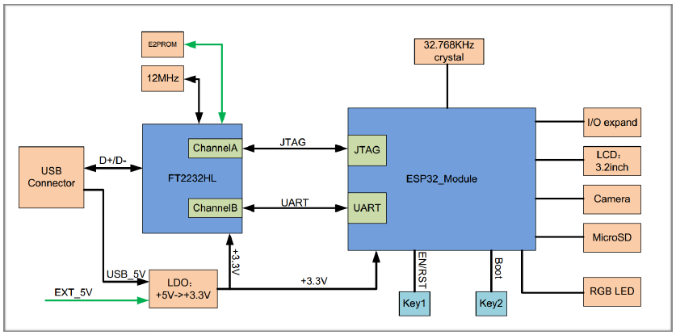
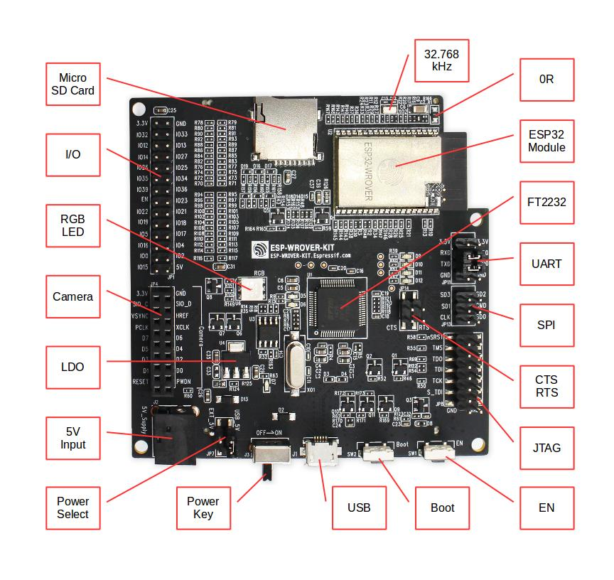
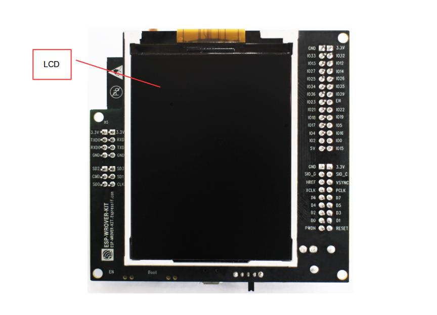
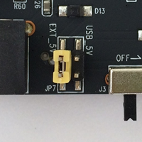
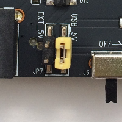
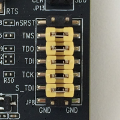
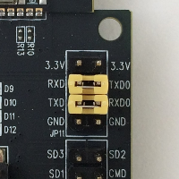
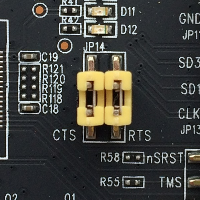

ESP-WROVER-KIT V3 入门指南
=======================================
:link_to_translation:`en:[English]`

本指南介绍了如何开始使用 ESP-WROVER-KIT V3 开发板及其功能和相关配置。有关 ESP-WROVER-KIT 其他版本的介绍，请见：:doc:`../hw-reference/index`。

准备工作
-------------

* :ref:`ESP-WROVER-KIT V3 开发板 <get-started-esp-wrover-kit-v3-board-front>`
* USB 数据线（A 转 Micro-B）
* PC（Windows、Linux 或 macOS）

您可以跳过介绍部分，直接前往 `应用程序开发`_ 章节。

概述
--------

ESP-WROVER-KIT 是 `乐鑫 <https://espressif.com>`_ 一款基于 ESP32 的开发板，集成了 LCD 屏幕和 MicroSD 卡槽。

ESP-WROVER-KIT 可选贴以下 ESP32 模组：

- :ref:`esp-modules-and-boards-esp32-wroom-32`
- :ref:`ESP32-WROVER <esp-modules-and-boards-esp32-wrover>`

此外，ESP-WROVER-KIT 的独特之处在于集成了一款先进多协议 USB 桥接器 (FTDI FT2232HL)，允许开发人员直接通过 USB 接口，使用 JTAG 对 ESP32 进行调试，无需额外的 JTAG 调试器。ESP-WROVER-KIT 可为开发人员提供简单、便捷且极具成本效益的开发体验。

为了便于使用，板上模组的绝大部分管脚均已引出至开发板的引脚。

.. note::

    该版本 ESP32-WROVER 模组 的 GPIO16 和 GPIO17 管脚用作 PSRAM 的片选和时钟信号。默认情况下，为了给用户提供可靠的性能，这两个 GPIO 管脚不引出至开发板引脚。

功能概述
----------------------

ESP-WROVER-KIT 开发板的主要组件和连接方式如下图所示。

    ESP-WROVER-KIT 功能框图

功能说明
----------------------

ESP-WROVER-KIT 开发板的主要组件、接口及控制方式见下。

.. _get-started-esp-wrover-kit-v3-board-front:

    ESP-WROVER-KIT 开发板布局 -- 俯视图

.. _get-started-esp-wrover-kit-v3-board-back:

    ESP-WROVER-KIT 开发板布局 -- 仰视图

下表从图片右上角开始，以顺时针顺序介绍了图 1 中的主要组件，然后以同样的顺序介绍图 2 中的主要组件。

.. list-table:: 
    :widths: 25 75
    :header-rows: 1

    * - 主要组件
      - 基本介绍
    * - 32.768 kHz
      - 外接 32.768 kHz 晶振，可提供 Deep-sleep 下使用的低功耗时钟。
    * - 0 欧电阻
      - ESP-WROVER-KIT 开发板设计了一个 0 欧电阻，可在测量 ESP32 系列模组在不同功耗模式下的电流时，直接移除或替换为分流器。
    * - ESP32 模组
      - 可选贴 ESP32-WROOM-32 或 ESP32-WROVER。ESP32-WROVER 模组完整集成了 ESP32-WROOM-32 的所有功能，且内置 32-Mbit PSRAM，可提供灵活的额外存储空间和数据处理能力。
    * - FT2232
      - FT2232 多协议 USB 转串口桥接器。开发人员可通过 USB 接口对 FT2232 芯片进行控制和编程，与 ESP32 建立连接。FT2232 芯片可在通道 A 提供 USB-to-JTAG 接口功能，并在通道 B 提供 USB-to-Serial 接口功能，便利开发人员的应用开发与调试。见 `ESP-WROVER-KIT V3 原理图`_。
    * - UART
      - 串口。FT2232HL 和 ESP32 的串行 TX/RX 信号已引出至 JP11 的两端。默认情况下，这两路信号由跳线帽连接。如果要跳过 FT2232 使用 ESP32 模组串口，则可移除相关跳线帽，将模组连接至其他外部串口设备。
    * - SPI
      - 默认情况下，ESP32 使用 SPI 接口访问内置 flash 和 PSRAM。使用这些引脚连接 ESP32 和其他 SPI 设备。这种情况下，需增加额外的片选 (CS) 信号。注意，选贴 ESP32-WROVER 模组时，该接口的工作电压为 1.8 V；选贴 ESP32-WROOM-32 时，该接口的工作电压为 3.3V。
    * - CTS/RTS
      - 串口流控信号。管脚默认不连接至电路。为了使能该功能，必须用跳线帽短路掉 JP14 的相应管脚。
    * - JTAG
      - JTAG 接口。FT2232HL 和 ESP32 的 JTAG 信号已引出至 JP8 的两端。默认情况下，这两路信号不连接。如需使能 JTAG，请按照 `设置选项`_ 的介绍，连接跳线帽。
    * - EN
      - 复位按键。
    * - Boot
      - 下载按键。按下 **Boot** 键并保持，同时按一下 **EN** 键（此时不要松开 **Boot** 键）进入“固件下载”模式，通过串口下载固件。
    * - USB
      - USB 接口。可用作开发板的供电电源，或连接 PC 和开发板的通信接口。
    * - 电源开关
      - 拨向 **USB** 按键一侧，开发板上电；拨离 **USB** 按键一侧，开发板掉电。
    * - 电源选择开关
      - ESP-WROVER-KIT 开发板可通过 USB 端口或 5V 输入接口供电。用户可使用跳线帽在两种供电模式中进行选择。更多详细信息，请见章节 `设置选项`_ 中有关 JP7 连接器的描述。
    * - 5V Input
      - 5V 电源接口建议仅在开发板自动运行（未连接 PC）时使用。仅用于全负荷工作下的后备电源。
    * - LDO
      - 5V-to-3.3V 低压差线型稳压器 NCP1117(1A)。NCP1117 最大电流输出为 1 A。板上 LDO 为固定输出电压，但用户也可以选用具有可变输出电压的 LDO。更多信息，请见 `ESP-WROVER-KIT V3 原理图`_。
    * - 摄像头
      - 摄像头接口，支持标准 OV7670 摄像头模块。
    * - RGB LED
      - 红绿蓝发光二极管，可由 PWM（脉冲宽度调制）控制。
    * - I/O
      - 板上模组的所有管脚均已引出至开发板的排针。用户可以对 ESP32 进行编程，实现 PWM、ADC、DAC、I2C、I2S、SPI 等多种功能。 
    * - MicroSD 卡槽
      - 适用于需要扩充数据存储空间或进行备份的应用开发场景。
    * - LCD 显示屏
      - 支持贴装一款 3.2” 的 SPI（标准四线串行外设接口）LCD 显示器，请见 :ref:`get-started-esp-wrover-kit-v3-board-back`。

.. _get-started-esp-wrover-kit-v3-setup-options:

设置选项
-------------

用户可通过 5 组排针，设置开发板功能，其中常见功能见下表：

=======  ================  =========================================================================
排针      跳线设置           功能描述
=======  ================  =========================================================================
JP7      |jp7-ext_5v|      使用外部电源为 ESP-WROVER-KIT 开发板供电
JP7      |jp7-usb_5v|      使用 USB 端口为 ESP-WROVER-KIT 开发板供电
JP8      |jp8|             使能 JTAG 功能
JP11     |jp11-tx-rx|      使能 UART 通信
JP14     |jp14|            使能 RTS/CTS 串口流控
=======  ================  =========================================================================

ESP32 管脚分配
------------------------

ESP32 模组的部分管脚/终端已被板上组件占用或用于外部硬件设备。如果某管脚对应的特定硬件未连接，则该管脚可用作他用。比如，摄像头/JP4 排针未连接相应硬件，则这些 GPIO 可用于其他用途。

部分管脚具备多个功能，可供板上组件或外部硬件设备同时使用，比如 GPIO0 和 GPIO2。由于管脚限制，一些外围设备不可同时使用，比如，由于 JTAG 和 SD 卡槽需共用部分管脚，因此一些使用 SD 卡功能的应用无法同时进行 JTAG 调试。

其他情况下，不同外设可同时使用。比如，LCD 屏幕和 SD 卡仅共用一个 GPIO21 管脚，可以同时使用。该管脚可为 LCD 屏幕提供 D/C（数据/控制）信号，并用于读取来自 SD 卡槽的 CD 信号（卡检测信号）。如无需使用卡检测功能，开发人员还可以通过移除 R167 来禁用该功能。此时，LCD 和 SD 卡槽可同时使用。

更多外设共享管脚的介绍，请见下一章节中的表格。

主要 I/O 连接器 / JP1
^^^^^^^^^^^^^^^^^^^^^^^^

JP1 连接器包括 14 x 2 个排针，具体功能可见下表中间 “I/O” 列的介绍。两侧的“共用”列则介绍了这些管脚在板上的其他用途。

=====================  =====  =====  =====================
共用                    I/O    I/O    共用
=====================  =====  =====  =====================
n/a                    3.3V   GND    n/a
NC/XTAL                IO32   IO33   NC/XTAL
JTAG, MicroSD          IO12   IO13   JTAG, MicroSD
JTAG, MicroSD          IO14   IO27   摄像头
摄像头                  IO26   IO25   摄像头，LCD
摄像头                  IO35   IO34   摄像头
摄像头                  IO39   IO36   摄像头
JTAG                   EN     IO23   摄像头，LCD
摄像头，LCD             IO22   IO21   摄像头，LCD，MicroSD
摄像头，LCD             IO19   IO18   摄像头，LCD
摄像头，LCD             IO5    IO17   PSRAM
PSRAM                  IO16   IO4    LED，摄像头，MicroSD
摄像头，LED，Boot       IO0    IO2    LED，MicroSD
JTAG，MicroSD          IO15   5V
=====================  =====  =====  =====================

说明：

* NC/XTAL - :ref:`32.768 kHz Oscillator <get-started-esp-wrover-kit-v3-xtal>`
* JTAG - :ref:`JTAG / JP8 <get-started-esp-wrover-kit-v3-jtag-header>`
* Boot - Boot 按键 / SW2
* 摄像头 - :ref:`摄像头 / JP4 <get-started-esp-wrover-kit-v3-camera-header>`
* LED - :ref:`RGB LED <get-started-esp-wrover-kit-v3-rgb-led-connections>`
* MicroSD - :ref:`MicroSD Card / J4 <get-started-esp-wrover-kit-v3-microsd-card-slot>`
* LCD - :ref:`LCD / U5 <get-started-esp-wrover-kit-v3-lcd-connector>`
* PSRAM - 仅适用于选贴 ESP32-WROVER 的情况。

.. _get-started-esp-wrover-kit-v3-xtal:

32.768 kHz 晶振
^^^^^^^^^^^^^^^^^^^^^

====  ==========
.     ESP32 管脚
====  ==========
1.    GPIO32
2.    GPIO33
====  ==========

.. note::

    默认情况下，管脚 GPIO32 和 GPIO33 已连接至晶振。因此，为了保证信号的完整性，这两个管脚并未连接至 JP1 I/O 连接器。用户可通过将 R11/R23 处的 0 欧电阻移至 R12/R24 处，以将 GP1O32 和 GPIO33 的连接从晶振移至 JP1。

.. _get-started-esp-wrover-kit-v3-spi-flash-header:

SPI Flash / JP13
^^^^^^^^^^^^^^^^

====  =============
.     ESP32 管脚
====  =============
1.    CLK / GPIO6
2.    SD0 / GPIO7
3.    SD1 / GPIO8
4.    SD2 / GPIO9
5.    SD3 / GPIO10
6.    CMD / GPIO11
====  =============

.. important::

    模组的 flash 总线已通过 0 欧电阻 R140 ~ R145 连接至排针 JP13。如果需要将 flash 的工作频率控制在 80 MHz，为了达到保证总线信号完整性等目的，建议移除 R140 ~ R145 电阻，将模组的 flash 总线与排针 JP2 断开。

.. _get-started-esp-wrover-kit-v3-jtag-header:

JTAG / JP8
^^^^^^^^^^

====  ==============  =============
.     ESP32 管脚       JTAG 信号
====  ==============  =============
1.    EN              TRST_N
2.    MTMS / GPIO14   TMS
3.    MTDO / GPIO15   TDO
4.    MTDI / GPIO12   TDI
5.    MTCK / GPIO13   TCK
====  ==============  =============

.. _get-started-esp-wrover-kit-v3-camera-header:

摄像头 / JP4
^^^^^^^^^^^^

====  ==========  =============================
.     ESP32 管脚   摄像头信号
====  ==========  =============================
1.    n/a         3.3V
2.    n/a         地
3.    GPIO27      SIO_C / SCCB 时钟
4.    GPIO26      SIO_D / SCCB 数据
5.    GPIO25      VSYNC / 垂直同步
6.    GPIO23      HREF / 水平参考
7.    GPIO22      PCLK / 像素时钟
8.    GPIO21      XCLK / 系统时钟
9.    GPIO35      D7 / 像素数据 Bit 7
10.   GPIO34      D6 / 像素数据 Bit 6
11.   GPIO39      D5 / 像素数据 Bit 5
12.   GPIO36      D4 / 像素数据 Bit 4
13.   GPIO19      D3 / 像素数据 Bit 3
14.   GPIO18      D2 / 像素数据 Bit 2
15.   GPIO5       D1 / 像素数据 Bit 1
16.   GPIO4       D0 / 像素数据 Bit 0
17.   GPIO0       RESET / 摄像头复位
18.   n/a         PWDN / 摄像头断电
====  ==========  =============================

* D0 到 D7 为摄像头的数据总线

.. _get-started-esp-wrover-kit-v3-rgb-led-connections:

RGB LED
^^^^^^^

====  ==========  =========
.     ESP32 管脚   RGB LED
====  ==========  =========
1.    GPIO0       红色
2.    GPIO2       绿色
3.    GPIO4       蓝色
====  ==========  =========

.. _get-started-esp-wrover-kit-v3-microsd-card-slot:

MicroSD 卡
^^^^^^^^^^^^

====  ==============  ===============
.     ESP32 管脚       MicroSD 信号
====  ==============  ===============
1.    MTDI / GPIO12   DATA2
2.    MTCK / GPIO13   CD / DATA3
3.    MTDO / GPIO15   CMD
4.    MTMS / GPIO14   CLK
5.    GPIO2           DATA0
6.    GPIO4           DATA1
7.    GPIO21          CD
====  ==============  ===============

.. _get-started-esp-wrover-kit-v3-lcd-connector:

LCD / U5
^^^^^^^^

====  ==============  ===============
.     ESP32 管脚       LCD 信号
====  ==============  ===============
1.    GPIO18          复位
2.    GPIO19          SCL
3.    GPIO21          D/C
4.    GPIO22          CS
5.    GPIO23          SDA
6.    GPIO25          SDO
7.    GPIO5           背光
====  ==============  ===============

.. _get-started-esp-wrover-kit-v3-start-development:

应用程序开发
-----------------------------

ESP-WROVER-KIT 上电前，请首先确认开发板完好无损。

初始设置
^^^^^^^^^^^^^

请严格按照下图所示连接跳线帽，注意不要额外连接其他跳线帽。

- 使用 JP7 连接器，选择 USB 为开发板供电。

- 使用 JP11 连接器，使能 UART 通信。

========================  ==========================
USB 供电                   使能 UART 通信
========================  ==========================
|jp7-usb_5v|              |jp11-tx-rx|
========================  ==========================

注意不要连接其他跳线帽。

打开 **电源开关**，**5V Power On LED** 应点亮。

正式开始开发
^^^^^^^^^^^^^^^^^^

现在，请前往 :doc:`index` 中的 :ref:`get-started-step-by-step` 章节，查看如何设置开发环境，并尝试将示例项目烧录至您的开发板。

相关文档
-----------------

* `ESP-WROVER-KIT V3 原理图`_ (PDF)
* `《ESP32 技术规格书》 <https://www.espressif.com/sites/default/files/documentation/esp32_datasheet_cn.pdf>`_ (PDF)
* `《ESP32-WROVER 技术规格书》 <https://www.espressif.com/sites/default/files/documentation/esp32_wrover_datasheet_cn.pdf>`_ (PDF)
* `《ESP32-WROOM-32 技术规格书》 <https://espressif.com/sites/default/files/documentation/esp32-wroom-32_datasheet_cn.pdf>`_ (PDF)
* :doc:`../api-guides/jtag-debugging/index`
* :doc:`../hw-reference/index`

.. _ESP-WROVER-KIT V3 原理图: https://dl.espressif.com/dl/schematics/ESP-WROVER-KIT_SCH-3.pdf

.. toctree::
    :hidden:

    get-started-wrover-kit-v2.rst
