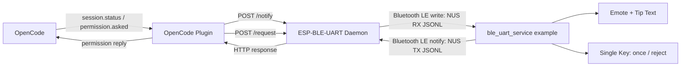

<!-- SPDX-FileCopyrightText: 2026 Espressif Systems (Shanghai) CO LTD -->
<!-- SPDX-License-Identifier: Apache-2.0 -->

# Building an OpenCode Companion with ESP-BLE-UART and ESP-VoCat

## Introduction

This document describes how to build a physical companion device for OpenCode using ESP-BLE-UART and ESP-VoCat. The companion device reflects the current session state on a display, presents permission requests for user approval, and returns permission decisions to OpenCode via single-key input. BLE UART serves as the transport layer between the device and the host-side editor session.

The tutorial is organized in two parts. Part 1 uses **ESP-BLE-UART Console** with the `ble_uart_service` Echo Server (this example) to verify that the host can discover, connect to, and exchange data with a BLE UART device. Part 2 introduces the `ble_uart_service` example firmware for the ESP-VoCat board (maintained in [esp-iot-solution](https://github.com/espressif/esp-iot-solution)), the **ESP-BLE-UART Daemon**, and the **OpenCode Plugin**, which together enable the device to receive session status updates and return `once` / `reject` permission decisions to OpenCode.

<p align="center">
  
  <br><em>ESP-VoCat Working With OpenCode</em>
</p>

## Learning Objectives

- Understand the BLE UART service and its GATT convention
- Learn how to build and flash the ESP-BLE-UART Echo Server
- Understand the JSON Lines protocol used over BLE UART
- Learn how to configure the ESP-BLE-UART Daemon and OpenCode Plugin

## Prerequisites

- A host machine with a Bluetooth adapter and scan/connect permissions.
- ESP-IDF environment exported.
- Any target supported by `ble_uart_service` for the Console echo-server smoke test.
- The full OpenCode UI demo requires:
  - An [ESP-VoCat](https://docs.espressif.com/projects/esp-dev-kits/en/latest/esp32s3/esp-vocat/index.html) development board (based on ESP32-S3) with a circular touch display and single-key input. The BLE UART transport is reusable, but the display/touch/emote UI in this example is board-specific. The example is maintained in the [esp-iot-solution](https://github.com/espressif/esp-iot-solution) repository at `examples/bluetooth/ble_uart_service`; see its README for supported boards, dependency versions, and build instructions.
  - The first CMake configuration of the `ble_uart_service` example requires network access to download `emote_assets.bin`. For offline or intranet environments, set `EMOTE_ASSETS_BIN` to a local path to override the download.
  - OpenCode installed to run the plugin demo.

Install the host-side ESP-BLE-UART Bridge dependencies:

```bash
cd $IDF_PATH
. ./export.sh
python -m pip install -r tools/ble/ble_uart_bridge/requirements.txt
```

On Windows, use `export.bat` or `export.ps1` from the ESP-IDF root instead of `. ./export.sh`.

## Part 1: ESP-BLE-UART Console

### What BLE UART Is

Bluetooth LE does not have a real UART peripheral in the classic serial-port sense. A BLE UART service is a GATT convention: one characteristic serves as the host-to-device RX channel, another as the device-to-host TX channel. The Echo Server in `ble_uart_service` uses Nordic UART Service-style UUIDs and sends received bytes back through TX notifications, which makes it suitable for verifying the host-side Console path.

The transport layer only moves bytes. In Part 1, those bytes are simple echoed text. In Part 2, the `ble_uart_service` example firmware running on ESP-VoCat puts a JSONL protocol on top of the same BLE UART channel.

### Build and Flash the ESP-BLE-UART Echo Server

```bash
cd $IDF_PATH/examples/bluetooth/ble_uart_service
idf.py set-target esp32s3    # or another supported target
idf.py build flash monitor
```

Keep the monitor open during pairing. If the central asks for a passkey, use the six-digit value printed by the firmware log. The firmware console output should resemble the following log (the address and device name suffix will vary):

```
I (548) ble_uart: BLE host task started
I (548) ble_uart: registered service 0x1800 handle=1
I (548) ble_uart: registered chr 0x2a00 def=2 val=3
I (548) ble_uart: registered chr 0x2a01 def=4 val=5
I (558) ble_uart: registered service 0x1801 handle=6
I (558) ble_uart: registered chr 0x2a05 def=7 val=8
I (568) ble_uart: registered chr 0x2b3a def=10 val=11
I (568) ble_uart: registered chr 0x2b29 def=12 val=13
I (578) ble_uart: registered service 6e400001-b5a3-f393-e0a9-e50e24dcca9e handle=14
I (578) ble_uart: registered chr 6e400002-b5a3-f393-e0a9-e50e24dcca9e def=15 val=16
I (588) ble_uart: registered chr 6e400003-b5a3-f393-e0a9-e50e24dcca9e def=17 val=18
I (608) NimBLE: GAP procedure initiated: stop advertising.
I (608) NimBLE: GAP procedure initiated: stop advertising.
I (608) ble_uart: addr=74:4d:bd:a9:ed:72
I (608) NimBLE: GAP procedure initiated: advertise;
I (618) NimBLE: disc_mode=2
I (618) NimBLE:  adv_channel_map=0 own_addr_type=0 adv_filter_policy=0 adv_itvl_min=0 adv_itvl_max=0
I (628) NimBLE:
I (628) ble_uart: advertising as 'BleUart-ED72'
I (628) main_task: Returned from app_main()
```

The `ble_uart: addr=74:4d:bd:a9:ed:72` line shows the device Bluetooth MAC address (`74:4D:BD:A9:ED:72`). The device advertises under the name shown in the last `ble_uart: advertising as 'BleUart-XXXX'` line.

When the central initiates a connection, the firmware logs a pairing passkey prompt. If you are prompted for a passkey by the system Bluetooth dialog or the `connection-check` command, enter the six-digit number shown in the monitor:

```
W (19298) ble_uart:     +-----------------------------+
W (19298) ble_uart:     |  BLE PAIRING PASSKEY:       |
W (19298) ble_uart:     |       617138                |
W (19298) ble_uart:     +-----------------------------+
```

### Find the BLE UART Device

Open a second terminal:

```bash
cd $IDF_PATH/tools/ble/ble_uart_bridge
python main.py list-devices
```

Use the printed device identifier as `DEVICE_ID`. You can check whether the target device has been discovered by matching the MAC address or device name in the output. On Linux, the device MAC address is printed directly:

```
> python main.py list-devices

2026-06-05 11:19:56.728 | INFO     | src.core.scanner:scan_devices:42 - Scanning for nearby BLE devices in 5.0s...
2026-06-05 11:19:57.108 | SUCCESS  | src.core.scanner:on_detect:39 - Found: 74:4D:BD:A9:ED:72, with name BleUart-ED72, rssi=-46
```

The `74:4D:BD:A9:ED:72` MAC address and `BleUart-ED72` device name in this output match the firmware log above.

On macOS, system restrictions prevent the tool from displaying the real Bluetooth MAC address. Instead, macOS assigns a CoreBluetooth UUID as the device identifier. Match the device name (`BleUart-ED72` in this example) in the `list-devices` output with the name shown in the firmware log to find the corresponding UUID:

```
> python main.py list-devices

2026-06-05 11:19:56.728 | INFO     | src.core.scanner:scan_devices:42 - Scanning for nearby BLE devices in 5.0s...
2026-06-05 11:19:57.108 | SUCCESS  | src.core.scanner:on_detect:39 - Found: 5BA2476C-CDD2-BF3F-F98C-252CFA45F8B5, with name BleUart-ED72, rssi=-46
```

The `5BA2476C-CDD2-BF3F-F98C-252CFA45F8B5` string in this example is the CoreBluetooth UUID to use as `DEVICE_ID` on macOS.

### Check the Bluetooth LE Link Before Opening Console

```bash
python main.py connection-check "<DEVICE_ID>"
```

This command connects, discovers the BLE UART service and characteristics, then disconnects. On Linux or Windows, pass the device MAC address as `DEVICE_ID`:

```
> python main.py connection-check 74:4D:BD:A9:ED:72

2026-06-05 12:06:27.252 | INFO     | src.core.bridge:connect:139 - Connecting to 74:4D:BD:A9:ED:72...
2026-06-05 12:06:37.460 | SUCCESS  | src.core.bridge:connect:206 - Succeeded to connect to 74:4D:BD:A9:ED:72!
2026-06-05 12:06:37.461 | INFO     | src.core.bridge:_disconnect_locked:86 - Disconnecting from 74:4D:BD:A9:ED:72...
2026-06-05 12:06:37.461 | INFO     | src.core.bridge:_handle_disconnect:120 - Disconnected from 74:4D:BD:A9:ED:72
```

On macOS, use the CoreBluetooth UUID instead:

```
> python main.py connection-check 5BA2476C-CDD2-BF3F-F98C-252CFA45F8B5

2026-06-05 12:06:27.252 | INFO     | src.core.bridge:connect:139 - Connecting to 5BA2476C-CDD2-BF3F-F98C-252CFA45F8B5...
2026-06-05 12:06:37.460 | SUCCESS  | src.core.bridge:connect:206 - Succeeded to connect to 5BA2476C-CDD2-BF3F-F98C-252CFA45F8B5!
2026-06-05 12:06:37.461 | INFO     | src.core.bridge:_disconnect_locked:86 - Disconnecting from 5BA2476C-CDD2-BF3F-F98C-252CFA45F8B5...
2026-06-05 12:06:37.461 | INFO     | src.core.bridge:_handle_disconnect:120 - Disconnected from 5BA2476C-CDD2-BF3F-F98C-252CFA45F8B5
```

If this step fails, resolve scanning, pairing, permissions, or advertising issues before proceeding to the daemon or OpenCode integration.

### Open ESP-BLE-UART Console

```bash
python main.py console "<DEVICE_ID>" --terminator lf
```

In the Console, type a short line and press Enter:

```
hello from console
```

Expected result:

```
[INFO] Connected to 68:B6:B3:55:41:76
[TX] hello from console
[RX] hello from console
```

- The Bluetooth LE address varies by device.
- Console shows `[TX]` lines for the input.
- The ESP-BLE-UART example echoes the same bytes back as `[RX]` output.

At this point Bluetooth LE discovery, connection, host-to-device writes, and device-to-host notifications all work. The JSONL protocol (used by the ESP-VoCat example), daemon, and OpenCode Plugin are application layers on top of this path; they do not replace it.

For more Console options such as hex mode, write-with-response, and alternate line endings, see [`tools/ble/ble_uart_bridge/docs/Quick-Start-BLE-UART-Console.md`](../../../tools/ble/ble_uart_bridge/docs/Quick-Start-BLE-UART-Console.md).

## Part 2: ESP-VoCat OpenCode Companion

### About ESP-VoCat

[ESP-VoCat](https://docs.espressif.com/projects/esp-dev-kits/en/latest/esp32s3/esp-vocat/index.html) is an intelligent AI development kit based on the ESP32-S3 module, featuring a circular touch display and single-key input.

The [esp-iot-solution](https://github.com/espressif/esp-iot-solution) repository contains a `ble_uart_service` example (at `examples/bluetooth/ble_uart_service`) that runs on the ESP-VoCat development board. This example firmware renders session status as emote expressions and presents permission requests for physical approval. See the example README in esp-iot-solution for supported boards, required component versions, and build details.

### Why JSON Lines

Bluetooth LE writes are packetized by the ATT MTU, not by application messages. The ESP-VoCat OpenCode flow uses JSON Lines (JSONL) on top of BLE UART. JSONL works here because it is readable in logs, easy to type into Console for manual testing, parsable with cJSON on firmware, and covers both request/response and fire-and-forget patterns.

### Architecture

The ESP-BLE-UART Bridge tools and OpenCode demo plugin are included in ESP-IDF master and release branches starting from `release/v5.2` under `tools/ble/ble_uart_bridge/`. The `ble_uart_service` example implements the device side of the protocol and is available in the [esp-iot-solution](https://github.com/espressif/esp-iot-solution) repository.



Each layer can be replaced independently:

- Console verifies the raw BLE UART path.
- Daemon keeps one Bluetooth LE connection open and exposes local HTTP endpoints.
- The OpenCode Plugin translates editor events into daemon requests.
- The `ble_uart_service` example renders status and permission prompts on the ESP-VoCat device.

### Start the ESP-BLE-UART Daemon

First flash the `ble_uart_service` example from the [esp-iot-solution](https://github.com/espressif/esp-iot-solution) repository onto the ESP-VoCat board. This is a different application from the Console Echo Server:

```bash
# Clone esp-iot-solution if not already available
git clone https://github.com/espressif/esp-iot-solution.git
cd esp-iot-solution/examples/bluetooth/ble_uart_service
idf.py set-target esp32s3
idf.py build flash monitor
```

See the example README in esp-iot-solution for dependency versions and board-specific configuration.

Then scan again and use the ESP-VoCat device identifier as `VOCAT_DEVICE_ID`:

```bash
cd $IDF_PATH/tools/ble/ble_uart_bridge
python main.py list-devices
python main.py connection-check "<VOCAT_DEVICE_ID>"
```

Start the daemon with the ESP-VoCat device:

```bash
cd $IDF_PATH/tools/ble/ble_uart_bridge
python main.py daemon "<VOCAT_DEVICE_ID>" --host 127.0.0.1 --port 8888
```

> **Note:** The daemon HTTP endpoints are unauthenticated. Keep the daemon bound to `127.0.0.1` unless you add your own access control.

In another terminal, check daemon status:

```bash
cd $IDF_PATH/tools/ble/ble_uart_bridge
python main.py daemon-status
```

### Verify ESP-VoCat Through the Daemon Before OpenCode

Do not use a generic `echo` request for ESP-VoCat validation; this firmware does not implement an echo op. Use the operations defined in the [esp-iot-solution example's json_format.md](https://github.com/espressif/esp-iot-solution/blob/master/examples/bluetooth/ble_uart_service/json_format.md).

Session status smoke test:

```bash
python main.py daemon-notify --op session.status --json '{
    "v": 1,
    "kind": "session.status",
    "event_id": "evt_manual",
    "session_id": "ses_manual",
    "requires_reply": false,
    "payload": {
        "type": "busy"
    }
}'

python main.py daemon-notify --op session.status --json '{
    "v": 1,
    "kind": "session.status",
    "event_id": "evt_manual",
    "session_id": "ses_manual",
    "requires_reply": false,
    "payload": {
        "type": "idle"
    }
}'
```

The CLI wraps each JSON object as the daemon envelope `data` field with `op: "session.status"` and `id: ""`. The firmware receives a complete JSONL envelope over Bluetooth LE and updates the display without replying.

Permission request smoke test:

```bash
python main.py daemon-send --op permission.request --timeout 35 --json '{
    "v": 1,
    "kind": "permission.request",
    "event_id": "evt_manual",
    "session_id": "ses_manual",
    "permission_id": "perm_manual",
    "requires_reply": true,
    "payload": {
        "id": "perm_manual",
        "sessionID": "ses_manual",
        "type": "bash",
        "title": "Run idf.py build",
        "metadata": {
            "command": "idf.py build"
        }
    }
}'
```

The ESP-VoCat device should display a permission prompt:

| ESP-VoCat input | Device reply    |
|-----------------|-----------------|
| Single click    | `decision: "once"`   |
| Long press      | `decision: "reject"` |
| 30s timeout      | `decision: "reject"` |

This manual daemon test exercises the same request/response path that the OpenCode Plugin uses.

### Install the OpenCode Demo Plugin

The OpenCode demo plugin is included in ESP-IDF under `tools/ble/ble_uart_bridge/demos/opencode`.

Project-local install:

```bash
mkdir -p <proj-path>/.opencode/plugins/opencode-ble-uart-bridge
cp $IDF_PATH/tools/ble/ble_uart_bridge/demos/opencode/src/*.ts \
  <proj-path>/.opencode/plugins/opencode-ble-uart-bridge/
```

User-level install:

```bash
mkdir -p ~/.config/opencode/plugins/opencode-ble-uart-bridge
cp $IDF_PATH/tools/ble/ble_uart_bridge/demos/opencode/src/*.ts \
  ~/.config/opencode/plugins/opencode-ble-uart-bridge/
```

Then configure OpenCode. For a project-local install, put the following in `<proj-path>/opencode.json` or merge it into an existing config:

```json
{
  "$schema": "https://opencode.ai/config.json",
  "plugin": [
    ".opencode/plugins/opencode-ble-uart-bridge/opencode-ble-uart-bridge.ts"
  ],
  "permission": {
    "edit": "ask"
  }
}
```

For a user-level install, point `plugin` at the installed file under `~/.config/opencode/plugins/opencode-ble-uart-bridge/`. Use an absolute home path if the config loader does not expand `~`.

Useful plugin environment variables:

```bash
export OPENCODE_BLE_DAEMON_URL="http://127.0.0.1:8888"
export OPENCODE_BLE_DECISION_TIMEOUT_SECONDS=60
export OPENCODE_BLE_DEBUG=1
```

Restart OpenCode after changing plugin files, `opencode.json`, or these environment variables.

### Run the OpenCode Demo

1. Keep the firmware running and advertising/connected.
2. Keep the ESP-BLE-UART Daemon running on `127.0.0.1:8888`.
3. Start OpenCode in the project where the plugin is configured.
4. Trigger a permission prompt, for example an edit operation when `permission.edit` is set to `ask`.

Expected behavior:

- OpenCode session status is forwarded as best-effort `session.status` updates.
- ESP-VoCat shows busy/idle/retry expressions.
- Permission prompts appear on ESP-VoCat with compact metadata such as command, path, or URL.
- Single click returns `once` to OpenCode.
- Long press or timeout returns `reject`.

To demonstrate bash or tool execution permissions, ensure the OpenCode permission config is set to prompt for that tool category. Otherwise, use an edit permission as the primary trigger.

<p align="center">
  
  <br><em>ESP-VoCat Asking For Permission</em>
</p>

> **Note:** For a comprehensive understanding of Bluetooth Low Energy, see the [Bluetooth LE Overview](../../../docs/en/api-guides/ble/overview.rst). For Bluetooth LE connection management and data exchange, refer to the [Bluetooth LE Multi-Connection Guide](../../../docs/en/api-guides/ble/ble-multiconnection-guide.rst).

## Protocol Reference

The firmware protocol is documented in the `ble_uart_service` example's `json_format.md` in the [esp-iot-solution](https://github.com/espressif/esp-iot-solution) repository (`examples/bluetooth/ble_uart_service/json_format.md`). The outer daemon envelope has the following format:

```
{"v":1,"id":"<bridge-request-id>","op":"<operation>","data":{}}
```

- `id` is non-empty for request/response operations such as `permission.request`.
- `id` is empty for fire-and-forget notifications such as `session.status` and `permission.cancel`.
- Device replies echo the same non-empty `id` and return either `ok/data` or `ok:false/error`.

Example permission request over JSONL on Bluetooth LE:

```json
{
    "v": 1,
    "id": "perm-001",
    "op": "permission.request",
    "data": {
        "v": 1,
        "kind": "permission.request",
        "event_id": "evt_...",
        "session_id": "ses_...",
        "permission_id": "perm_...",
        "requires_reply": true,
        "payload": {
            "id": "perm_...",
            "sessionID": "ses_...",
            "type": "bash",
            "title": "Run idf.py build",
            "metadata": {
                "command": "idf.py build"
            }
        }
    }
}
```

Example device response:

```json
{
    "v": 1,
    "id": "perm-001",
    "ok": true,
    "data": {
        "decision": "once",
        "message": "Approved from BLE device"
    }
}
```

`permission.cancel` clears a stale prompt without sending a later decision. This covers the case where the user answers from the OpenCode TUI before interacting with ESP-VoCat.

## Troubleshooting

- **No devices found:** confirm host Bluetooth access, firmware advertising, and proximity. Start with `list-devices` and `connection-check`.
- **Console works but daemon does not:** ensure Console is closed; this firmware accepts only one Bluetooth LE connection at a time.
- **Daemon disconnects:** the daemon does not run a background reconnect loop. When the next `/request` or `/notify` HTTP call arrives, it attempts an on-demand reconnect. If the device is unreachable for several consecutive attempts, the daemon exits automatically. Use `daemon-status` to check the current connection state and reconnect failure count.
- **OpenCode does not forward events:** confirm `OPENCODE_BLE_DAEMON_URL`, run `daemon-status`, and restart OpenCode after config changes.
- **Permission request times out:** confirm the device received a non-empty request `id`, no older prompt is pending, and the key was pressed before the timeout.
- **Unexpected rejections:** the demo is designed to fail closed. If the Bluetooth LE link, daemon, plugin, or device decision handling fails, the OpenCode side rejects rather than silently approves.
- **Pairing fails:** check the passkey printed in firmware logs and confirm the same value on the central.
- **Insufficient authentication:** if the connection or characteristic access fails with an authentication error, pair the device through the system Bluetooth settings first and enter the six-digit passkey shown in the firmware monitor log. Some desktop Bluetooth LE stacks require explicit system-level pairing before GATT operations succeed.

## Extension Ideas

- Add more input gestures for `always`, `edit`, or `deny for session`.
- Add richer display layouts for command/path/URL metadata.
- Add device-side settings for prompt timeout.
- Add an allowlist for low-risk commands.
- Add integration tests with a mocked daemon and simulated firmware replies.
- Replace JSONL with a compact binary protocol if a production product requires lower overhead.

## Summary

Each layer in this demo is small and independently testable: Console validates the raw BLE UART path, the daemon turns one Bluetooth LE connection into a local HTTP bridge, the OpenCode Plugin maps editor events to daemon requests, and ESP-VoCat provides the physical UI. Any layer can be replaced without affecting the others.
