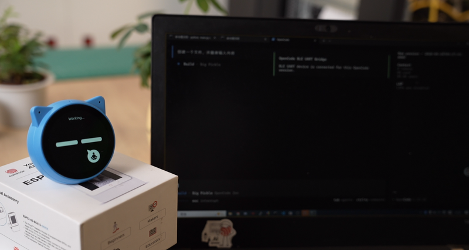
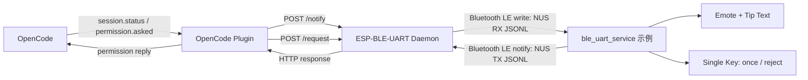
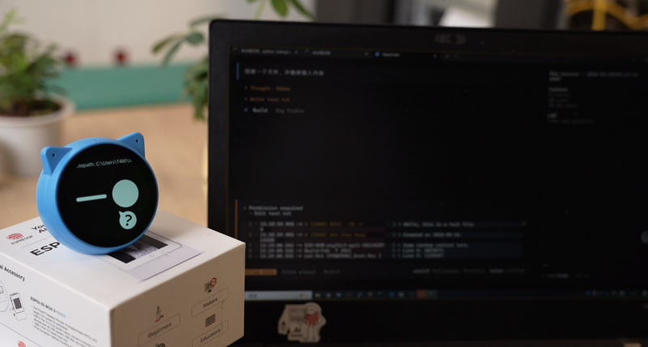

<!-- SPDX-FileCopyrightText: 2026 Espressif Systems (Shanghai) CO LTD -->
<!-- SPDX-License-Identifier: Apache-2.0 -->

# 使用 ESP-BLE-UART 与 ESP-VoCat 构建 OpenCode 伴侣设备

> [English](OPENCODE_COMPANION.md)

## 介绍

本文档介绍如何使用 ESP-BLE-UART 和 ESP-VoCat 构建一个 OpenCode 的物理伴侣设备。该设备在显示屏上反映当前会话 (Session) 状态，呈现权限请求 (Permission Request) 供用户审批，并通过单键输入将权限决策返回给 OpenCode。BLE UART 作为设备与主机侧编辑器会话之间的传输层。

本教程分为两个部分。第一部分使用 **ESP-BLE-UART 控制台 (Console)** 搭配 `ble_uart_service` 回显服务器 (Echo Server)，验证主机是否能够发现、连接 BLE UART 设备并完成数据交换。第二部分引入 `ble_uart_service` 示例固件（运行于 ESP-VoCat 开发板）、**ESP-BLE-UART 守护进程 (Daemon)** 和 **OpenCode 插件 (Plugin)**，使设备能够接收会话状态更新，并将 `once` / `reject` 权限决策返回给 OpenCode。

<p align="center">
  
  <br><em>ESP-VoCat 与 OpenCode 协同工作</em>
</p>

## 学习目标

- 了解 BLE UART 服务及其 GATT 约定
- 掌握构建和烧录 ESP-BLE-UART 回显服务器的方法
- 理解在 BLE UART 上运行的 JSON Lines 协议
- 掌握 ESP-BLE-UART 守护进程和 OpenCode 插件的配置方法

## 前置条件

- 主机具备可用的蓝牙适配器和扫描/连接权限。
- ESP-IDF 环境已导出。
- 回显服务器冒烟测试可使用 `ble_uart_service` 支持的任意目标芯片 (Target)。
- 完整 OpenCode UI 演示需要以下环境：
  - [ESP-VoCat](https://docs.espressif.com/projects/esp-dev-kits/en/latest/esp32s3/esp-vocat/index.html) 开发板（基于 ESP32-S3），配备圆形触摸显示屏和单键输入。BLE UART 传输层可以复用，但显示、触摸和表情 UI 为该示例的板级特性。该示例维护在 [esp-iot-solution](https://github.com/espressif/esp-iot-solution) 仓库的 `examples/bluetooth/ble_uart_service` 路径下，支持的板型、依赖版本和构建说明请参考示例 README。
  - `ble_uart_service` 示例首次编译配置时需要联网下载 `emote_assets.bin`；离线或内网环境下，请将 `EMOTE_ASSETS_BIN` 设置为本地路径以覆盖下载。
  - 安装 OpenCode 以运行插件演示。

安装主机侧 ESP-BLE-UART 桥接工具 (Bridge) 依赖：

```bash
cd $IDF_PATH
. ./export.sh
python -m pip install -r tools/ble/ble_uart_bridge/requirements.txt
```

Windows 下请使用 ESP-IDF 根目录中的 `export.bat` 或 `export.ps1`，不要使用 `. ./export.sh`。

## 第一部分：ESP-BLE-UART 控制台验证

### BLE UART 简介

Bluetooth LE 协议中并没有传统串口意义上的 UART 外设。BLE UART 服务 (BLE UART Service) 是一种 GATT 约定：一个特征值 (Characteristic) 作为主机写入设备的 RX 通道，另一个特征值作为设备通知 (Notify) 给主机的 TX 通道。`ble_uart_service` 中的回显服务器使用 Nordic UART Service 风格的 UUID，将收到的字节通过 TX Notify 原样发回，适合用于验证主机侧控制台链路。

传输层只负责搬运字节。第一部分中，这些字节为普通回显文本；第二部分中，运行在 ESP-VoCat 上的 `ble_uart_service` 示例固件会在同一条 BLE UART 通道上叠加 JSONL 协议。

### 构建并烧录 ESP-BLE-UART 回显服务器

```bash
cd $IDF_PATH/examples/bluetooth/ble_uart_service
idf.py set-target esp32s3    # 或其他支持的 target
idf.py build flash monitor
```

配对期间请保持串口监视器打开。中央设备 (Central) 提示输入配对密钥 (Passkey) 时，输入固件日志中打印的六位数字即可。固件控制台输出应类似以下日志（地址和设备名后缀会有所不同）：

```
I (548) ble_uart: BLE host task started
I (548) ble_uart: registered service 0x1800 handle=1
I (548) ble_uart: registered chr 0x2a00 def=2 val=3
I (548) ble_uart: registered chr 0x2a01 def=4 val=5
I (558) ble_uart: registered service 0x1801 handle=6
I (558) ble_uart: registered chr 0x2a05 def=7 val=8
I (568) ble_uart: registered chr 0x2b3a def=10 val=11
I (568) ble_uart: registered chr 0x2b29 def=12 val=13
I (578) ble_uart: registered service 6e400001-b5a3-f393-e0a9-e50e24dcca9e handle=14
I (578) ble_uart: registered chr 6e400002-b5a3-f393-e0a9-e50e24dcca9e def=15 val=16
I (588) ble_uart: registered chr 6e400003-b5a3-f393-e0a9-e50e24dcca9e def=17 val=18
I (608) NimBLE: GAP procedure initiated: stop advertising.
I (608) NimBLE: GAP procedure initiated: stop advertising.
I (608) ble_uart: addr=74:4d:bd:a9:ed:72
I (608) NimBLE: GAP procedure initiated: advertise;
I (618) NimBLE: disc_mode=2
I (618) NimBLE:  adv_channel_map=0 own_addr_type=0 adv_filter_policy=0 adv_itvl_min=0 adv_itvl_max=0
I (628) NimBLE:
I (628) ble_uart: advertising as 'BleUart-ED72'
I (628) main_task: Returned from app_main()
```

`ble_uart: addr=74:4d:bd:a9:ed:72` 这条日志指示了设备的蓝牙 MAC 地址为 `74:4D:BD:A9:ED:72`。设备以最后一行 `ble_uart: advertising as 'BleUart-XXXX'` 中显示的名称广播。

当中央设备发起连接时，固件会输出配对密钥提示。如果系统蓝牙对话框或 `connection-check` 命令要求输入配对密钥，请输入监视器中显示的六位数字：

```
W (19298) ble_uart:     +-----------------------------+
W (19298) ble_uart:     |  BLE PAIRING PASSKEY:       |
W (19298) ble_uart:     |       617138                |
W (19298) ble_uart:     +-----------------------------+
```

### 扫描 BLE UART 设备

打开第二个终端：

```bash
cd $IDF_PATH/tools/ble/ble_uart_bridge
python main.py list-devices
```

将输出中的设备标识记为 `DEVICE_ID`。可以通过输出中的 MAC 地址或设备名来判断是否扫描到了目标设备。在 Linux 上，设备 MAC 地址会直接显示：

```
> python main.py list-devices

2026-06-05 11:19:56.728 | INFO     | src.core.scanner:scan_devices:42 - Scanning for nearby BLE devices in 5.0s...
2026-06-05 11:19:57.108 | SUCCESS  | src.core.scanner:on_detect:39 - Found: 74:4D:BD:A9:ED:72, with name BleUart-ED72, rssi=-46
```

此输出中的 MAC 地址 `74:4D:BD:A9:ED:72` 和设备名 `BleUart-ED72` 均与上述固件日志一致。

在 macOS 上，由于系统限制，工具无法显示设备的真实蓝牙 MAC 地址，而是分配一个 CoreBluetooth UUID 作为设备标识。需要通过匹配 `list-devices` 输出中的设备名（此例中为 `BleUart-ED72`）与固件日志中的广播名，找到对应的 UUID：

```
> python main.py list-devices

2026-06-05 11:19:56.728 | INFO     | src.core.scanner:scan_devices:42 - Scanning for nearby BLE devices in 5.0s...
2026-06-05 11:19:57.108 | SUCCESS  | src.core.scanner:on_detect:39 - Found: 5BA2476C-CDD2-BF3F-F98C-252CFA45F8B5, with name BleUart-ED72, rssi=-46
```

此例中的 `5BA2476C-CDD2-BF3F-F98C-252CFA45F8B5` 即 macOS 下用作 `DEVICE_ID` 的 CoreBluetooth UUID。

### 打开控制台前检查连接

```bash
python main.py connection-check "<DEVICE_ID>"
```

该命令会连接设备、发现 BLE UART 服务和特征值，然后断开。在 Linux 或 Windows 上，将设备 MAC 地址作为 `DEVICE_ID` 传入：

```
> python main.py connection-check 74:4D:BD:A9:ED:72

2026-06-05 12:06:27.252 | INFO     | src.core.bridge:connect:139 - Connecting to 74:4D:BD:A9:ED:72...
2026-06-05 12:06:37.460 | SUCCESS  | src.core.bridge:connect:206 - Succeeded to connect to 74:4D:BD:A9:ED:72!
2026-06-05 12:06:37.461 | INFO     | src.core.bridge:_disconnect_locked:86 - Disconnecting from 74:4D:BD:A9:ED:72...
2026-06-05 12:06:37.461 | INFO     | src.core.bridge:_handle_disconnect:120 - Disconnected from 74:4D:BD:A9:ED:72
```

在 macOS 上，改用 CoreBluetooth UUID：

```
> python main.py connection-check 5BA2476C-CDD2-BF3F-F98C-252CFA45F8B5

2026-06-05 12:06:27.252 | INFO     | src.core.bridge:connect:139 - Connecting to 5BA2476C-CDD2-BF3F-F98C-252CFA45F8B5...
2026-06-05 12:06:37.460 | SUCCESS  | src.core.bridge:connect:206 - Succeeded to connect to 5BA2476C-CDD2-BF3F-F98C-252CFA45F8B5!
2026-06-05 12:06:37.461 | INFO     | src.core.bridge:_disconnect_locked:86 - Disconnecting from 5BA2476C-CDD2-BF3F-F98C-252CFA45F8B5...
2026-06-05 12:06:37.461 | INFO     | src.core.bridge:_handle_disconnect:120 - Disconnected from 5BA2476C-CDD2-BF3F-F98C-252CFA45F8B5
```

如果此步骤失败，请先解决扫描、配对、权限或广播问题，再继续使用守护进程或 OpenCode。

### 打开 ESP-BLE-UART 控制台

```bash
python main.py console "<DEVICE_ID>" --terminator lf
```

在控制台中输入一行短文本并按 Enter：

```
hello from console
```

预期结果：

```
[INFO] Connected to 68:B6:B3:55:41:76
[TX] hello from console
[RX] hello from console
```

- Bluetooth LE 地址因设备而异。
- 控制台中显示输入内容对应的 `[TX]` 行。
- ESP-BLE-UART 示例将相同字节回显，并显示为 `[RX]` 输出。

至此，Bluetooth LE 扫描、连接、主机到设备写入、设备到主机通知 (Notify) 均已验证通过。JSONL 协议（用于 ESP-VoCat 示例）、守护进程和 OpenCode 插件是叠加在该链路之上的应用层，不替代该链路本身。

更多控制台选项（如十六进制模式、带响应写入 (Write with Response)、不同换行符）请参考 [`tools/ble/ble_uart_bridge/docs/Quick-Start-BLE-UART-Console.md`](../../../tools/ble/ble_uart_bridge/docs/Quick-Start-BLE-UART-Console.md)。

## 第二部分：ESP-VoCat OpenCode 伴侣设备

### ESP-VoCat 简介

[ESP-VoCat](https://docs.espressif.com/projects/esp-dev-kits/en/latest/esp32s3/esp-vocat/index.html) 是基于 ESP32-S3 模组的智能 AI 开发套件，配备圆形触摸显示屏和单键输入。

[esp-iot-solution](https://github.com/espressif/esp-iot-solution) 仓库中包含一个 `ble_uart_service` 示例（位于 `examples/bluetooth/ble_uart_service`），该示例运行在 ESP-VoCat 开发板上。此示例固件将会话状态渲染为表情动画，并将权限请求呈现到屏幕上供用户物理审批。支持的板型、所需组件版本和构建说明请参考 esp-iot-solution 中的示例 README。

### 选择 JSON Lines 的原因

Bluetooth LE 写入按 ATT MTU 分包，不等同于应用层消息边界。ESP-VoCat 的 OpenCode 流程在 BLE UART 上使用 JSON Lines (JSONL)。选择 JSONL 的原因：日志和控制台中可直接阅读，便于手动测试时输入，固件侧可用 cJSON 解析，且同时支持请求/响应和即发即弃两种消息模式。

### 架构概述

ESP-BLE-UART 桥接工具和 OpenCode 演示插件已包含在 ESP-IDF 的 master 及 `release/v5.2` 及以上 release 分支中，位于 `tools/ble/ble_uart_bridge/` 目录下。`ble_uart_service` 示例实现设备侧协议，源码位于 [esp-iot-solution](https://github.com/espressif/esp-iot-solution) 仓库。



各层均可独立替换：

- 控制台验证原始 BLE UART 链路；
- 守护进程维持一个 Bluetooth LE 连接并提供本地 HTTP API；
- OpenCode 插件将编辑器事件转换为守护进程请求/通知；
- `ble_uart_service` 示例在 ESP-VoCat 设备上显示状态和权限提示 (Permission Prompt)。

### 启动 ESP-BLE-UART 守护进程

首先从 [esp-iot-solution](https://github.com/espressif/esp-iot-solution) 仓库将 `ble_uart_service` 示例烧录到 ESP-VoCat 开发板上，该示例与第一部分的控制台回显服务器为不同应用：

```bash
# 如尚未克隆 esp-iot-solution，先执行克隆
git clone https://github.com/espressif/esp-iot-solution.git
cd esp-iot-solution/examples/bluetooth/ble_uart_service
idf.py set-target esp32s3
idf.py build flash monitor
```

依赖版本和板级配置详见 esp-iot-solution 中的示例 README。

然后重新扫描设备，并将 ESP-VoCat 的设备标识记为 `VOCAT_DEVICE_ID`：

```bash
cd $IDF_PATH/tools/ble/ble_uart_bridge
python main.py list-devices
python main.py connection-check "<VOCAT_DEVICE_ID>"
```

使用该 ESP-VoCat 设备启动守护进程：

```bash
cd $IDF_PATH/tools/ble/ble_uart_bridge
python main.py daemon "<VOCAT_DEVICE_ID>" --host 127.0.0.1 --port 8888
```

> **Note:** 守护进程 HTTP API 未内置认证机制。除非自行添加访问控制，否则请保持绑定在 `127.0.0.1`。

在另一个终端检查守护进程状态：

```bash
cd $IDF_PATH/tools/ble/ble_uart_bridge
python main.py daemon-status
```

### 在接入 OpenCode 前通过守护进程验证 ESP-VoCat

不要使用通用 `echo` 请求验证 ESP-VoCat，该固件未实现 echo 操作。请使用 [esp-iot-solution 示例中的 json_format.md](https://github.com/espressif/esp-iot-solution/blob/master/examples/bluetooth/ble_uart_service/json_format.md) 中定义的操作。

会话状态 (Session Status) 冒烟测试：

```bash
python main.py daemon-notify --op session.status --json '{
    "v": 1,
    "kind": "session.status",
    "event_id": "evt_manual",
    "session_id": "ses_manual",
    "requires_reply": false,
    "payload": {
        "type": "busy"
    }
}'

python main.py daemon-notify --op session.status --json '{
    "v": 1,
    "kind": "session.status",
    "event_id": "evt_manual",
    "session_id": "ses_manual",
    "requires_reply": false,
    "payload": {
        "type": "idle"
    }
}'
```

CLI 将每个 JSON 对象作为守护进程信封 (Envelope) 的 `data` 字段发送，并设置 `op: "session.status"` 和 `id: ""`。固件通过 Bluetooth LE 收到完整 JSONL 信封后，更新显示但不返回响应。

权限请求 (Permission Request) 冒烟测试：

```bash
python main.py daemon-send --op permission.request --timeout 35 --json '{
    "v": 1,
    "kind": "permission.request",
    "event_id": "evt_manual",
    "session_id": "ses_manual",
    "permission_id": "perm_manual",
    "requires_reply": true,
    "payload": {
        "id": "perm_manual",
        "sessionID": "ses_manual",
        "type": "bash",
        "title": "Run idf.py build",
        "metadata": {
            "command": "idf.py build"
        }
    }
}'
```

ESP-VoCat 设备应显示一个权限提示：

| ESP-VoCat 输入 | 设备响应            |
|----------------|---------------------|
| 单击           | `decision: "once"`   |
| 长按           | `decision: "reject"` |
| 30 秒无输入    | `decision: "reject"` |

该手动守护进程测试验证的是 OpenCode 插件后续使用的同一条请求/响应链路。

### 安装 OpenCode 演示插件

OpenCode 演示插件已包含在 ESP-IDF 中，位于 `tools/ble/ble_uart_bridge/demos/opencode`。

项目级安装：

```bash
mkdir -p <proj-path>/.opencode/plugins/opencode-ble-uart-bridge
cp $IDF_PATH/tools/ble/ble_uart_bridge/demos/opencode/src/*.ts \
  <proj-path>/.opencode/plugins/opencode-ble-uart-bridge/
```

用户级安装：

```bash
mkdir -p ~/.config/opencode/plugins/opencode-ble-uart-bridge
cp $IDF_PATH/tools/ble/ble_uart_bridge/demos/opencode/src/*.ts \
  ~/.config/opencode/plugins/opencode-ble-uart-bridge/
```

然后配置 OpenCode。项目级安装时，将以下内容放入 `<proj-path>/opencode.json`，或合并到已有配置中：

```json
{
  "$schema": "https://opencode.ai/config.json",
  "plugin": [
    ".opencode/plugins/opencode-ble-uart-bridge/opencode-ble-uart-bridge.ts"
  ],
  "permission": {
    "edit": "ask"
  }
}
```

用户级安装时，将 `plugin` 指向 `~/.config/opencode/plugins/opencode-ble-uart-bridge/` 下的入口文件。如果配置加载器不展开 `~`，请使用绝对路径。

常用插件环境变量：

```bash
export OPENCODE_BLE_DAEMON_URL="http://127.0.0.1:8888"
export OPENCODE_BLE_DECISION_TIMEOUT_SECONDS=60
export OPENCODE_BLE_DEBUG=1
```

修改插件文件、`opencode.json` 或上述环境变量后，需要重启 OpenCode。

### 运行 OpenCode 演示

1. 保持固件运行，并处于广播或已连接状态。
2. 保持 ESP-BLE-UART 守护进程运行在 `127.0.0.1:8888`。
3. 在已配置插件的项目中启动 OpenCode。
4. 触发一次权限提示，例如当 `permission.edit` 设置为 `ask` 时执行编辑操作。

预期结果：

- OpenCode 会话状态以尽力传递 (Best-effort) 方式转发为 `session.status`；
- ESP-VoCat 显示 busy/idle/retry 表情；
- 权限提示显示到 ESP-VoCat，附带命令、路径、URL 等紧凑元数据 (Metadata)；
- 单击返回 `once` 给 OpenCode；
- 长按或超时返回 `reject`。

如需演示 bash 命令或工具执行权限，请确认 OpenCode 权限配置确实会对该工具类别发起询问；否则建议使用编辑权限 (Edit Permission) 作为触发路径。

<p align="center">
  
  <br><em>ESP-VoCat 请求权限</em>
</p>

> **Note:** 如需全面了解 Bluetooth Low Energy，请参见 [Bluetooth LE 概览](../../../docs/zh_CN/api-guides/ble/overview.rst)。关于 Bluetooth LE 连接管理和数据交换，请参考 [Bluetooth LE 多连接指南](../../../docs/zh_CN/api-guides/ble/ble-multiconnection-guide.rst)。

## 协议参考

固件协议详见 `ble_uart_service` 示例中的 `json_format.md`，位于 [esp-iot-solution](https://github.com/espressif/esp-iot-solution) 仓库 (`examples/bluetooth/ble_uart_service/json_format.md`)。外层守护进程信封格式如下：

```
{"v":1,"id":"<bridge-request-id>","op":"<operation>","data":{}}
```

- `id` 非空表示请求/响应操作，例如 `permission.request`；
- `id` 为空表示即发即弃通知，例如 `session.status` 和 `permission.cancel`；
- 设备响应会带回相同的非空 `id`，并返回 `ok/data` 或 `ok:false/error`。

Bluetooth LE 上的 JSONL 权限请求示例：

```json
{
    "v": 1,
    "id": "perm-001",
    "op": "permission.request",
    "data": {
        "v": 1,
        "kind": "permission.request",
        "event_id": "evt_...",
        "session_id": "ses_...",
        "permission_id": "perm_...",
        "requires_reply": true,
        "payload": {
            "id": "perm_...",
            "sessionID": "ses_...",
            "type": "bash",
            "title": "Run idf.py build",
            "metadata": {
                "command": "idf.py build"
            }
        }
    }
}
```

设备响应示例：

```json
{
    "v": 1,
    "id": "perm-001",
    "ok": true,
    "data": {
        "decision": "once",
        "message": "Approved from BLE device"
    }
}
```

`permission.cancel` 用于清理过期的权限提示，不再发送迟到的决策。适用于用户已在 OpenCode 终端界面 (TUI) 中处理了权限请求、但 ESP-VoCat 仍在显示权限提示的情况。

## 故障排查

- **扫描不到设备：** 确认主机蓝牙权限、固件正在广播、设备距离足够近。先用 `list-devices` 和 `connection-check` 排查。
- **控制台可用但守护进程不可用：** 确认控制台已关闭；该固件同一时间只接受一个 Bluetooth LE 连接。
- **守护进程断开连接：** 守护进程没有后台自动重连循环。当下一次 `/request` 或 `/notify` HTTP 请求到达时，守护进程会尝试按需重连。如果设备连续多次不可达，守护进程将自动退出。可使用 `daemon-status` 查看当前连接状态和重连失败计数。
- **OpenCode 未转发事件：** 确认 `OPENCODE_BLE_DAEMON_URL`，运行 `daemon-status`，修改配置后重启 OpenCode。
- **权限请求超时：** 确认设备收到的是带非空 `id` 的 `permission.request`，没有旧的权限提示仍在等待中，且用户在超时前已按下按键。
- **出现意外拒绝：** 演示采用失败即关闭 (Fail-closed) 设计。Bluetooth LE 链路、守护进程、插件或设备决策处理中任一环节失败，OpenCode 侧都会拒绝而非静默允许。
- **配对失败：** 检查固件日志中打印的配对密钥 (Passkey)，确认中央设备端输入的是同一个值。
- **认证不足 (Insufficient Authentication)：** 如果连接或特征值访问时报认证错误，请先通过系统蓝牙设置完成设备配对，并输入固件监视器日志中显示的六位数配对密钥。部分桌面 Bluetooth LE 协议栈要求在系统层面完成显式配对后，GATT 操作才能成功。

## 扩展方向

- 增加更多输入手势，支持 `always`、`edit` 或"本会话拒绝"。
- 为命令/路径/URL 元数据设计更丰富的显示布局。
- 在设备侧增加权限提示超时设置。
- 为低风险命令增加允许列表 (Allowlist)。
- 使用模拟守护进程和模拟固件响应进行集成测试。
- 如需更低开销，将 JSONL 替换为紧凑二进制协议。

## 总结

本演示中的每一层均保持简单且可独立测试：控制台验证原始 BLE UART 链路，守护进程将一个 Bluetooth LE 连接转换为本地 HTTP 桥接，OpenCode 插件将编辑器事件映射为守护进程请求，ESP-VoCat 提供物理 UI。任意一层均可单独替换而不影响其余部分。
