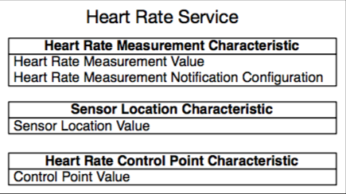

# GATT Server Service Table Example Walkthrough

## Introduction

This document presents a walkthrough of the GATT Server Service Table example code for the ESP32. This example implements a Bluetooth Low Energy (BLE) Generic Attribute (GATT) Server using a table-like data structure to define the server services and characteristics such as the one shown in the figure below Therefore, it demonstrates a practical way to define the server functionality in one place instead of adding services and characteristics one by one.

This example implements the *Heart Rate Profile* as defined by the [Traditional Profile Specifications](https://www.bluetooth.com/specifications/profiles-overview).

<div align="center"> </div>

## Includes

Let’s start by taking a look at the included headers in the [gatts_table_creat_demo.c](../main/gatts_table_creat_demo.c) file:

```c
#include "freertos/FreeRTOS.h"
#include "freertos/task.h"
#include "freertos/event_groups.h"
#include "esp_system.h"
#include "esp_log.h"
#include "nvs_flash.h"
#include "bt.h"
#include "bta_api.h"

#include "esp_gap_ble_api.h"
#include "esp_gatts_api.h"
#include "esp_bt_defs.h"
#include "esp_bt_main.h"
#include "esp_bt_main.h"
#include “gatts_table_creat_demo.h"
```
These includes are required for the *FreeRTOS* and underlying system components to run, including logging functionality and a library to store data in non-volatile flash memory. We are interested in ``bt.h``, ``esp_bt_main.h``, ``esp_gap_ble_api.h`` and ``esp_gatts_api.h`` which expose the BLE APIs required to implement this example.

* ``bt.h``: implements BT controller and VHCI configuration procedures from the host side.
* ``esp_bt_main.h``: implements initialization and enabling of the Bluedroid stack.
* ``esp_gap_ble_api.h``: implements GAP configuration such as advertising and connection parameters.
* ``esp_gatts_api.h``: implements GATT Server configuration such as creating services and characteristics.

## Service Table

The header file [gatts_table_creat_demo.h](../main/gatts_table_creat_demo.h) is where an enumeration of the services and characteristics is created:

```c
enum
{
    HRS_IDX_SVC,

    HRS_IDX_HR_MEAS_CHAR,
    HRS_IDX_HR_MEAS_VAL,
    HRS_IDX_HR_MEAS_NTF_CFG,

    HRS_IDX_BOBY_SENSOR_LOC_CHAR,
    HRS_IDX_BOBY_SENSOR_LOC_VAL,

    HRS_IDX_HR_CTNL_PT_CHAR,
    HRS_IDX_HR_CTNL_PT_VAL,

    HRS_IDX_NB,
};
```
The enumeration elements are set up in the same order as the Heart Rate Profile attributes, starting with the service followed by the characteristics of that service. In addition, the Heart Rate Measurement characteristic has a Client Characteristic Configuration (CCC) descriptor which is an additional attribute that describes if the characteristic has notifications enabled. The enumeration index can be used to identify each element later when creating the actual attributes table. In summary, the elements are described as follows:

* ``HRS_IDX_SVC``: Heart Rate Service index
* ``HRS_IDX_HR_MEAS_CHAR``: Heart Rate Measurement characteristic index
* ``HRS_IDX_HR_MEAS_VAL``: Heart Rate Measurement characteristic value index
* ``HRS_IDX_HR_MEAS_NTF_CFG``: Heart Rate Measurement notifications configuration (CCC) index
* ``HRS_IDX_BOBY_SENSOR_LOC_CHAR``: Heart Rate Body Sensor Location characteristic index
* ``HRS_IDX_BOBY_SENSOR_LOC_VAL``: Heart Rate Body Sensor Location characteristic value index
* ``HRS_IDX_HR_CTNL_PT_CHAR``: Heart Rate Control Point characteristic index
* ``HRS_IDX_HR_CTNL_PT_VAL``: Heart Rate Control Point characteristic value index
* ``HRS_IDX_NB``: Number of table elements.

## Main Entry Point

The entry point to this example is the ``app_main()`` function:

```c
void app_main()
{
    esp_err_t ret;

    // Initialize NVS.
    ret = nvs_flash_init();
    if (ret == ESP_ERR_NVS_NO_FREE_PAGES || ret == ESP_ERR_NVS_NEW_VERSION_FOUND) {
        ESP_ERROR_CHECK(nvs_flash_erase());
        ret = nvs_flash_init();
    }
    ESP_ERROR_CHECK( ret );

    esp_bt_controller_config_t bt_cfg = BT_CONTROLLER_INIT_CONFIG_DEFAULT();
    ret = esp_bt_controller_init(&bt_cfg);
    if (ret) {
        ESP_LOGE(GATTS_TABLE_TAG, "%s enable controller failed", __func__);
        return;
    }

    ret = esp_bt_controller_enable(ESP_BT_MODE_BLE);
    if (ret) {
        ESP_LOGE(GATTS_TABLE_TAG, "%s enable controller failed", __func__);
        return;
    }

    ESP_LOGI(GATTS_TABLE_TAG, "%s init bluetooth", __func__);

    ret = esp_bluedroid_init();
    if (ret) {
        ESP_LOGE(GATTS_TABLE_TAG, "%s init bluetooth failed", __func__);
        return;
    }
    ret = esp_bluedroid_enable();
    if (ret) {
        ESP_LOGE(GATTS_TABLE_TAG, "%s enable bluetooth failed", __func__);
        return;
    }

    esp_ble_gatts_register_callback(gatts_event_handler);
    esp_ble_gap_register_callback(gap_event_handler);
    esp_ble_gatts_app_register(ESP_HEART_RATE_APP_ID);
    return;
}
```

The main function starts by initializing the non-volatile storage library in order to be able to save parameters in flash memory.

```c
ret = nvs_flash_init();
```

## BT Controller and Stack Initialization

See this section in [GATT Server Example Walkthrough](../../gatt_server/tutorial/Gatt_Server_Example_Walkthrough.md).


## Application Profiles

This example implements one Application Profile for the Heart Rate Service. An Application Profile is a way to group functionality which is designed to be used by one client application, for example one smartphone mobile app. In this way, different types of profiles can be accommodated in one server. The Application Profile ID, which is an user-assigned number to identify each profile, is used to register the profile in the stack, in this example the ID is 0x55.

```c
#define HEART_PROFILE_NUM                       1
#define HEART_PROFILE_APP_IDX                   0
#define ESP_HEART_RATE_APP_ID                   0x55
```

The profiles are stored in the ``heart_rate_profile_tab`` array. Since there is only one profile in this example, one element is stored in the array with index zero as defined by the ``HEART_PROFILE_APP_IDX``. Additionally, the profile event handler callback function is initialized. Each application on the GATT server uses a different interface, represented by the gatts_if parameter. For initialization, this parameter is set to ``ESP_GATT_IF_NONE``, later when the application is registered, the gatts_if parameter is updated with the corresponding interface generated by the stack.

```c
/* One gatt-based profile one app_id and one gatts_if, this array will store the gatts_if returned by ESP_GATTS_REG_EVT */
static struct gatts_profile_inst heart_rate_profile_tab[HEART_PROFILE_NUM] = {
    [HEART_PROFILE_APP_IDX] = {
        .gatts_cb = gatts_profile_event_handler,
        .gatts_if = ESP_GATT_IF_NONE,       /* Not get the gatt_if, so initial is ESP_GATT_IF_NONE */
    },

};
```

The application registration takes place inside ``app_main()`` using the ``esp_ble_gatts_app_register()`` function:

```c
esp_ble_gatts_app_register(ESP_HEART_RATE_APP_ID);
```
The ``ESP_HEART_RATE_APP_ID`` serves as an application ID, distinguishing between various application layer callbacks. This identifier corresponds to the ``app_id`` found within the ``gatts_reg_evt_param`` in ESP_GATTS_REG_EVT.

## Setting GAP Parameters

The register application event is the first one that is triggered during the lifetime of the program. This example uses this event to configure advertising parameters upon registration in the profile event handler. The functions used to achieve this are:

* ``esp_ble_gap_set_device_name()``: used to set the advertised device name.
* ``esp_ble_gap_config_adv_data()``: used to configure standard advertising data.

The function used to configure standard Bluetooth Specification advertisement parameters is ``esp_ble_gap_config_adv_data()`` which takes a pointer to an ``esp_ble_adv_data_t`` structure. The ``esp_ble_adv_data_t`` data structure for advertising data has the following definition:

```c
typedef struct {
    bool set_scan_rsp;    /*!< Set this advertising data as scan response or not*/
    bool include_name;    /*!< Advertising data include device name or not */
    bool include_txpower; /*!< Advertising data include TX power */
    int min_interval;     /*!< Advertising data show slave preferred connection min interval */
    int max_interval;     /*!< Advertising data show slave preferred connection max interval */
    int appearance;       /*!< External appearance of device */
    uint16_t manufacturer_len; /*!< Manufacturer data length */
    uint8_t *p_manufacturer_data; /*!< Manufacturer data point */
    uint16_t service_data_len;    /*!< Service data length */
    uint8_t *p_service_data;      /*!< Service data point */
    uint16_t service_uuid_len;    /*!< Service uuid length */
    uint8_t *p_service_uuid;      /*!< Service uuid array point */
    uint8_t flag;         /*!< Advertising flag of discovery mode, see BLE_ADV_DATA_FLAG detail */
} esp_ble_adv_data_t;
```

In this example, the structure is initialized as follows:

```c
static esp_ble_adv_data_t heart_rate_adv_config = {
    .set_scan_rsp = false,
    .include_name = true,
    .include_txpower = true,
    .min_interval = 0x0006,
    .max_interval = 0x0010,
    .appearance = 0x00,
    .manufacturer_len = 0, //TEST_MANUFACTURER_DATA_LEN,
    .p_manufacturer_data =  NULL, //&test_manufacturer[0],
    .service_data_len = 0,
    .p_service_data = NULL,
    .service_uuid_len = sizeof(heart_rate_service_uuid),
    .p_service_uuid = heart_rate_service_uuid,
    .flag = (ESP_BLE_ADV_FLAG_GEN_DISC | ESP_BLE_ADV_FLAG_BREDR_NOT_SPT),
};
```

The minimum and maximum slave preferred connection intervals are set in units of 1.25 ms. In this example, the minimum slave preferred connection interval is defined as 0x0006 * 1.25 ms = 7.5 ms and the maximum slave preferred connection interval is initialized as 0x0010 * 1.25 ms = 20 ms.

An advertising payload can be up to 31 bytes of data. It is possible that some of the parameters surpass the 31-byte advertisement packet limit which causes the stack to cut the message and leave some of the parameters out. To solve this, usually the longer parameters are stored in the scan response, which can be configured using the same ``esp_ble_gap_config_adv_data()`` function and an additional esp_ble_adv_data_t type structure with the .set_scan_rsp parameter is set to true. Finally, to set the device name the ``esp_ble_gap_set_device_name()`` function is used. The registering event handler is shown as follows:

```c
static void gatts_profile_event_handler(esp_gatts_cb_event_t event,
esp_gatt_if_t gatts_if, esp_ble_gatts_cb_param_t *param)
{
    ESP_LOGE(GATTS_TABLE_TAG, "event = %x",event);
    switch (event) {
        case ESP_GATTS_REG_EVT:
            ESP_LOGI(GATTS_TABLE_TAG, "%s %d", __func__, __LINE__);
            esp_ble_gap_set_device_name(SAMPLE_DEVICE_NAME);
            ESP_LOGI(GATTS_TABLE_TAG, "%s %d", __func__, __LINE__);
            esp_ble_gap_config_adv_data(&heart_rate_adv_config);
            ESP_LOGI(GATTS_TABLE_TAG, "%s %d", __func__, __LINE__);
…
```

## GAP Event Handler

Once the advertising data have been set, the ``ESP_GAP_BLE_ADV_DATA_SET_COMPLETE_EVT`` is triggered and managed by the GAP event handler. Moreover, an ``ESP_GAP_BLE_SCAN_RSP_DATA_SET_COMPLETE_EVT`` is triggered as well if the scan response is also set. Once the configuration of the advertising and scan response data has been set, the handler can use any of these events to start advertising, which is done using the ``esp_ble_gap_start_advertising()`` function:

```c
static void gap_event_handler(esp_gap_ble_cb_event_t event, esp_ble_gap_cb_param_t *param)
{
    ESP_LOGE(GATTS_TABLE_TAG, "GAP_EVT, event %d", event);

    switch (event) {
    case ESP_GAP_BLE_ADV_DATA_SET_COMPLETE_EVT:
        esp_ble_gap_start_advertising(&heart_rate_adv_params);
        break;
    case ESP_GAP_BLE_ADV_START_COMPLETE_EVT:
        //advertising start complete event to indicate advertising start successfully or failed
        if (param->adv_start_cmpl.status != ESP_BT_STATUS_SUCCESS) {
            ESP_LOGE(GATTS_TABLE_TAG, "Advertising start failed");
        }
        break;
    default:
        break;
    }
}
```

The function to start advertising takes a structure of type ``esp_ble_adv_params_t`` with the advertising parameters required.

```c
/// Advertising parameters
typedef struct {
    uint16_t adv_int_min; /*!< Minimum advertising interval for undirected and low duty cycle directed advertising.
    Range: 0x0020 to 0x4000
    Default: N = 0x0800 (1.28 second)
    Time = N * 0.625 msec
    Time Range: 20 ms to 10.24 sec */
    uint16_t adv_int_max; /*!< Maximum advertising interval for undirected and low duty cycle directed advertising.
    Range: 0x0020 to 0x4000
    Default: N = 0x0800 (1.28 second)
    Time = N * 0.625 msec
    Time Range: 20 ms to 10.24 sec */
    esp_ble_adv_type_t adv_type;            /*!< Advertising type */
    esp_ble_addr_type_t own_addr_type;      /*!< Owner bluetooth device address type */
    esp_bd_addr_t peer_addr;                /*!< Peer device bluetooth device address */
    esp_ble_addr_type_t peer_addr_type;     /*!< Peer device bluetooth device address type */
    esp_ble_adv_channel_t channel_map;      /*!< Advertising channel map */
    esp_ble_adv_filter_t adv_filter_policy; /*!< Advertising filter policy */
} esp_ble_adv_params_t;
```

Note that ``esp_ble_gap_config_adv_data()`` configures the data that is advertised to the client and takes an ``esp_ble_adv_data_t structure``, while ``esp_ble_gap_start_advertising()`` makes the server to actually start advertising and takes an ``esp_ble_adv_params_t`` structure. The advertising data is the information that is shown to the client, while the advertising parameters are the configuration required by the BLE stack to execute.

For this example, the advertisement parameters are initialized as follows:

```c
static esp_ble_adv_params_t heart_rate_adv_params = {
    .adv_int_min        = 0x20,
    .adv_int_max        = 0x40,
    .adv_type           = ADV_TYPE_IND,
    .own_addr_type      = BLE_ADDR_TYPE_PUBLIC,
    //.peer_addr            =
    //.peer_addr_type       =
    .channel_map        = ADV_CHNL_ALL,
    .adv_filter_policy = ADV_FILTER_ALLOW_SCAN_ANY_CON_ANY,
};
```

These parameters configure the advertising interval between 20 ms to 40 ms. The advertisement is of type ADV_IND, which is generic, not directed to a particular central device and advertises the server as connectable. The address type is public, uses all channels and allows both scan and connection requests from any central.

If the advertising started successfully, an ``ESP_GAP_BLE_ADV_START_COMPLETE_EVT`` event is generated which in this example is used to check if the advertising status is indeed advertising or otherwise print an error message.

```c
…
    case ESP_GAP_BLE_ADV_START_COMPLETE_EVT:
        //advertising start complete event to indicate advertising start successfully or failed
        if (param->adv_start_cmpl.status != ESP_BT_STATUS_SUCCESS) {
            ESP_LOGE(GATTS_TABLE_TAG, "Advertising start failed");
        }
        break;
…
```

## GATT Event Handlers

When an Application Profile is registered, an ``ESP_GATTS_REG_EVT`` event is triggered. The parameters of the ``ESP_GATTS_REG_EVT`` are:

```c
esp_gatt_status_t status;    /*!< Operation status */
uint16_t app_id;             /*!< Application id which input in register API */
```

In addition to the previous parameters, the event also contains the GATT interface assigned by the BLE stack. The event is captured by the ``gatts_event_handler()`` which stores the generated interface in the profile table and then forwards it to the corresponding profile event handler.

```c
static void gatts_event_handler(esp_gatts_cb_event_t event, esp_gatt_if_t gatts_if, esp_ble_gatts_cb_param_t *param)
{
    ESP_LOGI(GATTS_TABLE_TAG, "EVT %d, gatts if %d", event, gatts_if);

    /* If event is register event, store the gatts_if for each profile */
    if (event == ESP_GATTS_REG_EVT) {
        if (param->reg.status == ESP_GATT_OK) {
            heart_rate_profile_tab[HEART_PROFILE_APP_IDX].gatts_if = gatts_if;
        } else {
            ESP_LOGI(GATTS_TABLE_TAG, "Reg app failed, app_id %04x, status %d",
                    param->reg.app_id,
                    param->reg.status);
            return;
        }
    }

    do {
        int idx;
        for (idx = 0; idx < HEART_PROFILE_NUM; idx++) {
            if (gatts_if == ESP_GATT_IF_NONE || /* ESP_GATT_IF_NONE, not specify a certain gatt_if, need to call every profile cb function */
            gatts_if == heart_rate_profile_tab[idx].gatts_if) {
                if (heart_rate_profile_tab[idx].gatts_cb) {
                    heart_rate_profile_tab[idx].gatts_cb(event, gatts_if, param);
                }
            }
        }
    } while (0);
}
```

## Creating Services and Characteristics with the Attribute Table

The register event is used to create a table of profile attributes by employing the ``esp_ble_gatts_create_attr_tab()`` function. This function takes an argument of type ``esp_gatts_attr_db_t`` which corresponds to a look up table keyed by the enumeration values defined in the header file.

The ``esp_gatts_attr_db_t`` structure has two members:

```c
esp_attr_control_t    attr_control;       /*!< The attribute control type*/
esp_attr_desc_t       att_desc;           /*!< The attribute type*/
```

The attr_control is the auto-respond parameter which can be set as ``ESP_GATT_AUTO_RSP`` to allow the BLE stack to take care of responding messages when read or write events arrive. The other option is ``ESP_GATT_RSP_BY_APP`` which allows to manually respond to messages using the ``esp_ble_gatts_send_response()`` function.

The ``att_desc`` is the attribute description which is made of:

```c
uint16_t uuid_length;      /*!< UUID length */
uint8_t  *uuid_p;          /*!< UUID value */
uint16_t perm;             /*!< Attribute permission */
uint16_t max_length;       /*!< Maximum length of the element*/
uint16_t length;           /*!< Current length of the element*/
uint8_t  *value;           /*!< Element value array*/
```

For example, the first element of the table in this example is the service attribute:

```c
[HRS_IDX_SVC]                       =
    {{ESP_GATT_AUTO_RSP}, {ESP_UUID_LEN_16, (uint8_t *)&primary_service_uuid, ESP_GATT_PERM_READ,
      sizeof(uint16_t), sizeof(heart_rate_svc), (uint8_t *)&heart_rate_svc}},
```

The initialization values are:

* ``[HRS_IDX_SVC]``: Named or designated initializer in the enum table.
* ``ESP_GATT_AUTO_RSP``: Auto respond configuration, set to respond automatically by the stack.
* ``ESP_UUID_LEN_16``: UUID length set to 16 bits.
* ``(uint8_t *)&primary_service_uuid``: UUID to identify the service as a primary one (0x2800).
* ``ESP_GATT_PERM_READ``: Read Permission for the service.
* ``sizeof(uint16_t)``: Maximum length of the service UUID (16 bits).
* ``sizeof(heart_rate_svc)``: Current service length set to the size of the variable *heart_rate_svc*, which is 16 bits.
* ``(uint8_t *)&heart_rate_svc``: Service attribute value set to the variable *heart_rate_svc* which contains the Heart Rate Service UUID (0x180D).

The rest of the attributes is initialized in the same way. Some attributes also have the *NOTIFY* property which is set by ``&char_prop_notify``. The complete table structure is initialized as follows:

```c
/// Full HRS Database Description - Used to add attributes into the database
static const esp_gatts_attr_db_t heart_rate_gatt_db[HRS_IDX_NB] =
{
    // Heart Rate Service Declaration
    [HRS_IDX_SVC]                       =
    {{ESP_GATT_AUTO_RSP}, {ESP_UUID_LEN_16, (uint8_t *)&primary_service_uuid, ESP_GATT_PERM_READ,
      sizeof(uint16_t), sizeof(heart_rate_svc), (uint8_t *)&heart_rate_svc}},

    // Heart Rate Measurement Characteristic Declaration
    [HRS_IDX_HR_MEAS_CHAR]            =
    {{ESP_GATT_AUTO_RSP}, {ESP_UUID_LEN_16, (uint8_t *)&character_declaration_uuid, ESP_GATT_PERM_READ,
      CHAR_DECLARATION_SIZE,CHAR_DECLARATION_SIZE, (uint8_t *)&char_prop_notify}},

    // Heart Rate Measurement Characteristic Value
    [HRS_IDX_HR_MEAS_VAL]               =
    {{ESP_GATT_AUTO_RSP}, {ESP_UUID_LEN_16, (uint8_t *)&heart_rate_meas_uuid, ESP_GATT_PERM_READ,
      HRPS_HT_MEAS_MAX_LEN,0, NULL}},

    // Heart Rate Measurement Characteristic - Client Characteristic Configuration Descriptor
    [HRS_IDX_HR_MEAS_NTF_CFG]           =
    {{ESP_GATT_AUTO_RSP}, {ESP_UUID_LEN_16, (uint8_t *)&character_client_config_uuid, ESP_GATT_PERM_READ|ESP_GATT_PERM_WRITE,
      sizeof(uint16_t),sizeof(heart_measurement_ccc), (uint8_t *)heart_measurement_ccc}},

    // Body Sensor Location Characteristic Declaration
    [HRS_IDX_BOBY_SENSOR_LOC_CHAR]  =
    {{ESP_GATT_AUTO_RSP}, {ESP_UUID_LEN_16, (uint8_t *)&character_declaration_uuid, ESP_GATT_PERM_READ,
      CHAR_DECLARATION_SIZE,CHAR_DECLARATION_SIZE, (uint8_t *)&char_prop_read}},

    // Body Sensor Location Characteristic Value
    [HRS_IDX_BOBY_SENSOR_LOC_VAL]   =
    {{ESP_GATT_AUTO_RSP}, {ESP_UUID_LEN_16, (uint8_t *)&body_sensor_location_uuid, ESP_GATT_PERM_READ,
      sizeof(uint8_t), sizeof(body_sensor_loc_val), (uint8_t *)body_sensor_loc_val}},

    // Heart Rate Control Point Characteristic Declaration
    [HRS_IDX_HR_CTNL_PT_CHAR]          =
    {{ESP_GATT_AUTO_RSP}, {ESP_UUID_LEN_16, (uint8_t *)&character_declaration_uuid, ESP_GATT_PERM_READ,
      CHAR_DECLARATION_SIZE,CHAR_DECLARATION_SIZE, (uint8_t *)&char_prop_read_write}},

    // Heart Rate Control Point Characteristic Value
    [HRS_IDX_HR_CTNL_PT_VAL]             =
    {{ESP_GATT_AUTO_RSP}, {ESP_UUID_LEN_16, (uint8_t *)&heart_rate_ctrl_point, ESP_GATT_PERM_WRITE|ESP_GATT_PERM_READ,
      sizeof(uint8_t), sizeof(heart_ctrl_point), (uint8_t *)heart_ctrl_point}},
};
```

## Starting the Service
When the attribute table is created, an ``ESP_GATTS_CREAT_ATTR_TAB_EVT`` event is triggered. This event has the following parameters:

```c
esp_gatt_status_t status;    /*!< Operation status */
esp_bt_uuid_t svc_uuid;      /*!< Service uuid type */
uint16_t num_handle;         /*!< The number of the attribute handle to be added to the gatts database */
uint16_t *handles;           /*!< The number to the handles */
```

This example uses this event to print information and to check that the size of the created table equals the number of elements in the enumeration HRS_IDX_NB. If the table is correctly created, the attribute handles are copied into the handle table heart_rate_handle_table and the service is started using the ``esp_ble_gatts_start_service()`` function:

```c
case ESP_GATTS_CREAT_ATTR_TAB_EVT:{
        ESP_LOGI(GATTS_TABLE_TAG, "The number handle =%x",param->add_attr_tab.num_handle);
        if (param->add_attr_tab.status != ESP_GATT_OK){
            ESP_LOGE(GATTS_TABLE_TAG, "Create attribute table failed, error code=0x%x", param->add_attr_tab.status);
        }
        else if (param->add_attr_tab.num_handle != HRS_IDX_NB){
            ESP_LOGE(GATTS_TABLE_TAG, "Create attribute table abnormally, num_handle (%d) \
                    doesn't equal to HRS_IDX_NB(%d)", param->add_attr_tab.num_handle, HRS_IDX_NB);
        }
        else {
            memcpy(heart_rate_handle_table, param->add_attr_tab.handles, sizeof(heart_rate_handle_table));
            esp_ble_gatts_start_service(heart_rate_handle_table[HRS_IDX_SVC]);
        }
        break;
```

The handles stored in the handles pointer of the event parameters are numbers that identify each attribute. The handles can be used to know which characteristic is being read or written to, therefore they can be passed around and to upper layers of the application to handle different actions.

Finally, the heart_rate_handle_table contains the Application Profile in the form of a structure with information about the attribute parameters as well as GATT interface, connection ID, permissions and application ID. The profile structure is shown as follows, note that not all members are used in this example:

```c
struct gatts_profile_inst {
    esp_gatts_cb_t gatts_cb;
    uint16_t gatts_if;
    uint16_t app_id;
    uint16_t conn_id;
    uint16_t service_handle;
    esp_gatt_srvc_id_t service_id;
    uint16_t char_handle;
    esp_bt_uuid_t char_uuid;
    esp_gatt_perm_t perm;
    esp_gatt_char_prop_t property;
    uint16_t descr_handle;
    esp_bt_uuid_t descr_uuid;
};
```

## Conclusion
This document explains the work flow of the GATT Server Service Table example code that implements a Heart Rate Profile. This example begins by defining a table of attributes which include all the services and characteristics of the server, then it registers the Application Profile which triggers events that are used to configure GAP parameters and to create the service table. A service table is initialized with all the parameters required for each attribute and the service is started. This example shows a practical way of defining the server attributes by using a table instead of adding characteristic one by one.


