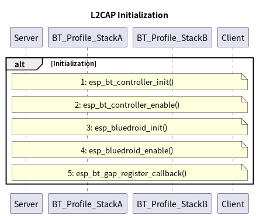
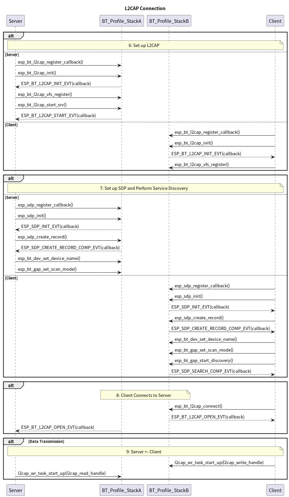

# Description of Bluetooth L2CAP Connection Example Sequence Diagram

## Introduction
This document describes the process of L2CAP initialization, connection, and data transfer established between Bluetooth L2CAP client and server provided in [bt_l2cap_server](../../bt_l2cap_server) example.

## Initialization Process

 

The `BT_Profile_StackA` and `BT_Profile_StackB` in the above diagram represent the same Bluetooth protocol stacks (GAP, SDP, L2CAP in this example). StackA and StackB are to distinguish which device is interacting with the protocol stack.
Both projects `BT_L2CAP_Server`([bt_l2cap_server](../../bt_l2cap_server)) and `BT_L2CAP_Client` have the same initialization process but are independent of each other. The entry point to the example is the `app_main()` function, and the main function starts by initializing the non-volatile storage library. Then, the L2CAP initialization both the `Server` and `Client` can be divided into the following steps:
- Step1: esp_bt_controller_init()
- Step2: esp_bt_controller_enable()
- Step3: esp_bluedroid_init_with_cfg()
- Step4: esp_bluedroid_enable()
- Step5: esp_bt_gap_register_callback()

## Connection Process

 

Step `6` is the setting phase of L2CAP. There are two alternative paths: one for the server's L2CAP setup and the other for the client's L2CAP setup.
- In the server path:
    - The L2CAP callback is registered by calling `esp_bt_l2cap_register_callback()`.
    - The `Server` performs the L2CAP initialization by calling the `esp_bt_l2cap_init()` function, and an asynchronous callback event `ESP_BT_L2CAP_INIT_EVT` is returned to indicate the initialization completion.
    - Then the `Server` proceeds to register the virtual file system using `esp_bt_l2cap_vfs_register()` and starts the server using function `esp_bt_l2cap_start_srv()`. The asynchronous callback event `ESP_BT_L2CAP_START_EVT` is also returned to indicate the server's start completion.

- In the client path:
    - Compared with the server's path, the client path also calls functions `esp_bt_l2cap_register_callback()`, `esp_bt_l2cap_init()` and  `esp_bt_l2cap_vfs_register()` to register L2CAP callback, initiate the L2CAP and register the the virtual file system. But the client does not need to start the service.

Step `7` in sequence diagram is the setting of SDP and process of service discovery. Similar to the L2CAP setup, there are separate paths for `Server` and `Client`.
- In the server path:
    - The SDP callback is registered by calling `esp_sdp_register_callback()`.
    - The `Server` initiates SDP by calling `esp_sdp_init()`, and the asynchronous callback event `ESP_SDP_INIT_EVT` is returned to indicate the initialization completion.
    - Then the `Server` creates an SDP record by calling `esp_sdp_create_record()`, and an asynchronous callback event `ESP_SDP_CREATE_RECORD_COMP_EVT` is returned to indicate the completion of the record creation.
    - The `Server` can also set the device name by calling `esp_bt_gap_set_device_name()` and make itself connectable and discoverable by calling `esp_bt_gap_set_scan_mode()`.
- In the client path:
    - The `Client` also calls functions `esp_sdp_register_callback()`, `esp_sdp_init()`, `esp_sdp_create_record()`, `esp_bt_gap_set_device_name()` and `esp_bt_gap_set_scan_mode()` to register SDP callback, initiate the SDP, create sdp record, set device name and set the scan mode.
    - Additionally, the `Client` calls `esp_bt_gap_start_discovery()` to start `Inquiry`. When the `Inquiry` process is completed, the asynchronous callback event `ESP_BT_GAP_DISC_RES_EVT` will be returned.

Once the event `ESP_BT_GAP_DISC_RES_EVT` is returned, the `Client` will try to make a L2CAP connection to the `BD Address` of `Server` by calling function `esp_bt_connect()` in step `8`.

After the establishment of L2CAP connection, both the `Server` and `Client` will receive the asynchronous callback event `ESP_BT_L2CAP_OPEN_EVT`, and they can transfer data by calling the function `l2cap_wr_task_start_up()`. However, it is important to note that the data sender should call the function `l2cap_wr_task_start_up()` with handler `l2cap_write_handle`, while the data receiver should call the function with the handler `l2cap_read_handle`. Once the transmission of the data is completed, it's recommended to close the connection and deinitialize the bluetooth profile stack.