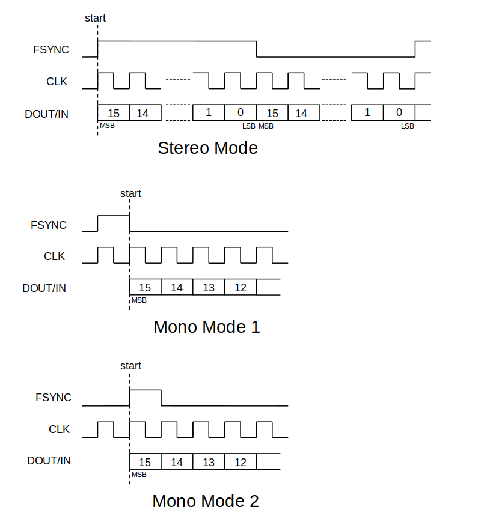

| Supported Targets | ESP32 | ESP32-S31 |
| ----------------- | ----- | --------- |

# Hands-Free Audio Gateway (HF-AG)

This example is to show how to use the APIs of Hands-Free Audio Gateway (hf_ag) Component and the effects of them by providing a set of commands. You can use this example to communicate with a device that implements Hands-Free Client Role (e.g. a headphone set).

## How to use example

### Hardware Required

This example is designed to run on commonly available ESP32 and ESP32-S31 development boards, e.g. ESP32-DevKitC and so on. To operate this example, it should be connected to a Hands-Free Client running on a Headphone/Headset or on another ESP32 or ESP32-S31 development board loaded with [hfp_hf](../hfp_hf) example of ESP-IDF.

### Configure the project

Open the project configuration menu:

```bash
idf.py menuconfig
```

### Special Configurations for HFP

#### Data Path

ESP32 HFP supports two types of audio datapath: PCM and HCI. Currently, ESP32-S31 HFP only supports HCI.

The default configuration is `PCM`, if you want to use `vHCI` you should configure the data path before building and downloading the binary.

- PCM: To use PCM, audio stream is directed from Bluetooth controller to the specific GPIO pins you set in the demo, and you should link these GPIO pins to a speaker via I2S port. The audio data will not go through the `Bluedroid`. In menuconfig, you should choose PCM in `menuconfig` path:

    `Component config --> Bluetooth controller --> BR/EDR Sync(SCO/eSCO) default data path --> PCM`

    and also

    `Component config --> Bluetooth --> Bluedroid Options --> Hands Free/Handset Profile --> audio(SCO) data path --> PCM`.

- vHCI: To use vHCI, audio data stream will be directed from Bluetooth Controller through vHCI and go through the Bluedroid to the Application layer. In menuconfig, you should choose vHCI in `menuconfig` path:

    `Component config --> Bluetooth controller --> BR/EDR Sync(SCO/eSCO) default data path --> HCI`

    and also

    `Component config --> Bluetooth --> Bluedroid Options --> Hands Free/Handset Profile --> audio(SCO) data path --> HCI`.

#### PCM Signal Configurations

PCM Signal supports three configurations in menuconfig: PCM Role, PCM Polar and Channel Mode(Stereo/Mono).

- PCM Role: PCM role can be configured as PCM master or PCM slave. The default configuration is `Master`, you can change the PCM role in `menuconfig` path:
    `Component config --> Bluetooth --> Controller Options --> PCM Signal Configurations --> PCM Signal Configurations: Role, Polar and Channel Mode(Stereo/Mono) --> PCM Role`

- PCM Polar: PCM polarity can be configured as Falling Edge or Rising Edge. The default configuration is `Falling Edge`, you can change the PCM polar in `menuconfig` path:
    `Component config --> Bluetooth --> Controller Options --> PCM Signal Configurations --> PCM Signal Configurations: Role, Polar and Channel Mode(Stereo/Mono) --> PCM Polar`

- Channel Mode(Stereo/Mono): PCM frame synchronization signal can be configured as Stereo mode or Mono mode, where the Mono mode can be configured in two different forms(Mono mode 1 and Mono mode 2). As is shown in the figure 

  - Stereo Mode(Dual channel): FSYNC and DOUT signals both change simultaneously on the edge of CLK. The FSYNC signal continues until the end of the current channel-data transmission.
  - Mono Mode 1(Single channel): FSYNC signal starts to change a CLK clock cycle earlier than the DOUT signal, which means that the FSYNC signal takes effect a clock cycle earlier than the first bit of the current channel-data transmission. The FSYNC signal continues for one extra CLK clock cycle.
  - Mono Mode 2(Single channel): FSYNC and DOUT signals both change simultaneously on the edge of CLK. The FSYNC signal continues for one extra CLK clock cycle.

- The default configuration is `Stereo Mode`, you can change the PCM Channel mode in `menuconfig` path:
    `Component config --> Bluetooth --> Controller Options --> PCM Signal Configurations --> PCM Signal Configurations: Role, Polar and Channel Mode(Stereo/Mono) --> Channel Mode(Stereo/Mono)`

### Codec Choice

Supported targets provide the following codecs for HFP audio data: `CVSD`, `mSBC` (WBS), and optionally `LC3-SWB` (HFP 1.9).

`CVSD` is the default setting and is also the widely used codec for voice audio. `mSBC` is designed for better voice quality through HFP Wideband Speech. `LC3-SWB` further extends sample rate to 32 kHz and must be encoded/decoded in the application layer.

To select Wideband / Super Wideband negotiation options, use:

`Component config --> Bluetooth --> Bluedroid Options --> Hands Free/Handset Profile --> Wideband Speech`

and (for LC3-SWB):

`Component config --> Bluetooth --> Bluedroid Options --> Hands Free/Handset Profile --> Super Wideband Speech (LC3-SWB)`

Which codec is actually used also depends on the `Data Path` configuration and peer capability:

- If you choose `PCM` for datapath, you can only use `CVSD` and hardware is responsible for the codec job. You cannot use `mSBC`/`LC3` on the PCM path, because those codecs are handled in software (stack or application) over HCI.
- If you choose `vHCI` for datapath with `Wideband Speech` on and LC3 off, codec job for mSBC is done in Bluedroid (unless External Codec is enabled, see below).
- If you choose `vHCI` for datapath with `Wideband Speech` off, hardware is responsible for the codec job and `CVSD` is in use.
- If you enable `Super Wideband Speech (LC3-SWB)`, LC3 negotiation is enabled. Bluedroid has **no internal LC3 codec**; this example implements LC3 encode/decode in the application using [espressif/esp_audio_codec](https://components.espressif.com/components/espressif/esp_audio_codec/).

#### External Codec (mSBC and LC3-SWB)

`Use External Codec for HFP` (`BT_HFP_USE_EXTERNAL_CODEC`) means the application owns encode/decode and uses encoded-frame APIs (`esp_hf_ag_register_audio_data_callback` / `esp_hf_ag_audio_data_send`). When enabled, Bluedroid's built-in mSBC software codec is removed.

This example reuses **one** push TX / decode worker path for both codecs; only the `esp_audio_codec` open/process/close calls differ:

| Negotiated codec | Application encoder/decoder | Frame period / PCM size |
| ---------------- | --------------------------- | ----------------------- |
| mSBC | `esp_sbc_enc_*` / `esp_sbc_dec_*` (`ESP_SBC_MODE_MSBC`) | 7.5 ms / 240 bytes PCM |
| LC3-SWB | `esp_lc3_enc_*` / `esp_lc3_dec_*` | 7.5 ms / 480 bytes PCM |

H2 sync headers are **not** filled by the application: send the codec payload only (mSBC 57 bytes / LC3 58 bytes). The stack adds H2 on TX and strips it on RX.

| Mode | Typical menuconfig | Who encodes/decodes |
| ---- | ------------------ | ------------------- |
| Internal mSBC (legacy) | HCI + WBS, External Codec **off** | Bluedroid + PCM callbacks / ringbuffer in this example |
| External mSBC | HCI + WBS, External Codec **on**, LC3 optional | Application via `esp_audio_codec` SBC (mSBC mode) |
| External LC3-SWB | HCI + WBS + LC3 **on** + External Codec **on** | Application via `esp_audio_codec` LC3 |

Recommended settings with peer [hfp_hf](../hfp_hf):

1. Controller and Bluedroid SCO data path: **HCI**
2. Enable `Wideband Speech`
3. Enable `Use External Codec for HFP` (required for both external mSBC and LC3-SWB)
4. Optionally enable `Super Wideband Speech (LC3-SWB)` if you want LC3 negotiation
5. Keep AG/HF options consistent on both boards
6. Build so Component Manager can fetch `esp_audio_codec` (see below)
7. `con` then `cona`. Expect `connected_msbc` or `connected_lc3`, and a log such as `ext codec ready: type=mSBC` / `type=LC3-SWB`

`CVSD` + External Codec is not the main path of this AG sine demo (prefer mSBC/LC3).

#### Dependency: `esp_audio_codec`

External mSBC/LC3 encode/decode link against [`espressif/esp_audio_codec`](https://components.espressif.com/components/espressif/esp_audio_codec/). The dependency is already declared in `main/idf_component.yml`:

```yaml
dependencies:
  espressif/esp_audio_codec: "^2.6.1"
```

On the first configure/build, ESP-IDF Component Manager downloads it into `managed_components/`. You normally do **not** need a manual step.

If the dependency is missing, add it with:

```bash
idf.py add-dependency "espressif/esp_audio_codec^2.6.1"
```

Enable the codecs you need under:

`Component config --> ESP Audio Codec --> Audio Encoder / Audio Decoder`

- mSBC external path: enable **SBC** encoder/decoder  
- LC3-SWB: also enable **LC3** encoder/decoder  

Then rebuild:

```bash
idf.py reconfigure build
```

### Build and Flash

Build the project and flash it to the board. Then, run monitor tool to view serial output:

```
idf.py -p PORT flash monitor
```

(Replace PORT with the name of the serial port to use.)

(To exit the serial monitor, type ``Ctrl-]``.)

See the [Getting Started Guide](https://docs.espressif.com/projects/esp-idf/en/latest/get-started/index.html) for full steps to configure and use ESP-IDF to build projects.

## Example Output

When you flash and monitor this example, the commands help table prints the following log at the very beginning:

```
Type 'help' to get the list of commands.
Use UP/DOWN arrows to navigate through command history.
Press TAB when typing command name to auto-complete.

 ==================================================
 |       Steps to test hfp_ag                     |
 |                                                |
 |  1. Print 'help' to gain overview of commands  |
 |  2. Setup a service level connection           |
 |  3. Run hfp_ag to test                         |
 |                                                |
 =================================================

```

### Service Level Connection and Disconnection

You can type `con` to establish a service level connection with HF Unit device and log prints such as:

```
W (2211) BT_APPL: new conn_srvc id:5, app_id:0
I (2221) BT_APP_HF: APP HFP event: CONNECTION_STATE_EVT
I (2221) BT_APP_HF: --connection state CONNECTED, peer feats 0x0, chld_feats 0x0
I (2291) BT_APP_HF: APP HFP event: CIND_RESPONSE_EVT
I (2291) BT_APP_HF: --CIND Start.
I (2331) BT_APP_HF: APP HFP event: CONNECTION_STATE_EVT
I (2331) BT_APP_HF: --connection state SLC_CONNECTED, peer feats 0xff, chld_feats 0x4010
```

**Note: Only after Hands-free Profile(HFP) service is initialized and a service level connection exists between an HF Unit and an AG device, could other commands be available.**

You can type `dis` to disconnect with the connected HF Unit device, and log prints such as:

```
disconnect
W (77321) BT_RFCOMM: port_rfc_closed RFCOMM connection in state 2 closed: Closed (res: 19)
I (77321) BT_APP_HF: APP HFP event: CONNECTION_STATE_EVT
I (77321) BT_APP_HF: --connection state DISCONNECTED, peer feats 0x0, chld_feats 0x0
W (77381) BT_RFCOMM: rfc_find_lcid_mcb LCID reused LCID:0x41 current:0x0
W (77381) BT_RFCOMM: RFCOMM_DisconnectInd LCID:0x41
```

### Audio Connection and Disconnection

You can type `cona` to establish the audio connection between HF Unit and AG device. Also, you can type `disa` to close the audio data stream.

#### Scenarios for Audio Connection

- Answer an incoming call
- Enable voice recognition
- Dial an outgoing call

#### Scenarios for Audio Disconnection

- Reject an incoming call
- Disable the voice recognition

#### Choice of Codec

Supported targets can negotiate CVSD, mSBC, and (when enabled) LC3-SWB. HF Unit and AG determine the codec by exchanging features during service level connection. The result also depends on your `menuconfig`.

CVSD is the default. For higher quality:

- If you enable `BT_HFP_WBS_ENABLE`, mSBC can be negotiated.
- With `BT_HFP_USE_EXTERNAL_CODEC`, this example encodes/decodes mSBC in the application (`esp_sbc_*`). Without it, Bluedroid's internal mSBC path is used (PCM callbacks).
- If you also enable `BT_HFP_LC3_ENABLE` **and** External Codec, negotiation may select LC3-SWB and this example runs the shared external path with `esp_lc3_*`.
- LC3-SWB always requires External Codec (`esp_hf_ag_audio_data_send` is only active in that mode).
- If you use the PCM data path, mSBC and LC3 are not available over the Bluedroid HCI audio APIs used in this demo.

### Answer or Reject an Incoming Call

#### Answer an Incoming Call

You can type `ac` to answer an incoming call and log prints such as:

```
Answer Call from AG.
W (1066280) BT_APPL: BTA_AG_SCO_CODEC_ST: Ignoring event 1
I (1067200) BT_APP_HF: APP HFP event: BCS_EVT
I (1067200) BT_APP_HF: --AG choose codec mode: CVSD Only
E (1067230) BT_BTM: btm_sco_connected, handle 180
I (1067240) BT_APP_HF: APP HFP event: AUDIO_STATE_EVT
I (1067240) BT_APP_HF: --Audio State connected
```

#### Reject an Incoming Call

You can type `rc` to reject an incoming call and log prints such as:

```
Reject Call from AG.
I (1067240) BT_APP_HF: APP HFP event: AUDIO_STATE_EVT
I (1067240) BT_APP_HF: --Audio State disconnected
```

#### End a Call

You can type `end` to end the current ongoing call and log prints such as:

```
End Call from AG.
W (157741) BT_APPL: BTA_AG_SCO_CLOSING_ST: Ignoring event 3
I (159311) BT_APP_HF: APP HFP event: AUDIO_STATE_EVT
I (159311) BT_APP_HF: --Audio State disconnected
I (159311) BT_APP_HF: --ESP AG Audio Connection Disconnected.
```

### Dial Number

You can type `d <num>` to dial `<num>` from AG and log prints such as:

```
Dial number 123456
I (207361) BT_APP_HF: APP HFP event: AUDIO_STATE_EVT
I (207361) BT_APP_HF: --Audio State connecting
W (207361) BT_APPL: BTA_AG_SCO_OPENING_ST: Ignoring event 1
W (207371) BT_APPL: BTA_AG_SCO_OPENING_ST: Ignoring event 1
E (208801) BT_BTM: btm_sco_connected, handle 181
I (208811) BT_APP_HF: APP HFP event: AUDIO_STATE_EVT
I (208811) BT_APP_HF: --Audio State connected
```

### Volume Control

You can type `vu <tgt> <vol>` to update the volume of a headset or microphone. The parameter should be set as follows:

- `<tgt>` : 0 - headset, 1 - microphone.
- `<vol>` : Integer among 0 - 15.

For example, `vu 0 9;` updates the volume of headset and the log on the AG side prints `Volume Update`, while on the HF Unit side the log prints:

```
E (17087) BT_HF: APP HFP event: VOLUME_CONTROL_EVT
E (17087) BT_HF: --volume_target: SPEAKER, volume 9
```

And also, `vu 1 9` updates the volume of a microphone and the log on the HF Unit side prints:

```
E (32087) BT_HF: APP HFP event: VOLUME_CONTROL_EVT
E (32087) BT_HF: --volume_target: MICROPHONE, volume 9
```

#### Voice Recognition

You can type `vron` to start the voice recognition and type `vroff` to terminate this function in the AG device. Both commands will notify the HF Unit the status of voice recognition. For example, type `vron` and the log will print:

```
Start Voice Recognition.
I (244141) BT_APP_HF: APP HFP event: AUDIO_STATE_EVT
I (244141) BT_APP_HF: --Audio State connecting
E (245301) BT_BTM: btm_sco_connected, handle 181
I (245311) BT_APP_HF: APP HFP event: AUDIO_STATE_EVT
I (245311) BT_APP_HF: --Audio State connected
```

#### Device Status Indication

You can type `ciev <ind_type> <value>` to send device status of AG to HF Unit. Log on AG prints such as:  `Device Indicator Changed!`  and on HF Unit side prints such as:

```
I (106167) BT_HF: APP HFP event: CALL_SETUP_IND_EVT
I (106167) BT_HF: --Call setup indicator INCOMING
```

**Note: The AG device sends only the changed status to the HF Unit.**

#### Send Extended AT Error Code

You can type `ate <rep> <err>` to send extended AT error code to HF Unit. The parameter should be set as follows:

- `<rep>` : integer among 0 - 7.
- `<err>` : integer among 0 - 32.

When you type `ate 7 7;` the log on the AG side prints `Send CME Error.` while on the HF Unit side prints:

```
E (448146) BT_HF: APP HFP event: AT_RESPONSE
E (448146) BT_HF: --AT response event, code 7, cme 7
```

#### In-Band Ring Tone Setting

You can type `iron` to enable the in-band ring tone and type `iroff` to disable it. The log on the AG side prints such as `Device Indicator Changed!` and on HF Unit side it prints such as:

```
E (19546) BT_HF: APP HFP event: IN-BAND_RING_TONE_EVT
E (19556) BT_HF: --in-band ring state Provided
```

## Troubleshooting

If you encounter any problems, please check if the following rules are followed:

- You should type the command in the terminal according to the format described in the commands help table.
- Not all commands in the table are supported by the HF Unit.
- If you want to `hf con;` to establish a service level connection with a specific HF Unit, you should add the MAC address of the HF Unit in `app_hf_msg_set.c` for example: `esp_bd_addr_t peer_addr = {0xb4, 0xe6, 0x2d, 0xeb, 0x09, 0x93};`
- Use `esp_hf_client_register_callback()` and  `esp_hf_client_init();` before  establishing a service level connection.
- For external mSBC/LC3: enable HCI + WBS + `BT_HFP_USE_EXTERNAL_CODEC` on **both** AG and HF; for LC3 also enable `BT_HFP_LC3_ENABLE`. Confirm `managed_components/espressif__esp_audio_codec` exists after build. Missing `esp_sbc_enc.h` / `esp_lc3_enc.h` usually means the Component Manager dependency was not fetched—run `idf.py reconfigure` or `idf.py add-dependency "espressif/esp_audio_codec^2.6.1"`.
- Enabling `BT_HFP_USE_EXTERNAL_CODEC` without using the example's external encoded-frame path (or with an outdated AG tree) can cause `rb send fail` / `BTA_AG_SCO_OPEN_ST: Ignoring event 9`, because the stack no longer pulls PCM for internal mSBC encode.

## Example Breakdown

Due to the complexity of the HFP, this example has more source files than other bluetooth examples. To show the functions of HFP in a simple way, we use the Commands and Effects scheme to illustrate APIs of the HFP in ESP-IDF.

- The example will respond to user command through the UART console. Please go to `console_uart.c` for the configuration details.
- For the voice interface, ESP32 has provided PCM input/output signals which can be directed to GPIO pins. So, please go to `gpio_pcm_config.c` for the configuration details.
- If you want to update the command table, please refer to `app_hf_msg_set.c`.
- If you want to update the responses of the AG or want to update the log, please refer to `bt_app_hf.c`.
- The task configuration part is in `bt_app_core.c`.