| Supported Targets | ESP32 |
| ----------------- | ----- |

ESP BLE Mesh AliGenie Example
=============================

This demo shows how to use AliGenie to control the LED state. The basic procedures are as follows:

1. Go to the Ali IoT platform to apply for device triples.
2. Configure triples.
3. Download and run this demo.
4. Use AliGenie speakers or AliGenie app for BLE Mesh to provision.
5. After devices are provisioned, use voice interaction or app to control the LED state with AliGenie speakers.

# Basic Procedures

## 1. Apply Triples

## 1.1 Create Project

The first step in using the Ali IoT platform is to create a project. Data between projects is isolated from each other. Steps:

1. Log in to the console of the [Ali IoT platform](https://living.aliyun.com/?spm=a2c4g.11186623.2.13.4d219931TRSWJO).
2. Click Create Project.
3. Configure the project name.

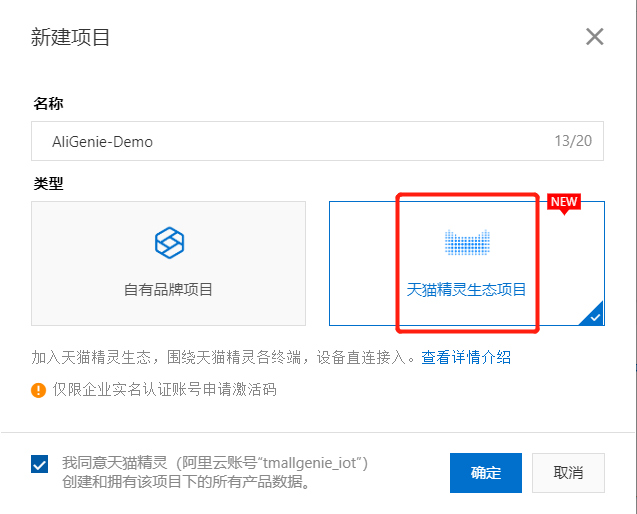

## 1.2 Create Product

In each project, you can create multiple products. After the product is created, you can abstract the actual product into a data model composed of attributes, services, and events by defining product functions to facilitate cloud management and data interaction.

1. On the main project page, click Create New Product.
2. Configure product parameters
3. Click Finish. After the product is successfully created, it will automatically enter the product function definition page.

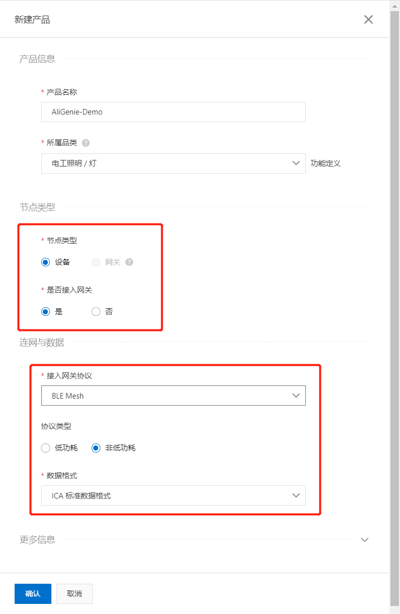

## 1.3 Definition Features

The platform provides default standard functions for each category. After the product is created, the function definition page automatically displays the default standard functions of the product.

You can add or modify features according to the following steps. On the product function definition page, click Add function corresponding to the standard function.

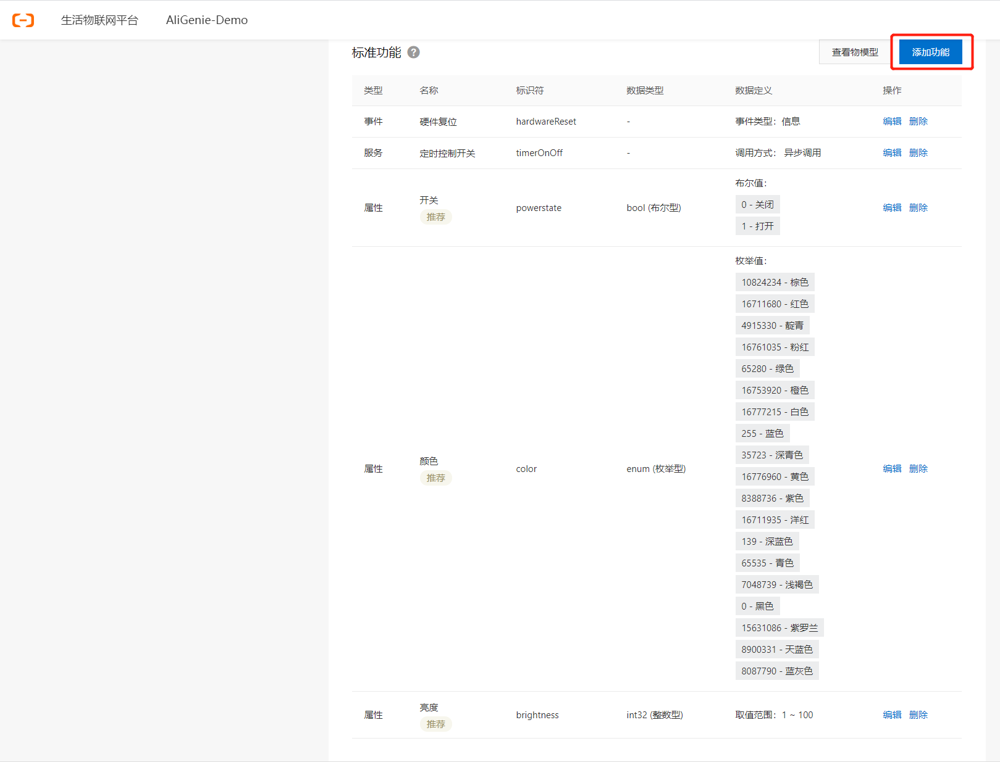

## 1.4 Configure App

The life IoT platform provides App services, which simplifies App development tasks. You can realize the data communication between the App and the platform through simple configuration, and achieve the effect of human-computer interaction.

1. Click Next: Human-Computer Interaction to enter the product-human-computer interaction page.
2. Turn on the switch to control the product using the public version App.
3. Click the selection panel. Select a device panel in the Theme Panel tab in the Select Product Panel dialog box or design a panel by yourself in the custom panel.
4. Install the public version App "Cloud Intelligence". Click Install now, select the development version, and then scan the code to download the development version of the public version of the App.
5. Configure the boot page for device network configuration.

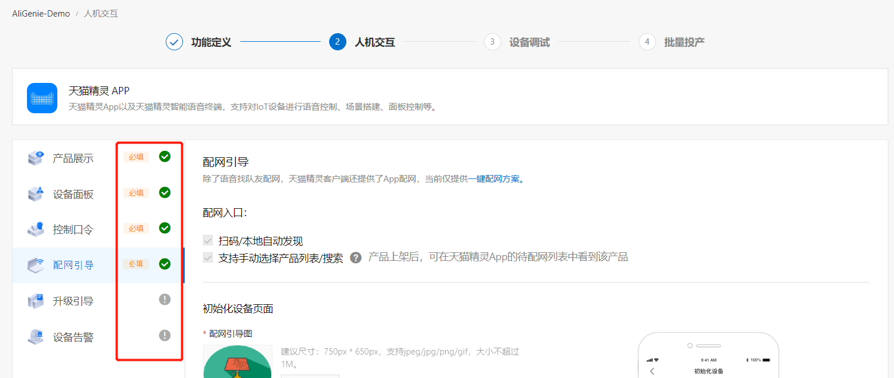

## 1.2 Add Debug Device

The device must use the unique device certificate (ProductID, DeviceName, DeviceSecret) issued by the platform to access the Ali IoT platform.

1. Click Next: Device debugging, enter the product-device debugging page.
2. Select the corresponding module in the selection of authentication module/chip, and it is recommended to use the module that has been certified by Ali.
3. Click Add Test Device in Test Device.
4. Configure the device name. DeviceName can also be left unconfigured, and the system automatically generates the device name.
5. Click OK, the interface displays the device certificate of the test device. The activation credentials (ProductID, DeviceName, DeviceSecret) that need to be burned into the device are shown in the red box in the figure below.

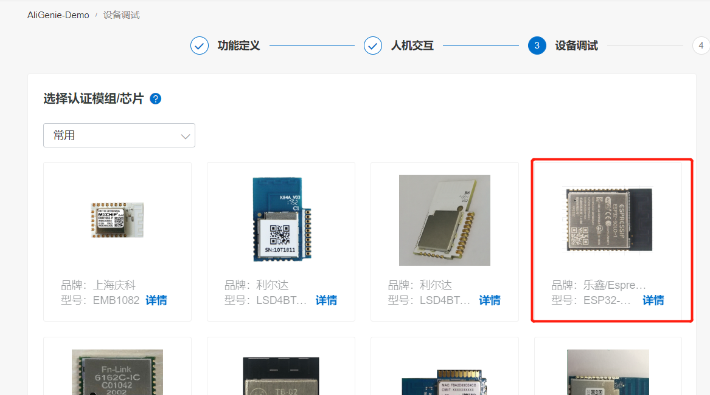

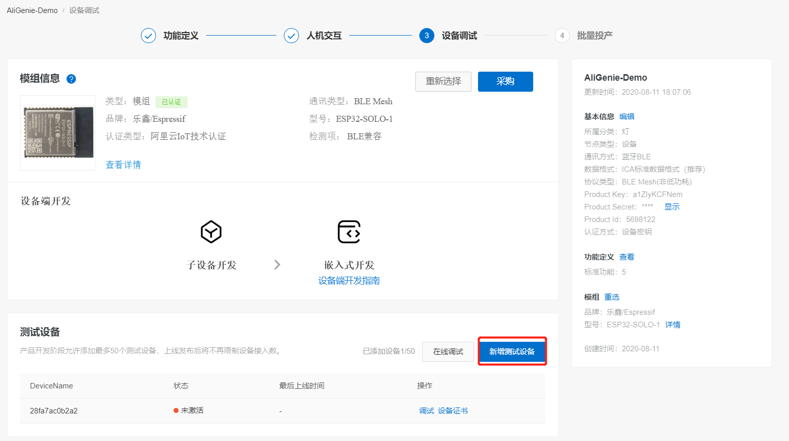

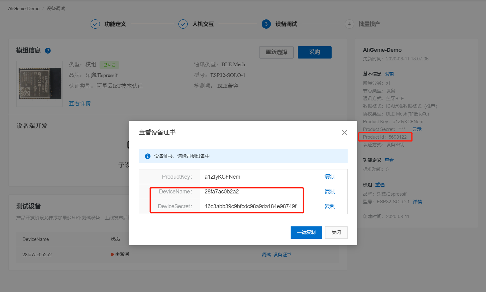

## 2. Configure triples

1. Enter the examples/bluetooth/esp_ble_mesh/aligenie_demo directory and run `idf.py menuconfig`
2. Configure device triples information, save and exit after modification.

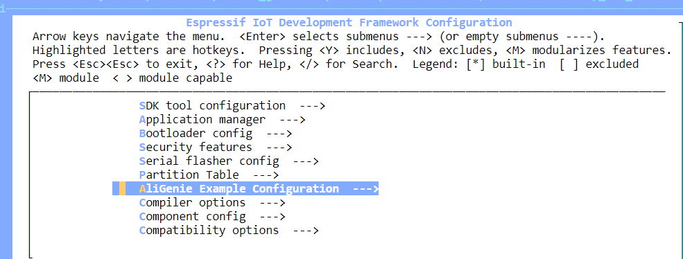

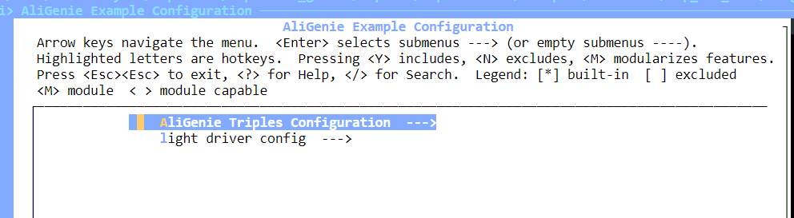

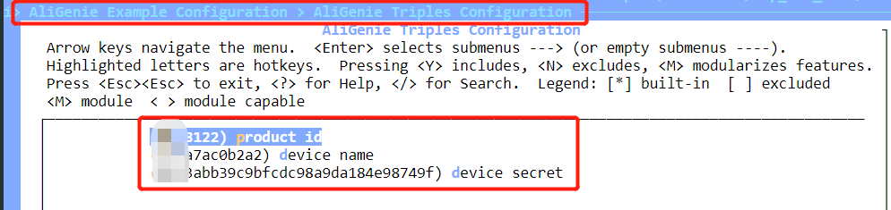

## 3. Config LED GPIO

1. To use color-adjustable RGB lights, three GPIOs, RED, GREEN, and BLUE, need to be configured.

## 4. Download and run this demo

1. After all configurations are completed, you can run `idf.py flash monitor` to download and monitor.
2. After the download is complete, you can see this log.

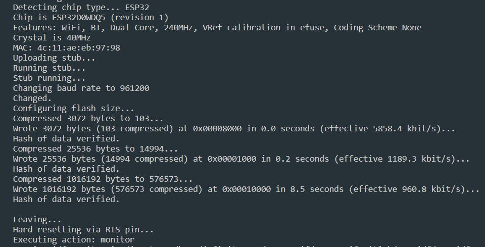

## 5. Provision

1. When the device is powered on for the first time, the GREEN light will blink, indicating that the device has not been provisioned yet.
2. We can say "天猫精灵，发现智能设备" to the AliGenie speaker.
3. When the speaker finds the device and prompts whether to connect, we say "连接" to the AliGenie speaker, and you can start provisioning the device.
4. Next we can use voice to control the lights, for example:"天猫精灵，开灯"、"天猫精灵，关灯"、"天猫精灵，把灯调整成蓝色"、"天猫精灵，把灯调整成绿色"…………

## 6. Reset

1. The device can be reset by repeatedly resetting the device three times.
2. Each reset operation needs to wait until the light is on before proceeding.
