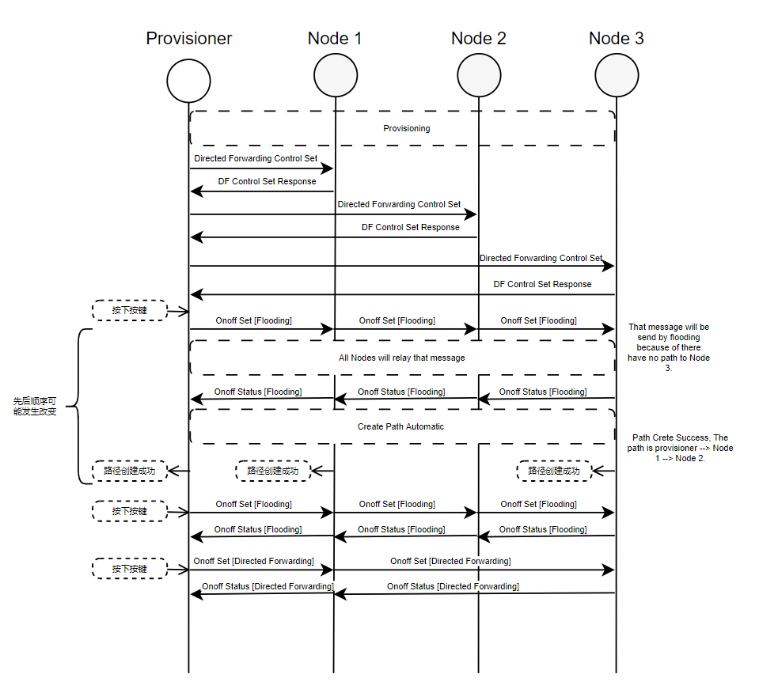

# 1. Introduction
## 1.1 Basic Knowledge
### 1.1.1 Data propagation in Bluetooth LE-Mesh v1.0
In Bluetooth LE-Mesh v1.0, messages in the network are propagated through bounded flooding, where bounded refers to the limited propagation range determined by the TTL (Time to Live) value, and flooding means that every receiving node participating in the message forwarding within the valid TTL range.

### 1.1.2 Data propagation in Bluetooth LE-Mesh v1.1
In Bluetooth LE-Mesh v1.1, messages in the network can be propagated through routing. This example demonstrates the Directed Forwarding method. Messages propagated using Directed Forwarding involve only those nodes on the path for forwarding, while other nodes do not participate in the forwarding.

### 1.1.3 Creating a path
Creating a path in the Espressif IDF Bluetooth LE-Mesh v1.1 protocol stack is straightforward. By marking the `send_tag` as `ESP_BLE_MESH_TAG_USE_DIRECTED` when sending a message, the protocol stack will actively check whether there is an existing path to reach the destination node. If not, the message will be sent using flooding first and then a path to the destination node will be requested. Once the path is successfully created, subsequent messages will be sent using routing.

### 1.1.4 Learning more about Directed Forwarding
For more information about Directed Forwarding, please refer to the detailed [documentation](https://docs.espressif.com/projects/esp-idf/en/latest/esp32/api-guides/esp-ble-mesh/ble-mesh-index.html) in the Espressif IDF document.

## 1.2 Example Description
### 1.2.1 Directory Structure and Explanation
```
directed_forwarding
├── df_client
│   ├── CMakeLists.txt
│   └── main
│       ├── board.c
│       ├── board.h
│       ├── CMakeLists.txt
│       ├── Kconfig.projbuild
│       └── main.c
├── df_server
│   ├── CMakeLists.txt
│   └── main
│       ├── board.c
│       ├── board.h
│       ├── CMakeLists.txt
│       ├── Kconfig.projbuild
│       └── main.c
├── tutorial
│   ├── images
│   └── BLE_Mesh_Directed_Forwarding_Example_Walkthrough.md
└── README.md
```
Under the directed_forwarding project, there are two main directories: df Client and df Server. In this example, the df Client assumes the roles of Provisioner, Path Origin, and Generic OnOff Client. The df Server assumes the roles of Generic OnOff Server and Path Target.

### 1.2.2 Prerequisites
- One device running the `df_client` project.
- One or more devices running the `df_server` project.

### 1.2.3 Running Phenomenon
The devices running the `df_client` project are referred to as the Provisioner node or Path Origin node in the following description.

The devices running the `df_server` project are referred to as Nodes.

When the Provisioner's LED is white, it indicates that it is provisioning a specific Node. When the provisioning process is complete, the LED of the provisioned Node will turn to white, and this process continues until all nodes join the network and the LEDs are white.

The last node to join the network serves as the Path Target. Once all nodes have joined the network, the button on the Provisioner should be pressed for the first time. The Provisioner will send VendorModel messages to the Path Target node in order to add the bd_address of the second-to-last and third-to-last nodes to the Path Target's receive whitelist. This allows the Path Target to only receive messages from these two nodes, thus avoiding receiving messages from the Path Origin (Provisioner) within the one hop range.

Once the configuration is complete, the button on the Provisioner should be pressed again for the second time. This will trigger the sending of a Generic Onoff Set message, which is expected to be sent using routing. However, since there is no existing path, it will also trigger a path establishment. After the path is successfully established, the LED on the nodes along the path will change from white to blue. However, the light on the Path Target will be green because there is no established path at the time of message sending. Therefore, the sending method will be changed from routing to flooding by the Mesh stack. Upon pressing the button for the third time, a Generic Onoff Set message will be sent using flooding, and the light on the Path Target will be green. On the fourth button press, a Generic Onoff Set message will be sent using routing, and the light on the Path Target will be blue.

### 1.2.4 Message Sequence


### 1.2.5 Code Explanation
#### 1.2.5.1 Onoff Client
First, declare and register `Directed Forwarding Client` and `Directed Forwarding Server` as shown below:
```c
#if CONFIG_BLE_MESH_DF_CLI
static esp_ble_mesh_client_t directed_forwarding_client;
#endif

#if CONFIG_BLE_MESH_DF_SRV
static esp_ble_mesh_df_srv_t directed_forwarding_server = {
    .directed_net_transmit = ESP_BLE_MESH_TRANSMIT(1, 100),
    .directed_relay_retransmit = ESP_BLE_MESH_TRANSMIT(2, 100),
    .default_rssi_threshold = (-80),
    .rssi_margin = 20,
    .directed_node_paths = 20,
    .directed_relay_paths = 20,
#if defined(CONFIG_BLE_MESH_GATT_PROXY_SERVER)
    .directed_proxy_paths = 20,
#else
    .directed_proxy_paths = 0,
#endif
#if defined(CONFIG_BLE_MESH_FRIEND)
    .directed_friend_paths = 20,
#else
    .directed_friend_paths = 0,
#endif
    .path_monitor_interval = 120,
    .path_disc_retry_interval = 300,
    .path_disc_interval = ESP_BLE_MESH_PATH_DISC_INTERVAL_30_SEC,
    .lane_disc_guard_interval = ESP_BLE_MESH_LANE_DISC_GUARD_INTERVAL_10_SEC,
    .directed_ctl_net_transmit = ESP_BLE_MESH_TRANSMIT(1, 100),
    .directed_ctl_relay_retransmit = ESP_BLE_MESH_TRANSMIT(2, 100),
};
#endif

static esp_ble_mesh_model_t root_models[] = {
    ESP_BLE_MESH_MODEL_CFG_SRV(&config_server),
    ESP_BLE_MESH_MODEL_CFG_CLI(&config_client),
#if CONFIG_BLE_MESH_DF_CLI
    ESP_BLE_MESH_MODEL_DF_CLI(&directed_forwarding_client),
#endif
#if CONFIG_BLE_MESH_DF_SRV
    ESP_BLE_MESH_MODEL_DF_SRV(&directed_forwarding_server),
#endif
    ESP_BLE_MESH_MODEL_GEN_ONOFF_CLI(NULL, &onoff_client),
};

```
The Directed Forwarding Client is used for configuring parameters of the Directed Forwarding Server. Every routing node must have a Directed Forwarding Server, but it is not necessary to have a Directed Forwarding Client.

The parameters in the Directed Forwarding Server are as follows:
- The `directed_net_transmit` parameter controls the broadcasting parameters for sending non-control messages using Directed Forwarding technology. In this example, `ESP_BLE_MESH_TRANSMIT(1, 100)` indicates 1 retransmission and an interval of 100 milliseconds for broadcasting. This value is the default and generally should not be changed.
- The `directed_relay_retransmit` parameter controls the broadcasting parameters for forwarding non-control messages using Directed Forwarding technology. In this example, `ESP_BLE_MESH_TRANSMIT(2, 100)` indicates 2 retransmissions and an interval of 100 milliseconds for broadcasting. This value is the default and generally should not be changed.
- The `default_rssi_threshold` and `rssi_margin` are used to control the received RSSI strength of path requests during path establishment. The RSSI strength of the path requests that nodes can accept should be greater than the sum of `default_rssi_threshold` and `rssi_margin`.
- The `directed_node_paths` specifies the minimum number of paths when the node is either the starting or destination node in the path. Its value should be no less than 20.
- The `directed_relay_paths` specifies the minimum number of paths when the node is an intermediate node in the path. Its value should be no less than 20.
- The `directed_proxy_paths` specifies the minimum number of paths when the node acts as a proxy server to assist proxy clients. When proxy servers are not supported, the value should be 0; otherwise, it should be no less than 20.
- The `directed_friend_paths` specifies the minimum number of paths when the node acts as a friend node to assist low-power nodes. When friend nodes are not supported, the value should be 0; otherwise, it should be no less than 20.
- The `path_monitor_interval` specifies the timeout for path monitoring in seconds.
- The `path_disc_retry_interval` specifies the timeout for retrying path discovery when it fails in seconds.
- The `path_disc_interval` specifies the timeout for paths.
- The `lane_disc_guard_interval` specifies the minimum time interval between two path requests.
- The `directed_ctl_net_transmit` parameter controls the broadcasting parameters for sending control messages using Directed Forwarding technology. In this example, `ESP_BLE_MESH_TRANSMIT(1, 100)` indicates 1 retransmission and an interval of 100 milliseconds for broadcasting. This value is the default and generally should not be changed.
- The `directed_ctl_relay_retransmit` parameter controls the broadcasting parameters for forwarding control messages using Directed Forwarding technology. In this example, `ESP_BLE_MESH_TRANSMIT(2, 100)` indicates 2 retransmissions and an interval of 100 milliseconds for broadcasting. This value is the default and generally should not be changed.

After registering the Directed Forwarding Client and Directed Forwarding Server, their callback functions also need to be registered. Here is an example code:
```c
static esp_err_t ble_mesh_init(void)
{
    // ...
    esp_ble_mesh_register_df_client_callback(example_ble_mesh_directed_forwarding_client_cb);
    esp_ble_mesh_register_df_server_callback(example_ble_mesh_directed_forwarding_server_cb);
    // ...
}
```
The implementation of the callback function `example_ble_mesh_directed_forwarding_client_cb` is as follows:
```c
static void example_ble_mesh_directed_forwarding_client_cb(esp_ble_mesh_df_client_cb_event_t event,
                                                           esp_ble_mesh_df_client_cb_param_t *param)
{
    switch (event) {
        case ESP_BLE_MESH_DF_CLIENT_RECV_SET_RSP_EVT:
            ESP_LOGW(TAG, "Directed Forwarding Set, opcode 0x%04x, from 0x%04x", param->params->opcode, param->params->ctx.addr);
            switch (param->params->opcode) {
            case ESP_BLE_MESH_MODEL_OP_DIRECTED_CONTROL_SET:
                if (param->recv.directed_control_status.status == STATUS_SUCCESS) {
                    ESP_LOGI(TAG, "Enable Directed Forwarding state success");
                } else {
                    ESP_LOGW(TAG, "Enable Directed Forwarding state fail");
                }
                break;
            }
            break;
        case ESP_BLE_MESH_DF_CLIENT_SEND_TIMEOUT_EVT:
            ESP_LOGW(TAG, "Directed Forwarding Timeout, opcode 0x%04x, to 0x%04x", param->params->opcode, param->params->ctx.addr);
            esp_ble_mesh_node_info_t node = {.unicast = param->params->ctx.addr};
            example_ble_mesh_send_directed_forwarding_srv_control_set(&node);
            break;
        default:
            break;
    }
}
```
The event `ESP_BLE_MESH_DF_CLIENT_RECV_SET_RSP_EVT` triggers the opcode `ESP_BLE_MESH_MODEL_OP_DIRECTED_CONTROL_SET` within the callback function. This event occurs when the Directed Forwarding Client sends a Directed Forwarding Control Set message to the Directed Forwarding Server and receives a response. The Directed Forwarding functionality is disabled by default on routing nodes, so the Directed Forwarding Client needs to enable this functionality on each routing node, sequentially.

The implementation of the callback function `example_ble_mesh_directed_forwarding_server_cb` is as follows:
```c
static void example_ble_mesh_directed_forwarding_server_cb(esp_ble_mesh_df_server_cb_event_t event,
                                                           esp_ble_mesh_df_server_cb_param_t *param)
{
    esp_ble_mesh_df_server_table_change_t change = {0};
    esp_ble_mesh_uar_t path_origin;
    esp_ble_mesh_uar_t path_target;

    if (event == ESP_BLE_MESH_DF_SERVER_TABLE_CHANGE_EVT) {
        memcpy(&change, &param->value.table_change, sizeof(esp_ble_mesh_df_server_table_change_t));

        switch (change.action) {
            case ESP_BLE_MESH_DF_TABLE_ADD: {
                memcpy(&path_origin, &change.df_table_info.df_table_entry_add_remove.path_origin, sizeof(path_origin));
                memcpy(&path_target, &change.df_table_info.df_table_entry_add_remove.path_target, sizeof(path_target));
                ESP_LOGI(TAG, "Established a path from 0x%04x to 0x%04x", path_origin.range_start, path_target.range_start);
            }
                break;
            case ESP_BLE_MESH_DF_TABLE_REMOVE: {
                memcpy(&path_origin, &change.df_table_info.df_table_entry_add_remove.path_origin, sizeof(path_origin));
                memcpy(&path_target, &change.df_table_info.df_table_entry_add_remove.path_target, sizeof(path_target));
                ESP_LOGI(TAG, "Remove a path from 0x%04x to 0x%04x", path_origin.range_start, path_target.range_start);
            }
                break;
            default:
                ESP_LOGW(TAG, "Unknown action %d", change.action);
        }
    }

    return;
}
```
Currently, only the `ESP_BLE_MESH_DF_SERVER_TABLE_CHANGE_EVT` event is available, which contains two actions: `ESP_BLE_MESH_DF_TABLE_ADD` and `ESP_BLE_MESH_DF_TABLE_REMOVE`. When a table entry is added to the routing table (DIRECTED_FORWARDING_TABLE), the `ESP_BLE_MESH_DF_TABLE_ADD` action is triggered, indicating the establishment of a new path. When a table entry is removed from the routing table (DIRECTED_FORWARDING_TABLE), the `ESP_BLE_MESH_DF_TABLE_REMOVE` action is triggered, indicating the termination of a path.

The `example_ble_mesh_send_gen_onoff_set` function demonstrates how to use Directed Forwarding to send a message.
```c
void example_ble_mesh_send_gen_onoff_set(bool by_df)
{
    esp_ble_mesh_generic_client_set_state_t set = {0};
    esp_ble_mesh_client_common_param_t common = {0};
    esp_err_t err = ESP_OK;

    if (!last_node_idx) {
        ESP_LOGE(TAG, "No node provisioned");
        return;
    }

    curr_node_idx = last_node_idx - 1;

    esp_ble_mesh_node_info_t *node = &nodes[curr_node_idx];

    example_ble_mesh_set_msg_common(&common, node, onoff_client.model, ESP_BLE_MESH_MODEL_OP_GEN_ONOFF_SET);
    
    if (by_df) {
        common.ctx.send_tag |= ESP_BLE_MESH_TAG_USE_DIRECTED|ESP_BLE_MESH_TAG_IMMUTABLE_CRED;
    } else {
        common.ctx.send_tag |= ESP_BLE_MESH_TAG_IMMUTABLE_CRED;
    }

    ESP_LOGI(TAG, "Will send a message to node(0x%04x) with %s", node->unicast, by_df ? "DF" : "Flooding");

    set.onoff_set.op_en = false;
    set.onoff_set.onoff = node->onoff;
    set.onoff_set.tid = node->tid;
    node->tid++;

    err = esp_ble_mesh_generic_client_set_state(&common, &set);
    if (err) {
        ESP_LOGE(TAG, "Send Generic OnOff Set Unack failed");
        return;
    }

    node->onoff = !node->onoff;
    board_led_operation(0, 100, 0);
}

```
You can choose whether to use Directed Forwarding to send the Generic Onoff Set message before its transmission. Here is the code snippet:
```c
    if (by_df) {
        common.ctx.send_tag |= ESP_BLE_MESH_TAG_USE_DIRECTED|ESP_BLE_MESH_TAG_IMMUTABLE_CRED;
    } else {
        common.ctx.send_tag |= ESP_BLE_MESH_TAG_IMMUTABLE_CRED;
    }
```
Only setting `ESP_BLE_MESH_TAG_USE_DIRECTED` in `send_tag` is necessary. Additionally, it is not recommended to set `ESP_BLE_MESH_TAG_IMMUTABLE_CRED` in practical applications, as doing so will prevent the protocol stack from actively selecting the optimal way to transmit the message. In this example, setting this bit is solely for demonstrating the difference between flooding propagation mode and routing propagation mode.

With this, the message can be broadcasted using routing.

This message can be broadcasted via the routing method.
#### 1.2.5.2 Onoff Server
At Onoff Server, it is important to know how to determine if a message is sent by Directed Forwarding. The code in the example is as follows:
```c
static void example_change_led_state(esp_ble_mesh_model_t *model,
                                     esp_ble_mesh_msg_ctx_t *ctx, uint8_t onoff)
{
    uint16_t primary_addr = esp_ble_mesh_get_primary_element_address();
    uint8_t elem_count = esp_ble_mesh_get_element_count();
    uint8_t i;

    if (ESP_BLE_MESH_ADDR_IS_UNICAST(ctx->recv_dst)) {
        for (i = 0; i < elem_count; i++) {
            if (ctx->recv_dst == (primary_addr + i)) {
                if (ctx->recv_op == ESP_BLE_MESH_MODEL_OP_GEN_ONOFF_SET) {
                    if (ctx->recv_cred == ESP_BLE_MESH_DIRECTED_CRED) {
                        // Receive a message send by directed forwarding.
                        board_led_operation_auto_close(0,0,100,2000);
                    } else {
                        // Receive a message send by flooding.
                        board_led_operation_auto_close(100,0,0,2000);
                    }
                }
            }
        }
    } else if (ESP_BLE_MESH_ADDR_IS_GROUP(ctx->recv_dst)) {
        if (esp_ble_mesh_is_model_subscribed_to_group(model, ctx->recv_dst)) {
            if (ctx->recv_op == ESP_BLE_MESH_MODEL_OP_GEN_ONOFF_SET) {
                if (ctx->recv_cred == ESP_BLE_MESH_DIRECTED_CRED) {
                    /* Receive a message send by directed forwarding. */
                    board_led_operation_auto_close(0,0,100,2000);
                } else {
                    /* Receive a message send by flooding. */
                    board_led_operation_auto_close(100,0,0,2000);
                }
            }
        }
    } else if (ctx->recv_dst == 0xFFFF) {
        if (ctx->recv_op == ESP_BLE_MESH_MODEL_OP_GEN_ONOFF_SET) {
            if (ctx->recv_cred == ESP_BLE_MESH_DIRECTED_CRED) {
                /* Receive a message send by directed forwarding. */
                board_led_operation_auto_close(0,0,100,2000);
            } else {
                /* Receive a message send by flooding. */
                board_led_operation_auto_close(100,0,0,2000);
            }
        }
    }
}
```
The propagation source of the message can be determined during use by `ctx->recv_cred`.
```c
        if (ctx->recv_op == ESP_BLE_MESH_MODEL_OP_GEN_ONOFF_SET) {
            if (ctx->recv_cred == ESP_BLE_MESH_DIRECTED_CRED) {
                /* Receive a message send by directed forwarding. */
                board_led_operation_auto_close(0,0,100,2000);
            } else {
                /* Receive a message send by flooding. */
                board_led_operation_auto_close(100,0,0,2000);
            }
        }
```

Similarly, upon receiving `ESP_BLE_MESH_MODEL_OP_GEN_ONOFF_SET` and replying with `ESP_BLE_MESH_MODEL_OP_GEN_ONOFF_STATUS`, there is no restriction on the sending format, so once the path is established, messages are sent using Directed Forwarding.
