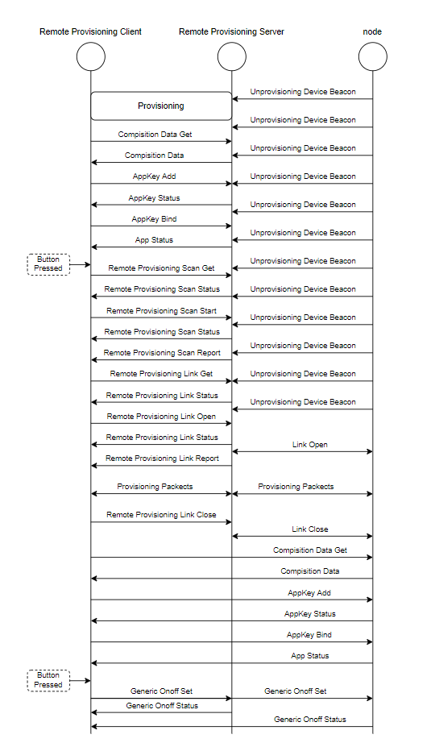

# 1. Introduction
This example demonstrates how to use the Remote Provisioning feature in the Espressif IDF's Bluetooth LE Mesh v1.1 protocol stack.

The Remote Provisioning feature allows for the inclusion of nodes that are not within the coverage range of the Provisioner. In Remote Provisioning, there are two roles: the Remote Provisioning Client and the Remote Provisioning Server. The Remote Provisioning Client is typically played by the Provisioner, while the Remote Provisioning Server can be played by any node within the network. As an intermediate node, the Remote Provisioning Server primarily performs three functions: 
1. Reports information of unprovisioned devices to the Remote Provisioning Client.
2. Reports its own provisioning status to the Remote Provisioning Client.
3. Distributes provisioning data from the Remote Provisioning Client to unprovisioned devices. 

By coordinating with each other, the Remote Provisioning Client and Remote Provisioning Server work together to include unprovisioned devices into the network.
## 1.1 Example Description
### 1.1.1 Directory Structure and Explanation
```
.
├── unprov_dev
│   ├── CMakeLists.txt
│   └── main
│       ├── board.c
│       ├── board.h
│       ├── CMakeLists.txt
│       ├── Kconfig.projbuild
│       └── main.c
├── rpr_client
│   ├── CMakeLists.txt
│   └── main
│       ├── board.c
│       ├── board.h
│       ├── CMakeLists.txt
│       ├── Kconfig.projbuild
│       └── main.c
├── rpr_server
│   ├── CMakeLists.txt
│   └── main
│       ├── board.c
│       ├── board.h
│       ├── CMakeLists.txt
│       ├── Kconfig.projbuild
│       └── main.c
├── tutorial
│    ├── images
│    └── BLE_Mesh_Remote_Provisioning_Example_Walkthrough.md
└── README.md
```
In this example, there are three roles: unprovisioned device, remote provisioning client, and remote provisioning server.

1. The node is used to simulate an unprovisioned device that is outside the signal coverage of the provisioner. In practice, it is not necessary to place it outside the signal coverage of the provisioner, as we can restrict the provisioner from provisioning it through software limitations. This is done to simulate the node being outside the provisioner's signal coverage.
2. The remote_provisioning_client refers to the Remote Provisioning Client mentioned earlier.
3. The remote_provisioning_server refers to the Remote Provisioning Server mentioned earlier.

Based on this, you will need at least three devices to run this example:

1 x Device running `unprov_dev`.

1 x Device running `rpr_client`.

1 x Device running `rpr_server`.

### 1.1.2 Running Phenomenon
First, power on the devices running `rpr_client` and node. The LED on the node will be red, indicating that the node is in an unprovisioned state.

The node will maintain a solid red LED, indicating that remote_provisioning_client is unable to provision the node device.

Next, power on the remote_provisioning_server node. The LED on the remote_provisioning_server will change from red to green. The remote_provisioning_client will also have a green LED, indicating that it is preparing to provision the remote_provisioning_server and perform post-provisioning tasks (such as adding AppKey and binding AppKey).

Once all the tasks are completed, the LEDs on both remote_provisioning_server and remote_provisioning_client will turn off. Pressing the button on the remote_provisioning_client will command the remote_provisioning_server to start searching for unprovisioned devices.

When the remote_provisioning_server finds a device, its LED will turn blue, and the LEDs on both the remote_provisioning_client and the node will turn green. This indicates that the node is going through the provisioning process via the remote_provisioning_server.

Once all LEDs on the remote_provisioning_client, remote_provisioning_server, and node are turned off, it means that all the preliminary work is completed.

At this point, pressing the button on the remote_provisioning_client allows you to control the LED on/off state of both the remote_provisioning_server and the node.

### 1.1.3 Message Sequence

### 1.1.4 Code Explanation
#### Remote Provisioning Client
----
Declaration and registration of a remote provisioning client.
```c
#if CONFIG_BLE_MESH_RPR_CLI
static esp_ble_mesh_client_t remote_prov_client;
#endif
// ...
static esp_ble_mesh_model_t root_models[] = {
    ESP_BLE_MESH_MODEL_CFG_SRV(&config_server),
    ESP_BLE_MESH_MODEL_CFG_CLI(&config_client),
#if CONFIG_BLE_MESH_RPR_CLI
    ESP_BLE_MESH_MODEL_RPR_CLI(&remote_prov_client),
#endif
    ESP_BLE_MESH_MODEL_GEN_ONOFF_CLI(NULL, &onoff_client),
};
```
In the `ble_mesh_init` function, register callback functions for relevant events and set the prefix for the commissionable device. The prefix for node devices is 0x55,0x55, while the prefix set for the remote provisioning client is 0x55,0xaa. Therefore, the remote provisioning client does not directly commission node devices.

```c
static esp_err_t ble_mesh_init(void)
{
    // ...
    uint8_t match[2] = {0x55, 0xaa};

    esp_ble_mesh_register_prov_callback(example_ble_mesh_provisioning_cb);
    esp_ble_mesh_register_config_client_callback(example_ble_mesh_config_client_cb);
    esp_ble_mesh_register_generic_client_callback(example_ble_mesh_generic_client_cb);
    /* Register the callback function of remote provisioning client */
    esp_ble_mesh_register_rpr_client_callback(example_ble_mesh_remote_prov_client_callback);

    /* Set the accepted unprovisioned device uuid prefix */
    err = esp_ble_mesh_provisioner_set_dev_uuid_match(match, sizeof(match), 0x0, false);
    if (err != ESP_OK) {
        ESP_LOGE(TAG, "Failed to set matching device uuid (err %d)", err);
        return err;
    }

    // ...
}
```
In the `example_ble_mesh_config_client_cb` function, under the event `ESP_BLE_MESH_CFG_CLIENT_SET_STATE_EVT` and opcode `ESP_BLE_MESH_MODEL_OP_MODEL_APP_BIND`, use the function `example_ble_mesh_query_element_have_model` to check if the currently ended AppKeyBind node supports the remote provisioning server. If it does, record the node address and trigger the sending of a Remote Provisioning Server Scan Get command when a button is pressed to start remote provisioning.
```c
static void example_ble_mesh_config_client_cb(esp_ble_mesh_cfg_client_cb_event_t event,
                                              esp_ble_mesh_cfg_client_cb_param_t *param)
{
    // ...

    switch (event) {
        // ...
    case ESP_BLE_MESH_CFG_CLIENT_SET_STATE_EVT:
        switch (opcode) {
        // ...
        case ESP_BLE_MESH_MODEL_OP_MODEL_APP_BIND: {

            if (!example_ble_mesh_query_element_have_model(addr, ESP_BLE_MESH_MODEL_ID_RPR_SRV, CID_NVAL)) {
                if (remote_rpr_srv_addr) {
                    ESP_LOGI(TAG, "The last node have been provisioned, You could click button to send Generic Onoff Set");
                    click_to_send_onoff_set = 1;
                } else {
                    ESP_LOGE(TAG, "Element (addr: 0x%04x) does not support remote provisioning srv model");
                }
                return;
            } else {
                click_to_send_onoff_set = 0;
                ESP_LOGI(TAG, "The Remote Provisioning Server have been provisioned, You could click button to start remote provisioning");
                remote_rpr_srv_addr = addr;
            }
            board_led_operation(LED_G, LED_OFF);
            break;
        }
        default:
            break;
        }
        break;
        // ...
    default:
        ESP_LOGE(TAG, "Not a config client status message event");
        break;
    }
}
```
The button callback function in board.c is as follows:
```c
static void button_tap_cb(void* arg)
{
    static uint8_t onoff = 1;
    ESP_LOGI(TAG, "tap cb (%s)", (char *)arg);
    if (click_to_send_onoff_set) {
        example_ble_mesh_send_gen_onoff_set(onoff);
        onoff = !onoff;
    } else {
        example_ble_mesh_send_remote_provisioning_scan_start();
    }
}
```
By using `click_to_send_onoff_set`, it can be determined whether the current button press should trigger `Generic Onoff Set` or `Remote Provisioning Scan Start`.
The implementation of the function `example_ble_mesh_send_remote_provisioning_scan_start` is as follows:
```c
void example_ble_mesh_send_remote_provisioning_scan_start(void)
{

    esp_ble_mesh_client_common_param_t common = {0};
    esp_err_t err = ESP_OK;

    if (!remote_rpr_srv_addr) {
        ESP_LOGE(TAG, "No valid remote provisioning server address");
        return;
    }

    /* Send a ESP_BLE_MESH_MODEL_OP_RPR_SCAN_GET to get the scan status of remote provisioning server */
    example_ble_mesh_set_msg_common(&common, remote_rpr_srv_addr, remote_prov_client.model, ESP_BLE_MESH_MODEL_OP_RPR_SCAN_GET);
    err = esp_ble_mesh_rpr_client_send(&common, NULL);
    if (err != ESP_OK) {
        ESP_LOGE(TAG, "Failed to send Remote Provisioning Client msg: Scan Get");
    }
    cur_rpr_cli_opcode = ESP_BLE_MESH_MODEL_OP_RPR_SCAN_GET;
}
```
Opcode `ESP_BLE_MESH_MODEL_OP_RPR_SCAN_GET` is used to obtain the scan status of the remote provisioning server. It can assist the remote provisioning client in scanning for unprovisioned devices only when the status is Idle. The remote provisioning server will immediately respond with `ESP_BLE_MESH_MODEL_OP_RPR_SCAN_STATUS` upon receiving `ESP_BLE_MESH_MODEL_OP_RPR_SCAN_GET`.

The `ESP_BLE_MESH_MODEL_OP_RPR_SCAN_STATUS` has the following four fields:
1. `scan_status`: This field indicates the status of the remote provisioning server's handling of the scan command from the remote provisioning client. If the value is `ESP_BLE_MESH_RPR_STATUS_SUCCESS`, it means that the remote provisioning server successfully processed the `ESP_BLE_MESH_MODEL_OP_RPR_SCAN_GET` command in this example.

2. `rpr_scanning`: This field indicates the current status of the remote provisioning server.
    - `ESP_BLE_MESH_RPR_SCAN_IDLE`: Indicates that the remote provisioning server is in an idle state and can be started.
    - `ESP_BLE_MESH_RPR_SCAN_MULTIPLE_DEVICE`: Indicates that the remote provisioning server is currently scanning in multiple device mode. When the remote provisioning server is in this mode, it is executing a scanning task and will report any unprovisioned devices until the scan count limit is reached.
    - `ESP_BLE_MESH_RPR_SCAN_SINGLE_DEVICE`: Indicates that the remote provisioning server is scanning for a specific device. It will only report when it scans an unprovisioned beacon that meets the requirements of the remote provisioning client.

3. `scan_items_limit`: This field represents the maximum number of unprovisioned device information reported by the remote provisioning server. The value is set by the remote provisioning client and defaults to the maximum value `CONFIG_BLE_MESH_RPR_SRV_MAX_SCANNED_ITEMS`, which is 10 if not set by the client.

4. `timeout`: This value represents the timeout for the remote provisioning server to perform the scan operation in seconds.

In this example, the parsing and manipulation of the above data are shown as follows:
```c
static void example_ble_mesh_remote_prov_client_callback(esp_ble_mesh_rpr_client_cb_event_t event,
                                        esp_ble_mesh_rpr_client_cb_param_t *param)
{
    static uint8_t remote_dev_uuid[16] = {0};
    esp_ble_mesh_rpr_client_msg_t msg = {0};
    esp_ble_mesh_client_common_param_t common = {0};
    esp_err_t err = ESP_OK;
    uint16_t addr = 0;

    switch (event) {
        // ...
    case ESP_BLE_MESH_RPR_CLIENT_RECV_PUB_EVT:
    case ESP_BLE_MESH_RPR_CLIENT_RECV_RSP_EVT:
        ESP_LOGW(TAG, "Remote Prov Client Recv RSP, opcode 0x%04x, from 0x%04x",
                 param->recv.params->ctx.recv_op, param->recv.params->ctx.addr);
        switch (param->recv.params->ctx.recv_op) {
        case ESP_BLE_MESH_MODEL_OP_RPR_SCAN_CAPS_STATUS:
            break;
        case ESP_BLE_MESH_MODEL_OP_RPR_SCAN_STATUS:
            addr = param->recv.params->ctx.addr;
            ESP_LOGI(TAG, "scan_status, status 0x%02x", param->recv.val.scan_status.status);
            ESP_LOGI(TAG, "scan_status, rpr_scanning 0x%02x", param->recv.val.scan_status.rpr_scanning);
            ESP_LOGI(TAG, "scan_status, scan_items_limit 0x%02x", param->recv.val.scan_status.scan_items_limit);
            ESP_LOGI(TAG, "scan_status, timeout 0x%02x", param->recv.val.scan_status.timeout);
            switch (cur_rpr_cli_opcode) {
            case ESP_BLE_MESH_MODEL_OP_RPR_SCAN_GET: {
                if (param->recv.val.scan_status.status == ESP_BLE_MESH_RPR_STATUS_SUCCESS) {
                    switch (param->recv.val.scan_status.rpr_scanning) {
                        /**
                         *  If the remote provisioning server's scan state is idle,
                         *  that state indicates that remote provisioning server could
                         *  start scan process.
                         */
                        case ESP_BLE_MESH_RPR_SCAN_IDLE: {
                            err = example_ble_mesh_set_msg_common(&common, addr, remote_prov_client.model,
                                                                    ESP_BLE_MESH_MODEL_OP_RPR_SCAN_START);
                            if (err != ESP_OK) {
                                ESP_LOGE(TAG, "Set message common fail:%d", __LINE__);
                                return ;
                            }

                            msg.scan_start.scan_items_limit = 0; /* 0 indicates there is no limit for scan items' count */
                            msg.scan_start.timeout = 0x0A;       /* 0x0A is the default timeout */
                            msg.scan_start.uuid_en = 0;          /* If uuid enabled, a specify device which have the same uuid will be report */
                                                                 /* If uuid disable, any unprovision device all will be report */

                            err = esp_ble_mesh_rpr_client_send(&common, &msg);
                            if (err != ESP_OK) {
                                ESP_LOGE(TAG, "Failed to send Remote Provisioning Client msg: Scan start");
                            }
                            cur_rpr_cli_opcode = ESP_BLE_MESH_MODEL_OP_RPR_SCAN_START;
                            break;
                        }
                        default:
                            ESP_LOGW(TAG, "Remote Provisioning Server(addr: 0x%04x) Busy", addr);
                            break;
                    }
                } else {
                    ESP_LOGE(TAG, "Remote Provisioning Client Scan Get Fail");
                }
            }
                break;
            case ESP_BLE_MESH_MODEL_OP_RPR_SCAN_START: {
                if (param->recv.val.scan_status.status == ESP_BLE_MESH_RPR_STATUS_SUCCESS) {
                    ESP_LOGI(TAG, "Start Remote Provisioning Server(addr: 0x%04x) Scan Success", addr);
                } else {
                    ESP_LOGE(TAG, "Remote Provisioning Client Scan Start Fail");
                }
                break;
            }
            default:
                ESP_LOGW(TAG, "Unknown Process opcode 0x%04x:%d", cur_rpr_cli_opcode,__LINE__);
                break;
            }
            break;
        }
        // ...
    default:
        break;
    }
}
```
Due to `ESP_BLE_MESH_MODEL_OP_RPR_SCAN_STATUS` being a response to multiple Remote Provisioning Client Opcodes, the Remote Provisioning Client needs to keep track of the current Opcode being sent in order to differentiate the Opcode corresponding to the Status. In this example, the variable `cur_rpr_cli_opcode` is used for this purpose.

When receiving a response `ESP_BLE_MESH_MODEL_OP_RPR_SCAN_STATUS` for `ESP_BLE_MESH_MODEL_OP_RPR_SCAN_GET`, if the current Scan status of the Remote Provisioning Server is Idle, then send `ESP_BLE_MESH_MODEL_OP_RPR_SCAN_START` to the Remote Provisioning Server to initiate scanning.
`ESP_BLE_MESH_MODEL_OP_RPR_SCAN_START` requires three parameters:
1. `scan_items_limit`: The number of Unprovisioned Devices that can be scanned. This value cannot exceed the maximum scan limit of the Remote Provisioning Server. When set to 0, the Remote Provisioning Client does not limit this value, and the Remote Provisioning Server will set it to its own maximum scan limit.
2. `timeout`: The maximum scan time for the Remote Provisioning Server in seconds. This value cannot be set to 0.
3. `uuid_en`: Specifies whether the unprovisioned device's UUID is specified. 0 means no, 1 means yes. If specified, the UUID information of the unprovisioned device needs to be filled. An example is shown below. In this example, the UUID is not specified.
```c
msg.scan_start.uuid_en = 1;
memcpy(msg.scan_start.uuid, unprovisioned_device_uuid, 16);
```
When `ESP_BLE_MESH_MODEL_OP_RPR_SCAN_START` is sent, the Remote Provisioning Server will immediately respond with `ESP_BLE_MESH_MODEL_OP_RPR_SCAN_STATUS`. If `scan_status.status` is `ESP_BLE_MESH_RPR_STATUS_SUCCESS`, it indicates that the Remote Provisioning Server's Scan has been successfully started. When it scans an unprovisioned device, it will respond with `ESP_BLE_MESH_MODEL_OP_RPR_SCAN_REPORT`. The handling of `ESP_BLE_MESH_MODEL_OP_RPR_SCAN_REPORT` in this example is as follows:
```c
static void example_ble_mesh_remote_prov_client_callback(esp_ble_mesh_rpr_client_cb_event_t event,
                                        esp_ble_mesh_rpr_client_cb_param_t *param)
{
    // ...
        case ESP_BLE_MESH_MODEL_OP_RPR_SCAN_REPORT:
            addr = param->recv.params->ctx.addr;
            ESP_LOGI(TAG, "scan_report, rssi %ddBm", param->recv.val.scan_report.rssi);
            ESP_LOG_BUFFER_HEX(TAG": scan_report, uuid", param->recv.val.scan_report.uuid, 16);
            ESP_LOGI(TAG, "scan_report, oob_info 0x%04x", param->recv.val.scan_report.oob_info);
            ESP_LOGI(TAG, "scan_report, uri_hash 0x%08x", param->recv.val.scan_report.uri_hash);

            if (param->recv.val.scan_report.uuid[0] != remote_dev_uuid_match[0] ||
                param->recv.val.scan_report.uuid[1] != remote_dev_uuid_match[1]) {
                ESP_LOGI(TAG, "This device is not expect device");
                return;
            }

            memcpy(remote_dev_uuid, param->recv.val.scan_report.uuid, 16);

            /* Send ESP_BLE_MESH_MODEL_OP_RPR_LINK_GET to remote provisioning server get link status */
            err = example_ble_mesh_set_msg_common(&common, addr,remote_prov_client.model
                                        , ESP_BLE_MESH_MODEL_OP_RPR_LINK_GET);
            if (err != ESP_OK) {
                ESP_LOGE(TAG, "Set message common fail:%d", __LINE__);
                return;
            }

            err = esp_ble_mesh_rpr_client_send(&common, NULL);
            if (err != ESP_OK) {
                ESP_LOGE(TAG, "Failed to send Remote Provisioning Client msg:Link Get");
            }

            cur_rpr_cli_opcode = ESP_BLE_MESH_MODEL_OP_RPR_LINK_GET;
            break;
    // ...
}
```
If the scanned device is the expected device, use `ESP_BLE_MESH_MODEL_OP_RPR_LINK_GET` to obtain the status of the Provisioning Link of the Remote Provisioning Server. The Provisioning Link can only be opened for network provisioning when its status is `ESP_BLE_MESH_RPR_LINK_IDLE`. Upon receiving `ESP_BLE_MESH_MODEL_OP_RPR_LINK_GET`, the Remote Provisioning Server will respond with `ESP_BLE_MESH_MODEL_OP_RPR_LINK_STATUS`.

The Status includes two main fields:
1. `status`: This field indicates whether the Remote Provisioning Server has successfully processed the command from the Remote Provisioning Client. In this example, the command is `ESP_BLE_MESH_MODEL_OP_RPR_LINK_GET` and only when the result is `ESP_BLE_MESH_RPR_STATUS_SUCCESS`, it means that the Remote Provisioning Server has processed the `ESP_BLE_MESH_MODEL_OP_RPR_LINK_GET` message successfully.
2. `rpr_status`: This field indicates the current status of the Provisioning Link on the Remote Provisioning Server. The Provisioning Link can have the following states:
   - `ESP_BLE_MESH_RPR_LINK_IDLE`: Indicates that the Provisioning Link is in an idle state.
   - `ESP_BLE_MESH_RPR_LINK_OPENING`: Indicates that the Provisioning Link is being opened.
   - `ESP_BLE_MESH_RPR_LINK_ACTIVE`: Indicates that the Provisioning Link has been activated and is waiting for the Remote Provisioning Client to send the command to start network provisioning.
   - `ESP_BLE_MESH_RPR_OUTBOUND_PACKET_TRANSFER`: Indicates that the Provisioning Link is in the process of network provisioning.
   - `ESP_BLE_MESH_RPR_LINK_CLOSING`: Indicates that the Provisioning Link is about to be closed.

In this example, only the `ESP_BLE_MESH_RPR_LINK_IDLE` state is processed as follows:
```c
static void example_ble_mesh_remote_prov_client_callback(esp_ble_mesh_rpr_client_cb_event_t event,
                                        esp_ble_mesh_rpr_client_cb_param_t *param)
{
    // ...
            case ESP_BLE_MESH_MODEL_OP_RPR_LINK_GET: {
                if (param->recv.val.link_status.status == ESP_BLE_MESH_RPR_STATUS_SUCCESS) {
                    switch (param->recv.val.link_status.rpr_state) {
                    case ESP_BLE_MESH_RPR_LINK_IDLE:
                        /**
                         *  Link status is idle, send ESP_BLE_MESH_MODEL_OP_RPR_LINK_OPEN 
                         *  to remote provisioning server to open prov link
                         */
                        err = example_ble_mesh_set_msg_common(&common, addr, remote_prov_client.model
                                                    , ESP_BLE_MESH_MODEL_OP_RPR_LINK_OPEN);
                        if (err != ESP_OK) {
                            ESP_LOGE(TAG, "Set message common fail:%d", __LINE__);
                            return;
                        }
                        
                        msg.link_open.uuid_en = 1;
                        memcpy(msg.link_open.uuid, remote_dev_uuid, 16);
                        msg.link_open.timeout_en = 0;

                        err = esp_ble_mesh_rpr_client_send(&common, &msg);
                        if (err != ESP_OK) {
                            ESP_LOGE(TAG, "Failed to send Remote Provisioning Client msg:Link open");
                        }
                        cur_rpr_cli_opcode = ESP_BLE_MESH_MODEL_OP_RPR_LINK_OPEN;
                        break;
                    default:
                        ESP_LOGW(TAG, "Remote Provisioning Server(addr: 0x%04x) Busy", addr);
                        break;
                    }
                }
                break;
            }
    // ...
}
```
If the status of the Provisioning Link of the Remote Provisioning Server is `ESP_BLE_MESH_RPR_LINK_IDLE`, the Remote Provisioning Client sends `ESP_BLE_MESH_MODEL_OP_RPR_LINK_OPEN` to open the Provisioning Link of the Remote Provisioning Server. Once the Remote Provisioning Server receives `ESP_BLE_MESH_MODEL_OP_RPR_LINK_OPEN`, it immediately replies with `ESP_BLE_MESH_MODEL_OP_RPR_LINK_STATUS` to indicate whether it has received the command from the Remote Provisioning Client. The Remote Provisioning Server then reports to the Remote Provisioning Client whether it has successfully established a Provisioning Link with the unprovisioned device by replying with `ESP_BLE_MESH_MODEL_OP_RPR_LINK_REPORT`.

Only when the `status` in `ESP_BLE_MESH_MODEL_OP_RPR_LINK_REPORT` is `ESP_BLE_MESH_RPR_STATUS_SUCCESS` and `rpr_state` is `ESP_BLE_MESH_RPR_LINK_ACTIVE`, it means that the Remote Provisioning Server has successfully established a Provisioning Link with the unprovisioned device and the Link Open is successful. At this point, the unprovisioned device triggers the `ESP_BLE_MESH_NODE_PROV_LINK_OPEN_EVT` event.

In this example, the processing of receiving `ESP_BLE_MESH_MODEL_OP_RPR_LINK_REPORT` is as follows:
```c
            switch (cur_rpr_cli_opcode) {
            case ESP_BLE_MESH_MODEL_OP_RPR_LINK_OPEN:
                if (param->recv.val.link_report.status == ESP_BLE_MESH_RPR_STATUS_SUCCESS) {
                    switch (param->recv.val.link_report.rpr_state)
                    {
                    case ESP_BLE_MESH_RPR_LINK_ACTIVE:
                        ESP_LOGI(TAG, "Remote Provisioning Server(addr: 0x%04x) Link Open Success", addr);
                        esp_ble_mesh_rpr_client_act_param_t param = {0};
                        param.start_rpr.model = remote_prov_client.model;
                        param.start_rpr.rpr_srv_addr = addr;

                        /* Let remote provisioning server start provisioning */
                        err = esp_ble_mesh_rpr_client_action(ESP_BLE_MESH_RPR_CLIENT_ACT_START_RPR,
                                                                        &param);
                        if (err) {
                            ESP_LOGE(TAG, "Failed to perform Remote Provisioning Client action: Start Prov");
                        }
                        board_led_operation(LED_G, LED_ON);
                        break;
                    default:
                        ESP_LOGI(TAG, "Remote Provisioning Server(addr: 0x%04x) Status error", addr);
                        break;
                    }
                } else {
                    ESP_LOGW(TAG, "Remote Provisioning Server(addr: 0x%04x) Link open fail");
                }
                break;
            }
            break;
```
Once the Remote Provisioning Server successfully establishes a Provisioning Link with the unprovisioned device, the network provisioning process can be initiated by setting the API `esp_ble_mesh_rpr_client_action` to `ESP_BLE_MESH_RPR_CLIENT_ACT_START_RPR` and passing the address of the Remote Provisioning Server.

After the network provisioning is completed, the Remote Provisioning Client triggers the event `ESP_BLE_MESH_RPR_CLIENT_PROV_COMP_EVT`, which returns data about the network information of the nodes entering the network through Remote Provisioning. This includes node UUID, node address, and number of elements in the node.

Once the network provisioning is completed, the Remote Provisioning Client sends `ESP_BLE_MESH_MODEL_OP_RPR_LINK_CLOSE` to the Remote Provisioning Server to close the Provisioning Link. It also configures the nodes entering the network through Remote Provisioning by obtaining their Composition Data, AppKey Add, and AppKey Bind.

#### Remote Provisioning Server
----

To register and declare the Remote Provision Server Model, the remote_provisioning_server should be implemented as follows:
```c
static esp_ble_mesh_model_t root_models[] = {
#if CONFIG_BLE_MESH_RPR_SRV
    ESP_BLE_MESH_MODEL_RPR_SRV(NULL), // Register Remote Provisioning Server
#endif
    ESP_BLE_MESH_MODEL_CFG_SRV(&config_server),
    ESP_BLE_MESH_MODEL_GEN_ONOFF_SRV(&onoff_pub_0, &onoff_server_0),
};
```
In the `ble_mesh_init` function, register the callback function for the Remote Provisioning Server as follows:
```c
static esp_err_t ble_mesh_init(void)
{
    esp_err_t err = ESP_OK;

    esp_ble_mesh_register_prov_callback(example_ble_mesh_provisioning_cb);
    esp_ble_mesh_register_config_server_callback(example_ble_mesh_config_server_cb);
    esp_ble_mesh_register_generic_server_callback(example_ble_mesh_generic_server_cb);
    esp_ble_mesh_register_rpr_server_callback(example_remote_prov_server_callback);
}
```
Since all the related functionalities of Remote Provisioning Server are handled by the protocol stack, the callback function `example_remote_prov_server_callback` of Remote Provisioning Server is only used to indicate the current step. The implementation is as follows:
```c
static void example_remote_prov_server_callback(esp_ble_mesh_rpr_server_cb_event_t event,
                                        esp_ble_mesh_rpr_server_cb_param_t *param)
{
    switch (event) {
    case ESP_BLE_MESH_RPR_SERVER_SCAN_START_EVT:
        ESP_LOGW(TAG, "ESP_BLE_MESH_RPR_SERVER_SCAN_START_EVT");
        print_scan_start_evt(param);
        break;
    case ESP_BLE_MESH_RPR_SERVER_SCAN_STOP_EVT:
        ESP_LOGW(TAG, "ESP_BLE_MESH_RPR_SERVER_SCAN_STOP_EVT");
        print_scan_stop_evt(param);
        break;
    case ESP_BLE_MESH_RPR_SERVER_EXT_SCAN_START_EVT:
        ESP_LOGW(TAG, "ESP_BLE_MESH_RPR_SERVER_EXT_SCAN_START_EVT");
        print_ext_scan_start_evt(param);
        break;
    case ESP_BLE_MESH_RPR_SERVER_EXT_SCAN_STOP_EVT:
        ESP_LOGW(TAG, "ESP_BLE_MESH_RPR_SERVER_EXT_SCAN_STOP_EVT");
        print_ext_scan_stop_evt(param);
        break;
    case ESP_BLE_MESH_RPR_SERVER_LINK_OPEN_EVT:
        ESP_LOGW(TAG, "ESP_BLE_MESH_RPR_SERVER_LINK_OPEN_EVT");
        print_link_open_evt(param);
        board_led_operation_rmt(LED_OFF, LED_OFF, LED_ON);
        break;
    case ESP_BLE_MESH_RPR_SERVER_LINK_CLOSE_EVT:
        ESP_LOGW(TAG, "ESP_BLE_MESH_RPR_SERVER_LINK_CLOSE_EVT");
        board_led_operation_rmt(LED_OFF, LED_OFF, LED_OFF);
        print_link_close_evt(param);
        break;
    case ESP_BLE_MESH_RPR_SERVER_PROV_COMP_EVT:
        ESP_LOGW(TAG, "ESP_BLE_MESH_RPR_SERVER_PROV_COMP_EVT");
        print_prov_comp_evt(param);
        break;
    default:
        break;
    }
}
```
#### Unprovisioned Device
----
The Remote Provisioning functionality is transparent to unprovisioned device. Therefore, regardless of whether Provisioning is done through Remote Provisioning or directly by the Provisioner, it will trigger the same events on the unprovisioned device side. Hence, in this example, it is not explained in detail.
