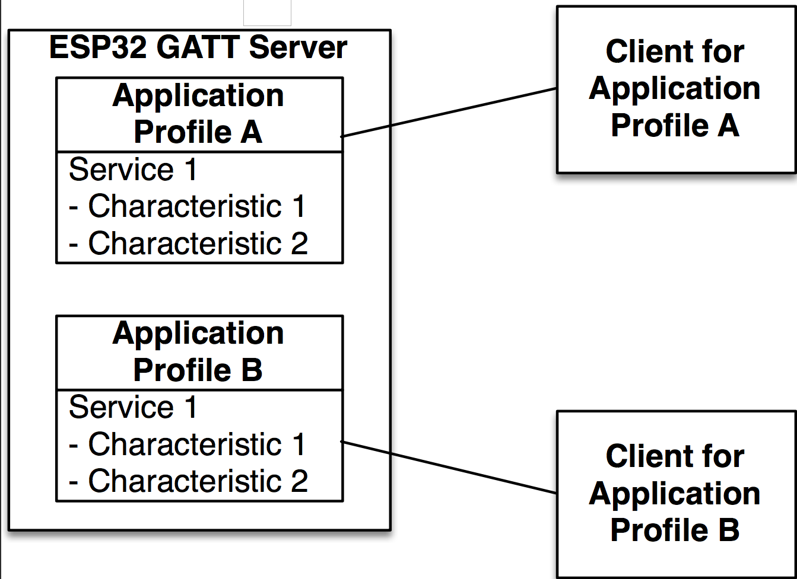

# Gatt Server Example Walkthrough

## Introduction

In this document, we review the GATT SERVER example code which implements a Bluetooth Low Energy (BLE) Generic Attribute Profile (GATT) Server on the ESP32. This example is designed around two Application Profiles and a series of events that are handled in order to execute a sequence of configuration steps, such as defining advertising parameters, updating connection parameters and creating services and characteristics. In addition, this example handles read and write events, including a Write Long Characteristic request, which divides the incoming data into chunks so that the data can fit in the Attribute Protocol (ATT) message. This document follows the program workflow and breaks down the code in order to make sense of every section and reasoning behind the implementation.

## Includes

First, let’s take a look at the includes:

```c
#include <stdio.h>
#include <stdlib.h>
#include <string.h>
#include "freertos/FreeRTOS.h"
#include "freertos/task.h"
#include "freertos/event_groups.h"
#include "esp_system.h"
#include "esp_log.h"
#include "nvs_flash.h"
#include "bt.h"
#include "bta_api.h"
#include "esp_gap_ble_api.h"
#include "esp_gatts_api.h"
#include "esp_bt_defs.h"
#include "esp_bt_main.h"
#include "sdkconfig.h"
```
These includes are required for the FreeRTOS and underlaying system components to run, including the logging functionality and a library to store data in non-volatile flash memory. We are interested in `"bt.h"`, `"esp_bt_main.h"`, `"esp_gap_ble_api.h"` and `"esp_gatts_api.h"`, which expose the BLE APIs required to implement this example.

* `bt.h`: implements BT controller and VHCI configuration procedures from the host side.
* `esp_bt_main.h`: implements initialization and enabling of the Bluedroid stack.
* `esp_gap_ble_api.h`: implements GAP configuration, such as advertising and connection parameters.
* `esp_gatts_api.h`: implements GATT configuration, such as creating services and characteristics.

## Main Entry Point

The entry point to this example is the app_main() function:

```c
 void app_main()
{
    esp_err_t ret;

    // Initialize NVS.
    ret = nvs_flash_init();
    if (ret == ESP_ERR_NVS_NO_FREE_PAGES) {
        ESP_ERROR_CHECK(nvs_flash_erase());
        ret = nvs_flash_init();
    }
    ESP_ERROR_CHECK(ret);

    esp_bt_controller_config_t bt_cfg = BT_CONTROLLER_INIT_CONFIG_DEFAULT();
    ret = esp_bt_controller_init(&bt_cfg);
    if (ret) {
        ESP_LOGE(GATTS_TAG, "%s initialize controller failed\n", __func__);
        return;
    }

    ret = esp_bt_controller_enable(ESP_BT_MODE_BTDM);
    if (ret) {
        ESP_LOGE(GATTS_TAG, "%s enable controller failed\n", __func__);
        return;
    }
    ret = esp_bluedroid_init();
    if (ret) {
        ESP_LOGE(GATTS_TAG, "%s init bluetooth failed\n", __func__);
        return;
    }
    ret = esp_bluedroid_enable();
    if (ret) {
        ESP_LOGE(GATTS_TAG, "%s enable bluetooth failed\n", __func__);
        return;
    }

    ret = esp_ble_gatts_register_callback(gatts_event_handler);
    if (ret){
        ESP_LOGE(GATTS_TAG, "gatts register error, error code = %x", ret);
        return;
    }
    ret = esp_ble_gap_register_callback(gap_event_handler);
    if (ret){
        ESP_LOGE(GATTS_TAG, "gap register error, error code = %x", ret);
        return;
    }
    ret = esp_ble_gatts_app_register(PROFILE_A_APP_ID);
    if (ret){
        ESP_LOGE(GATTS_TAG, "gatts app register error, error code = %x", ret);
        return;
    }
    ret = esp_ble_gatts_app_register(PROFILE_B_APP_ID);
    if (ret){
        ESP_LOGE(GATTS_TAG, "gatts app register error, error code = %x", ret);
        return;
    }
    esp_err_t local_mtu_ret = esp_ble_gatt_set_local_mtu(512);
    if (local_mtu_ret){
        ESP_LOGE(GATTS_TAG, "set local  MTU failed, error code = %x", local_mtu_ret);
    }
    return;
} 
```
The main function starts by initializing the non-volatile storage library. This library allows to save key-value pairs in flash memory and is used by some components such as the Wi-Fi library to save the SSID and password:

```c
ret = nvs_flash_init();
```
## BT Controller and Stack Initialization

The main function also initializes the BT controller by first creating a BT controller configuration structure named `esp_bt_controller_config_t` with default settings generated by the `BT_CONTROLLER_INIT_CONFIG_DEFAULT()` macro. The BT controller implements the Host Controller Interface (HCI) on the controller side, the Link Layer (LL) and the Physical Layer (PHY). The BT Controller is invisible to the user applications and deals with the lower layers of the BLE stack. The controller configuration includes setting the BT controller stack size, priority and HCI baud rate. With the settings created, the BT controller is initialized and enabled with the `esp_bt_controller_init()` function:

```c
esp_bt_controller_config_t bt_cfg = BT_CONTROLLER_INIT_CONFIG_DEFAULT();
ret = esp_bt_controller_init(&bt_cfg);
```
Next, the controller is enabled in Dual Mode (BLE + BT Classic).

```c
ret = esp_bt_controller_enable(ESP_BT_MODE_BTDM);
```

There are four Bluetooth modes supported:

1. `ESP_BT_MODE_IDLE`: Bluetooth not running
2. `ESP_BT_MODE_BLE`: BLE mode
3. `ESP_BT_MODE_CLASSIC_BT`: BT Classic mode
4. `ESP_BT_MODE_BTDM`: Dual mode (BLE + BT Classic)

After the initialization of the BT controller, the Bluedroid stack, which includes the common definitions and APIs for both BT Classic and BLE, is initialized and enabled by using:

```c
ret = esp_bluedroid_init();
ret = esp_bluedroid_enable();
```
The Bluetooth stack is up and running at this point in the program flow, however the functionality of the application has not been defined yet. The functionality is defined by reacting to events such as what happens when another device tries to read or write parameters and establish a connection. The two main managers of events are the GAP and GATT event handlers. The application needs to register a callback function for each event handler in order to let the application know which functions are going to handle the GAP and GATT events:

```c
esp_ble_gatts_register_callback(gatts_event_handler);
esp_ble_gap_register_callback(gap_event_handler);
```
The functions `gatts_event_handler()` and `gap_event_handler()` handle all the events that are pushed to the application from the BLE stack.

## APPLICATION PROFILES

The GATT Server example application is organized by using Application Profiles as shown in Fig 1. Each Application Profile describes a way to group functionalities that are designed for one client application, such as a mobile app running on a smartphone or tablet. In this way, a single design, enabled by different Application Profiles, can behave differently when used by different smartphone apps, allowing the server to react differently according to the client app that is being used. In practice, each profile is seen by the client as an independent BLE service. It is up to the client to discriminate the services that it is interested in.


<p align="center">Fig.1. Application Profiles are used to organize a BLE application in order to implement different functionality for different clients.</p> 

Each profile is defined as a struct where the struct members depend on the services and characteristics that are implemented in that Application Profile. The members also include a GATT interface, Application ID, Connection ID and a callback function to handle profile events. In this example, each profile is composed by:

* GATT interface
* Application ID
* Connection ID
* Service handle
* Service ID
* Characteristic handle
* Characteristic UUID
* Attribute permissions
* Characteristic properties
* Client Characteristic Configuration descriptor handle
* Client Characteristic Configuration descriptor UUID

It can be observed from this structure that this profile was designed to have one service and one characteristic, and that the characteristic has one descriptor. The service has a handle and an ID, in the same manner that each characteristic has a handle, an UUID, attribute permissions and properties. In addition, if the characteristic supports notifications or indications, it must implement a Client Characteristic Configuration descriptor (CCCD), which is an additional attribute that describes if the notifications or indications are enabled and defines how the characteristic may be configured by a specific client. This descriptor also has a handle and an UUID.

The structure implementation is:

```c
struct gatts_profile_inst {
    esp_gatts_cb_t gatts_cb;
    uint16_t gatts_if;
    uint16_t app_id;
    uint16_t conn_id;
    uint16_t service_handle;
    esp_gatt_srvc_id_t service_id;
    uint16_t char_handle;
    esp_bt_uuid_t char_uuid;
    esp_gatt_perm_t perm;
    esp_gatt_char_prop_t property;
    uint16_t descr_handle;
    esp_bt_uuid_t descr_uuid;
};
```
The Application Profiles are stored in an array and corresponding callback functions `gatts_profile_a_event_handler()` and `gatts_profile_b_event_handler()` are assigned. Different applications on the GATT client use different interfaces, represented by the gatts_if parameter. For initialization, this parameter is set to `ESP_GATT_IF_NONE`, which means that the Application Profile is not linked to any client yet.

```c
static struct gatts_profile_inst gl_profile_tab[PROFILE_NUM] = {
    [PROFILE_A_APP_ID] = {
        .gatts_cb = gatts_profile_a_event_handler,
        .gatts_if = ESP_GATT_IF_NONE,
    [PROFILE_B_APP_ID] = {
        .gatts_cb = gatts_profile_b_event_handler,
        .gatts_if = ESP_GATT_IF_NONE,
    },
};
```
Finally, the Application Profiles are registered using the Application ID, which is an user-assigned number to identify each profile. In this way, multiple Application Profiles can run in one server. 

```c
esp_ble_gatts_app_register(PROFILE_A_APP_ID);
esp_ble_gatts_app_register(PROFILE_B_APP_ID);
```

## Setting GAP Parameters

The register application event is the first one that is triggered during the lifetime of the program, this example uses the Profile A GATT event handle to configure the advertising parameters upon registration. This example has the option to use both standard Bluetooth Core Specification advertising parameters or a customized raw buffer. The option can be selected with the `CONFIG_SET_RAW_ADV_DATA` define. The raw advertising data can be used to implement iBeacons, Eddystone or other proprietaries, and custom frame types such as the ones used for Indoor Location Services that are different from the standard specifications.

The function used to configure standard Bluetooth Specification advertisement parameters is `esp_ble_gap_config_adv_data()`, which takes a pointer to an `esp_ble_adv_data_t` structure. The `esp_ble_adv_data_t` data structure for advertising data has the following definition:

```c
typedef struct {
    bool set_scan_rsp;            /*!< Set this advertising data as scan response or not*/
    bool include_name;            /*!< Advertising data include device name or not */
    bool include_txpower;         /*!< Advertising data include TX power */
    int min_interval;             /*!< Advertising data show advertising min interval */
    int max_interval;             /*!< Advertising data show advertising max interval */
    int appearance;               /*!< External appearance of device */
    uint16_t manufacturer_len;    /*!< Manufacturer data length */
    uint8_t *p_manufacturer_data; /*!< Manufacturer data point */
    uint16_t service_data_len;    /*!< Service data length */
    uint8_t *p_service_data;      /*!< Service data point */
    uint16_t service_uuid_len;    /*!< Service uuid length */
    uint8_t *p_service_uuid;      /*!< Service uuid array point */
    uint8_t flag;                 /*!< Advertising flag of discovery mode, see BLE_ADV_DATA_FLAG detail */
} esp_ble_adv_data_t;
```
In this example, the structure is initialized as follows:

```c
static esp_ble_adv_data_t adv_data = {
    .set_scan_rsp = false,
    .include_name = true,
    .include_txpower = true,
    .min_interval = 0x20,
    .max_interval = 0x40,
    .appearance = 0x00,
    .manufacturer_len = 0, //TEST_MANUFACTURER_DATA_LEN,
    .p_manufacturer_data =  NULL, //&test_manufacturer[0],
    .service_data_len = 0,
    .p_service_data = NULL,
    .service_uuid_len = 32,
    .p_service_uuid = test_service_uuid128,
    .flag = (ESP_BLE_ADV_FLAG_GEN_DISC | ESP_BLE_ADV_FLAG_BREDR_NOT_SPT),
};
```
The minimum and maximum advertisement intervals are set as multiples of 1.25 ms. In this example, the minimum advertisement interval is defined as 0x20 * 1.25 ms = 40 ms, and the maximum advertisement interval is initialized as 0x40 * 1.25 ms = 80 ms.

An advertising payload can be up to 31 bytes of data. It is possible the parameter data is large enough to surpass the 31-byte advertisement packet limit, which causes the stack to cut the advertisement packet and leave some of the parameters out. This behavior can be demonstrated in this example if the manufacturer length and data are uncommented, which makes the services to not be advertised after recompiling and testing.

It is possible to also advertise customized raw data using the `esp_ble_gap_config_adv_data_raw()`
and `esp_ble_gap_config_scan_rsp_data_raw()` functions, which require to create and pass a buffer for both advertising data and scanning response data. In this example, the raw data is represented by the `raw_adv_data[]` and `raw_scan_rsp_data[]` arrays.

Finally, to set the device name, the `esp_ble_gap_set_device_name()` function is used. The registering event handler is shown as follows:

```c
static void gatts_profile_a_event_handler(esp_gatts_cb_event_t event, esp_gatt_if_t gatts_if, esp_ble_gatts_cb_param_t *param) {
    switch (event) {
    case ESP_GATTS_REG_EVT:
         ESP_LOGI(GATTS_TAG, "REGISTER_APP_EVT, status %d, app_id %d\n", param->reg.status, param->reg.app_id);
         gl_profile_tab[PROFILE_A_APP_ID].service_id.is_primary = true;
         gl_profile_tab[PROFILE_A_APP_ID].service_id.id.inst_id = 0x00;
         gl_profile_tab[PROFILE_A_APP_ID].service_id.id.uuid.len = ESP_UUID_LEN_16;
         gl_profile_tab[PROFILE_A_APP_ID].service_id.id.uuid.uuid.uuid16 = GATTS_SERVICE_UUID_TEST_A;

         esp_ble_gap_set_device_name(TEST_DEVICE_NAME);
#ifdef CONFIG_SET_RAW_ADV_DATA
        esp_err_t raw_adv_ret = esp_ble_gap_config_adv_data_raw(raw_adv_data, sizeof(raw_adv_data));
        if (raw_adv_ret){
            ESP_LOGE(GATTS_TAG, "config raw adv data failed, error code = %x ", raw_adv_ret);
        }
        adv_config_done |= adv_config_flag;
        esp_err_t raw_scan_ret = esp_ble_gap_config_scan_rsp_data_raw(raw_scan_rsp_data, sizeof(raw_scan_rsp_data));
        if (raw_scan_ret){
            ESP_LOGE(GATTS_TAG, "config raw scan rsp data failed, error code = %x", raw_scan_ret);
        }
        adv_config_done |= scan_rsp_config_flag;
#else
        //config adv data
        esp_err_t ret = esp_ble_gap_config_adv_data(&adv_data);
        if (ret){
            ESP_LOGE(GATTS_TAG, "config adv data failed, error code = %x", ret);
        }
        adv_config_done |= adv_config_flag;
        //config scan response data
        ret = esp_ble_gap_config_adv_data(&scan_rsp_data);
        if (ret){
            ESP_LOGE(GATTS_TAG, "config scan response data failed, error code = %x", ret);
        }
        adv_config_done |= scan_rsp_config_flag;
#endif
```
## GAP Event Handler

Once the advertising data have been set, the GAP event `ESP_GAP_BLE_ADV_DATA_SET_COMPLETE_EVT` is triggered. For the case of raw advertising data set, the event triggered is `ESP_GAP_BLE_ADV_DATA_RAW_SET_COMPLETE_EVT`. Additionally when the raw scan response data is set, `ESP_GAP_BLE_SCAN_RSP_DATA_RAW_SET_COMPLETE_EVT` event is triggered. 

```c
static void gap_event_handler(esp_gap_ble_cb_event_t event, esp_ble_gap_cb_param_t *param)
{   
    switch (event) {
    #ifdef CONFIG_SET_RAW_ADV_DATA
    case ESP_GAP_BLE_ADV_DATA_RAW_SET_COMPLETE_EVT:
         adv_config_done &= (~adv_config_flag);
         if (adv_config_done==0){
             esp_ble_gap_start_advertising(&adv_params);
         }
         break;
    case ESP_GAP_BLE_SCAN_RSP_DATA_RAW_SET_COMPLETE_EVT:
         adv_config_done &= (~scan_rsp_config_flag);
         if (adv_config_done==0){
             esp_ble_gap_start_advertising(&adv_params);
         }
         break;
#else
    case ESP_GAP_BLE_ADV_DATA_SET_COMPLETE_EVT:
         adv_config_done &= (~adv_config_flag);
         if (adv_config_done == 0){
             esp_ble_gap_start_advertising(&adv_params);
         }
         break;
    case ESP_GAP_BLE_SCAN_RSP_DATA_SET_COMPLETE_EVT:
         adv_config_done &= (~scan_rsp_config_flag);
         if (adv_config_done == 0){
             esp_ble_gap_start_advertising(&adv_params);
         }
         break;
#endif
…
```
In any case, the server can start advertising using the `esp_ble_gap_start_advertising()` function, which takes a structure of type `esp_ble_adv_params_t` with the advertising parameters required by the stack to operate:

```c
/// Advertising parameters
typedef struct {
    uint16_t adv_int_min; 
    /*!< Minimum advertising interval for undirected and low duty cycle directed advertising.
 					Range: 0x0020 to 0x4000
 					Default: N = 0x0800 (1.28 second)
					Time = N * 0.625 msec
					Time Range: 20 ms to 10.24 sec */
    uint16_t adv_int_max; 
    /*!< Maximum advertising interval for undirected and low duty
					cycle directed advertising. 
					Range: 0x0020 to 0x4000 
					Default: N = 0x0800 (1.28 second)
					Time = N * 0.625 msec 
					Time Range: 20 ms to 10.24 sec */
    esp_ble_adv_type_t adv_type;            /*!< Advertising type */
    esp_ble_addr_type_t own_addr_type;      /*!< Owner bluetooth device address type */
    esp_bd_addr_t peer_addr;                /*!< Peer device bluetooth device address */
    esp_ble_addr_type_t peer_addr_type;     /*!< Peer device bluetooth device address type */
    esp_ble_adv_channel_t channel_map;      /*!< Advertising channel map */
    esp_ble_adv_filter_t adv_filter_policy; /*!< Advertising filter policy */
} 
esp_ble_adv_params_t;
```

Note that `esp_ble_gap_config_adv_data()` configures the data that will be advertised to the client and takes an `esp_ble_adv_data_t` structure, while `esp_ble_gap_start_advertising()` makes the server to actually start advertising and takes an `esp_ble_adv_params_t` structure. The advertising data is the information that is shown to the client, while the advertising parameters are the configuration required by the GAP to execute.

For this example, the advertisement parameters are initialized as follows:

```c
static esp_ble_adv_params_t test_adv_params = {
    .adv_int_min        = 0x20,
    .adv_int_max        = 0x40,
    .adv_type           = ADV_TYPE_IND,
    .own_addr_type      = BLE_ADDR_TYPE_PUBLIC,
    //.peer_addr        =
    //.peer_addr_type   =
    .channel_map        = ADV_CHNL_ALL,
    .adv_filter_policy  = ADV_FILTER_ALLOW_SCAN_ANY_CON_ANY,
};
```

These parameters configure the advertising interval between 40 ms to 80 ms. The advertisement is `ADV_IND`, which is a generic, not directed to a particular central device and connectable type. The address type is public, uses all channels and allows both scan and connection requests from any central.

If the advertising started successfully, an `ESP_GAP_BLE_ADV_START_COMPLETE_EVT` event is generated, which in this example is used to check if the advertising status is indeed advertising. Otherwise, an error message is printed.

```c
…
    case ESP_GAP_BLE_ADV_START_COMPLETE_EVT:
    //advertising start complete event to indicate advertising start successfully or failed
         if (param->adv_start_cmpl.status != ESP_BT_STATUS_SUCCESS) {
             ESP_LOGE(GATTS_TAG, "Advertising start failed\n");
         }
         break;
…
```

## GATT Event Handlers

When an Application Profile is registered, an `ESP_GATTS_REG_EVT` event is triggered. The parameters of the `ESP_GATTS_REG_EVT` are:

* `esp_gatt_status_t status;　/*!< Operation status */`
* `uint16_t app_id;　　　　　　　/*!< Application id which input in register API */`

In addition to the previous parameters, the event also contains the GATT interface assigned by the BLE stack. The event is captured by the `gatts_event_handler()`, which used to store the generated interface in the profile table, and then the event is forwarded to the corresponding profile event handler.
 
```c
static void gatts_event_handler(esp_gatts_cb_event_t event, esp_gatt_if_t gatts_if, esp_ble_gatts_cb_param_t *param)
{
    /* If event is register event, store the gatts_if for each profile */
    if (event == ESP_GATTS_REG_EVT) {
        if (param->reg.status == ESP_GATT_OK) {
            gl_profile_tab[param->reg.app_id].gatts_if = gatts_if;
        } else {
            ESP_LOGI(GATTS_TAG, "Reg app failed, app_id %04x, status %d\n",
                    param->reg.app_id,
                    param->reg.status);
            return;
        }
    }

/* If the gatts_if equal to profile A, call profile A cb handler,
 * so here call each profile's callback */
    do {
        int idx;
        for (idx = 0; idx < PROFILE_NUM; idx++) {
            if (gatts_if == ESP_GATT_IF_NONE||gatts_if == gl_profile_tab[idx].gatts_if) 			{
                if (gl_profile_tab[idx].gatts_cb) {
                    gl_profile_tab[idx].gatts_cb(event, gatts_if, param);
                }
            }
        }
    } while (0);
}
```
 
## Creating Services

The register event is also used to create a profile attributes table by using the `esp_ble_gatts_create_attr_tab()` function, which takes an `esp_gatts_attr_db_t` type structure that has all the information of the service table. The way to create this table is:

```c
…
esp_ble_gatts_create_service(gatts_if, &gl_profile_tab[PROFILE_A_APP_ID].service_id, GATTS_NUM_HANDLE_TEST_A);
break;
…
```
The number of handles is defined as 4:

```c
#define GATTS_NUM_HANDLE_TEST_A     4
```

The handles are:

1. Service handle
2. Characteristic handle
3. Characteristic value handle
4. Characteristic descriptor handle

The service is defined as a primary service with a UUID length of 16 bits. The service ID is initialized with instance ID = 0 and UUID defined by `GATTS_SERVICE_UUID_TEST_A`. 

The service instance ID can be used to differentiate multiple services with the same UUID. In this example, since there is only one service for each Application Profiles and the services have different UUIDs, the service instance ID can be defined as 0 in both profile A and B. However if there was only one Application Profile with two services using the same UUID, then it would be necessary to use different instance IDs to refer to one service or the other.

Application Profile B creates the service in the same way as Profile A:

```c
static void gatts_profile_b_event_handler(esp_gatts_cb_event_t event, esp_gatt_if_t gatts_if, esp_ble_gatts_cb_param_t *param) {
    switch (event) {
    case ESP_GATTS_REG_EVT:
         ESP_LOGI(GATTS_TAG, "REGISTER_APP_EVT, status %d, app_id %d\n", param->reg.status, param->reg.app_id);
         gl_profile_tab[PROFILE_B_APP_ID].service_id.is_primary = true;
         gl_profile_tab[PROFILE_B_APP_ID].service_id.id.inst_id = 0x00;
         gl_profile_tab[PROFILE_B_APP_ID].service_id.id.uuid.len = ESP_UUID_LEN_16;
         gl_profile_tab[PROFILE_B_APP_ID].service_id.id.uuid.uuid.uuid16 = GATTS_SERVICE_UUID_TEST_B;

         esp_ble_gatts_create_service(gatts_if, &gl_profile_tab[PROFILE_B_APP_ID].service_id, GATTS_NUM_HANDLE_TEST_B);
         break;
…
}
```

## Starting Services and Creating Characteristics

When a service is created successfully, an `ESP_GATTS_CREATE_EVT` event managed by the profile GATT handler is triggered, and can be used to start the service and add characteristics to the service. For the case of Profile A, the service is started and the characteristics are added as follows:

```c
case ESP_GATTS_CREATE_EVT:
     ESP_LOGI(GATTS_TAG, "CREATE_SERVICE_EVT, status %d, service_handle %d\n", param->create.status, param->create.service_handle);
     gl_profile_tab[PROFILE_A_APP_ID].service_handle = param->create.service_handle;
     gl_profile_tab[PROFILE_A_APP_ID].char_uuid.len = ESP_UUID_LEN_16;
     gl_profile_tab[PROFILE_A_APP_ID].char_uuid.uuid.uuid16 = GATTS_CHAR_UUID_TEST_A;  
     
     esp_ble_gatts_start_service(gl_profile_tab[PROFILE_A_APP_ID].service_handle);
     a_property = ESP_GATT_CHAR_PROP_BIT_READ | ESP_GATT_CHAR_PROP_BIT_WRITE | ESP_GATT_CHAR_PROP_BIT_NOTIFY;
     esp_err_t add_char_ret =  
     esp_ble_gatts_add_char(gl_profile_tab[PROFILE_A_APP_ID].service_handle,  
                            &gl_profile_tab[PROFILE_A_APP_ID].char_uuid,  
                            ESP_GATT_PERM_READ | ESP_GATT_PERM_WRITE,  
                            a_property,  
                            &gatts_demo_char1_val,  
                            NULL);
    if (add_char_ret){
        ESP_LOGE(GATTS_TAG, "add char failed, error code =%x",add_char_ret);
    }
    break;
```

First, the service handle generated by the BLE stack is stored in the profile table, which will be used later by the application layer to refer to this service. Then, the UUID of the characteristic and its UUID length are set. The length of the characteristic UUID is again 16 bits. The service is started using the `esp_ble_gatts_start_service()` function with the service handle previously generated. An `ESP_GATTS_START_EVT` event, which is used to print information, is triggered. The characteristic is added to the service by the `esp_ble_gatts_start_service()` function in conjunction with the characteristics permissions and properties. In this example, the characteristics in both profiles are set up as follows:

Permissions:

* `ESP_GATT_PERM_READ`: To read characteristic value is permitted
* `ESP_GATT_PERM_WRITE`: To write characteristic value is permitted

Properties:

* `ESP_GATT_CHAR_PROP_BIT_READ`: Characteristic can be read
* `ESP_GATT_CHAR_PROP_BIT_WRITE`: Characteristic can be written
* `ESP_GATT_CHAR_PROP_BIT_NOTIFY`: Characteristic can notify value changes

It might seem redundant to have both permissions and properties for read and write. However, the read and write properties of an attribute are information that is shown to the client in order to let the client know if the server accepts read and write requests. In that sense, the properties serve as a hint to the client to properly access the server resources. On the other hand, permissions are the authorization that is given to the client to either read or write that attribute. For example, if a client tries to write an attribute for which it does not have the write permission, the server will reject that request, even if the write property is set.

In addition, this example gives an initial value to the characteristic represented by `gatts_demo_char1_val`. The initial value is defined as follows:

```c
esp_attr_value_t gatts_demo_char1_val =
{
    .attr_max_len = GATTS_DEMO_CHAR_VAL_LEN_MAX,
    .attr_len     = sizeof(char1_str),
    .attr_value   = char1_str,
};
```
Where `char1_str` is dummy data:

```c
uint8_t char1_str[] = {0x11,0x22,0x33};
```

and the characteristic length is defined as:

```c
#define GATTS_DEMO_CHAR_VAL_LEN_MAX 0x40
```

The characteristic initial value must be a non-null object and the characteristic length must always be greater than zero, otherwise the stack will return an error.

Finally, the characteristic is configured in a way that it is required to send a response manually every time the characteristic is read or written, instead of letting the stack auto respond. This is configured by setting the last parameter of the `esp_ble_gatts_add_char()` function, representing the attribute response control parameter, to `ESP_GATT_RSP_BY_APP` or NULL.

## Creating the Characteristic Descriptor

Adding a characteristic to a service triggers an `ESP_GATTS_ADD_CHAR_EVT` event, which returns the handle generated by the stack for the characteristic just added. The event includes the following parameters:

* `esp_gatt_status_t status;　　　　　/*!< Operation status */`
* `uint16_t attr_handle;　　　　　　　/*!< Characteristic attribute handle */`
* `uint16_t service_handle;　　　　　/*!< Service attribute handle */`
* `esp_bt_uuid_t char_uuid;　　　　　/*!< Characteristic uuid */`

The attribute handle returned by the event is stored in the profile table and the characteristic descriptor length and UUID are set as well. The characteristic length and value are read using the `esp_ble_gatts_get_attr_value()` function, and then printed for information purposes. Finally, the characteristic description is added using the `esp_ble_gatts_add_char_descr()` function. The parameters used are the service handle, the descriptor UUID, write and read permissions, an initial value and the auto response setting. The initial value for the characteristic descriptor can be a NULL pointer and the auto response parameter is set to NULL as well, which means that requests that require responses have to be replied manually.

```c
    case ESP_GATTS_ADD_CHAR_EVT: {
         uint16_t length = 0;
         const uint8_t *prf_char;

         ESP_LOGI(GATTS_TAG, "ADD_CHAR_EVT, status %d,  attr_handle %d, service_handle %d\n",
                 param->add_char.status, param->add_char.attr_handle, param->add_char.service_handle);  
                 gl_profile_tab[PROFILE_A_APP_ID].char_handle = param->add_char.attr_handle;
                 gl_profile_tab[PROFILE_A_APP_ID].descr_uuid.len = ESP_UUID_LEN_16;  
                 gl_profile_tab[PROFILE_A_APP_ID].descr_uuid.uuid.uuid16 = ESP_GATT_UUID_CHAR_CLIENT_CONFIG;  
                 esp_err_t get_attr_ret = esp_ble_gatts_get_attr_value(param->add_char.attr_handle, &length, &prf_char);         
         if (get_attr_ret == ESP_FAIL){  
	           ESP_LOGE(GATTS_TAG, "ILLEGAL HANDLE");
         }
         ESP_LOGI(GATTS_TAG, "the gatts demo char length = %x\n", length);
         for(int i = 0; i < length; i++){
             ESP_LOGI(GATTS_TAG, "prf_char[%x] = %x\n",i,prf_char[i]);
         }       
         esp_err_t add_descr_ret = esp_ble_gatts_add_char_descr(  
                                 gl_profile_tab[PROFILE_A_APP_ID].service_handle,  
                                 &gl_profile_tab[PROFILE_A_APP_ID].descr_uuid,  
                                 ESP_GATT_PERM_READ | ESP_GATT_PERM_WRITE,  
                                 NULL,NULL);
         if (add_descr_ret){
            ESP_LOGE(GATTS_TAG, "add char descr failed, error code = %x", add_descr_ret);
         }
         break;
    }
```

Once the descriptor is added, the `ESP_GATTS_ADD_CHAR_DESCR_EVT` event is triggered, which in this example is used to print an information message.

```c
    case ESP_GATTS_ADD_CHAR_DESCR_EVT:
         ESP_LOGI(GATTS_TAG, "ADD_DESCR_EVT, status %d, attr_handle %d, service_handle %d\n",
                  param->add_char.status, param->add_char.attr_handle,  
                  param->add_char.service_handle);
         break;
```
This procedure is repeated in the Profile B event handler, in order to create the services and characteristics for that profile.

## Connection Event

An `ESP_GATTS_CONNECT_EVT` is triggered when a client has connected to the GATT server. This event is used to update the connection parameters, such as latency, minimum connection interval, maximum connection interval and time out. The connection parameters are stored into an `esp_ble_conn_update_params_t` structure, and then passed to the `esp_ble_gap_update_conn_params()` function. The update connection parameters procedure needs to be done only once, therefore the Profile B connection event handler does not include the `esp_ble_gap_update_conn_params()` function. Finally, the connection ID returned by the event is stored in the profile table.

Profile A connection event:

```c
case ESP_GATTS_CONNECT_EVT: {  
     esp_ble_conn_update_params_t conn_params = {0};  
     memcpy(conn_params.bda, param->connect.remote_bda, sizeof(esp_bd_addr_t));
     /* For the IOS system, please reference the apple official documents about the ble connection parameters restrictions. */
     conn_params.latency = 0;  
     conn_params.max_int = 0x30;    // max_int = 0x30*1.25ms = 40ms  
     conn_params.min_int = 0x10;    // min_int = 0x10*1.25ms = 20ms   
     conn_params.timeout = 400;     // timeout = 400*10ms = 4000ms  
     ESP_LOGI(GATTS_TAG, "ESP_GATTS_CONNECT_EVT, conn_id %d, remote %02x:%02x:%02x:%02x:%02x:%02x:, is_conn %d",  
             param->connect.conn_id,  
             param->connect.remote_bda[0],  
             param->connect.remote_bda[1],  
             param->connect.remote_bda[2],  
             param->connect.remote_bda[3],  
             param->connect.remote_bda[4],  
             param->connect.remote_bda[5],  
             param->connect.is_connected);
 	 gl_profile_tab[PROFILE_A_APP_ID].conn_id = param->connect.conn_id;
	 //start sent the update connection parameters to the peer device.
	 esp_ble_gap_update_conn_params(&conn_params);
	 break;
    }
```

Profile B connection event:

```c
case ESP_GATTS_CONNECT_EVT:  
     ESP_LOGI(GATTS_TAG, "CONNECT_EVT, conn_id %d, remote %02x:%02x:%02x:%02x:%02x:%02x:, is_conn %d\n",  
              param->connect.conn_id,  
              param->connect.remote_bda[0],  
              param->connect.remote_bda[1],  
              param->connect.remote_bda[2],  
              param->connect.remote_bda[3],  
              param->connect.remote_bda[4],  
              param->connect.remote_bda[5],  
              param->connect.is_connected);
	  gl_profile_tab[PROFILE_B_APP_ID].conn_id = param->connect.conn_id;
	  break;
```

The `esp_ble_gap_update_conn_params()` function triggers a GAP event `ESP_GAP_BLE_UPDATE_CONN_PARAMS_EVT`, which is used to print the connection information:

```c
    case ESP_GAP_BLE_UPDATE_CONN_PARAMS_EVT:
         ESP_LOGI(GATTS_TAG, "update connetion params status = %d, min_int = %d, max_int = %d,  
                  conn_int = %d,latency = %d, timeout = %d",
                  param->update_conn_params.status,
                  param->update_conn_params.min_int,
                  param->update_conn_params.max_int,
                  param->update_conn_params.conn_int,
                  param->update_conn_params.latency,
                  param->update_conn_params.timeout);
         break;
```

## Managing Read Events

Now that the services and characteristics are created and started, the program can receive read and write events. The read operations are represented by the `ESP_GATTS_READ_EVT` event, which has the following parameters:
	
* `uint16_t conn_id;　　　　　/*!< Connection id */`
* `uint32_t trans_id;　　　　　/*!< Transfer id */`
* `esp_bd_addr_t bda;　　　　　/*!< The bluetooth device address which been read */`
* `uint16_t handle;　　　　　　/*!< The attribute handle */`
* `uint16_t offset;　　　　　　/*!< Offset of the value, if the value is too long */`
* `bool is_long;　　　　　　　　/*!< The value is too long or not */`
* `bool need_rsp;　　　　　　　/*!< The read operation need to do response */`

In this example, a response is constructed with dummy data and sent back to the host using the same handle given by the event. In addition to the response, the GATT interface, the connection ID and the transfer ID are also included as parameters in the `esp_ble_gatts_send_response()` function. This function is necessary if the auto response byte is set to NULL when creating the characteristic or descriptor.

```c
case ESP_GATTS_READ_EVT: {
     ESP_LOGI(GATTS_TAG, "GATT_READ_EVT, conn_id %d, trans_id %d, handle %d\n",  
              param->read.conn_id, param->read.trans_id, param->read.handle);  
              esp_gatt_rsp_t rsp;  
              memset(&rsp, 0, sizeof(esp_gatt_rsp_t));  
              rsp.attr_value.handle = param->read.handle;  
              rsp.attr_value.len = 4;  
              rsp.attr_value.value[0] = 0xde;  
              rsp.attr_value.value[1] = 0xed;  
              rsp.attr_value.value[2] = 0xbe;  
              rsp.attr_value.value[3] = 0xef;  
              esp_ble_gatts_send_response(gatts_if,  
                                          param->read.conn_id,  
                                          param->read.trans_id,  
                                          ESP_GATT_OK, &rsp);
     break;
    }
```

## Managing Write Events

The write events are represented by the `ESP_GATTS_WRITE_EVT` event, which has the following parameters:

* `uint16_t conn_id;　　　　　/*!< Connection id */`
* `uint32_t trans_id;　　　　/*!< Transfer id */`
* `esp_bd_addr_t bda;　　　　/*!< The bluetooth device address which been written */`
* `uint16_t handle;　　　　　/*!< The attribute handle */`
* `uint16_t offset;　　　　　/*!< Offset of the value, if the value is too long */`
* `bool need_rsp;　　　　　　/*!< The write operation need to do response */`
* `bool is_prep;　　　　　　　/*!< This write operation is prepare write */`
* `uint16_t len;　　　　　　　/*!< The write attribute value length */`
* `uint8_t *value;　　　　　　/*!< The write attribute value */`

There are two types of write events implemented in this example, write characteristic value and write long characteristic value. The first type of write is used when the characteristic value can fit in one Attribute Protocol Maximum Transmission Unit (ATT MTU), which is usually 23 bytes long. The second type is used when the attribute to write is longer than what can be sent in one single ATT message by dividing the data into multiple chunks using Prepare Write Responses, after which an Executive Write Request is used to confirm or cancel the complete write request. This behavior is defined in the [Bluetooth Specification Version 4.2](https://www.bluetooth.com/specifications/bluetooth-core-specification), Vol 3, Part G, section 4.9. The write long characteristic message flow is shown in Fig. 2.

When a write event is triggered, this example prints logging messages, and then executes the `example_write_event_env()` function.

```c
case ESP_GATTS_WRITE_EVT: {                          
     ESP_LOGI(GATTS_TAG, "GATT_WRITE_EVT, conn_id %d, trans_id %d, handle %d\n", param->write.conn_id, param->write.trans_id, param->write.handle);
     if (!param->write.is_prep){
        ESP_LOGI(GATTS_TAG, "GATT_WRITE_EVT, value len %d, value :", param->write.len);
        esp_log_buffer_hex(GATTS_TAG, param->write.value, param->write.len);
        if (gl_profile_tab[PROFILE_B_APP_ID].descr_handle == param->write.handle && param->write.len == 2){
            uint16_t descr_value= param->write.value[1]<<8 | param->write.value[0];
            if (descr_value == 0x0001){
                if (b_property & ESP_GATT_CHAR_PROP_BIT_NOTIFY){
                    ESP_LOGI(GATTS_TAG, "notify enable");
                    uint8_t notify_data[15];
                    for (int i = 0; i < sizeof(notify_data); ++i)
                    {
                         notify_data[i] = i%0xff;  
                     }
                     //the size of notify_data[] need less than MTU size
                     esp_ble_gatts_send_indicate(gatts_if, param->write.conn_id,  
                                                 gl_profile_tab[PROFILE_B_APP_ID].char_handle,  
                                                 sizeof(notify_data),  
                                                 notify_data, false);
                }
            }else if (descr_value == 0x0002){
                 if (b_property & ESP_GATT_CHAR_PROP_BIT_INDICATE){
                     ESP_LOGI(GATTS_TAG, "indicate enable");
                     uint8_t indicate_data[15];
                     for (int i = 0; i < sizeof(indicate_data); ++i)
                     {
                         indicate_data[i] = i % 0xff;
                      }
                      //the size of indicate_data[] need less than MTU size
                     esp_ble_gatts_send_indicate(gatts_if, param->write.conn_id,  
                                                 gl_profile_tab[PROFILE_B_APP_ID].char_handle,  
                                                 sizeof(indicate_data),  
                                                 indicate_data, true);
                }
             }
             else if (descr_value == 0x0000){
                 ESP_LOGI(GATTS_TAG, "notify/indicate disable ");
             }else{
                 ESP_LOGE(GATTS_TAG, "unknown value");
             }
        }
    }
    example_write_event_env(gatts_if, &a_prepare_write_env, param); 
    break;
}
```


 <p align="center">Fig.2. Message flow for Write Long Characteristic</p> 

The `example_write_event_env()` function contains the logic for the write long characteristic procedure:

```c
void example_write_event_env(esp_gatt_if_t gatts_if, prepare_type_env_t *prepare_write_env, esp_ble_gatts_cb_param_t *param){
    esp_gatt_status_t status = ESP_GATT_OK;
    if (param->write.need_rsp){
       if (param->write.is_prep){
            if (prepare_write_env->prepare_buf == NULL){
                prepare_write_env->prepare_buf = (uint8_t *)malloc(PREPARE_BUF_MAX_SIZE*sizeof(uint8_t));
                prepare_write_env->prepare_len = 0;
                if (prepare_write_env->prepare_buf == NULL) {
                    ESP_LOGE(GATTS_TAG, "Gatt_server prep no mem\n");
                    status = ESP_GATT_NO_RESOURCES;
                }
            } else {
                if(param->write.offset > PREPARE_BUF_MAX_SIZE) {
                    status = ESP_GATT_INVALID_OFFSET;
                } 
                else if ((param->write.offset + param->write.len) > PREPARE_BUF_MAX_SIZE) {
                    status = ESP_GATT_INVALID_ATTR_LEN;
                }
            }

            esp_gatt_rsp_t *gatt_rsp = (esp_gatt_rsp_t *)malloc(sizeof(esp_gatt_rsp_t));
            gatt_rsp->attr_value.len = param->write.len;
            gatt_rsp->attr_value.handle = param->write.handle;
            gatt_rsp->attr_value.offset = param->write.offset;
            gatt_rsp->attr_value.auth_req = ESP_GATT_AUTH_REQ_NONE;
            memcpy(gatt_rsp->attr_value.value, param->write.value, param->write.len);
            esp_err_t response_err = esp_ble_gatts_send_response(gatts_if, param->write.conn_id,  
                                                                 param->write.trans_id, status, gatt_rsp);
            if (response_err != ESP_OK){
               ESP_LOGE(GATTS_TAG, "Send response error\n");
            }
            free(gatt_rsp);
            if (status != ESP_GATT_OK){
                return;
            }
            memcpy(prepare_write_env->prepare_buf + param->write.offset,
                   param->write.value,
                   param->write.len);
            prepare_write_env->prepare_len += param->write.len;

        }else{
            esp_ble_gatts_send_response(gatts_if, param->write.conn_id, param->write.trans_id, status, NULL);
        }
    }
} 
```

When the client sends a Write Request or a Prepare Write Request, the server shall respond. However, if the client sends a Write Without Response command, the server does not need to reply back a response. This is checked in the write procedure by examining the value of the `write.need_rsp parameter`. If a response is needed, the procedure continues doing the response preparation, if not present, the client does not need a response and therefore the procedure is ended.

```c
void example_write_event_env(esp_gatt_if_t gatts_if, prepare_type_env_t *prepare_write_env,  
                             esp_ble_gatts_cb_param_t *param){
    esp_gatt_status_t status = ESP_GATT_OK;
    if (param->write.need_rsp){
…
```

The function then checks if the Prepare Write Request parameter represented by the `write.is_prep` is set, which means that the client is requesting a Write Long Characteristic. If present, the procedure continues with the preparation of multiple write responses, if not present, then the server simply sends a single write response back.

```c
…
if (param->write.is_prep){
…
}else{
	esp_ble_gatts_send_response(gatts_if, param->write.conn_id, param->write.trans_id, status, NULL);
}
…
```

To handle long characteristic write, a prepare buffer structure is defined and instantiated:

```c
typedef struct {
    uint8_t                 *prepare_buf;
    int                      prepare_len;
} prepare_type_env_t;

static prepare_type_env_t a_prepare_write_env;
static prepare_type_env_t b_prepare_write_env;
```
In order to use the prepare buffer, some memory space is allocated for it. In case the allocation fails due to a lack of memory, an error is printed:

```c
if (prepare_write_env->prepare_buf == NULL) {
    prepare_write_env->prepare_buf =  
    (uint8_t*)malloc(PREPARE_BUF_MAX_SIZE*sizeof(uint8_t));  
    prepare_write_env->prepare_len = 0;
    if (prepare_write_env->prepare_buf == NULL) {  
       ESP_LOGE(GATTS_TAG, "Gatt_server prep no mem\n");
       status = ESP_GATT_NO_RESOURCES;
    }
}
```

If the buffer is not NULL, which means initialization completed, the procedure then checks if the offset and message length of the incoming write fit the buffer.

```c
else {
	if(param->write.offset > PREPARE_BUF_MAX_SIZE) {
		status = ESP_GATT_INVALID_OFFSET;
	} 
	else if ((param->write.offset + param->write.len) > PREPARE_BUF_MAX_SIZE) {
		 status = ESP_GATT_INVALID_ATTR_LEN;
	}
}
```

The procedure now prepares the response of type `esp_gatt_rsp_t` to be sent back to the client. The response it constructed using the same parameters of the write request, such as length, handle and offset. In addition, the GATT authentication type needed to write to this characteristic is set with `ESP_GATT_AUTH_REQ_NONE`, which means that the client can write to this characteristic without needing to authenticate first. Once the response is sent, the memory allocated for its use is freed.

```c
esp_gatt_rsp_t *gatt_rsp = (esp_gatt_rsp_t *)malloc(sizeof(esp_gatt_rsp_t));
gatt_rsp->attr_value.len = param->write.len;
gatt_rsp->attr_value.handle = param->write.handle;
gatt_rsp->attr_value.offset = param->write.offset;
gatt_rsp->attr_value.auth_req = ESP_GATT_AUTH_REQ_NONE;
memcpy(gatt_rsp->attr_value.value, param->write.value, param->write.len);
esp_err_t response_err = esp_ble_gatts_send_response(gatts_if, param->write.conn_id,  
                                                     param->write.trans_id, status, gatt_rsp);
if (response_err != ESP_OK){
	ESP_LOGE(GATTS_TAG, "Send response error\n");
}
free(gatt_rsp);
if (status != ESP_GATT_OK){
	return;
}
```
Finally, the incoming data is copied to the buffer created and its length is incremented by the offset:

```c
memcpy(prepare_write_env->prepare_buf + param->write.offset,
       param->write.value,  
       param->write.len);
prepare_write_env->prepare_len += param->write.len;
```
The client finishes the long write sequence by sending an Executive Write Request. This command triggers an `ESP_GATTS_EXEC_WRITE_EVT` event. The server handles this event by sending a response and executing the `example_exec_write_event_env()` function:

```c
case ESP_GATTS_EXEC_WRITE_EVT:  
     ESP_LOGI(GATTS_TAG,"ESP_GATTS_EXEC_WRITE_EVT");  
     esp_ble_gatts_send_response(gatts_if, param->write.conn_id, param->write.trans_id, ESP_GATT_OK, NULL);  
     example_exec_write_event_env(&a_prepare_write_env, param);  
     break;
```
Let’s take a look at the Executive Write function:

```c
void example_exec_write_event_env(prepare_type_env_t *prepare_write_env, esp_ble_gatts_cb_param_t *param){
    if (param->exec_write.exec_write_flag == ESP_GATT_PREP_WRITE_EXEC){
        esp_log_buffer_hex(GATTS_TAG, prepare_write_env->prepare_buf, prepare_write_env->prepare_len);
    }
    else{
        ESP_LOGI(GATTS_TAG,"ESP_GATT_PREP_WRITE_CANCEL");
    }
    if (prepare_write_env->prepare_buf) {
        free(prepare_write_env->prepare_buf);
        prepare_write_env->prepare_buf = NULL;
    }
    prepare_write_env->prepare_len = 0;
}
```

The executive write is used to either confirm or cancel the write procedure done before, by the Long Characteristic Write procedure. In order to do this, the function checks for the `exec_write_flag` in the parameters received with the event. If the flag equals the execute flag represented by `exec_write_flag`, the write is confirmed and the buffer is printed in the log; if not, then it means the write is canceled and all the data that has been written is deleted.

```c
if (param->exec_write.exec_write_flag == ESP_GATT_PREP_WRITE_EXEC){  
   esp_log_buffer_hex(GATTS_TAG,  
                      prepare_write_env->prepare_buf,  
                      prepare_write_env->prepare_len);
 }
else{
    ESP_LOGI(GATTS_TAG,"ESP_GATT_PREP_WRITE_CANCEL");
 }
```
Finally, the buffer structure that was created to store the chunks of data from the long write operation is freed and its pointer is set to NULL to leave it ready for the next long write procedure.

```c
if (prepare_write_env->prepare_buf) {
    free(prepare_write_env->prepare_buf);
    prepare_write_env->prepare_buf = NULL;
}
prepare_write_env->prepare_len = 0;
```

## Conclusion
In this document, we have gone through the GATT SERVER example code describing each section. The application is designed around the concept of Application Profiles. In addition, the procedures that this example uses to register event handlers are explained. The events follow a sequence of configuration steps, such as defining advertising parameters, updating connection parameters and creating services and characteristics. Finally, the way in which read and write events are handled, including Write Long characteristics by dividing the write into chunks that can fit the Attribute Protocol message is explained.


