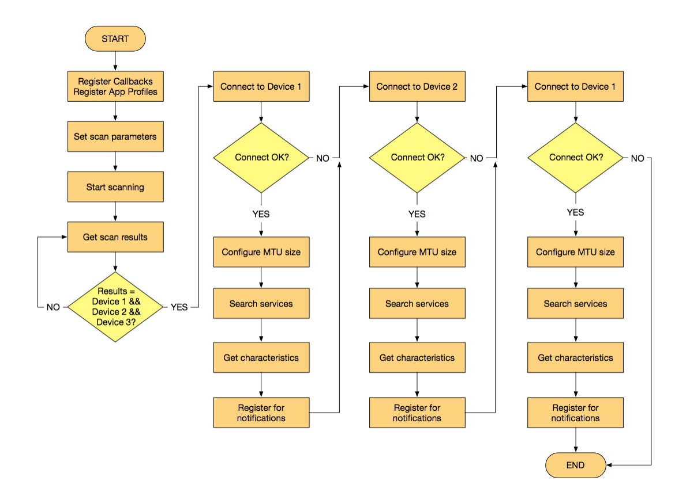
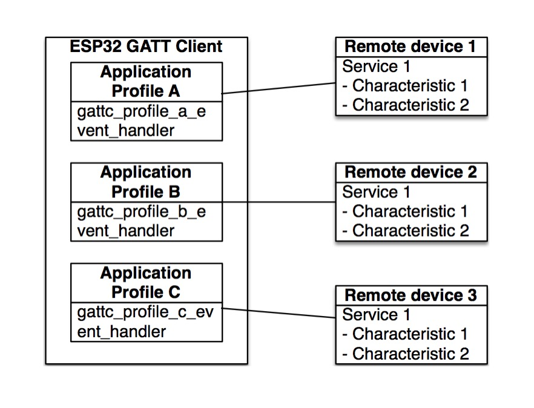

# GATT Client Multi-connection Example Walkthrough

## Introduction
This document presents a description of the multi-connection BLE GATT client example for the ESP32. In this implementation, a single ESP32 working as a GATT client connects to three different GATT servers at the same time. This set up illustrates the use case of an ESP32 device acting in a way so that it receives data from different BLE sensors. The unique combination of ESP32’s BLE + Wi-Fi capabilities in addition to connection to multiple peripherals makes it a great candidate to serve as an IoT gateway.

This example’s workflow is similar to the [GATT Client Example Walkthrough](../../gatt_client/tutorial/Gatt_Client_Example_Walkthrough.md) and is shown in the figure below. However, in the multi-connection implementation, a GATT client searches for three specific server names and once that it has found them it opens a connection to all three of them one after the other. In code, each connection is handled separately with one Application Profile.

Four ESP32 devices are needed in order to demonstrate this example, among which:

* one would be employed as a GATT Client flashed with the [gattc_multi_connect](../../gattc_multi_connect) demo, and,
* the rest run as GATT servers flashed with the [gatt_server](../../gatt_server) demo of the ESP-IDF Bluetooth examples folder.

<div align="center"></div>

## Includes
The multi-connection example’s main source file is [gattc_multi_connect.c](../main/gattc_multi_connect.c). For details, see Section [Includes](../../gatt_client/tutorial/Gatt_Client_Example_Walkthrough.md#includes) in [GATT Client Example Walkthrough](../../gatt_client/tutorial/Gatt_Client_Example_Walkthrough.md).

## Main Entry Point
See Section [Main Entry Point](../../gatt_client/tutorial/Gatt_Client_Example_Walkthrough.md#main-entry-point) in [GATT Client Example Walkthrough](../../gatt_client/tutorial/Gatt_Client_Example_Walkthrough.md).

## Implementation Procedure
The GATT Client implementation includes the following steps:

* system initialization,
* scanning configuration,
* scanning of nearby devices,
* connection to devices of interest,
* registering for notifications.

### Initializing
See Section [Main Entry Point](../../gatt_client/tutorial/Gatt_Client_Example_Walkthrough.md#main-entry-point) in [GATT Client Example Walkthrough](../../gatt_client/tutorial/Gatt_Client_Example_Walkthrough.md).

#### Application Profiles
Application Profiles are a way to group functionality. They are designed so that each Application Profile connects to one peer device, that way the same ESP32 can connect to multiple devices by assigning one Application Profile to each one, as figure below shows. Each Application Profile creates a GATT interface to connect to other devices. The Application Profiles are defined by an ID number, there are three profiles in this example:

```c
#define PROFILE_NUM 3
#define PROFILE_A_APP_ID 0	
#define PROFILE_B_APP_ID 1
#define PROFILE_C_APP_ID 2
```

<div align="center"></div>


The ``esp_ble_gattc_app_register()`` function is used to register each Application Profile to the BLE stack. The registration operation generates a GATT interface that is returned as a parameter in a registration event. In addition, each Application Profile is also defined by a structure that can be used to keep the state of the application and update its parameters when new data is propagated by the stack.

The Application Profiles in code are instances of a ``gattc_profile_inst`` structure. For details, see Section [Application Profiles](../../gatt_client/tutorial/Gatt_Client_Example_Walkthrough.md#application-profiles) in [GATT Client Example Walkthrough](../../gatt_client/tutorial/Gatt_Client_Example_Walkthrough.md).

### Scanning

#### Setting Scan Parameters
See Section [Setting Scan Parameters](../../gatt_client/tutorial/Gatt_Client_Example_Walkthrough.md#setting-scan-parameters) in [GATT Client Example Walkthrough](../../gatt_client/tutorial/Gatt_Client_Example_Walkthrough.md).

#### Starting to Scan
See Section [Start Scanning](../../gatt_client/tutorial/Gatt_Client_Example_Walkthrough.md#start-scanning) in [GATT Client Example Walkthrough](../../gatt_client/tutorial/Gatt_Client_Example_Walkthrough.md).

#### Getting Scan Results
See Section [Getting Scan Results](../../gatt_client/tutorial/Gatt_Client_Example_Walkthrough.md#start-scanning) in [GATT Client Example Walkthrough](../../gatt_client/tutorial/Gatt_Client_Example_Walkthrough.md).

#### Name Comparison

* First, the name of the device is extracted from the advertised data and stored in the ``adv_name`` variable:

   ```c
   adv_name = esp_ble_resolve_adv_data(scan_result->scan_rst.ble_adv, ESP_BLE_AD_TYPE_NAME_CMPL, &adv_name_len);
   ```

* Then, the device name found is compared to the server names that the client wants to connect to. The server names are defined in the ``remote_device_name`` array:

   ```c
   static const char remote_device_name[3][20] = {"ESP_GATTS_DEMO_1", "ESP_GATTS_DEMO_2", “ESP_GATTS_DEMO_3"};
   ```
   The name comparison takes places as follows:
   
   ```c
	if (strlen(remote_device_name[0]) == adv_name_len && strncmp((char *)adv_name, remote_device_name[0], adv_name_len) == 0) {
                    if (find_device_1 == false) {
                        find_device_1 = true;
                        ESP_LOGI(GATTC_TAG, "Searched device %s", remote_device_name[0]);
                        memcpy(gl_profile_tab[PROFILE_A_APP_ID].remote_bda, scan_result->scan_rst.bda, 6);
                    }
                    break;
                }
                else if (strlen(remote_device_name[1]) == adv_name_len && strncmp((char *)adv_name, remote_device_name[1], adv_name_len) == 0) {
                    if (find_device_2 == false) {
                        find_device_2 = true;
                        ESP_LOGI(GATTC_TAG, "Searched device %s", remote_device_name[1]);
                        memcpy(gl_profile_tab[PROFILE_B_APP_ID].remote_bda, scan_result->scan_rst.bda, 6);
                    }
                }
                else if (strlen(remote_device_name[2]) == adv_name_len && strncmp((char *)adv_name, remote_device_name[2], adv_name_len) == 0) {
                    if (find_device_3 == false) {
                        find_device_3 = true;
                        ESP_LOGI(GATTC_TAG, "Searched device %s", remote_device_name[2]);
                        memcpy(gl_profile_tab[PROFILE_C_APP_ID].remote_bda, scan_result->scan_rst.bda, 6);
                    }
                    break;
                }                                    
   ```
   
* If any of the device names found corresponds to a remote device name, the ``find_device_X`` flag is set and the address of the remote device is stored in the ``gl_profile_tab`` table. When all flags are set, the client stops scanning and connects to the remote devices.  

### Connecting to Remote Devices

#### Connecting to the First Remote Device
Once all devices have been found, the client stops scanning:

```c
if (find_device_1 && find_device_2 && find_device_3 && stop_scan == false {
    stop_scan = true;
    esp_ble_gap_stop_scanning();
    }
```

The scan stop triggers an ``ESP_GAP_BLE_SCAN_STOP_COMPLETE_EVT`` event which is used to open a connection to the first remote device. The second and third devices get connected once the client searches for services, gets characteristics and registers for notifications on the first device. This workflow is designed to test that the communication between each remote device is working correctly before trying to connect to the next device or in case of error, skip to the next device.  

```c
case ESP_GAP_BLE_SCAN_STOP_COMPLETE_EVT:
    if (param->scan_stop_cmpl.status != ESP_BT_STATUS_SUCCESS){
        ESP_LOGE(GATTC_TAG, "Scan stop failed");
        break;
    }
    ESP_LOGI(GATTC_TAG, "Stop scan successfully");
    if (!stop_scan){
        ESP_LOGE(GATTC_TAG, "Did not find all devices");
    }
    if (find_device_1){
        esp_ble_gattc_open(gl_profile_tab[PROFILE_A_APP_ID].gattc_if, gl_profile_tab[PROFILE_A_APP_ID].remote_bda, true);
    }
    break;
```

* The connection is opened with the ``esp_ble_gattc_open()`` function which takes the GATT interface, the remote device address and a boolean value set to true for direct connection or false for background auto connection. To disconnect the physical connection, the GAP API function ``esp_ble_gap_disconnect()`` is used.
	
	When connecting to the first device, an ``ESP_GATTC_CONNECT_EVT`` event is generated which is forwarded to all profiles. It also triggers an ``ESP_GATTC_OPEN_EVT`` event that is forwarded to the Profile A event handler only, or ``gattc_profile_a_event_handler()`` function. The event checks that the connection is opened successfully, if not, the device is ignored and the client tries to open a connection to the second device:
  
  ```c
  case ESP_GATTC_OPEN_EVT:
        if (p_data->open.status != ESP_GATT_OK){
            //open failed, ignore the first device, connect the second device
            ESP_LOGE(GATTC_TAG, "connect device failed, status %d", p_data->open.status);
            if (find_device_2){
                esp_ble_gattc_open(gl_profile_tab[PROFILE_B_APP_ID].gattc_if, gl_profile_tab[PROFILE_B_APP_ID].remote_bda, true);
            }
            break;
        }
  ```
	If the connection is successful the client saves the connection ID, prints the remote device information and configures the MTU size to 200 bytes.
	
	```c
	gl_profile_tab[PROFILE_A_APP_ID].conn_id = p_data->open.conn_id;
	ESP_LOGI(GATTC_TAG, "ESP_GATTC_OPEN_EVT conn_id %d, if %d, status %d, mtu %d", p_data->open.conn_id, gattc_if, p_data->open.status, p_data->open.mtu);
	ESP_LOGI(GATTC_TAG, "REMOTE BDA:");
	esp_log_buffer_hex(GATTC_TAG, p_data->open.remote_bda, sizeof(esp_bd_addr_t));
	esp_err_t mtu_ret = esp_ble_gattc_config_mtu (gattc_if, p_data->open.conn_id, 200);
	if (mtu_ret){
	ESP_LOGE(GATTC_TAG, "config MTU error, error code = %x", mtu_ret);
	}
	break;
	```   
* After configuration of the MTU size, an ``ESP_GATTC_CFG_MTU_EVT`` is generated. This event is used to search for available known services on the remote device. The search is performed by using the ``esp_ble_gattc_search_service()`` function and a service ID defined by:
	
	```c
	static esp_bt_uuid_t remote_filter_service_uuid = {
    .len = ESP_UUID_LEN_16,
    .uuid = {.uuid16 = REMOTE_SERVICE_UUID,},
    };
    ```
* The handler then searches for the service:

	```c
	case ESP_GATTC_CFG_MTU_EVT:
        if (param->cfg_mtu.status != ESP_GATT_OK){
            ESP_LOGE(GATTC_TAG,"Config mtu failed");
        }
        ESP_LOGI(GATTC_TAG, "Status %d, MTU %d, conn_id %d", param->cfg_mtu.status, param->cfg_mtu.mtu, param->cfg_mtu.conn_id);
        esp_ble_gattc_search_service(gattc_if, param->cfg_mtu.conn_id, &remote_filter_service_uuid);
        break;
   ```
   If the service is found, an ``ESP_GATTC_SEARCH_RES_EVT`` event is triggered which allows to set the ``get_service_1 flag`` to true. This flag is used to print information and later get the characteristic that the client is interested in. 

* Once the search for all services is completed, an ``ESP_GATTC_SEARCH_CMPL_EVT`` event is generated which is used to get the characteristics of the service just discovered. This is done with the ``esp_ble_gattc_get_characteristic()`` function:
	
	```c
 	case ESP_GATTC_SEARCH_CMPL_EVT:
        if (p_data->search_cmpl.status != ESP_GATT_OK){
            ESP_LOGE(GATTC_TAG, "search service failed, error status = %x", p_data->search_cmpl.status);
            break;
        }
        if (get_service_1){
            esp_ble_gattc_get_characteristic(gattc_if, p_data->search_cmpl.conn_id, &remote_service_id, NULL);
        }
        break;
   ```
   	The ``esp_ble_gattc_get_characteristic()`` function takes the GATT interface, the connection ID and the remote service ID as parameters. In addition, a NULL value is passed to indicate that we want all the characteristics starting from the first one. If the client is interested in a specific characteristic it could pass the characteristic ID in this field to specify that.
   	An ``ESP_GATTC_GET_CHAR_EVT`` event is triggered when a characteristic is discovered. This event is used to print information about the characteristic.

* If the characteristic ID is the same as the one defined by ``REMOTE_NOTIFY_CHAR_UUID``, the client registers for notifications on that characteristic value.
* Finally, the next characteristic is requested using the same ``esp_ble_gattc_get_characteristic()`` function, this time, the last parameter is set to the current characteristic. This triggers another ``ESP_GATTC_GET_CHAR_EVT`` and the process is repeated until all characteristics are obtained.

	```c
	case ESP_GATTC_GET_CHAR_EVT:
        if (p_data->get_char.status != ESP_GATT_OK) {
            break;
        }
        ESP_LOGI(GATTC_TAG, "GET CHAR: conn_id = %x, status %d", p_data->get_char.conn_id, p_data->get_char.status);
        ESP_LOGI(GATTC_TAG, "GET CHAR: srvc_id = %04x, char_id = %04x", p_data->get_char.srvc_id.id.uuid.uuid.uuid16, p_data->get_char.char_id.uuid.uuid.uuid16);

        if (p_data->get_char.char_id.uuid.uuid.uuid16 == REMOTE_NOTIFY_CHAR_UUID) {
            ESP_LOGI(GATTC_TAG, "register notify");
            esp_ble_gattc_register_for_notify(gattc_if, gl_profile_tab[PROFILE_A_APP_ID].remote_bda, &remote_service_id, &p_data->get_char.char_id);
        }

        esp_ble_gattc_get_characteristic(gattc_if, p_data->get_char.conn_id, &remote_service_id, &p_data->get_char.char_id);
        break;
   ```

At this point the client has acquired all characteristics from the remote device and has subscribed for notifications on the characteristics of interest. Every time a client registers for notifications, an ``ESP_GATTC_REG_FOR_NOTIFY_EVT`` event is triggered. In this example, this event is set to write to the remote device Client Configuration Characteristic (CCC) using the ``esp_ble_gattc_write_char_descr()`` function. In turn, this function is used to write to characteristic descriptors. There are many characteristic descriptors defined by the Bluetooth specification, however, for this example, the descriptor of interest is the one that deals with enabling notifications, that is the Client Configuration descriptor. 

#### Connecting to the Next Remote Device
* In order to pass this descriptor as a parameter we first define it as:

	```c
	static esp_gatt_id_t notify_descr_id = {
    .uuid = {
        .len = ESP_UUID_LEN_16,
        .uuid = {.uuid16 = ESP_GATT_UUID_CHAR_CLIENT_CONFIG,},
        },
    .inst_id = 0,
    };
   ```

	Where ``ESP_GATT_UUID_CHAR_CLIENT_CONFIG`` is defined as the UUID to identify the CCC:
	
	```c
   #define ESP_GATT_UUID_CHAR_CLIENT_CONFIG            0x2902          /*  Client Characteristic Configuration */
   ```
	The value to write is “1” to enable notifications. The parameter ``ESP_GATT_WRITE_TYPE_RSP`` is also passed to request that the server responds to the write request, as well as the ``ESP_GATT_AUTH_REQ_NONE`` parameter to indicate that the write request does not need authorization:
   	
   	```c
   case ESP_GATTC_REG_FOR_NOTIFY_EVT: {
        if (p_data->reg_for_notify.status != ESP_GATT_OK){
            ESP_LOGE(GATTC_TAG, "reg notify failed, error status =%x", p_data->reg_for_notify.status);
            break;
        }
        uint16_t notify_en = 1;
        ESP_LOGI(GATTC_TAG, "REG FOR NOTIFY: status %d, srvc_id = %04x, char_id = %04x",
                p_data->reg_for_notify.status,
                p_data->reg_for_notify.srvc_id.id.uuid.uuid.uuid16,
                p_data->reg_for_notify.char_id.uuid.uuid.uuid16);

        esp_ble_gattc_write_char_descr(gattc_if,
                                       gl_profile_tab[PROFILE_A_APP_ID].conn_id,
                                       &remote_service_id,
                                       &p_data->reg_for_notify.char_id,
                                       &notify_descr_id,
                                       sizeof(notify_en),
                                       (uint8_t *)&notify_en,
                                       ESP_GATT_WRITE_TYPE_RSP,
                                       ESP_GATT_AUTH_REQ_NONE);
        break;
    }
   ```
   
* Once notifications are enabled, the remote device sends a notification which triggers the ``ESP_GATTC_NOTIFY_EVT`` event on the client. This event is handled to write back to the characteristic using the ``esp_ble_gattc_write_char()`` function:

	```c
	case ESP_GATTC_NOTIFY_EVT:
        ESP_LOGI(GATTC_TAG, "ESP_GATTC_NOTIFY_EVT, Receive notify value:");
        esp_log_buffer_hex(GATTC_TAG, p_data->notify.value, p_data->notify.value_len);
        //write  back
        esp_ble_gattc_write_char(gattc_if,
                                gl_profile_tab[PROFILE_A_APP_ID].conn_id,
                                &remote_service_id,
                                &p_data->notify.char_id,
                                p_data->notify.value_len,
                                p_data->notify.value,
                                ESP_GATT_WRITE_TYPE_RSP,
                                ESP_GATT_AUTH_REQ_NONE);
        break;
    ```
      
* If the writing procedure is acknowledged then the remote device has connected successfully and communication is established without error. Immediately, the write procedure generates an ``ESP_GATTC_WRITE_CHAR_EVT`` event which in this example is used to print information and connect to the second remote device:

	```c
	case ESP_GATTC_WRITE_CHAR_EVT:
        if (p_data->write.status != ESP_GATT_OK){
            ESP_LOGE(GATTC_TAG, "write char failed, error status = %x", p_data->write.status);
        }else{
            ESP_LOGI(GATTC_TAG, "write char success");
        }
        //connect the second device
        if (find_device_2){
            esp_ble_gattc_open(gl_profile_tab[PROFILE_B_APP_ID].gattc_if, gl_profile_tab[PROFILE_B_APP_ID].remote_bda, true);
        }
        break;
   ```
   
* This triggers an open event which is handled by the Profile B event handler. This handler follows the same steps to search for services, get characteristics, register for notifications and write to the characteristic as the first device. The sequence for the second device also ends with an ``ESP_GATTC_WRITE_CHAR_EVT`` event which in turn is used to connect to the third device:

	```c
 	case ESP_GATTC_WRITE_CHAR_EVT:
        if (p_data->write.status != ESP_GATT_OK){
            ESP_LOGE(GATTC_TAG, "Write char failed, error status = %x", p_data->write.status);
        }else{
            ESP_LOGI(GATTC_TAG, "Write char success");
        }
        //connect the third device
        if (find_device_3){
            esp_ble_gattc_open(gl_profile_tab[PROFILE_C_APP_ID].gattc_if, gl_profile_tab[PROFILE_C_APP_ID].remote_bda, true);
        }
        break;
   ```

* The third devices also performs the same configuration and communication steps in identical form as the first and second devices. Upon successful completion, all three remote devices are simultaneously connected appropriately and receiving notifications without error.

## Conclusion
In this example we have reviewed the example code for the multi-connection GATT client. The client connects to three remote BLE peripherals and searches for services of interest. If the services are found, the characteristics of those services are discovered and subscribed to. The connections to the remote devices are done in order, starting from the first one and making sure that remote device has connected successfully and is notifying before trying to connect to the next device. This example shows a practical way to use the ESP32 as a central device that can read multiple BLE sensors at the same time.
