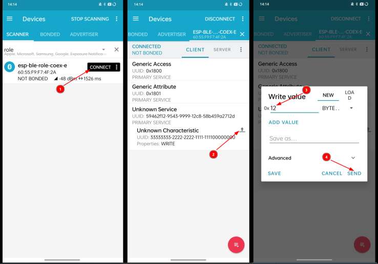

# BLE Multiple Connections Central Example Walkthrough

## Introduction

In this tutorial, the multiple connection example code for the espressif chipsets with BLE5.0 support is reviewed. The example demonstrates a scenario where dozens of connections are working simultaneously to showcase how to invoke vendor APIs to establish connections and enhance connection stability. While acting as a central device to connect multiple peripherals, it also broadcasts itself as connectable and can be connected by a phone. Once the phone successfully connects, it can perform write operations on all connected devices.  

To minimize the number of development boards, the central and peripheral devices can simulate multiple connections by changing their static random addresses. Therefore, this example only requires two Espressif development boards. Multiple development boards can also be used to simulate a real-world usage scenario.

## Includes

This example is located in the examples folder of the ESP-IDF under the [ble_multi_conn_cent/main](../main/). The [main.c](../main/main.c) file located in the main folder contains all the functionality that we are going to review. The header files contained in [main.c](../main/main.c) are:

```c
#include <string.h>
#include "esp_log.h"
#include "nvs_flash.h"
/* BLE */
#include "nimble/nimble_port.h"
#include "nimble/nimble_port_freertos.h"
#include "host/ble_hs.h"
#include "host/util/util.h"
#include "services/gap/ble_svc_gap.h"
#include "ble_multi_conn_cent.h"
```

These `includes` are required for the FreeRTOS and underlying system components to run, including the logging functionality and a library to store data in non-volatile flash memory. We are interested in `“nimble_port.h”`, `“nimble_port_freertos.h”`, `"ble_hs.h"` and `“ble_svc_gap.h”`, `“ble_multi_conn_cent.h”` which expose the BLE APIs required to implement this example.

* `nimble_port.h`: Includes the declaration of functions required for the initialization of the nimble stack.
* `nimble_port_freertos.h`: Initializes and enables nimble host task.
* `ble_hs.h`: Defines the functionalities to handle the host event
* `ble_svc_gap.h`:Defines the macros for device name and device appearance and declares the function to set them.
* `ble_multi_conn_cent.h`: Defines the functions used for multiple connections.

## Main Entry Point

The program’s entry point is the app_main() function:

```c
void
app_main(void)
{
    int rc;
    /* Initialize NVS — it is used to store PHY calibration data */
    esp_err_t ret = nvs_flash_init();
    if  (ret == ESP_ERR_NVS_NO_FREE_PAGES || ret == ESP_ERR_NVS_NEW_VERSION_FOUND) {
        ESP_ERROR_CHECK(nvs_flash_erase());
        ret = nvs_flash_init();
    }
    ESP_ERROR_CHECK(ret);

    ret = nimble_port_init();
    if (ret != ESP_OK) {
        ESP_LOGE(TAG, "Failed to init nimble %d ", ret);
        return;
    }

    /* Configure the host. */
    ble_hs_cfg.reset_cb = blecent_on_reset;
    ble_hs_cfg.sync_cb = blecent_on_sync;
    ble_hs_cfg.store_status_cb = ble_store_util_status_rr;

    /* Initialize data structures to track connected peers. */
    rc = peer_init(BLE_PEER_MAX_NUM, BLE_PEER_MAX_NUM, BLE_PEER_MAX_NUM, BLE_PEER_MAX_NUM);
    assert(rc == 0);

    /* Set the default device name. We will act as both central and peripheral. */
    rc = ble_svc_gap_device_name_set("esp-ble-role-coex");
    assert(rc == 0);

    rc = gatt_svr_init();
    assert(rc == 0);

    /* XXX Need to have template for store */
    ble_store_config_init();

    nimble_port_freertos_init(blecent_host_task);
}
```

The main function starts by initializing the non-volatile storage library. This library allows us to save the key-value pairs in flash memory.`nvs_flash_init()` stores the PHY calibration data.

```c
esp_err_t ret = nvs_flash_init();
if (ret == ESP_ERR_NVS_NO_FREE_PAGES || ret == ESP_ERR_NVS_NEW_VERSION_FOUND) {
    ESP_ERROR_CHECK(nvs_flash_erase());
    ret = nvs_flash_init();
}
ESP_ERROR_CHECK( ret );
```

## BT Controller and Stack Initialization

The main function calls `nimble_port_init()` to initialize BT Controller and nimble stack. This function initializes the BT controller by first creating its configuration structure named `esp_bt_controller_config_t` with default settings generated by the `BT_CONTROLLER_INIT_CONFIG_DEFAULT()` macro. It implements the Host Controller Interface (HCI) on the controller side, the Link Layer (LL), and the Physical Layer (PHY). The BT Controller is invisible to the user applications and deals with the lower layers of the BLE stack. The controller configuration includes setting the BT controller stack size, priority. With the settings created, the BT controller is initialized and enabled with the `esp_bt_controller_init()` and `esp_bt_controller_enable()` functions:

```c
esp_bt_controller_config_t config_opts = BT_CONTROLLER_INIT_CONFIG_DEFAULT();
ret = esp_bt_controller_init(&config_opts);
```

Next, the controller is enabled in BLE Mode.

```c
ret = esp_bt_controller_enable(ESP_BT_MODE_BLE);
```
>The controller should be enabled in `ESP_BT_MODE_BLE` if you want to use the BLE mode.

There are four Bluetooth modes supported:

1. `ESP_BT_MODE_IDLE`: Bluetooth not running
2. `ESP_BT_MODE_BLE`: BLE mode
3. `ESP_BT_MODE_CLASSIC_BT`: BT Classic mode
4. `ESP_BT_MODE_BTDM`: Dual mode (BLE + BT Classic)

After the initialization of the BT controller, the nimble stack, which includes the common definitions and APIs for BLE, is initialized by using `esp_nimble_init()`:

```c
esp_err_t esp_nimble_init(void)
{
#if !SOC_ESP_NIMBLE_CONTROLLER
    /* Initialize the function pointers for OS porting */
    npl_freertos_funcs_init();

    npl_freertos_mempool_init();

    if(esp_nimble_hci_init() != ESP_OK) {
        ESP_LOGE(NIMBLE_PORT_LOG_TAG, "hci inits failed\n");
        return ESP_FAIL;
    }

    /* Initialize default event queue */
    ble_npl_eventq_init(&g_eventq_dflt);
    /* Initialize the global memory pool */
    os_mempool_module_init();
    os_msys_init();

#endif
    /* Initialize the host */
    ble_transport_hs_init();

    return ESP_OK;
}
```

The host is configured by setting up the callbacks on Stack-reset, Stack-sync, registration of each GATT resource, and storage status.

```c
 ble_hs_cfg.reset_cb = ble_multi_adv_on_reset;
 ble_hs_cfg.sync_cb = ble_multi_adv_on_sync;
 ble_hs_cfg.gatts_register_cb = gatt_svr_register_cb;
 ble_hs_cfg.store_status_cb = ble_store_util_status_rr;
```

The main function calls `ble_svc_gap_device_name_set()` to set the default device name. 'esp-ble-role-coex' is passed as the default device name to this function.

```c
rc = ble_svc_gap_device_name_set("esp-ble-role-coex");
```

main function calls  `ble_store_config_init()` to configure the host by setting up the storage callbacks which handle the read, write, and deletion of security material.

```c
/* XXX Need to have a template for store */
ble_store_config_init();
```

The main function ends by creating a task where nimble will run using `nimble_port_freertos_init()`. This enables the nimble stack by using `esp_nimble_enable()`.

```c
nimble_port_freertos_init(ble_multi_adv_host_task);
```

`esp_nimble_enable()` create a task where the nimble host will run. It is not strictly necessary to have a separate task for the nimble host, but since something needs to handle the default queue, it is easier to create a separate task.

## Multiple Connections

This example will be executed according to the following steps:

* Call the vendor APIs to set a common factor. All subsequent connections need to set the interval as a multiple of this number to reduce mutual interference between different connections.

  ```c
      /*
       * To improve both throughput and stability, it is recommended to set the connection interval
       * as an integer multiple of the `MINIMUM_CONN_INTERVAL`. This `MINIMUM_CONN_INTERVAL` should
       * be calculated based on the total number of connections and the Transmitter/Receiver phy.
       *
       * Note that the `MINIMUM_CONN_INTERVAL` value should meet the condition that:
       *      MINIMUM_CONN_INTERVAL > ((MAX_TIME_OF_PDU * 2) + 150us) * CONN_NUM.
       *
       * For example, if we have 10 connections, maxmum TX/RX length is 251 and the phy is 1M, then
       * the `MINIMUM_CONN_INTERVAL` should be greater than ((261 * 8us) * 2 + 150us) * 10 = 43260us.
       *
       */
      rc = ble_gap_common_factor_set(true, (BLE_PREF_CONN_ITVL_MS * 1000) / 625);
  ```

* Enable both scan and adv simultaneously.

  ```c
      /* We will function as both the central and peripheral device, connecting to all peripherals
       * with the name of BLE_PEER_NAME. Meanwhile, a connectable advertising will be enabled.
       * In this example, we register two gap callback functions.
       *  - ble_cent_client_gap_event: Used by the central.
       *  - ble_cent_server_gap_event: Used by the peripheral.
       */
      ble_cent_advertise();
      ble_cent_scan();
  ```

* In the callback function of the scan, compare the name from the received adv. If it is the device you want to connect to, initiate the connection with the specified connection parameters.

  > When sending multiple connect requests to the same device, the peer may reject duplicate connections. Therefore, before initiating a connection, it is necessary to change your own static random address.

  ```c
      /* The parameters for multi-connect. We expect that this connection has at least
       * BLE_PREF_EVT_LEN_MS every interval to Rx and Tx.
       */
      multi_conn_params.scheduling_len_us = BLE_PREF_EVT_LEN_MS * 1000;
      multi_conn_params.own_addr_type = BLE_OWN_ADDR_RANDOM;
      multi_conn_params.peer_addr = peer_addr;
      multi_conn_params.duration_ms = 3000;
      multi_conn_params.phy_mask = BLE_GAP_LE_PHY_1M_MASK | BLE_GAP_LE_PHY_2M_MASK |
                                   BLE_GAP_LE_PHY_CODED_MASK;
      multi_conn_params.phy_1m_conn_params = &uncoded_conn_param;
      multi_conn_params.phy_2m_conn_params = &uncoded_conn_param;
      multi_conn_params.phy_coded_conn_params = &coded_conn_param;
  
      rc = ble_gap_multi_connect(&multi_conn_params, ble_cent_client_gap_event, NULL);
  ```

  

* The connection will be automatically established. When the maximum number of connections is reached, you can connect to a device named "esp-ble-role-coex-e" using your mobile phone (with `nRF Connect` APP). After writing to its characteristic , the central device will forward the received data to all peripherals.





## Conclusion

Users can use this example to understand how to use the vendor APIs and experience the stability of multiple connections it brings.

