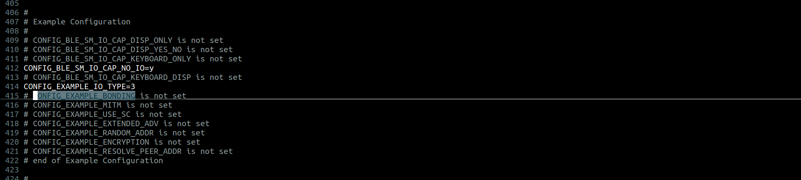
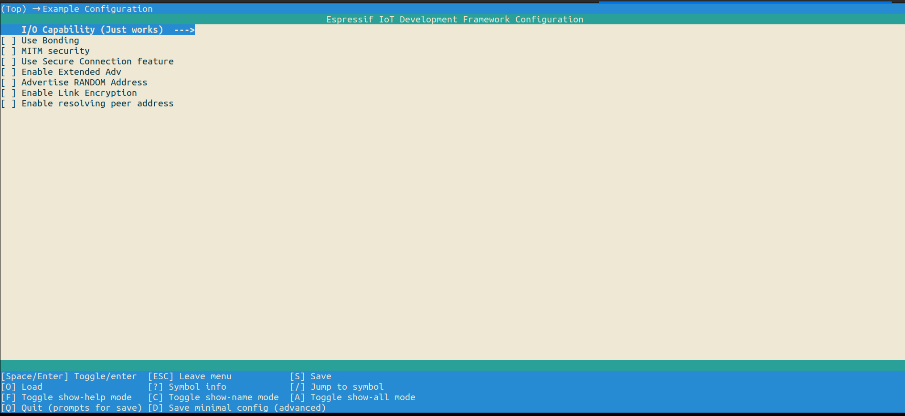

# BLE Peripheral Example Walkthrough

## Introduction

In this tutorial, the ble peripheral example code for the espressif chipsets is reviewed. This example aims at understanding GATT database configuration, handling GATT reads and writes, handling subscribe events, and understanding advertisement and SMP-related NimBLE APIs.It also demonstrates the security features of the NimBLE stack. SMP parameters like I/O capabilities of the device, Bonding flag, MITM protection flag and Secure Connection only mode, Enabling Link Encryption, etc., can be configured through menuconfig options.

## Includes

This example is located in the examples folder of the ESP-IDF under the [bleprph/main](../main). The [main.c](../main/main.c) file located in the main folder contains all the functionality that we are going to review. The header files contained in [main.c](../main/main.c) are:
These `includes` are required for the FreeRTOS and underlying system components to run, including the logging functionality and a library to store data in non-volatile flash memory. We are interested in `“nimble_port.h”`, `“nimble_port_freertos.h”`, `"ble_hs.h"` and `“ble_svc_gap.h”`, `“bleprph.h”` which expose the BLE APIs required to implement this example.

* `nimble_port.h`: Includes the declaration of functions required for the initialization of the nimble stack.
* `nimble_port_freertos.h`: Initializes and enables nimble host task.
* `ble_hs`.h`: Defines the functionalities to handle the host event
* `ble_svc_gap`.h`: Defines the macros for device name, and device appearance and declares the function to set them.
* `bleprph.h`: It includes the code containing forward declarations of 2 structs `ble_hs_cfg`, and `ble_gatt_register_ctxt`. It also defines the UUIDs for gatt server services and characteristics.

## Main Entry Point

The program’s entry point is the app_main() function:

```c
void
app_main(void)
{
    int rc;

    /* Initialize NVS — it is used to store PHY calibration data */
    esp_err_t ret = nvs_flash_init();
    if (ret == ESP_ERR_NVS_NO_FREE_PAGES || ret == ESP_ERR_NVS_NEW_VERSION_FOUND) {
        ESP_ERROR_CHECK(nvs_flash_erase());
        ret = nvs_flash_init();
    }
    ESP_ERROR_CHECK(ret);

    ret = nimble_port_init();
    if (ret != ESP_OK) {
        ESP_LOGE(tag, "Failed to init nimble %d ", ret);
        return;
    }
    /* Initialize the NimBLE host configuration. */
    ble_hs_cfg.reset_cb = bleprph_on_reset;
    ble_hs_cfg.sync_cb = bleprph_on_sync;
    ble_hs_cfg.gatts_register_cb = gatt_svr_register_cb;
    ble_hs_cfg.store_status_cb = ble_store_util_status_rr;

    ble_hs_cfg.sm_io_cap = CONFIG_EXAMPLE_IO_TYPE;
#ifdef CONFIG_EXAMPLE_BONDING
    ble_hs_cfg.sm_bonding = 1;
    /* Enable the appropriate bit masks to make sure the keys
     * that are needed are exchanged
     */
    ble_hs_cfg.sm_our_key_dist |= BLE_SM_PAIR_KEY_DIST_ENC;
    ble_hs_cfg.sm_their_key_dist |= BLE_SM_PAIR_KEY_DIST_ENC;
#endif
#ifdef CONFIG_EXAMPLE_MITM
    ble_hs_cfg.sm_mitm = 1;
#endif
#ifdef CONFIG_EXAMPLE_USE_SC
    ble_hs_cfg.sm_sc = 1;
#else
    ble_hs_cfg.sm_sc = 0;
#endif
#ifdef CONFIG_EXAMPLE_RESOLVE_PEER_ADDR
    /* Stores the IRK */
    ble_hs_cfg.sm_our_key_dist |= BLE_SM_PAIR_KEY_DIST_ID;
    ble_hs_cfg.sm_their_key_dist |= BLE_SM_PAIR_KEY_DIST_ID;
#endif

    rc = gatt_svr_init();
    assert(rc == 0);

    /* Set the default device name. */
    rc = ble_svc_gap_device_name_set("nimble-bleprph");
    assert(rc == 0);

    /* XXX Need to have template for store */
    ble_store_config_init();

    nimble_port_freertos_init(bleprph_host_task);

    /* Initialize command line interface to accept input from user */
    rc = scli_init();
    if (rc != ESP_OK) {
        ESP_LOGE(tag, "scli_init() failed");
    }
}
```
The main function starts by initializing the non-volatile storage library. This library allows us to save the key-value pairs in flash memory.`nvs_flash_init()` stores the PHY calibration data. In a Bluetooth Low Energy (BLE) device, cryptographic keys used for encryption and authentication are often stored in Non-Volatile Storage (NVS).BLE stores the peer keys, CCCD keys, peer records, etc on NVS. By storing these keys in NVS, the BLE device can quickly retrieve them when needed, without the need for time-consuming key generations.
```c
esp_err_t ret = nvs_flash_init();
if (ret == ESP_ERR_NVS_NO_FREE_PAGES || ret == ESP_ERR_NVS_NEW_VERSION_FOUND) {
    ESP_ERROR_CHECK(nvs_flash_erase());
    ret = nvs_flash_init();
}
ESP_ERROR_CHECK( ret );
```
## BT Controller and Stack Initialization

The main function calls `nimble_port_init()` to initialize BT Controller and nimble stack. This function initializes the BT controller by first creating its configuration structure named `esp_bt_controller_config_t` with default settings generated by the `BT_CONTROLLER_INIT_CONFIG_DEFAULT()` macro. It implements the Host Controller Interface (HCI) on the controller side, the Link Layer (LL), and the Physical Layer (PHY). The BT Controller is invisible to the user applications and deals with the lower layers of the BLE stack. The controller configuration includes setting the BT controller stack size, priority, and HCI baud rate. With the settings created, the BT controller is initialized and enabled with the `esp_bt_controller_init()` and `esp_bt_controller_enable()` functions:

```c
esp_bt_controller_config_t config_opts = BT_CONTROLLER_INIT_CONFIG_DEFAULT();
ret = esp_bt_controller_init(&config_opts);
```
Next, the controller is enabled in BLE Mode.

```c
ret = esp_bt_controller_enable(ESP_BT_MODE_BLE);
```
The controller should be enabled in `ESP_BT_MODE_BLE` if you want to use the BLE mode.

There are four Bluetooth modes supported:

1. `ESP_BT_MODE_IDLE`: Bluetooth not running
2. `ESP_BT_MODE_BLE`: BLE mode
3. `ESP_BT_MODE_CLASSIC_BT`: BT Classic mode
4. `ESP_BT_MODE_BTDM`: Dual mode (BLE + BT Classic)

After the initialization of the BT controller, the nimble stack, which includes the common definitions and APIs for BLE, is initialized by using `esp_nimble_init()`:

```c
esp_err_t esp_nimble_init(void)
{

#if !SOC_ESP_NIMBLE_CONTROLLER
    /* Initialize the function pointers for OS porting */
    npl_freertos_funcs_init();

    npl_freertos_mempool_init();

    if(esp_nimble_hci_init() != ESP_OK) {
        ESP_LOGE(NIMBLE_PORT_LOG_TAG, "hci inits failed\n");
        return ESP_FAIL;
    }

    /* Initialize default event queue */
    ble_npl_eventq_init(&g_eventq_dflt);

    os_msys_init();

    void ble_store_ram_init(void);
    /* XXX Need to have a template for store */
    ble_store_ram_init();
#endif

    /* Initialize the host */
    ble_hs_init();
    return ESP_OK;
}
```

The host is configured by setting up the callbacks that get executed upon  Stack-reset, Stack-sync, registration of each GATT resource (service, characteristic, or descriptor), and when a persistence operation cannot be performed or a persistence failure is imminent.

```c
ble_hs_cfg.reset_cb = bleprph_on_reset;
ble_hs_cfg.sync_cb = bleprph_on_sync;
ble_hs_cfg.gatts_register_cb = gatt_svr_register_cb;
ble_hs_cfg.store_status_cb = ble_store_util_status_rr;
```

## Security Manager Configuration
Security Manager (sm_ members) is configurable at runtime to simplify security testing. Defaults for those are configured by selecting proper options via menuconfig for example configurations.

### I/O CAPABILITIES
```c
ble_hs_cfg.sm_io_cap = CONFIG_EXAMPLE_IO_TYPE; // Security Manager Local Input Output Capabilities is set to 3 which represents no input and no output.
```
### USE BONDING 
```c
#ifdef CONFIG_EXAMPLE_BONDING
    ble_hs_cfg.sm_bonding = 1; // If set proper flag in Pairing, Request/Response will be set. This results in storing keys distributed during bonding

    /* Enable the appropriate bit masks to make sure the keys
     * that are needed are exchanged
     */
    ble_hs_cfg.sm_our_key_dist |= BLE_SM_PAIR_KEY_DIST_ENC; // Security Manager Local Key Distribution Mask

    ble_hs_cfg.sm_their_key_dist |= BLE_SM_PAIR_KEY_DIST_ENC; //Security Manager Remote Key Distribution Mask 
#endif
```
`CONFIG_EXAMPLE_BONDING` is set to enable the bonding on Bleprph. By default this flag is disabled. It can be configured through the sdkconfig file or from the menuconfig options.
The Following are screenshots of the same.






### MITM PROTECTION
```c
#ifdef CONFIG_EXAMPLE_MITM
    ble_hs_cfg.sm_mitm = 1; 
#endif
```
When the `CONFIG_EXAMPLE_MITM` flag is set during pairing, it will enable the MITM bit in the auth req field of pairing request, which in turn necessitates protection against Man-In-The-Middle attacks during the pairing process. The flag can be configured through sdkconfig or menuconfig as mentioned above.

### SECURE CONNECTION FEUTURE
```c
#ifdef CONFIG_EXAMPLE_USE_SC
    ble_hs_cfg.sm_sc = 1;
#else
    ble_hs_cfg.sm_sc = 0;
#endif
```
When the `CONFIG_EXAMPLE_USE_SC` flag is set in the Pairing Request/Response, it enables the usage of LE Secure Connections for pairing, provided that the remote device also supports it. If the remote device does not support LE Secure Connections, the pairing process falls back to using legacy pairing.

### ENABLE RESOLVING PEER ADDRESS
```c
#ifdef CONFIG_EXAMPLE_RESOLVE_PEER_ADDR
    /* Stores the IRK */
    ble_hs_cfg.sm_our_key_dist |= BLE_SM_PAIR_KEY_DIST_ID;
    ble_hs_cfg.sm_their_key_dist |= BLE_SM_PAIR_KEY_DIST_ID;
#endif
```
Above snippet is representing the distribution of identity resolving keys (IRKs) during the pairing process. IRKs are used in Bluetooth's device address resolution process, which allows devices to associate a resolvable private address with a public identity (IRK). This enhances privacy by making it difficult to track a device solely based on its address. This sets the keys that are distributed during the phase 3 for SMP pairing.

## GATT SERVER INIT
```c
 rc = gatt_svr_init();
    assert(rc == 0);
```
The gatt_svr_init function is called during the initialization phase of a BLE application to set up the GATT server and define the services and characteristics it supports. 

## SETTING DEVICE NAME
The main function calls `ble_svc_gap_device_name_set()` to set the default device name. 'nimble-bleprph' is passed as the default device name to this function.
```c
rc = ble_svc_gap_device_name_set("nimble-bleprph");
```
## BLE STORE CONFIGURATION
main function calls  `ble_store_config_init()` to configure the host by setting up the storage callbacks which handle the read, write, and deletion of security material.
```c
/* XXX Need to have a template for store */
    ble_store_config_init();
```
## THREAD MODEL
The main function creates a task where nimble will run using `nimble_port_freertos_init()`. This enables the nimble stack by using `esp_nimble_enable()`. 
```c
nimble_port_freertos_init(bleprph_host_task);
```
`esp_nimble_enable()` create a task where the nimble host will run. Nimble stack runs in a separate thread with its own context to handle async operations from controller and post HCI commands to controller.

## SETTING COMMAND-LINE INTERFACE
```c
  rc = scli_init();
    if (rc != ESP_OK) {
        ESP_LOGE(tag, "scli_init() failed");
    }
```
To initialize a command line interface (CLI) that accepts input from the user, the function scli_init() is used. This function registers the CLI command "key <value>" to receive input from the user during the pairing process. The pairing process is facilitated using the ble_register_cli() function.

# PERIPHERAL ADVERTISEMENT

1. Peripheral advertisement is used by many applications to start advertising from applications.`bleprph` example provides this feature of advertisement. It uses the following function to start an advertisement.
2. `bleprph_advertise` start by creating the instances of structures `ble_gap_adv_params` and `ble_hs_adv_fields`.
3. Advertising parameters such as connecting modes, discoverable modes, advertising intervals, channel map advertising filter policy, and high duty cycle for directed advertising are defined in these structures.
4. `ble_hs_adv_fields` provides a structure to store advertisement data in a Bluetooth Low Energy (BLE) application. It contains various data members, such as flags (indicating advertisement type and other general information), advertising transmit power, device name, and 16-bit service UUIDs (such as alert notifications), etc.

Below is the implementation to start the advertisement.
```c
static void
bleprph_advertise(void)
{
    struct ble_gap_adv_params adv_params;
    struct ble_hs_adv_fields fields;
    const char *name;
    int rc;

    /**
     *  Set the advertisement data included in our advertisements:
     *     o Flags (indicates advertisement type and other general info).
     *     o Advertising tx power.
     *     o Device name.
     *     o 16-bit service UUIDs (alert notifications).
     */

    memset(&fields, 0, sizeof fields);

    /* Advertise two flags:
     *     o Discoverability in forthcoming advertisement (general)
     *     o BLE-only (BR/EDR unsupported).
     */
    fields.flags = BLE_HS_ADV_F_DISC_GEN |
                   BLE_HS_ADV_F_BREDR_UNSUP;

    /* Indicate that the TX power level field should be included; have the
     * stack fill this value automatically.  This is done by assigning the
     * special value BLE_HS_ADV_TX_PWR_LVL_AUTO.
     */
    fields.tx_pwr_lvl_is_present = 1;
    fields.tx_pwr_lvl = BLE_HS_ADV_TX_PWR_LVL_AUTO;

    name = ble_svc_gap_device_name();
    fields.name = (uint8_t *)name;
    fields.name_len = strlen(name);
    fields.name_is_complete = 1;

    fields.uuids16 = (ble_uuid16_t[]) {
        BLE_UUID16_INIT(GATT_SVR_SVC_ALERT_UUID)
    };
    fields.num_uuids16 = 1;
    fields.uuids16_is_complete = 1;

    rc = ble_gap_adv_set_fields(&fields);
    if (rc != 0) {
        MODLOG_DFLT(ERROR, "error setting advertisement data; rc=%d\n", rc);
        return;
    }

    /* Begin advertising. */
    memset(&adv_params, 0, sizeof adv_params);
    adv_params.conn_mode = BLE_GAP_CONN_MODE_UND;
    adv_params.disc_mode = BLE_GAP_DISC_MODE_GEN;
    rc = ble_gap_adv_start(own_addr_type, NULL, BLE_HS_FOREVER,
                           &adv_params, bleprph_gap_event, NULL);
    if (rc != 0) {
        MODLOG_DFLT(ERROR, "error enabling advertisement; rc=%d\n", rc);
        return;
    }
}
```
## Configuration of Advertising data(`ble_hs_adv_fields fields`) 

### Setting advertising flags and transmitting power level
```c
  memset(&fields, 0, sizeof fields);

    fields.flags = BLE_HS_ADV_F_DISC_GEN |
                   BLE_HS_ADV_F_BREDR_UNSUP;
    fields.tx_pwr_lvl_is_present = 1;
    fields.tx_pwr_lvl = BLE_HS_ADV_TX_PWR_LVL_AUTO;
```
All data members of `fields` are initialized to 0 before setting up using the `memset()` function. Discoverability for upcoming advertisements is set to general. Advertisement is set to BLE supported only. Assigning the `tx_pwr_lvl` field to `BLE_HS_ADV_TX_PWR_LVL_AUTO` prompts the stack to automatically fill in the transmit power level field.

### Setting up the device name
```c
    name = ble_svc_gap_device_name();
    fields.name = (uint8_t *)name;
    fields.name_len = strlen(name);
    fields.name_is_complete = 1;
```
The app main function call the API `ble_svc_gap_device_name_set("nimble-bleprph")` which takes the user defined device name as a parameter. This API sets the device name to the characters array `ble_svc_gap_name` defined in the file [ble_svc_gap.c](../../../../../components/bt/host/nimble/nimble/nimble/host/services/gap/src/ble_svc_gap.c). The `ble_svc_gap_device_name()` API returns the same above mentioned char array which was set from the main function.

### Setting up the UUID for alert notification
```c
    fields.uuids16 = (ble_uuid16_t[]) {
        BLE_UUID16_INIT(GATT_SVR_SVC_ALERT_UUID)
    };
    fields.num_uuids16 = 1;
    fields.uuids16_is_complete = 1;

    rc = ble_gap_adv_set_fields(&fields);
    if (rc != 0) {
        MODLOG_DFLT(ERROR, "error setting advertisement data; rc=%d\n", rc);
        return;
    }
```
This example uses ANS service just as a way to uniquely identify itself from multiple advertisers and client can find it to connect to.
`ble_gap_adv_set_fields()` sets the following advertising data. This API internally depends on other APIs to set the data.APIs can be checked here [ble_hs_adv.c](../../../../../components/bt/host/nimble/nimble/nimble/host/src/ble_hs_adv.c)
1. Adv flags   
2. 16-bit service class UUIDS
3. 32-bit service class UUIDS
4. 128-bit service class UUIDS
5. Local Name
6. Tx Power Level
7. Slave connection interval range
8. Service data - 16-bit UUID
9. Public target address
10. Appearance
11. Advertising interval
12. Service data - 32-bit UUID
13. Service data - 128-bit UUID
14. URI
15. Manufacturer-specific data

## Start Advertisement

```c
memset(&adv_params, 0, sizeof adv_params);
    adv_params.conn_mode = BLE_GAP_CONN_MODE_UND;
    adv_params.disc_mode = BLE_GAP_DISC_MODE_GEN;
    rc = ble_gap_adv_start(own_addr_type, NULL, BLE_HS_FOREVER,
                           &adv_params, bleprph_gap_event, NULL);
    if (rc != 0) {
        MODLOG_DFLT(ERROR, "error enabling advertisement; rc=%d\n", rc);
        return;
    }
```
Advertisement parameters are initialized to 0 using `memset`. Enables advertising with general discoverable mode and undirected connectable mode.
The `ble_gap_adv_start()` function configures and starts the advertising procedure.

The description of the `ble_gap_adv_start()` method is as follows:
```c
Return Value : 0 on success, error code on failure
```

```c
Parameters

1. `own_addr_type`:The type of address the stack should use for itself. Valid values are:
- BLE_OWN_ADDR_PUBLIC
- BLE_OWN_ADDR_RANDOM
- BLE_OWN_ADDR_RPA_PUBLIC_DEFAULT
- BLE_OWN_ADDR_RPA_RANDOM_DEFAULT
2. `direct_addr`:The peer’s address for directed advertising. This parameter shall be non-NULL if directed advertising is being used. In this case, we have set it to NULL.
3. `duration_ms`: The duration of the advertisement procedure. On expiration, the procedure ends and a BLE_GAP_EVENT_ADV_COMPLETE event is reported. Units are milliseconds. Specify BLE_HS_FOREVER for no expiration.
4. `adv_params`: Additional arguments specifying the particulars of the advertising procedure.
5. `cb`: The callback to associate with this advertising procedure. If advertising ends, the event is reported through this callback. If advertising results in a connection, the connection inherits this callback as its event-reporting mechanism. The Callback, in this case, is `bleprph_gap_event`.
6. `cb_arg `: The optional argument to pass to the callback function.
```
## Extended Advertisement

```c
static void
ext_bleprph_advertise(void)
{
    struct ble_gap_ext_adv_params params;
    struct os_mbuf *data;
    uint8_t instance = 0;
    int rc;

    /* First check if any instance is already active */
    if(ble_gap_ext_adv_active(instance)) {
        return;
    }

    /* use defaults for non-set params */
    memset (&params, 0, sizeof(params));

    /* enable connectable advertising */
    params.connectable = 1;

    /* advertise using random addr */
    params.own_addr_type = BLE_OWN_ADDR_PUBLIC;

    params.primary_phy = BLE_HCI_LE_PHY_1M;
    params.secondary_phy = BLE_HCI_LE_PHY_2M;
    //params.tx_power = 127;
    params.sid = 1;

    params.itvl_min = BLE_GAP_ADV_FAST_INTERVAL1_MIN;
    params.itvl_max = BLE_GAP_ADV_FAST_INTERVAL1_MIN;

    /* configure instance 0 */
    rc = ble_gap_ext_adv_configure(instance, &params, NULL,
                                   bleprph_gap_event, NULL);
    assert (rc == 0);

    /* in this case only scan response is allowed */

    /* get mbuf for scan rsp data */
    data = os_msys_get_pkthdr(sizeof(ext_adv_pattern_1), 0);
    assert(data);

    /* fill mbuf with scan rsp data */
    rc = os_mbuf_append(data, ext_adv_pattern_1, sizeof(ext_adv_pattern_1));
    assert(rc == 0);

    rc = ble_gap_ext_adv_set_data(instance, data);
    assert (rc == 0);

    /* start advertising */
    rc = ble_gap_ext_adv_start(instance, 0, 0);
    assert (rc == 0);
}
```
Structure Declarations: The code declares structures and variables required for configuring and starting extended advertising.

1. Check for Active Instance: It checks whether the advertising instance with the specified instance number (0 in this case) is already active. If it's active, the function returns, meaning no further action is taken.

2. Initialize Advertising Parameters: The params structure is initialized with advertising parameters. It specifies that the advertising will be connectable, using a public address, with specified PHYs, set advertising set ID, and interval values.

3. Configure Advertising Instance: The function ble_gap_ext_adv_configure is called to configure the advertising instance with the specified parameters. It also associates a callback function bleprph_gap_event for handling GAP (Generic Access Profile) events related to advertising.

4. Allocate Memory for Scan Response Data: Memory is allocated to store scan response data using the function os_msys_get_pkthdr. The size of memory allocated is based on the size of ext_adv_pattern_1.

5. Fill Scan Response Data: The scan response data is filled into the allocated memory using os_mbuf_append. This data will be transmitted in response to scan requests from other devices.

6. Set Scan Response Data: The scan response data is associated with the advertising instance using the function ble_gap_ext_adv_set_data.

7. Start Extended Advertising: The function ble_gap_ext_adv_start is called to start the extended advertising for the specified instance.

Overall, this code configures and starts extended advertising with specific parameters for the given instance. It also sets scan response data to be sent along with advertising packets.

### Why Extended Advertisement
In Bluetooth 4.0, the advertising payload was a maximum of 31 octets. In Bluetooth 5, it is increased to 255 octets by adding additional advertising channels and new advertising PDUs.
This removes the need to duplicate the data payload on all three advertising channels while allowing considerably more advertising data in the area before running into coexistence issues.

Bluetooth 5 provides three low-energy PHYs:

- LE 1M PHY –1M/s bit rate; uncoded (each bit maps to a single radio symbol). The same PHY is used in Bluetooth 4.0.
- LE Coded PHY (new) – Supports 1M/s symbol rate with error correction coding. Used for Bluetooth 5’s “four times the range”.
- LE 2M PHY (new) –2M/S symbol rate; uncoded. Used for Bluetooth 5’s “2 times the speed”.
So with two new PHYs, 4 times the range and 2 times the speed is achieved. 

## GAP Events in bleprph
We have set the  `bleprph_gap_event()` as callback for `ble_gap_adv_start()` method. Various events are handled in the `bleprph_gap_event()`.Their list is as follows:
1. BLE_GAP_EVENT_CONNECT: This case handles when a new connection is established or a connection attempt fails. It prints connection status, and details about the connection, and, in case of failure, resume advertising. If the Connection was established then the connection descriptor is initiated using the method `ble_gap_conn_find()`.
2. BLE_GAP_EVENT_DISCONNECT: This case handles a disconnection event. It prints disconnection details and resumes advertising.
3. BLE_GAP_EVENT_CONN_UPDATE:  This case handles a connection parameter update event. It prints the updated connection parameters.
4. BLE_GAP_EVENT_ADV_COMPLETE: This case handles the completion of advertising. It resumes advertising when advertising completes.
5. BLE_GAP_EVENT_ENC_CHANGE: This case is activated when encryption is enabled or disabled for a connection. It displays the status of the encryption change and the connection descriptor. If encryption is enabled (when `CONFIG_EXAMPLE_ENCRYPTION` is defined), it initiates service discovery.
6. BLE_GAP_EVENT_NOTIFY_TX: This case handles a notification transmit event. It prints details about the transmitted notification.
7. BLE_GAP_EVENT_SUBSCRIBE: This case handles a subscription event. It prints details about subscription changes.
8. BLE_GAP_EVENT_MTU: This case is activated when the Maximum Transmission Unit (MTU) is updated for a connection. It prints the new MTU value and related information.
9. BLE_GAP_EVENT_REPEAT_PAIRING: The event occurs when we already have a bond with the peer, but it is attempting to establish a new secure link. It is convenient to just throw away the old bond and accept the new link.
 
These cases cover various events related to GAP and security management, allowing the application to respond appropriately to different situations during BLE communication.

## Conclusion
1. This example focuses on learning about GATT database configuration, handling GATT read and write operations, managing to subscribe events, understanding advertisement, and utilizing NimBLE APIs for SMP (Security Manager Protocol) related tasks.
2. In addition, this example showcases the security capabilities of the NimBLE stack. 
3. The configuration of SMP parameters, such as the device's I/O capabilities, bonding flag, Man-In-The-Middle (MITM) protection flag, Secure Connection Only mode, and enabling link encryption, can be easily set through menuconfig options.