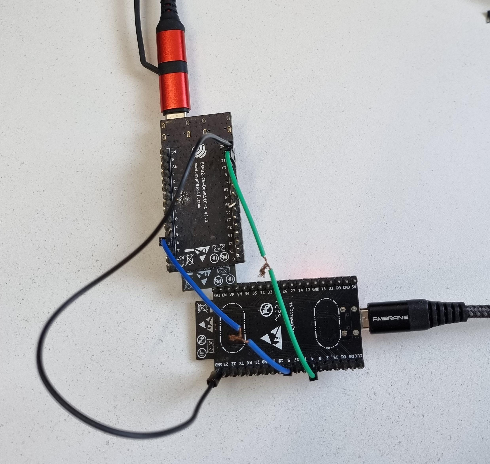

# BLE Peripheral Example Walkthrough

## Introduction

The tutorial is focused on how to implement the custom transport in the application and register it with nimble-host. This example has the exact same working as bleprph except the transport used is custom UART transport written in `"main/uart_driver.c"` file. The controller is disabled for this example, the nimble-host tries to communicate with the external connected controller using UART transport.

Note: This walkthrough only covers the transport used by the application, for detailed explanation see the [bleprph_walkthrough](../../bleprph/tutorial/bleprph_walkthrough.md)
## Hardware Setup

This example uses esp32 chip to run the example `bleprph_host_only` that runs the nimble-host and sends and receives the commands and events using uart. The another chip used is esp32c6 that runs the controller `esp-idf/examples/bluetooth/nimble/hci` example that runs the controller and receives commands and sends events using UART. Below is the setup of esp32 and esp32c6.



Note that the esp32 gpio pins tx=4 and rx=5 are configurable using idf.py menuconfig -> example config -> Uart Configuration. The tx pin of one chip connects to the rx pin of the other and vice versa.

The gpio pins for hci example are configurable through idf.py menuconfig -> Component config -> Bluetooth -> Controller Options -> HCI Config

Below is the pin connection chart for Esp32(Running host) and esp32c6(Running controller).

| Esp32 (Signal) | Esp32 (GPIO Pin)  | C6 (Signal) | C6 (GPIO Pin) |
|----------------|-------------------|-------------|---------------|
|       Rx       |         5         |      Tx     |       5       |
|       Tx       |         4         |      Rx     |       12      |

The same pin configuration could be used for esp32c3, esp32s3, esp32c2 and esp32c6.
For esp32p4 use the following configuration.

| P4 (Signal)    | P4 (GPIO Pin)     | C6 (Signal) | C6 (GPIO Pin) |
|----------------|-------------------|-------------|---------------|
|       Rx       |         22        |      Tx     |       5       |
|       Tx       |         21        |      Rx     |       12      |


```c
#define UART_TX_PIN              (4)
#define UART_RX_PIN              (5)
#define UART_RTS_PIN             (19)
#define UART_CTS_PIN             (23)
```

## Main Entry Point

The program’s entry point is the app_main() function:

```c
void
app_main(void)
{
    int rc;

    /* Initialize NVS — it is used to store PHY calibration data */
    esp_err_t ret = nvs_flash_init();
    if (ret == ESP_ERR_NVS_NO_FREE_PAGES || ret == ESP_ERR_NVS_NEW_VERSION_FOUND) {
        ESP_ERROR_CHECK(nvs_flash_erase());
        ret = nvs_flash_init();
    }
    ESP_ERROR_CHECK(ret);

    hci_uart_open();
    ret = nimble_port_init();
    if (ret != ESP_OK) {
        ESP_LOGE(tag, "Failed to init nimble %d ", ret);
        return;
    }
    ....
    ....
}
```
In the main function `hci_uart_open()` configures the uart with necessary parameters like baud_rate, parity, etc. The file [uart_driver.c](../main/uart_driver.c) has all the uart transport code along with the necessary apis mandated by nimble-host. `ble_transport_to_ll_acl_impl` is the api used to send the data to the controller. and `ble_transport_to_ll_cmd_impl` is used to send the command to the controller. These two apis are implemented as they are necessary. Along with these two apis, any data that is received in the rx direction is redirected to the host using `ble_transport_to_hs_evt` and `ble_transport_to_hs_acl` apis.

## Conclusion
1. This example covered how to write the custom transport layer and use it with nimble-host.
2. The example used the esp-hosted network-adapter example flashed on esp32c6 connected through UART to test this demo.
3. In the similar fashion the external controller could be connected.
