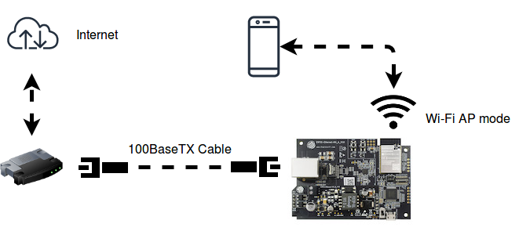

| Supported Targets | ESP32 | ESP32-C2 | ESP32-C3 | ESP32-C6 | ESP32-S2 | ESP32-S3 |
| ----------------- | ----- | -------- | -------- | -------- | -------- | -------- |

# eth2ap Example
(See the README.md file in the upper level 'examples' directory for more information about examples. To try a more complex application about Ethernet to WiFi data forwarding, please go to [iot-solution](https://github.com/espressif/esp-iot-solution/tree/release/v1.0/examples/eth2wifi).)

**Note:** This example uses some internal APIs (e.g. `esp_wifi_internal_tx`) which might get changed between minor versions of ESP-IDF.

## Overview


The similarities on MAC layer between Ethernet and Wi-Fi make it easy to forward packets from Ethernet to Wi-Fi and vice versa. This example illustrates how to implement a simple "router" which only supports forwarding packets between Ethernet port and Wi-Fi AP interface. In this case, the Ethernet should play the role of WAN (i.e. it can access outside network) so that a mobile device could get access to the Internet when it gets connected to ESP32 through Wi-Fi.

**Note:** In this example, ESP32 works like a *bridge* between Ethernet and Wi-Fi, and it won't perform any actions on Layer3 and higher layer, which means there's no need to initialize the TCP/IP stack.

## How to use example

### Hardware Required

To run this example, it's recommended that you have an official ESP32 Ethernet development board - [ESP32-Ethernet-Kit](https://docs.espressif.com/projects/esp-idf/en/latest/hw-reference/get-started-ethernet-kit.html). This example should also work for 3rd party ESP32 board as long as it's integrated with a supported Ethernet PHY chip. Up until now, ESP-IDF supports up to four Ethernet PHY: `LAN8720`, `IP101`, `DP83848` and `RTL8201`, additional PHY drivers should be implemented by users themselves.

Besides that, `esp_eth` component can drive third-party Ethernet module which integrates MAC and PHY and provides common communication interface (e.g. SPI, USB, etc). This example will take the **DM9051** as an example, illustrating how to install the Ethernet driver in the same manner.

#### Pin Assignment

See common pin assignments for Ethernet examples from [upper level](../README.md#common-pin-assignments).

### Configure the project

```
idf.py menuconfig
```

In addition to the common configurations for Ethernet examples from [upper level](../README.md#common-configurations), you might also need to update the default value of following configurations:

In the `Example Configuration` menu:
* Set the SSID and password for Wi-Fi ap interface under `Wi-Fi SSID` and `Wi-Fi Password`.
* Set the maximum connection number under `Maximum STA connections`.

### Build, Flash, and Run

Build the project and flash it to the board, then run monitor tool to view serial output:

```
idf.py -p PORT build flash monitor
```

(Replace PORT with the name of the serial port to use.)

(To exit the serial monitor, type ``Ctrl-]``.)

See the [Getting Started Guide](https://docs.espressif.com/projects/esp-idf/en/latest/get-started/index.html) for full steps to configure and use ESP-IDF to build projects.

## Example Output

### Step 1: Initialize Ethernet and Wi-Fi (AP mode)

```bash
I (508) example: Power On Ethernet PHY
I (518) system_api: Base MAC address is not set, read default base MAC address from BLK0 of EFUSE
I (518) emac: emac reset done
I (518) example: Ethernet Started
......
I (538) wifi: wifi driver task: 3ffc7fbc, prio:23, stack:3584, core=0
I (538) system_api: Base MAC address is not set, read default base MAC address from BLK0 of EFUSE
I (538) system_api: Base MAC address is not set, read default base MAC address from BLK0 of EFUSE
I (568) wifi: wifi firmware version: ec61a20
I (568) wifi: config NVS flash: enabled
I (568) wifi: config nano formating: disabled
I (568) wifi: Init dynamic tx buffer num: 32
I (568) wifi: Init data frame dynamic rx buffer num: 32
I (578) wifi: Init management frame dynamic rx buffer num: 32
I (588) wifi: Init management short buffer num: 32
I (588) wifi: Init static rx buffer size: 1600
I (588) wifi: Init static rx buffer num: 10
I (598) wifi: Init dynamic rx buffer num: 32
```

### Step 2: Ethernet Connects to Router/Switch/PC (with DHCP server enabled)

```bash
I (4518) example: Ethernet Link Up
```

### Step 3: Start Wi-Fi AP

```bash
I (4618) phy: phy_version: 4100, 2a5dd04, Jan 23 2019, 21:00:07, 0, 0
I (4618) wifi: mode : softAP (30:ae:a4:c6:87:5b)
I (4628) wifi: Total power save buffer number: 16
I (4628) wifi: Init max length of beacon: 752/752
I (4628) wifi: Init max length of beacon: 752/752
```

### Step 4: Wi-Fi station (e.g. mobile phone) connects to ESP32's Wi-Fi

```bash
I (10168) wifi: new:<1,0>, old:<1,0>, ap:<1,1>, sta:<255,255>, prof:1
I (10168) wifi: station: c4:0b:cb:ec:9a:84 join, AID=1, bgn, 20
I (10258) example: AP got a station connected
```

Now your mobile phone should get access to the Internet.

## Troubleshooting

See common troubleshooting for Ethernet examples from [upper level](../README.md#common-troubleshooting).

* If you got error message like `WiFi send packet failed` when running the example, you may need to enlarge the value of `FLOW_CONTROL_WIFI_SEND_DELAY_MS` in "ethernet_example_main.c", because Ethernet process packets faster than Wi-Fi on ESP32.
* If you got error message like `send flow control message failed or timeout` when running the example, you may need to enlarge the value of `FLOW_CONTROL_QUEUE_LENGTH` in "ethernet_example_main".
* Wi-Fi station doesn't receive any IP via DHCP?
    * All Layer 3 (TCP/IP functions) on the ESP32 are disabled, including the SoftAP DHCP server. This means that devices must be able to access another DHCP server (for example on a Wi-Fi router connected via ethernet) or should use statically assigned IP addresses.

(For any technical queries, please open an [issue](https://github.com/espressif/esp-idf/issues) on GitHub. We will get back to you as soon as possible.)
