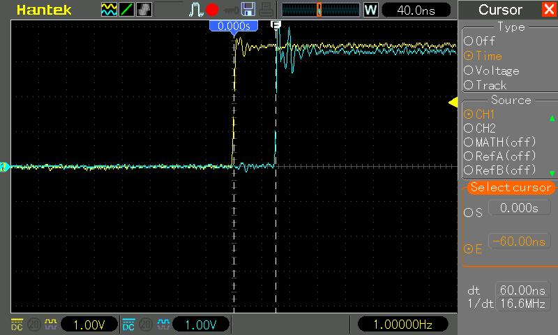

| Supported Targets | ESP32-P4 |
| ----------------- | -------- |

# Time Synchronization over PTP
(See the README.md file in the upper level 'examples' directory for more information about examples.)

## Overview

This example demonstrates the use of Precision Time Protocol (PTP) for time synchronization over Ethernet in ESP-IDF. PTP allows precise time synchronization between different nodes in a network. The example initializes Ethernet, starts a PTP daemon (based on a [Nuttx implementation](https://github.com/apache/nuttx-apps/tree/master/netutils/ptpd) ported to ESP-IDF), and showcases synchronization accuracy by toggling a GPIO pin.

The PTP protocol is transported over **Ethernet at Layer 2 (L2)**, following the guidelines set forth in Annex F of the IEEE 1588-2008 standard (also known as PTPv2). The **timestamps for synchronization are provided by internal Ethernet MAC (EMAC)** and are attached to Ethernet frames at the hardware level. These hardware-generated timestamps are then passed to the software via the **L2 TAP interface**, allowing precise clock synchronization with minimal latency.

The example is designed to run at least with two ESP32P4 boards, where one acts as **the master** and the other as **the slave**. Both devices will begin toggling a GPIO pin once they are synchronized. By measuring alignment of the rising edges of the GPIO pulse on both devices using an oscilloscope, you can observe the synchronization precision. The pulse width and toggle frequency can be configured using ``CONFIG_EXAMPLE_PTP_PULSE_WIDTH_NS``.

## How to use example

### Hardware Required

* It's recommended that you have two official ESP32P4 boards with Ethernet capabilities - [ESP32-P4-Function-EV-Board](https://docs.espressif.com/projects/esp-dev-kits/en/latest/esp32p4/esp32-p4-function-ev-board/user_guide.html).

* Oscilloscope to measure the GPIO pulse alignment between the master and slave devices.

#### Pin Assignment

See common pin assignments for Ethernet examples from [upper level](../README.md#common-pin-assignments).

### Configure the project

Run the:

```
idf.py menuconfig
```
and configure the following parameters:

* **PTP Pulse GPIO Pin**: Set the GPIO pin number for pulse toggling.
* **Pulse Width (ns)**: Set the pulse width (in nanoseconds).
* **PTP Daemon Configuration**: Select either Master or Slave and configure all the associated parameters per your application needs. To achieve more precise synchronization, enable ``PTP Client delay requests``.
* **Ethernet**: See common configurations for Ethernet examples from [upper level](../README.md#common-configurations).

### Build, Flash, and Run

Build the project for both boards and flash it, then run monitor tool to view serial output:

```
idf.py -p PORT build flash monitor
```

(Replace PORT with the name of the serial port to use.)

(To exit the serial monitor, type ``Ctrl-]``.)

See the [Getting Started Guide](https://docs.espressif.com/projects/esp-idf/en/latest/get-started/index.html) for full steps to configure and use ESP-IDF to build projects.

## Example Output

### PTP Slave

```
I (10107) ptpd: Got announce packet, seq 3120

I (10107) ptpd: Switching to better PTP time source

I (10107) gpio: GPIO[20]| InputEn: 0| OutputEn: 1| OpenDrain: 0| Pullup: 0| Pulldown: 0| Intr:0 
I (10107) ptpd: Got sync packet, seq 31198

I (10127) ptpd: Waiting for follow-up

I (10127) ptpd: Got follow-up packet, seq 31198

I (10137) ptpd: Local time: 7.633787680, remote time 31996.904013440

I (10137) ptpd: Jumped to timestamp 31996.935345720 s

I (9866) ptp_example: Starting Pulse train

I (9866) ptp_example: curr time: 230.312127120

I (9876) ptp_example: next time: 231.500000000

I (9876) main_task: Returned from app_main()
I (10836) ptpd: Got sync packet, seq 229

I (10836) ptpd: Waiting for follow-up

I (10836) ptpd: Got follow-up packet, seq 229

I (10846) ptpd: Local time: 231.286076880, remote time 231.286195640

I (10846) ptpd: remote_delta_ns 231286195640, local_delta_ns 231286076880, tick_diff 118760

I (10856) ptpd: offset_ns 118760, adj 130636, drift_acc 11876

...

I (59686) ptpd: Waiting for follow-up

I (59686) ptpd: Got follow-up packet, seq 277

I (59696) ptpd: Local time: 280.136196920, remote time 280.136196120

I (59696) ptpd: remote_delta_ns 1030000440, local_delta_ns 1030000440, tick_diff 0

I (59706) ptpd: offset_ns -186, adj 2, drift_acc 188

I (59716) ptpd: Sent delay req, seq 19

I (59716) ptpd: Got delay-resp, seq 19

I (59726) ptpd: Path delay: 847 ns (avg: 626 ns)
```

### Synchronization Pulses

The below figure shows synchronization pulses generated by master and slave device measured on oscilloscope.



## Troubleshooting

See common troubleshooting for Ethernet examples from [upper level](../README.md#common-troubleshooting).

(For any technical queries, please open an [issue](https://github.com/espressif/esp-idf/issues) on GitHub. We will get back to you as soon as possible.)
