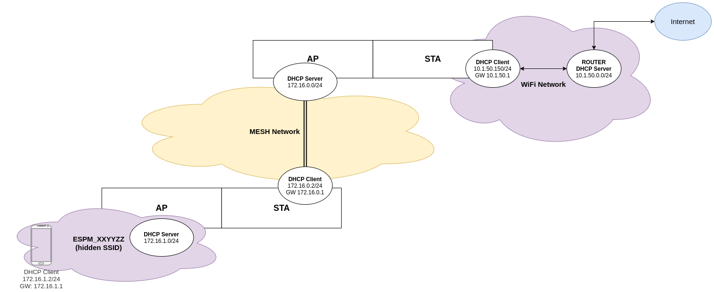

# Non-Mesh Communication Example

This example demonstrates how to use mesh to forward non-mesh traffic to internet and back.
It's basically a fork of the `internal_communication` but with some additional (IP) configurations.
Basically it provides internet access via every node hidden SSID (`ESPM_XXYYZZ` where `XXYYZZ` are the last 3 bytes of the STA MAC address).



## Limitations
* DNS server is not (always) correctly set 
* Sometimes it seems that it takes some seconds in order for the connectivity work
* Non-mesh clients gets disconnected probably because of `esp_mesh_set_ap_assoc_expire` timer
* Unstable performance (see the 3-layer iPerf test below) sometimes starting the iPerf client make the connectivity drops completely (not even a ping) which is later then restore

## Perf

### WiFi iPerf client (directly connected to router SSID)
```
Accepted connection from 192.168.1.101, port 58107
[  5] local 192.168.1.107 port 5201 connected to 192.168.1.101 port 58108
[ ID] Interval           Transfer     Bitrate
[  5]   0.00-1.00   sec  9.44 MBytes  79.2 Mbits/sec                  
[  5]   1.00-2.00   sec  10.4 MBytes  87.5 Mbits/sec                  
[  5]   2.00-3.00   sec  10.6 MBytes  89.2 Mbits/sec                  
[  5]   3.00-4.00   sec  10.7 MBytes  89.9 Mbits/sec                  
[  5]   4.00-5.00   sec  10.2 MBytes  85.1 Mbits/sec                  
[  5]   5.00-6.00   sec  10.8 MBytes  90.8 Mbits/sec                  
[  5]   6.00-7.00   sec  10.9 MBytes  91.1 Mbits/sec                  
[  5]   7.00-8.00   sec  11.0 MBytes  92.5 Mbits/sec                  
[  5]   8.00-9.00   sec  10.7 MBytes  89.5 Mbits/sec                  
[  5]   9.00-10.00  sec  10.7 MBytes  89.6 Mbits/sec                  
[  5]  10.00-10.04  sec   433 KBytes  93.8 Mbits/sec                  
- - - - - - - - - - - - - - - - - - - - - - - - -
[ ID] Interval           Transfer     Bitrate
[  5]   0.00-10.04  sec   106 MBytes  88.5 Mbits/sec                  receiver
```

### WiFi iPerf client (directly connected to the ROOT node hidden SSID of the mesh network)
```
Accepted connection from 192.168.1.101, port 58117
[  5] local 192.168.1.107 port 5201 connected to 192.168.1.101 port 58118
[ ID] Interval           Transfer     Bitrate
[  5]   0.00-1.00   sec  2.18 MBytes  18.3 Mbits/sec                  
[  5]   1.00-2.00   sec  2.18 MBytes  18.3 Mbits/sec                  
[  5]   2.00-3.00   sec  2.18 MBytes  18.3 Mbits/sec                  
[  5]   3.00-4.00   sec  2.13 MBytes  17.9 Mbits/sec                  
[  5]   4.00-5.00   sec  2.24 MBytes  18.8 Mbits/sec                  
[  5]   5.00-6.00   sec  2.09 MBytes  17.5 Mbits/sec                  
[  5]   6.00-7.00   sec  2.28 MBytes  19.1 Mbits/sec                  
[  5]   7.00-8.00   sec  2.18 MBytes  18.3 Mbits/sec                  
[  5]   8.00-9.00   sec  2.08 MBytes  17.5 Mbits/sec                  
[  5]   9.00-10.00  sec  2.16 MBytes  18.1 Mbits/sec                  
[  5]  10.00-10.01  sec  38.2 KBytes  25.7 Mbits/sec                  
- - - - - - - - - - - - - - - - - - - - - - - - -
[ ID] Interval           Transfer     Bitrate
[  5]   0.00-10.01  sec  21.7 MBytes  18.2 Mbits/sec                  receiver
```

### WiFi iPerf client (via 2-layer mesh network)
```
Accepted connection from 192.168.1.101, port 58087
[  5] local 192.168.1.107 port 5201 connected to 192.168.1.101 port 58088
[ ID] Interval           Transfer     Bitrate
[  5]   0.00-1.00   sec   669 KBytes  5.48 Mbits/sec                  
[  5]   1.00-2.00   sec   778 KBytes  6.37 Mbits/sec                  
[  5]   2.00-3.00   sec   950 KBytes  7.78 Mbits/sec                  
[  5]   3.00-4.00   sec   874 KBytes  7.16 Mbits/sec                  
[  5]   4.00-5.00   sec   868 KBytes  7.11 Mbits/sec                  
[  5]   5.00-6.00   sec   894 KBytes  7.32 Mbits/sec                  
[  5]   6.00-7.00   sec   796 KBytes  6.52 Mbits/sec                  
[  5]   7.00-8.00   sec   861 KBytes  7.05 Mbits/sec                  
[  5]   8.00-9.00   sec   874 KBytes  7.16 Mbits/sec                  
[  5]   9.00-10.00  sec   853 KBytes  6.99 Mbits/sec                  
[  5]  10.00-10.05  sec  48.1 KBytes  8.05 Mbits/sec                  
- - - - - - - - - - - - - - - - - - - - - - - - -
[ ID] Interval           Transfer     Bitrate
[  5]   0.00-10.05  sec  8.27 MBytes  6.90 Mbits/sec                  receiver
```

### WiFi iPerf client (via 3-layer chain mesh network)
```
Connecting to host 192.168.1.107, port 5201
[  4] local 172.16.1.2 port 58286 connected to 192.168.1.107 port 5201
[ ID] Interval           Transfer     Bandwidth
[  4]   0.00-1.00   sec   370 KBytes  3.03 Mbits/sec
[  4]   1.00-2.00   sec   148 KBytes  1.21 Mbits/sec
[  4]   2.00-3.00   sec   339 KBytes  2.77 Mbits/sec
[  4]   3.00-4.00   sec   334 KBytes  2.74 Mbits/sec
[  4]   4.00-5.00   sec   376 KBytes  3.08 Mbits/sec
[  4]   5.00-6.00   sec   322 KBytes  2.63 Mbits/sec
[  4]   6.00-7.00   sec   337 KBytes  2.77 Mbits/sec
[  4]   7.00-8.00   sec   375 KBytes  3.07 Mbits/sec
[  4]   8.00-9.00   sec   332 KBytes  2.73 Mbits/sec
[  4]   9.00-10.00  sec   397 KBytes  3.25 Mbits/sec
- - - - - - - - - - - - - - - - - - - - - - - - -
[ ID] Interval           Transfer     Bandwidth
[  4]   0.00-10.00  sec  3.25 MBytes  2.73 Mbits/sec                  sender
[  4]   0.00-10.00  sec  3.14 MBytes  2.63 Mbits/sec                  receiver

[  4] local 172.16.1.2 port 58288 connected to 192.168.1.107 port 5201
[ ID] Interval           Transfer     Bandwidth
[  4]   0.00-1.00   sec   468 KBytes  3.83 Mbits/sec
[  4]   1.00-2.00   sec   286 KBytes  2.34 Mbits/sec
[  4]   2.00-3.00   sec   304 KBytes  2.50 Mbits/sec
[  4]   3.00-4.00   sec   358 KBytes  2.93 Mbits/sec
[  4]   4.00-5.00   sec   370 KBytes  3.04 Mbits/sec
[  4]   5.00-6.00   sec   362 KBytes  2.96 Mbits/sec
[  4]   6.00-7.00   sec   368 KBytes  3.01 Mbits/sec
[  4]   7.00-8.00   sec   300 KBytes  2.46 Mbits/sec
[  4]   8.00-9.00   sec   286 KBytes  2.34 Mbits/sec
[  4]   9.00-10.00  sec   141 KBytes  1.15 Mbits/sec
- - - - - - - - - - - - - - - - - - - - - - - - -
[ ID] Interval           Transfer     Bandwidth
[  4]   0.00-10.00  sec  3.17 MBytes  2.66 Mbits/sec                  sender
[  4]   0.00-10.00  sec  3.08 MBytes  2.58 Mbits/sec                  receiver

[  4] local 172.16.1.2 port 58290 connected to 192.168.1.107 port 5201
[ ID] Interval           Transfer     Bandwidth
[  4]   0.00-1.00   sec   227 KBytes  1.86 Mbits/sec
[  4]   1.00-2.00   sec  0.00 Bytes  0.00 bits/sec
[  4]   2.00-3.00   sec  0.00 Bytes  0.00 bits/sec
[  4]   3.00-4.00   sec  0.00 Bytes  0.00 bits/sec
[  4]   4.00-5.00   sec  0.00 Bytes  0.00 bits/sec
[  4]   5.00-6.00   sec  0.00 Bytes  0.00 bits/sec
[  4]   6.00-7.00   sec  0.00 Bytes  0.00 bits/sec
[  4]   7.00-8.00   sec  0.00 Bytes  0.00 bits/sec
[  4]   8.00-9.00   sec  0.00 Bytes  0.00 bits/sec
[  4]   9.00-10.00  sec  0.00 Bytes  0.00 bits/sec
- - - - - - - - - - - - - - - - - - - - - - - - -
[ ID] Interval           Transfer     Bandwidth
[  4]   0.00-10.00  sec   227 KBytes   186 Kbits/sec                  sender
[  4]   0.00-10.00  sec  93.3 KBytes  76.4 Kbits/sec                  receiver

[  4] local 172.16.1.2 port 58296 connected to 192.168.1.107 port 5201
[ ID] Interval           Transfer     Bandwidth
[  4]   0.00-1.01   sec   192 KBytes  1.57 Mbits/sec
[  4]   1.01-2.00   sec  41.0 KBytes   337 Kbits/sec
[  4]   2.00-3.00   sec  66.4 KBytes   543 Kbits/sec
[  4]   3.00-4.00   sec  0.00 Bytes  0.00 bits/sec
[  4]   4.00-5.00   sec   102 KBytes   833 Kbits/sec
[  4]   5.00-6.00   sec  0.00 Bytes  0.00 bits/sec
[  4]   6.00-7.00   sec  0.00 Bytes  0.00 bits/sec
[  4]   7.00-8.00   sec  0.00 Bytes  0.00 bits/sec
[  4]   8.00-9.00   sec  0.00 Bytes  0.00 bits/sec
[  4]  10.00-25.49  sec  0.00 Bytes  0.00 bits/sec
- - - - - - - - - - - - - - - - - - - - - - - - -
[ ID] Interval           Transfer     Bandwidth
[  4]   0.00-25.49  sec   401 KBytes   129 Kbits/sec                  sender
[  4]   0.00-25.49  sec  0.00 Bytes  0.00 bits/sec                  receiver

[  4] local 172.16.1.2 port 58303 connected to 192.168.1.107 port 5201
[ ID] Interval           Transfer     Bandwidth
[  4]   0.00-1.00   sec   311 KBytes  2.55 Mbits/sec
[  4]   1.00-2.00   sec   271 KBytes  2.22 Mbits/sec
[  4]   2.00-3.00   sec   252 KBytes  2.06 Mbits/sec
[  4]   3.00-4.00   sec   252 KBytes  2.06 Mbits/sec
[  4]   4.00-5.00   sec   116 KBytes   950 Kbits/sec
[  4]   5.00-6.00   sec  0.00 Bytes  0.00 bits/sec
[  4]   6.00-7.01   sec  0.00 Bytes  0.00 bits/sec
[  4]   7.01-8.00   sec  0.00 Bytes  0.00 bits/sec
[  4]   8.00-9.00   sec  0.00 Bytes  0.00 bits/sec
[  4]   9.00-10.00  sec  0.00 Bytes  0.00 bits/sec
- - - - - - - - - - - - - - - - - - - - - - - - -
[ ID] Interval           Transfer     Bandwidth
[  4]   0.00-10.00  sec  1.17 MBytes   985 Kbits/sec                  sender
[  4]   0.00-10.00  sec  1.09 MBytes   917 Kbits/sec                  receiver

[  4] local 172.16.1.2 port 58307 connected to 192.168.1.107 port 5201
[ ID] Interval           Transfer     Bandwidth
[  4]   0.00-1.00   sec   241 KBytes  1.96 Mbits/sec
[  4]   1.00-2.00   sec  0.00 Bytes  0.00 bits/sec
[  4]   2.00-3.00   sec  0.00 Bytes  0.00 bits/sec
[  4]   3.00-4.00   sec  3.86 MBytes  32.4 Mbits/sec
[  4]   4.00-5.00   sec  0.00 Bytes  0.00 bits/sec
[  4]   5.00-6.00   sec  0.00 Bytes  0.00 bits/sec
[  4]   6.00-7.00   sec  0.00 Bytes  0.00 bits/sec
[  4]   7.00-8.00   sec  0.00 Bytes  0.00 bits/sec
[  4]   8.00-9.00   sec  0.00 Bytes  0.00 bits/sec
[  4]   9.00-10.00  sec  0.00 Bytes  0.00 bits/sec
- - - - - - - - - - - - - - - - - - - - - - - - -
[ ID] Interval           Transfer     Bandwidth
[  4]   0.00-10.00  sec  4.10 MBytes  3.43 Mbits/sec                  sender
[  4]   0.00-10.00  sec   172 KBytes   141 Kbits/sec                  receiver

[  4] local 172.16.1.2 port 58312 connected to 192.168.1.107 port 5201
[ ID] Interval           Transfer     Bandwidth
[  4]   0.00-1.00   sec   276 KBytes  2.26 Mbits/sec
[  4]   1.00-2.00   sec  97.6 KBytes   799 Kbits/sec
[  4]   2.00-3.00   sec   284 KBytes  2.33 Mbits/sec
[  4]   3.00-4.00   sec   214 KBytes  1.75 Mbits/sec
[  4]   4.00-5.00   sec   240 KBytes  1.97 Mbits/sec
[  4]   5.00-6.00   sec   252 KBytes  2.06 Mbits/sec
[  4]   6.00-7.00   sec   264 KBytes  2.17 Mbits/sec
[  4]   7.00-8.00   sec   286 KBytes  2.34 Mbits/sec
[  4]   8.00-9.00   sec   246 KBytes  2.01 Mbits/sec
[  4]   9.00-10.00  sec   253 KBytes  2.08 Mbits/sec
- - - - - - - - - - - - - - - - - - - - - - - - -
[ ID] Interval           Transfer     Bandwidth
[  4]   0.00-10.00  sec  2.36 MBytes  1.98 Mbits/sec                  sender
[  4]   0.00-10.00  sec  2.25 MBytes  1.89 Mbits/sec                  receiver

[  4] local 172.16.1.2 port 58314 connected to 192.168.1.107 port 5201
[ ID] Interval           Transfer     Bandwidth
[  4]   0.00-1.00   sec   416 KBytes  3.40 Mbits/sec
[  4]   1.00-2.00   sec   148 KBytes  1.21 Mbits/sec
[  4]   2.00-3.00   sec   163 KBytes  1.34 Mbits/sec
[  4]   3.00-4.00   sec   284 KBytes  2.32 Mbits/sec
[  4]   4.00-5.00   sec   256 KBytes  2.10 Mbits/sec
[  4]   5.00-6.00   sec   308 KBytes  2.53 Mbits/sec
[  4]   6.00-7.00   sec   339 KBytes  2.78 Mbits/sec
[  4]   7.00-8.00   sec   181 KBytes  1.48 Mbits/sec
[  4]   8.00-9.00   sec  0.00 Bytes  0.00 bits/sec
[  4]   9.00-10.00  sec  0.00 Bytes  0.00 bits/sec
- - - - - - - - - - - - - - - - - - - - - - - - -
[ ID] Interval           Transfer     Bandwidth
[  4]   0.00-10.00  sec  2.05 MBytes  1.72 Mbits/sec                  sender
[  4]   0.00-10.00  sec  1.96 MBytes  1.65 Mbits/sec                  receiver

[  4] local 172.16.1.2 port 58316 connected to 192.168.1.107 port 5201
[ ID] Interval           Transfer     Bandwidth
[  4]   0.00-1.00   sec   412 KBytes  3.37 Mbits/sec
[  4]   1.00-2.00   sec  18.8 KBytes   154 Kbits/sec
[  4]   2.00-3.00   sec  0.00 Bytes  0.00 bits/sec
[  4]   3.00-4.00   sec   233 KBytes  1.91 Mbits/sec
[  4]   4.00-5.00   sec   322 KBytes  2.64 Mbits/sec
[  4]   5.00-6.00   sec   342 KBytes  2.81 Mbits/sec
[  4]   6.00-7.00   sec   296 KBytes  2.42 Mbits/sec
[  4]   7.00-8.00   sec   280 KBytes  2.29 Mbits/sec
[  4]   8.00-9.00   sec   293 KBytes  2.39 Mbits/sec
[  4]   9.00-10.00  sec   277 KBytes  2.28 Mbits/sec
- - - - - - - - - - - - - - - - - - - - - - - - -
[ ID] Interval           Transfer     Bandwidth
[  4]   0.00-10.00  sec  2.42 MBytes  2.03 Mbits/sec                  sender
[  4]   0.00-10.00  sec  2.33 MBytes  1.95 Mbits/sec                  receiver
```