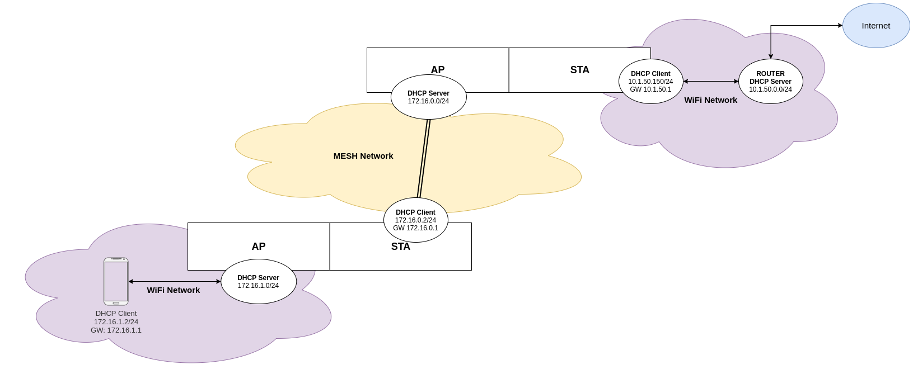

# Non-Mesh IP Internal Communication Example

This example demonstrates how to use mesh to forward non-mesh IP traffic to internet edge and back. 
It's basically a fork of the `ip_internal_network` but where a node can be converted to an entrypoint node 
for non-mesh devices to reach internet via the mesh network. It can be seen as a WiFi extender/repeater.
To do so I have to (mis)configure the mesh network on the node(s) that will be used as entry-point for the non-mesh clients.
Specifically I introduce the `ap` console command that will reconfigure the node in the following way:
* Reconfigure SoftAP to expose a new SSID that will be used by non-mesh clients
* Enable DHCP server on SoftAP
* Enable PNAT on the SoftAP interface (traffic from the non-mesh clients is NATed and forwarded to ST and therefore to the root node)




## Functionality

This example uses experimental NAT feature to translate addresses/ports from an internal subnet (mesh-network), that is created 
by the root node running a DHCP server. 
At the same time, a node can be converted in an entrypoint node for non-mesh device.
To do so you need to send `ap` command to the esp console of the desired node.
This command reconfigure the soft-AP and creates a new WiFI network (with DHCP server support). 
Traffic coming from that network (nonmesh-network) will be NATed and forwarded to the root node and ultimately reach the Internet.

## Limitations
* This explicitly mess up the mesh configuration on a specific node, aka such node cannot be used as "forwarder" node anymore
* There is no intra-node/intra-nonmesh clients IP communication
* It only allows a non-mesh client to access internet via the mesh network (and root node)

## Perf

### WiFi iPerf client (directly connected to router SSID)
```
Accepted connection from 192.168.1.101, port 54900
[  5] local 192.168.1.107 port 5201 connected to 192.168.1.101 port 54901
[ ID] Interval           Transfer     Bitrate
[  5]   0.00-1.00   sec  4.81 MBytes  40.3 Mbits/sec                  
[  5]   1.00-2.00   sec  4.14 MBytes  34.7 Mbits/sec                  
[  5]   2.00-3.00   sec  4.51 MBytes  37.9 Mbits/sec                  
[  5]   3.00-4.00   sec  3.39 MBytes  28.5 Mbits/sec                  
[  5]   4.00-5.00   sec  3.43 MBytes  28.8 Mbits/sec                  
[  5]   5.00-6.00   sec  5.38 MBytes  45.2 Mbits/sec                  
[  5]   6.00-7.00   sec  5.86 MBytes  49.2 Mbits/sec                  
[  5]   7.00-8.00   sec  5.41 MBytes  45.4 Mbits/sec                  
[  5]   8.00-9.00   sec  6.23 MBytes  52.3 Mbits/sec                  
[  5]   9.00-10.00  sec  5.31 MBytes  44.5 Mbits/sec                  
[  5]  10.00-10.33  sec  1.87 MBytes  47.6 Mbits/sec                  
- - - - - - - - - - - - - - - - - - - - - - - - -
[ ID] Interval           Transfer     Bitrate
[  5]   0.00-10.33  sec  50.4 MBytes  40.9 Mbits/sec                  receiver
```

### WiFi iPerf client (via 2-layer mesh network)
The node on the 2nd layer is used as entrypoint node, the WiFi client attaches to it.
```
Accepted connection from 192.168.1.101, port 55390
[  5] local 192.168.1.107 port 5201 connected to 192.168.1.101 port 55391
[ ID] Interval           Transfer     Bitrate
[  5]   0.00-1.00   sec  92.8 KBytes   760 Kbits/sec                  
[  5]   1.00-2.00   sec   245 KBytes  2.01 Mbits/sec                  
[  5]   2.00-3.00   sec   266 KBytes  2.18 Mbits/sec                  
[  5]   3.00-4.00   sec   261 KBytes  2.14 Mbits/sec                  
[  5]   4.00-5.00   sec   220 KBytes  1.81 Mbits/sec                  
[  5]   5.00-6.00   sec   303 KBytes  2.48 Mbits/sec                  
[  5]   6.00-7.00   sec   239 KBytes  1.96 Mbits/sec                  
[  5]   7.00-8.00   sec   256 KBytes  2.10 Mbits/sec                  
[  5]   8.00-9.00   sec   247 KBytes  2.02 Mbits/sec                  
[  5]   9.00-10.00  sec   187 KBytes  1.53 Mbits/sec                  
- - - - - - - - - - - - - - - - - - - - - - - - -
[ ID] Interval           Transfer     Bitrate
[  5]   0.00-10.06  sec  2.26 MBytes  1.89 Mbits/sec                  receiver
```

### WiFi iPerf client (directly attached to the root node in a "single-node" network)
```
Accepted connection from 192.168.1.101, port 55916
[  5] local 192.168.1.107 port 5201 connected to 192.168.1.101 port 55917
[ ID] Interval           Transfer     Bitrate
[  5]   0.00-1.00   sec  0.00 Bytes  0.00 bits/sec                  
[  5]   1.00-2.00   sec   493 KBytes  4.04 Mbits/sec                  
[  5]   2.00-3.00   sec  1.38 MBytes  11.6 Mbits/sec                  
[  5]   3.00-4.00   sec  1.55 MBytes  13.0 Mbits/sec                  
[  5]   4.00-5.00   sec  1.48 MBytes  12.4 Mbits/sec                  
[  5]   5.00-6.00   sec  1.25 MBytes  10.5 Mbits/sec                  
[  5]   6.00-7.00   sec  1.33 MBytes  11.2 Mbits/sec                  
[  5]   7.00-8.00   sec  1.45 MBytes  12.1 Mbits/sec                  
[  5]   8.00-9.00   sec  1.24 MBytes  10.4 Mbits/sec                  
[  5]   9.00-10.00  sec  1.48 MBytes  12.4 Mbits/sec                  
[  5]  10.00-10.02  sec  32.5 KBytes  17.5 Mbits/sec                  
- - - - - - - - - - - - - - - - - - - - - - - - -
[ ID] Interval           Transfer     Bitrate
[  5]   0.00-10.02  sec  11.7 MBytes  9.77 Mbits/sec                  receiver
```

## ToDo's
- [ ] Perf are awful (see [Perf](#Perf) section), wireshark shows many TCP retransmission, dup ACK and OOO packets
- [ ] Even the MTU settings the node forwarding traffic generate the `ESP_ERR_MESH_ARGUMENT` error
- [ ] entrypoint node crashes when parent disappears
    ```
    I (1531915) mesh: [wifi]disconnected reason:105(parent stopped), continuous:2/max:12, non-root, vote(,stopped)<><>
    I (1531925) wifi:new:<1,1>, old:<1,1>, ap:<1,1>, sta:<1,1>, prof:11
    I (1531925) wifi:state: init -> auth (b0)
    Guru Meditation Error: Core  0 panic'ed (InstrFetchProhibited). Exception was unhandled.
    
    Core  0 register dump:
    PC      : 0xffff0000  PS      : 0x00060d30  A0      : 0x800e69b0  A1      : 0x3ffc1a70  
    A2      : 0x3ffbbeb8  A3      : 0x3ffd8610  A4      : 0x00000158  A5      : 0x3ffd8584  
    A6      : 0x00000000  A7      : 0x3ffb61c4  A8      : 0x80175ee4  A9      : 0x3ffc1a30  
    A10     : 0x4400ffff  A11     : 0x3ffd8610  A12     : 0x00000158  A13     : 0x3ffd8584  
    A14     : 0x00000000  A15     : 0x3ffd8610  SAR     : 0x00000014  EXCCAUSE: 0x00000014  
    EXCVADDR: 0xffff0000  LBEG    : 0x4000c2e0  LEND    : 0x4000c2f6  LCOUNT  : 0xffffffff  
    
    Backtrace:0x7ffefffd:0x3ffc1a700x400e69ad:0x3ffc1a90 0x4012e35d:0x3ffc1ab0 0x4012f68e:0x3ffc1ad0 0x4012e56f:0x3ffc1b30 0x40093899:0x3ffc1b50 0x400918e8:0x3ffc1b70 0x4008c62d:0x3ffc1ba0 
    0x400e69ad: wifi_ap_receive at /home/wizche/esp-idf/components/esp_wifi/src/wifi_netif.c:45
    0x4012e35d: hostap_deliver_data at ??:?
    0x4012f68e: hostap_input at ??:?
    0x4012e56f: ap_rx_cb at ??:?
    0x40093899: ppRxPkt at ??:?
    0x400918e8: ppTask at ??:?
    0x4008c62d: vPortTaskWrapper at /home/wizche/esp-idf/components/freertos/FreeRTOS-Kernel/portable/xtensa/port.c:133
    ```

### Hardware Required

This example can be executed on any platform board, the only required interface is WiFi and connection to internet.

### Configure the project

Open the project configuration menu (`idf.py menuconfig`) to configure the mesh network channel, router SSID, router password and mesh softAP settings.

### Build and Flash

Build the project and flash it to multiple boards forming a mesh network, then run monitor tool to view serial output:

```
idf.py -p PORT flash monitor
```

(To exit the serial monitor, type ``Ctrl-]``.)

See the Getting Started Guide for full steps to configure and use ESP-IDF to build projects.

## Example Output

The following logs shows how an ICMP echo goes from the entrypoint to internet and back.
* 172.16.1.0/24 is the mesh network where the IPs are given by the root node
* 172.16.0.0/24 is the non-mesh network exposed by the entrypoint node

### Output sample from mesh entrypoint node
```
I (73949) mesh_main: [NODE] LAYER: 2 | TYPE: 2 | MESH_SSID: ESPM_702FC0 | IP:172.16.0.2 | AP: 40:f5:20:70:2f:c1 | STA: 40:f5:20:70:2f:c0
I (73949) mesh_main: Interface ap, NAPT: 1, IPv4: 172.16.1.1
I (73959) mesh_main: Interface st, NAPT: 0, IPv4: 172.16.0.2
I (73959) mesh_main: Interface lo, NAPT: 0, IPv4: 127.0.0.1
Processing packet coming from 'ap' src 172.16.1.2 dest 1.1.1.1
Checking NAPT table for dest: 1.1.1.1
W (74889) wifi:NAPT enabled, skip check
Destination address doesnt match NAPT interface address 172.16.1.1
<ba-add>idx:2 (ifx:1, 8c:aa:b5:a7:a2:98), tid:0, ssn:0, winSize:64
ip_input(ap): iphdr->dest 0x1010101 iphdr->src 0x20110ac netif->ip_addr 0x10110ac (0x10101, 0x110ac, 0x1000000)
ip_input(st): iphdr->dest 0x1010101 iphdr->src 0x20110ac netif->ip_addr 0x20010ac (0x10101, 0x10ac, 0x1000000)
ip_input(lo): iphdr->dest 0x1010101 iphdr->src 0x20110ac netif->ip_addr 0x100007f (0x1, 0x7f, 0x1010100)
ip4_input: packet from ap not for us.
ip4_route_src_hook 172.16.1.2 -> 1.1.1.1
 ip4_route_src_hook ap
 ip4_route_src_hook ap UP with IP  172.16.1.1
 ip4_route_src_hook st
 ip4_route_src_hook st UP with IP  172.16.0.2
 ip4_route_src_hook lo
 ip4_route_src_hook lo UP with IP  127.0.0.1
I (74969) mesh_main: [NODE] LAYER: 2 | TYPE: 2 | MESH_SSID: ESPM_702FC0 | IP:172.16.0.2 | AP: 40:f5:20:70:2f:c1 | STA: 40:f5:20:70:2f:c0
ip4_route matching for dest IP 1.1.1.1
 ip4_route ap
I (74979) mesh_main: Interface ap, NAPT: 1, IPv4: 172.16.1.1
 ip4_route matching on if ap with IP  172.16.1.1
 ip4_route st
 ip4_route matching on if st with IP  172.16.0.2
 ip4_route lo
 ip4_route matching on if lo with IP  127.0.0.1
I (74989) mesh_main: Interface st, NAPT: 0, IPv4: 172.16.0.2
ip4_route_src_hook -1.-1.-1.-1 -> 1.1.1.1
I (75009) mesh_main: Interface lo, NAPT: 0, IPv4: 127.0.0.1
ip4_route returning default interface st
ip_napt_find
looking up in table src: 172.16.1.2, port: 44975, mport: 0
NAPT table:
 src                     dest                    sport   dport   mport   
+-----------------------+-----------------------+-------+-------+-------+
| 172 |  16 |   1 |   2 |   1 |   1 |   1 |   1 | 44975 | 44975 | 44975 |
ip_napt_free
NAPT table:
 src                     dest                    sport   dport   mport   
+-----------------------+-----------------------+-------+-------+-------+
not found
ip_napt_insert(): TCP=0, UDP=0, ICMP=1
ip_napt_add
NAPT table:
 src                     dest                    sport   dport   mport   
+-----------------------+-----------------------+-------+-------+-------+
| 172 |  16 |   1 |   2 |   1 |   1 |   1 |   1 | 44975 | 44975 | 44975 |
[ICMP] ip_napt_forward src: 0x20010ac, dest: 0x20010ac, 
ip4_forward(ap->st): forwarding packet from 172.16.1.2 to 1.1.1.1
I (75099) mesh_netif: Sending to root, dest addr: 40:f5:20:71:fa:e5, size: 74
I (75459) mesh_netif: Node received: from: 40:f5:20:70:2f:c0 to 40:f5:20:71:fa:e5 size: 74
I (75469) mesh_netif: Forwarding response to TCP/IP stack of STA interface!
Processing packet coming from 'st' src 1.1.1.1 dest 172.16.0.2
Checking NAPT table for dest: 172.16.0.2
ip_napt_find
looking up in table dest: 1.1.1.1, port: 44975, mport: 44975
NAPT table:
 src                     dest                    sport   dport   mport   
+-----------------------+-----------------------+-------+-------+-------+
| 172 |  16 |   1 |   2 |   1 |   1 |   1 |   1 | 44975 | 44975 | 44975 |
found
[ICMP] ip_napt_recv dst: 0x20010ac, dest: 0x20110ac, 
ip_input(st): iphdr->dest 0x20110ac iphdr->src 0x1010101 netif->ip_addr 0x20010ac (0x110ac, 0x10ac, 0x2000000)
ip_input(ap): iphdr->dest 0x20110ac iphdr->src 0x1010101 netif->ip_addr 0x10110ac (0x110ac, 0x110ac, 0x2000000)
ip_input(lo): iphdr->dest 0x20110ac iphdr->src 0x1010101 netif->ip_addr 0x100007f (0xac, 0x7f, 0x2011000)
ip4_input: packet from st not for us.
ip4_route_src_hook 1.1.1.1 -> 172.16.1.2
 ip4_route_src_hook ap
 ip4_route_src_hook ap UP with IP  172.16.1.1
 ip4_route_src_hook st
 ip4_route_src_hook st UP with IP  172.16.0.2
 ip4_route_src_hook lo
 ip4_route_src_hook lo UP with IP  127.0.0.1
ip4_route matching for dest IP 172.16.1.2
 ip4_route ap
 ip4_route matching on if ap with IP  172.16.1.1
 ip4_route match on if ap with IP  172.16.1.1 netmask 255.255.255.0
[NAPT] ip_napt_forward NAPT not enabled for interface st
ip4_forward(st->ap): forwarding packet from 1.1.1.1 to 172.16.1.2
```

### Output sample from the root node
```
I (74162) mesh_main: [ROOT] LAYER: 1 | TYPE: 1 | MESH_SSID: ESPM_71FAE4 | IP:10.1.50.150 | AP: 40:f5:20:71:fa:e5 | STA: 40:f5:20:71:fa:e4
I (74172) mesh_main: Interface ap, NAPT: 1, IPv4: 172.16.0.1
I (74192) mesh_main: Interface st, NAPT: 0, IPv4: 10.1.50.150
I (73932) mesh_netif: Root received: from: 40:f5:20:71:fa:e5 to 40:f5:20:70:2f:c0 size: 74
Processing packet coming from 'ap' src 172.16.0.2 dest 1.1.1.1
Checking NAPT table for dest: 1.1.1.1
NAPT enabled, skip check
Destination address doesnt match NAPT interface address 172.16.0.1
ip_input(ap): iphdr->dest 0x1010101 iphdr->src 0x20010ac netif->ip_addr 0x10010ac (0x10101, 0x10ac, 0x1000000)
ip_input(st): iphdr->dest 0x1010101 iphdr->src 0x20010ac netif->ip_addr 0x9632010a (0x101, 0x10a, 0x1010000)
ip_input(lo): iphdr->dest 0x1010101 iphdr->src 0x20010ac netif->ip_addr 0x100007f (0x1, 0x7f, 0x1010100)
ip4_input: packet from ap not for us.
ip4_route_src_hook 172.16.0.2 -> 1.1.1.1
 ip4_route_src_hook ap
 ip4_route_src_hook ap UP with IP  172.16.0.1
 ip4_route_src_hook st
 ip4_route_src_hook st UP with IP  10.1.50.150
 ip4_route_src_hook lo
 ip4_route_src_hook lo UP with IP  127.0.0.1
ip4_route matching for dest IP 1.1.1.1
 ip4_route ap
 ip4_route matching on if ap with IP  172.16.0.1
 ip4_route st
 ip4_route matching on if st with IP  10.1.50.150
 ip4_route lo
 ip4_route matching on if lo with IP  127.0.0.1
ip4_route_src_hook -1.-1.-1.-1 -> 1.1.1.1
ip4_route returning default interface st
ip_napt_find
looking up in table src: 172.16.0.2, port: 44975, mport: 0
NAPT table:
 src                     dest                    sport   dport   mport   
+-----------------------+-----------------------+-------+-------+-------+
| 172 |  16 |   0 |   2 |   1 |   1 |   1 |   1 | 44975 | 44975 | 44975 |
ip_napt_free
NAPT table:
 src                     dest                    sport   dport   mport   
+-----------------------+-----------------------+-------+-------+-------+
not found
ip_napt_insert(): TCP=0, UDP=0, ICMP=1
ip_napt_add
NAPT table:
 src                     dest                    sport   dport   mport   
+-----------------------+-----------------------+-------+-------+-------+
| 172 |  16 |   0 |   2 |   1 |   1 |   1 |   1 | 44975 | 44975 | 44975 |
[ICMP] ip_napt_forward src: 0x9632010a, dest: 0x9632010a, 
ip4_forward(ap->st): forwarding packet from 172.16.0.2 to 1.1.1.1
Processing packet coming from 'st' src 1.1.1.1 dest 10.1.50.150
Checking NAPT table for dest: 10.1.50.150
ip_napt_find
looking up in table dest: 1.1.1.1, port: 44975, mport: 44975
NAPT table:
 src                     dest                    sport   dport   mport   
+-----------------------+-----------------------+-------+-------+-------+
| 172 |  16 |   0 |   2 |   1 |   1 |   1 |   1 | 44975 | 44975 | 44975 |
found
[ICMP] ip_napt_recv dst: 0x9632010a, dest: 0x20010ac, 
ip_input(st): iphdr->dest 0x20010ac iphdr->src 0x1010101 netif->ip_addr 0x9632010a (0x10ac, 0x10a, 0x2000000)
ip_input(ap): iphdr->dest 0x20010ac iphdr->src 0x1010101 netif->ip_addr 0x10010ac (0x10ac, 0x10ac, 0x2000000)
ip_input(lo): iphdr->dest 0x20010ac iphdr->src 0x1010101 netif->ip_addr 0x100007f (0xac, 0x7f, 0x2001000)
ip4_input: packet from st not for us.
ip4_route_src_hook 1.1.1.1 -> 172.16.0.2
 ip4_route_src_hook ap
 ip4_route_src_hook ap UP with IP  172.16.0.1
 ip4_route_src_hook st
 ip4_route_src_hook st UP with IP  10.1.50.150
I (74212) mesh_main: Interface lo, NAPT: 0, IPv4: 127.0.0.1
 ip4_route_src_hook lo
 ip4_route_src_hook lo UP with IP  127.0.0.1
ip4_route matching for dest IP 172.16.0.2
 ip4_route ap
 ip4_route matching on if ap with IP  172.16.0.1
 ip4_route match on if ap with IP  172.16.0.1 netmask 255.255.255.0
[NAPT] ip_napt_forward NAPT not enabled for interface st
ip4_forward(st->ap): forwarding packet from 1.1.1.1 to 172.16.0.2
```
