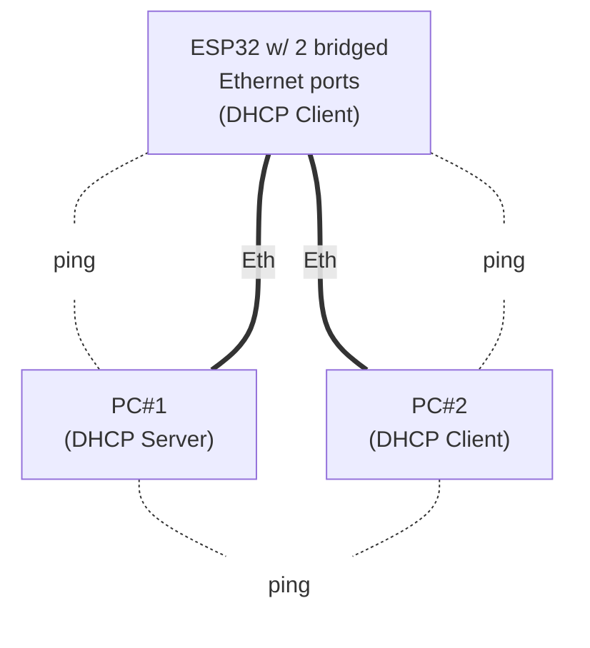

| Supported Targets | ESP32 | ESP32-C2 | ESP32-C3 | ESP32-C6 | ESP32-S2 | ESP32-S3 |
| ----------------- | ----- | -------- | -------- | -------- | -------- | -------- |

# Bridge Example
(See the README.md file in the upper level 'examples' directory for more information about examples.)

## Overview

This example demonstrates basic usage of `LwIP IEEE 802.1D bridge`. Bridge connects two separate networks to appear as if they were a single network at layer 2.

Specifically, from IOT use cases point of view, one of the advantages of bridge usage is to enable ring topology of Ethernet connected devices which would otherwise needed to be connected in tree topology. Tree topology usually requires extensive wiring since each device is connected to the central point (switch/router) by separate cable. In opposite, ring topology can save wiring since the devices can be "daisy-chained" (each device in path can pass the traffic further to the final destination). Note that the ring may not be "closed" and so simplifies network topology even further.

Performance of this type of "software" bridge is limited by the performance of ESP32 and data bus used to interconnect ESP32 with physical network interfaces (e.g. SPI shared among multiple Ethernet modules). If your application requires higher performance network, please consider using switch ICs which are specifically designed for such applications like [KSZ8863](https://github.com/espressif/esp-eth-drivers/blob/master/ksz8863/).

## How to use example

You need one ESP32 with at least two Ethernet ports and two PCs (or other Ethernet capable devices). Connect the network as shown in figure below, configure PC#1 as DHCP server and PC#2 as DHCP client.



The work flow of the example is then as follows:

1. Install the Ethernet ports drivers in ESP32.
2. Configure bridge.
3. Wait for a DHCP leases in ESP32 and PC#2.
4. If get IP addresses successfully, then you will be able to ping the ESP32 device and PC#2 from PC#1 (and vice versa).

## Hardware Required

To run this example, it's recommended that you have either an official ESP32 Ethernet development board - [ESP32-Ethernet-Kit](https://docs.espressif.com/projects/esp-idf/en/latest/hw-reference/get-started-ethernet-kit.html), or 3rd party ESP32 board as long as it's integrated with a supported Ethernet PHY chips, connected with supported SPI Ethernet modules (for example `DM9051`, `W5500` or `KSZ8851SNL`). Or ESP32(S/C series) board without internal Ethernet interface but connected to multiple SPI Ethernet modules.

### Pin Assignment

See common pin assignments for [Ethernet examples](../../ethernet/README.md#common-pin-assignments).

When using two Ethernet SPI modules at a time, they are to be connected to single SPI interface. Both modules then share data (MOSI/MISO) and CLK signals. However, the CS, interrupt and reset pins need to be connected to separate GPIO for each Ethernet SPI module.

## Configure the project

```
idf.py menuconfig
```

To be the bridge feature available, enable `LwIP IEEE 802.1D bridge` option in ESP-NETIF Adapter component config menu and properly configure `Number of clients store data in netif` in LWIP component config menu.

For Ethernet configuration, see common configurations in [Ethernet examples](../../ethernet/README.md#common-configurations).

## Build, Flash, and Run

Build the project and flash it to the board, then run monitor tool to view serial output:

```
idf.py -p PORT build flash monitor
```

(Replace PORT with the name of the serial port to use.)

(To exit the serial monitor, press ``Ctrl-]``.)

See the [Getting Started Guide](https://docs.espressif.com/projects/esp-idf/en/latest/get-started/index.html) for full steps to configure and use ESP-IDF to build projects.

### Forwarding Database Configuration

You can configure bridge’s static Forwarding Database (FDB) via interactive console. Type ``help`` in the serial monitor to show available options.

## Example Output

**ESP32 output:**

```bash
I (436) esp_eth.netif.netif_glue: 08:3a:f2:31:20:f7
I (436) esp_eth.netif.netif_glue: ethernet attached to netif
I (436) w5500.mac: version=4
I (446) esp_eth.netif.netif_glue: 08:3a:f2:31:20:f7
I (446) esp_eth.netif.netif_glue: ethernet attached to netif
I (446) esp_netif_br_glue: 08:3a:f2:31:20:f7
I (456) esp_netif_br_glue: bridge netif glue attached
I (3456) eth_example: Ethernet Started
I (3456) eth_example: Ethernet Link Up
I (3456) eth_example: Ethernet HW Addr 08:3a:f2:31:20:f7
I (3466) eth_example: Ethernet Started
I (5466) eth_example: Ethernet Link Up
I (5466) eth_example: Ethernet HW Addr 08:3a:f2:31:20:f7
I (8896) esp_netif_handlers: br0 ip: 192.168.20.105, mask: 255.255.255.0, gw: 192.168.20.1
I (8896) eth_example: Ethernet Got IP Address
I (8896) eth_example: ~~~~~~~~~~~
I (8896) eth_example: ETHIP:192.168.20.105
I (8906) eth_example: ETHMASK:255.255.255.0
I (8906) eth_example: ETHGW:192.168.20.1
I (8916) eth_example: ~~~~~~~~~~~
```

**PC output (on Linux OS):**

```bash
$ ip a

...

2: enp4s0: <BROADCAST,MULTICAST,UP,LOWER_UP> mtu 1500 qdisc fq_codel state UP group default qlen 1000
    link/ether 70:85:c2:d3:ea:18 brd ff:ff:ff:ff:ff:ff
    inet 192.168.20.116/24 brd 192.168.20.255 scope global dynamic noprefixroute enp4s0
       valid_lft 346sec preferred_lft 346sec
    inet6 fe80::4efa:2bae:e58c:231e/64 scope link noprefixroute 
       valid_lft forever preferred_lft forever

...
```

**PC output (on Windows OS):**

```bash
ipconfig -all

...

Ethernet adapter Ethernet:

   Connection-specific DNS Suffix  . : example.org
   Description . . . . . . . . . . . : Realtek PCIe GbE Family Controller
   Physical Address. . . . . . . . . : 70-85-C2-D3-EA-18
   DHCP Enabled. . . . . . . . . . . : Yes
   Autoconfiguration Enabled . . . . : Yes
   Link-local IPv6 Address . . . . . : fe80::21e3:aa78:f165:bbc8%15(Preferred)
   IPv4 Address. . . . . . . . . . . : 192.168.20.116(Preferred)
   Subnet Mask . . . . . . . . . . . : 255.255.255.0
   Lease Obtained. . . . . . . . . . : Tuesday, May 10, 2022 10:36:52 AM
   Lease Expires . . . . . . . . . . : Tuesday, May 10, 2022 10:46:51 AM
   Default Gateway . . . . . . . . . :
   DHCP Server . . . . . . . . . . . : 192.168.20.1
   DHCPv6 IAID . . . . . . . . . . . : 259032514
   DHCPv6 Client DUID. . . . . . . . : 00-01-00-01-25-3F-B4-00-70-85-C2-D3-EA-18
   DNS Servers . . . . . . . . . . . : fec0:0:0:ffff::1%1
                                       fec0:0:0:ffff::2%1
                                       fec0:0:0:ffff::3%1
   NetBIOS over Tcpip. . . . . . . . : Enabled

...
```

Now you can ping your ESP32 in PC#1 terminal by entering `ping 192.168.20.105` and you can ping your PC#2 in PC#1 terminal by entering `ping 192.168.20.116` (note that actual IP addresses depend on what you get by DHCP server).

## Known Limitations

* Currently only Ethernet interfaces can be bridged using LwIP bridge.
* If you need to stop just one Ethernet interface which is bridged to perform some action like speed/duplex setting, **all remaining interfaces** associated with the bridge need to be stopped as well to the bridge work properly after the interfaces are started again.

## Troubleshooting

See common troubleshooting for [Ethernet examples](../../ethernet/README.md#common-troubleshooting).

(For any technical queries, please open an [issue](https://github.com/espressif/esp-idf/issues) on GitHub. We will get back to you as soon as possible.)
