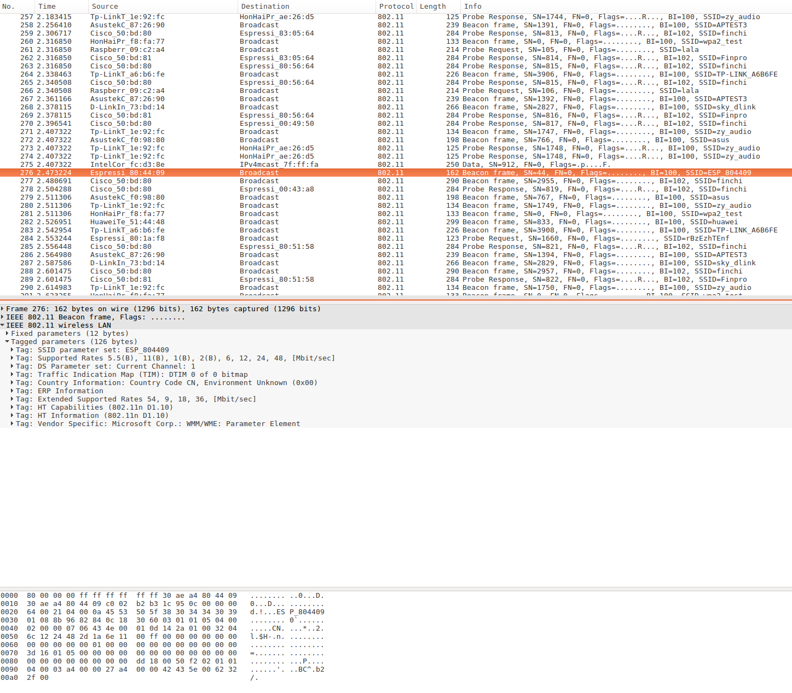

| Supported Targets | ESP32 | ESP32-C2 | ESP32-C3 | ESP32-C5 | ESP32-C6 | ESP32-S2 | ESP32-S3 |
| ----------------- | ----- | -------- | -------- | -------- | -------- | -------- | -------- |

# Simple Sniffer Example

(See the README.md file in the upper level 'examples' directory for more information about examples.)

## Overview

This example demonstrates basic usage of WiFi and Ethernet sniffer mode by saving packets into SD card with pcap format. There is also an option to send pcap file to host via JTAG interface.

For more information about pcap, please go to [wikipedia](https://en.wikipedia.org/wiki/Pcap).

This example is based on console component. For more information about console, please refer to [console guide](https://docs.espressif.com/projects/esp-idf/en/latest/esp32/api-reference/system/console.html).

## How to use example

### Hardware Required

To run this example with WiFi interface, you should have one ESP32 dev board integrated with a SD card slot (e.g. [ESP-WROVER-KIT](https://docs.espressif.com/projects/esp-idf/en/latest/hw-reference/modules-and-boards.html#esp-wrover-kit-v4-1)) or just connect [ESP32-DevKitC](https://docs.espressif.com/projects/esp-idf/en/latest/hw-reference/modules-and-boards.html#esp32-devkitc-v4) to a SD card breakout board. To run this example with Ethernet interface option, you should have one ESP32 dev board with physical layer Ethernet support (e.g. [ESP32-Ethernet-Kit](https://docs.espressif.com/projects/esp-idf/en/latest/esp32/hw-reference/esp32/get-started-ethernet-kit.html#)) or connect SPI-Ethernet module (e.g. DM9051) to your dev board.
If you want to send packets to host, make sure to connect ESP32 to some kind of [JTAG adapter](https://docs.espressif.com/projects/esp-idf/en/latest/api-guides/jtag-debugging/index.html#jtag-debugging-selecting-jtag-adapter).

#### Ethernet Pin Assignment

See common pin assignments for Ethernet from [ethernet examples folder](../../ethernet/README.md#common-pin-assignments).

### Configure the project

Open the project configuration menu (`idf.py menuconfig`). Then go into `Example Configuration` in top menu.

- Check `Store command history in flash` if you want to save command history into flash (recommend).
- Select where to save the pcap file in `Select destination to store pcap file` menu item.
  - `SD Card` means saving packets (pcap format) into the SD card you plug in. The default SD card work mode is set to SDMMC for target ESP32 and ESP32S3, but SPI is the only choice for other targets.
  - `Memory` means saving packets in memory and can parse packets in place.
  - `JTAG (App Trace)` means sending packets (pcap format) to host via JTAG interface. This feature depends on [app trace component](https://docs.espressif.com/projects/esp-idf/en/latest/api-guides/app_trace.html), Component config -> Application Level Tracing -> Data Destination -> JTAG should be enabled to choose `JTAG (App Trace)` as destination.
- Set the mount point in your filesystem in `SD card mount point in the filesystem` menu item. This configuration only takes effect when you choose to save packets into SD card.
- Set max name length of pcap file in `Max name length of pcap file` menu item.
- Set the length of sniffer work queue in `Length of sniffer work queue` menu item.
- Set the stack size of the sniffer task in `Stack size of sniffer task` menu item.
- Set the priority of the sniffer task in `Length of sniffer work queue` menu item.

To configure Ethernet device(s), go to `Example Ethernet Configuration` in top menu.
  - For more information related to Ethernet configurations see common configuration of Ethernet from [ethernet examples folder](../../ethernet/README.md#common-configurations).

### Build and Flash

```
idf.py -p PORT flash monitor
```

(Replace PORT with name of the serial port.)

(To exit the serial monitor, type ``Ctrl-]``.)

See the [Getting Started Guide](https://docs.espressif.com/projects/esp-idf/en/latest/get-started/index.html) for full steps to configure and use ESP-IDF to build projects.

### `sniffer` Command Usage

> sniffer  [-i <wlan|eth0|eth1|...>] [-F <mgmt|data|ctrl|misc|mpdu|ampdu|fcsfail>]... [-c <channel>] [--stop] [-n <num>]
>   Capture specific packet and store in pcap format
>   -i, --interface=<wlan|eth0|eth1|...>  which interface to capture packet
>   -F, --filter=<mgmt|data|ctrl|misc|mpdu|ampdu|fcsfail>  filter parameters
>   -c, --channel=<channel>  communication channel to use
>         --stop  stop running sniffer
>   -n, --number=<num>  the number of the packets to be captured

The `sniffer` command support some important options as follow:

* `-i`: Specify the interface to sniff packets, currently only support `wlan` and `eth0`
* `-c`: Specify the channel to sniff packet at `wlan` interface
* `-F`: Specify the filter condition at `wlan` interface, currently only support following filter conditions, you can select any number of them
  * mgmt: Management packets
  * data: Data packets
  * ctrl: Control packets
  * misc: Other packets
  * mpdu: MPDU packets
  * ampdu: AMPDU packets
* `-n`: Specify the number of packages to capture in this sniffer job. The sniffer job will stop automatically without using `sniffer --stop` command.
* `--stop`: Stop sniffer job

### `pcap` Command Usage When the Destination is `SD Card`

> pcap  -f <file> [--open] [--close] [--summary]
>   Save and parse pcap file
>   -f, --file=<file>  name of the file storing the packets in pcap format
>         --open  open .pcap file
>        --close  close .pcap file
>      --summary  option to parse and show the summary of .pcap file

The `pcap` command support some important options as follow:

* `-f`: Specify the name of file which will store the packets or show summary, default value is `sniffer`, and the resulting file name will be like “snifferX.pcap”, here ‘X’ shows the file’s order.
* `--open`: Option to open a '.pcap' file
* `--close`: Option to close the '.pcap' file
* `--summary`: Show the summary of '.pcap' file

### `pcap` Command Usage When the Destination is `Memory`

> pcap  -f <file> [--open] [--close] [--summary]
>   Save and parse pcap file
>   -f, --file=<file>  name of the file storing the packets in pcap format
>         --open  open .pcap file
>        --close  close .pcap file
>      --summary  option to parse and show the summary of .pcap file

The `pcap` command support some important options as follow:

* `-f`: Specify the file name to storage packet or show summary
* `--open`: Option to open a '.pcap' file
* `--close`: Option to close the '.pcap' file
* `--summary`: Show the summary of '.pcap' file (needs to be called prior file closing)

### `pcap` Command Usage When the Destination is `JTAG`
pcap command is not used when destination is JTAG. The pcap session is started automatically with the Sniffer start.

## Example Output
### Steps for using **SD Card** to storage packages and watch summary
#### Mount SD Card

```bash
 =======================================================
 |         Steps to sniff network packets              |
 |                                                     |
 |  1. Enter 'help' to check all commands usage        |
 |  2. Enter 'mount <device>' to mount filesystem      |
 |  3. Enter 'pcap' to create pcap file                |
 |  4. Enter 'sniffer' to start capture packets        |
 |  5. Enter 'unmount <device>' to unmount filesystem  |
 |                                                     |
 =======================================================


Type 'help' to get the list of commands.
Use UP/DOWN arrows to navigate through command history.
Press TAB when typing command name to auto-complete.
sniffer> mount sd
I (12653) example: Initializing SD card
I (12653) example: Using SDMMC peripheral
I (12663) gpio: GPIO[13]| InputEn: 0| OutputEn: 1| OpenDrain: 0| Pullup: 0| Pulldown: 0| Intr:0
Name: SC64G
Type: SDHC/SDXC
Speed: 20 MHz
Size: 60906MB
```

#### Create .pcap file

```bash
sniffer> pcap --open -f simple-sniffer
I (41383) cmd_pcap: open file successfully
```

#### Start Sniffer (with 10 packages)

```bash
sniffer> sniffer -i wlan -c 2 -n 10
I (58153) cmd_sniffer: 10 packages will be captured
I (58163) phy_init: phy_version 4670,719f9f6,Feb 18 2021,17:07:07
I (58263) wifi:ic_enable_sniffer
I (58263) cmd_sniffer: start WiFi promiscuous ok
I (58303) wifi:ic_disable_sniffer
I (58303) wifi:flush txq
I (58303) wifi:stop sw txq
I (58303) wifi:lmac stop hw txq
I (58303) cmd_sniffer: stop promiscuous ok
```

#### Close .pcap file

```bash
sniffer> pcap --close -f simple-sniffer
I (80453) cmd_pcap: .pcap file close done
```

#### Parse '.pcap' file and watch at bash with '--summary' option

```bash
sniffer> pcap --summary -f simple-sniffer
I (112833) cmd_pcap: /sdcard/simple-sniffer.pcap is to be parsed
------------------------------------------------------------------------
Pcap packet Head:
------------------------------------------------------------------------
Magic Number: a1b2c3d4
Major Version: 2
Minor Version: 4
SnapLen: 262144
LinkType: 105
------------------------------------------------------------------------
Packet 0:
Timestamp (Seconds): 0
Timestamp (Microseconds): 3670
Capture Length: 303
Packet Length: 303
Packet Type:  0
Packet Subtype:  5
Destination:  0  0  0  0 a1  0
Source:  2 84 56  e  0  0
------------------------------------------------------------------------
Packet 1:
Timestamp (Seconds): 0
Timestamp (Microseconds): 3670
Capture Length: 294
Packet Length: 294
Packet Type:  0
Packet Subtype:  5
Destination:  0  0  0  0 a1  0
Source:  2 84 56  e  0  0
------------------------------------------------------------------------
Packet 2:

...

------------------------------------------------------------------------
Pcap packet Number: 10
------------------------------------------------------------------------
```

#### Unmount SD Card

```bash
sniffer> unmount sd
I (183873) example: Card unmounted
```

### Steps for using **memory** to storage packages and watch summary
#### Open a memory for pcap

```bash
sniffer> pcap --open -f simple-sniffer
I (11816) cmd_pcap: open file successfully
```

#### Sniff 10 packages

```bash
sniffer> sniffer -i wlan -c 2 -n 10
I (71086) cmd_sniffer: 10 packages will be captured
I (71096) phy_init: phy_version 4670,719f9f6,Feb 18 2021,17:07:07
I (71186) wifi:ic_enable_sniffer
I (71186) cmd_sniffer: start WiFi promiscuous ok
I (71246) wifi:ic_disable_sniffer
I (71246) wifi:flush txq
I (71256) wifi:stop sw txq
I (71256) wifi:lmac stop hw txq
I (71256) cmd_sniffer: stop promiscuous ok
```

#### Watch the summary of the package captured above

```bash
sniffer> pcap --summary -f simple-sniffer
I (93396) cmd_pcap: Memory is to be parsed
------------------------------------------------------------------------
Pcap packet Head:
------------------------------------------------------------------------
Magic Number: a1b2c3d4
Major Version: 2
Minor Version: 4
SnapLen: 262144
LinkType: 105
------------------------------------------------------------------------
Packet 0:
Timestamp (Seconds): 0
Timestamp (Microseconds): 5481
Capture Length: 266
Packet Length: 266
Packet Type:  0
Packet Subtype:  2
Destination:  0  0  0  0 a1  0
Source:  2 8a 69 15  0  0
------------------------------------------------------------------------
Packet 1:
Timestamp (Seconds): 0
Timestamp (Microseconds): 24405
Capture Length: 175
Packet Length: 175
Packet Type:  0
Packet Subtype:  f
Destination:  0  0  0  0 a1  0
Source:  2 84 55 5f  0  0
------------------------------------------------------------------------
Packet 2:

...

------------------------------------------------------------------------
Pcap packet Number: 10
------------------------------------------------------------------------
```


#### Close pcap file in memory

```bash
sniffer> pcap --close -f simple-sniffer
I (130566) cmd_pcap: free memory successfully
I (130566) cmd_pcap: .pcap file close done
```

### Steps for sending packets to host via **JTAG interface**

1. Select `JTAG (App Trace)` as the destination of pcap files in project configuration.
2. Build & Flash with `idf.py -p PORT flash`
3. Connect JTAG, run OpenOCD (for more information about how-to please refer to [JTAG Debugging](https://docs.espressif.com/projects/esp-idf/en/latest/api-guides/jtag-debugging/index.html)).
4. Telnet to localhost with 4444 port: `telnet localhost 4444`.
5. In the telnet session, run command like `esp32 apptrace start file://sniffer-esp32.pcap 1 -1 20` (more information about this command, please refer to [apptrace command](https://docs.espressif.com/projects/esp-idf/en/latest/api-guides/app_trace.html#openocd-application-level-tracing-commands)).
6. Run the example, start sniffer with `sniffer` command.
7. Stop sniffer by entering command `sniffer --stop` in the example console.
8. Stop tracing by entering command `esp32 apptrace stop` in the telnet session.

### Open PCap File in Wireshark



## Troubleshooting

- Make sure you have plugged in your SD card and mount it into filesystem before doing sniffer work or you will get error message like “Create file /sdcard/sniffer0.pcap failed”.
- To protect the SD card, we recommend you to execute command `unmount sd` before you plug out your SD card.
- Make sure to run `esp32 apptrace` command before or immediately after a new sniffer task started when you try this example with JTAG. Otherwise the console will issue warning message `waiting for apptrace established` every 1 second. If the apptrace communication doesn't be established within 10 seconds (can be altered by macro `SNIFFER_APPTRACE_RETRY`), this sniffer command will failed with an error message `waiting for apptrace established timeout`.

(For any technical queries, please open an [issue](https://github.com/espressif/esp-idf/issues) on GitHub. We will get back to you as soon as possible.)
