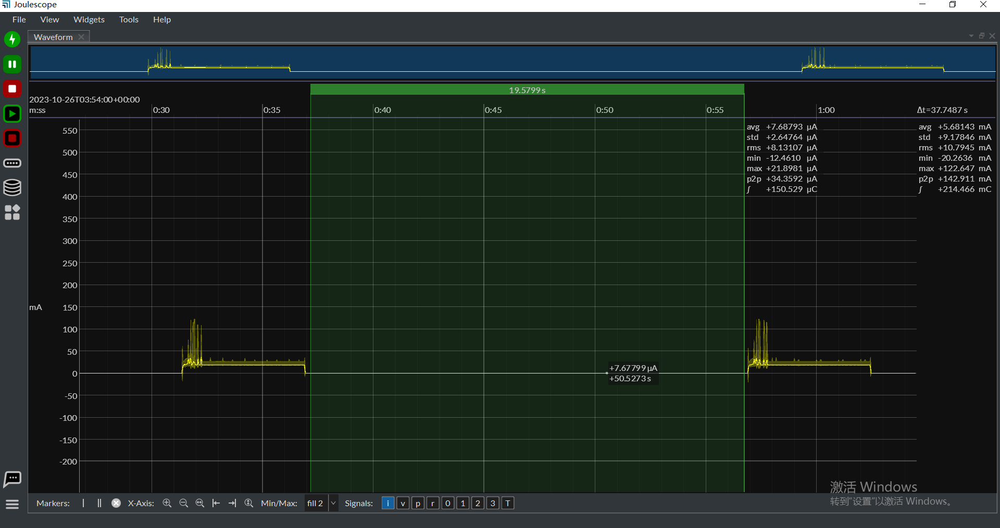

| Supported Targets | ESP32-C6 | ESP32-H2 |
| ----------------- | -------- | -------- |

# OpenThread Sleepy Device Example

The example demonstrates the Thread Sleepy End Device (SED), the device will enter [Deep Sleep mode](https://docs.espressif.com/projects/esp-idf/en/latest/esp32c6/api-reference/system/sleep_modes.html#sleep-modes) during idle state.

This example is designed to address a specific deep sleep application scenario. First, it connects to the Thread network, and after 5 seconds when the state changes to CHILD, it enters deep sleep mode. There are two ways to wake up in this example: one is by using a 20-second periodic RTC timer, and the other is through GPIO input. Deep sleep is part of the upper-layer logic, and it's the user's responsibility to manage it in their own applications. If you need more wake-up methods, you can refer to the [Exapmle deep sleep](../../../system/deep_sleep/). Additionally, Espressif provides a stub for handling wake-ups, which allows for a quick check, and the user can decide whether to wake up or continue deep sleep in this stub, as explained in the [Example deep sleep stub](../../../system/deep_sleep_wake_stub).

Note: Implementing a standard Thread Sleepy Device is recommended using the [Light Sleep example](../light_sleep). Deep sleep triggers a reboot, and the device needs to undergo a re-attach process to rejoin the network. This means additional packet interactions are necessary after each wake-up from deep sleep. It can be advantageous in reducing power consumption, especially when the device remains in a sleep state for extended periods, such as more than 30 minutes.
## How to use example

### Hardware Required

* Prepare two 802.15.4 SoC development boards, one for an OpenThread Leader and the other one for an OpenThread Sleepy End Device (SED).
* Connect the board using a USB cable for power supply and programming.

## Configure the Openthread Dataset

* Run [ot_cli](../../ot_cli/) on another 802.15.4 SoC device to create openthread dataset configuration and start an openthread network as the Leader.
* Configure the Openthread dataset using `idf.py menuconfig` in `Component config ---> Openthread ---> Thread Operation Dataset`, ensuring that the openthread sleepy device's dataset matches the dataset of the Leader device.

### Build and Flash

Build the project and flash it to the board. Use the following command: `idf.py -p <PORT> erase-flash flash monitor`.

### Example Output

As the example runs, you will see the log output indicating the initialization and operation of OpenThread, including the device joining the OpenThread network as a Sleepy End Device (SED).

```
I(281) OPENTHREAD:[I] Settings------: Read NetworkInfo {rloc:0x4001, extaddr:623954c9725869e6, role:child, mode:0x04, version:4, keyseq:0x0, ...
I(291) OPENTHREAD:[I] Settings------: ... pid:0x3b33d767, mlecntr:0x3ba17, maccntr:0x3baa8, mliid:868f19ce8c3f6207}
I(301) OPENTHREAD:[I] Settings------: Read ParentInfo {extaddr:3afe8db4802dc1aa, version:4}
I (311) ot_esp_power_save: Wake up from timer. Time spent in deep sleep and boot: 20321ms
I (331) ot_esp_power_save: Enabling timer wakeup, 20s
I (331) OPENTHREAD: OpenThread attached to netif
I(341) OPENTHREAD:[N] Mle-----------: Role disabled -> detached
I (291) main_task: Returned from app_main()
I (371) OT_STATE: netif up
I(511) OPENTHREAD:[N] Mle-----------: Role detached -> child
I (531) ot_esp_power_save: Start one-shot timer for 5s to enter the deep sleep
I (5531) ot_esp_power_save: Enter deep sleep
```

When the device enter deep sleep, GPIO9 also can wake up the device, you can push down the BOOT button then you can see the device wakes up:

```
I(281) OPENTHREAD:[I] Settings------: Read NetworkInfo {rloc:0x4001, extaddr:623954c9725869e6, role:child, mode:0x04, version:4, keyseq:0x0, ...
I(291) OPENTHREAD:[I] Settings------: ... pid:0x3b33d767, mlecntr:0x3d576, maccntr:0x3d609, mliid:868f19ce8c3f6207}
I(301) OPENTHREAD:[I] Settings------: Read ParentInfo {extaddr:3afe8db4802dc1aa, version:4}
I (321) ot_esp_power_save: Wake up from GPIO. Time spent in deep sleep and boot: 8470ms
I (331) ot_esp_power_save: Enabling timer wakeup, 20s
I (331) OPENTHREAD: OpenThread attached to netif
I(341) OPENTHREAD:[N] Mle-----------: Role disabled -> detached
I (291) main_task: Returned from app_main()
I (371) OT_STATE: netif up
I(511) OPENTHREAD:[N] Mle-----------: Role detached -> child
I (531) ot_esp_power_save: Start one-shot timer for 5s to enter the deep sleep
I (5531) ot_esp_power_save: Enter deep sleep
```

During the deep sleep, a typical power consumption is shown below:
