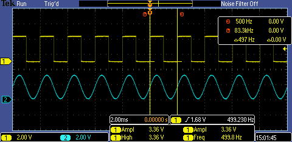
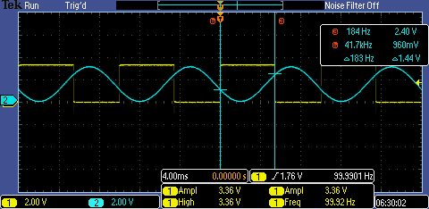
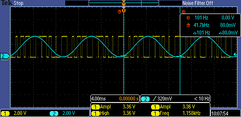

| Supported Targets | ESP32-H2 | ESP32-P4 |
| ----------------- | -------- | -------- |

# Analog Comparator Example

(See the README.md file in the upper level 'examples' directory for more information about examples.)

This example is going to show how to use the Analog Comparator. The example toggles a GPIO to monitor the positive and negative crosses on the analog comparator unit.

## Realization

- If the target supports generating the analog comparator events (like ESP32-P4), the example can toggle the monitoring GPIO via Event Task Matrix (ETM). ETM can bind the analog comparator cross events (positive and negative events) with the GPIO tasks (to set or clear a GPIO), so that every event happens, hardware will execute the corresponding task without CPU involved.

- If the target does not support to generate the analog comparator events (like ESP32-H2). The example will register an event callback on the analog comparator, and toggle the GPIO in the callback. It requires the CPU to process every event ISR, thus it is not effective as ETM and can't achieve a high resolution.

## How to Use Example

### Hardware Requirement

* A development board with any supported Espressif SOC chip (see `Supported Targets` table above)
* A USB cable for power supply and programming
* A device to generate the source signal. For example, you can use a ESP SoC that support DAC peripheral (like ESP32 or ESP32S2) to generate source signal, or just use a signal generator.

#### Required Additionally for External Reference

* One more external signal for the reference. You can input a static voltage or a wave, for example, the static voltage can be gotten by the resistor divider, and the wave can be generated by either ESP SoC or a signal generator.

### Example Connection

Let's take ESP32-H2 and ESP32 for example, and we use the DAC on ESP32 as the signal generator (you can use a real signal generator instead if you have one).

#### Internal Reference

Download this example into ESP32-H2 and any DAC examples in `examples/peripherals/dac` directory into ESP32.

```
     ┌──────────────┐                ┌──────────────┐
     │   ESP32-H2   │                │     ESP32    │
     │              │  source signal │              │
┌────┤GPIO0   GPIO11│◄────┬──────────┤GPIO25        │
│    │              │     │          │              │
│    │           GND├─────┼────┬─────┤GND           │
│    │              │     │    │     │              │
│    └──────────────┘     │    │     └──────────────┘
│                         │    │
│    ┌──────────────┐     │    │
│    │ Oscilloscope │     │    │
│    │              │     │    │
└───►│Probe1  Probe2│◄────┘    │
     │              │          │
     │           GND├──────────┘
     │              │
     └──────────────┘
```

#### External Reference

For the static external reference, we can use resistor divider to get the static voltage.

```
     ┌──────────────┐                ┌──────────────┐
     │   ESP32-H2   │                │     ESP32    │
     │              │  source signal │              │
┌────┤GPIO0   GPIO11│◄────┬──────────┤GPIO25        │
│    │              │  ref│signal    │              │
│    │        GPIO10│◄────┼──────┐ ┌─┤GND           │
│    │              │     │      │ │ │              │
│    │           GND├─────┼─┬────┼─┘ └──────────────┘
│    │              │     │ │    │         VDD
│    └──────────────┘     │ │    │         ─┬─
│                         │ │    │          │
│                         │ │    │          ├┐
│    ┌──────────────┐     │ │    │          ││R1
│    │ Oscilloscope │     │ │    │          ├┘
│    │              │     │ │    └──────────┤
└───►│Probe1  Probe2│◄────┘ │               │
     │              │       │               ├┐
     │           GND├───────┤               ││R2
     │              │       │               ├┘
     └──────────────┘       │               │
                            └───────────────┤
                                            │
                                           ─┴─
                                           GND
```

Also, we can generate a different signal on another DAC channel on ESP32, you can customize your DAC wave using `examples/peripherals/dac/dac_continuous/signal_generator` example.

```
     ┌──────────────┐                ┌──────────────┐
     │   ESP32-H2   │                │     ESP32    │
     │              │  source signal │              │
┌────┤GPIO0   GPIO11│◄────┬──────────┤GPIO25        │
│    │              │  ref│signal    │              │
│    │        GPIO10│◄────┼──────────┤GPIO26        │
│    │              │     │          │              │
│    │           GND├─────┼───┬──────┤GND           │
│    │              │     │   │      │              │
│    └──────────────┘     │   │      └──────────────┘
│                         │   │
│                         │   │
│    ┌──────────────┐     │   │
│    │ Oscilloscope │     │   │
│    │              │     │   │
└───►│Probe1  Probe2│◄────┘   │
     │              │         │
     │           GND├─────────┘
     │              │
     └──────────────┘
```

### Configure the Project

You can decide to adopt internal reference or external reference in the example menu config, and you can also enable hysteresis comparator for the internal reference in the menu config.

### Build and Flash

Build the project and flash it to the board, then run monitor tool to view serial output:

```
idf.py -p PORT build flash monitor
```

(To exit the serial monitor, type ``Ctrl-]``.)

See the Getting Started Guide for full steps to configure and use ESP-IDF to build projects.

## Example Output

### Static Internal Reference

The internal voltage is set to 50% VDD, and input a 50 Hz sine wave as source signal (blue line), the output GPIO toggles every time the sine wave crossing the reference voltage (yellow line)



### Hysteresis Internal Reference

The internal voltage is set to 30% VDD and 70% VDD alternately in this case, the source signal is a 100 Hz sine wave (blue line), the output GPIO toggles every time the source signal exceed 70% VDD and lower than 30% VDD.



### External Reference

Here we input a 100 Hz sine wave (blue line) as the source signal and input a 1 KHz triangle wave as the reference signal, the output wave (yellow line) can be regarded as a SPWM (Sinusoidal PWM) wave.



## Troubleshooting

For any technical queries, please open an [issue](https://github.com/espressif/esp-idf/issues) on GitHub. We will get back to you soon.
