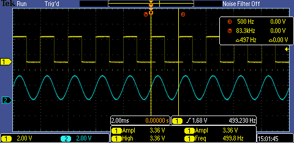
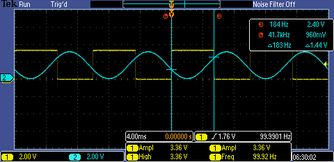
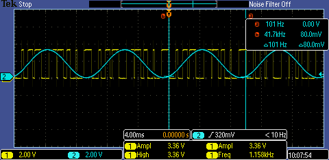

| Supported Targets | ESP32-C5 | ESP32-C61 | ESP32-H2 | ESP32-H21 | ESP32-P4 |
| ----------------- | -------- | --------- | -------- | --------- | -------- |

# Analog Comparator Auto Scan Example

(See the README.md file in the upper level 'examples' directory for more information about examples.)

This example shows how to use the Analog Comparator auto scan mode. After enabling the comparator unit, hardware keeps scanning source channels automatically and updates comparator outputs continuously. The example toggles a GPIO to monitor positive and negative crossing results in real time.

## Realization

- If the target supports generating analog comparator events (like ESP32-P4), the example toggles the monitoring GPIO via Event Task Matrix (ETM). ETM binds comparator cross events (positive and negative) to GPIO tasks (set/clear), so each auto-scan crossing result can drive hardware actions without CPU involvement.

- If the target does not support generating analog comparator events (like ESP32-H2), the example registers an interrupt callback and toggles the GPIO in the callback. This still relies on auto scan for continuous output updates, but every crossing ISR must be handled by CPU, so it is less efficient than ETM.

## How to Use Example

### Hardware Requirement

* A development board with any supported Espressif SOC chip (see `Supported Targets` table above)
* A USB cable for power supply and programming
* A signal generator for generating the source signal

#### Required Additionally for External Reference

* One more external signal for the reference. You can input a static voltage or a wave, for example, the static voltage can be gotten by the resistor divider, and the wave can be generated by either ESP SoC or a signal generator.

### Example Connection

#### Internal Reference

```
     +--------------+                +--------------+
     |   ESP Board  |                |  Signal Gen  |
     |              |  source signal |              |
+----+GPIO    Src In|<----+----------+OUT           |
|    |              |     |          |              |
|    |           GND+-----+----+-----+GND           |
|    |              |     |    |     |              |
|    +--------------+     |    |     +--------------+
|                         |    |
|    +--------------+     |    |
|    | Oscilloscope |     |    |
|    |              |     |    |
+--->|Probe1  Probe2|<----+    |
     |              |          |
     |           GND+----------+
     |              |
     +--------------+
```

#### External Reference

For the static external reference, we can use resistor divider to get the static voltage.

```
     +--------------+                +--------------+
     |   ESP Board  |                |  Signal Gen  |
     |              |  source signal |              |
+----+GPIO    Src In|<----+----------+OUT           |
|    |              |  ref|signal    |              |
|    |        Ref In|<----+------+ +-+GND           |
|    |              |     |      | | |              |
|    |           GND+-----+-+----+-+ +--------------+
|    |              |     | |    |         VDD
|    +--------------+     | |    |         -+-
|                         | |    |          |
|                         | |    |          ++
|    +--------------+     | |    |          ||R1
|    | Oscilloscope |     | |    |          ++
|    |              |     | |    +----------+
+--->|Probe1  Probe2|<----+ |               |
     |              |       |               ++
     |           GND+-------+               ||R2
     |              |       |               ++
     +--------------+       |               |
                            +---------------+
                                            |
                                           -+-
```

### Configure the Project

You can decide to adopt internal reference or external reference in the example menu config, and you can also enable hysteresis comparator for the internal reference in the menu config.

### Build and Flash

Build the project and flash it to the board, then run monitor tool to view serial output:

```
idf.py -p PORT build flash monitor
```

(To exit the serial monitor, type ``Ctrl-]``.)

See the Getting Started Guide for full steps to configure and use ESP-IDF to build projects.

## Example Output

### Static Internal Reference

The internal voltage is set to 50% VDD, and input a 50 Hz sine wave as source signal (blue line), the output GPIO toggles every time the sine wave crossing the reference voltage (yellow line)



### Hysteresis Internal Reference

The internal voltage is set to 30% VDD and 70% VDD alternately in this case, the source signal is a 100 Hz sine wave (blue line), the output GPIO toggles every time the source signal exceed 70% VDD and lower than 30% VDD.



### External Reference

Here we input a 100 Hz sine wave (blue line) as the source signal and input a 1 KHz triangle wave as the reference signal, the output wave (yellow line) can be regarded as a SPWM (Sinusoidal PWM) wave.



## Troubleshooting

For any technical queries, please open an [issue](https://github.com/espressif/esp-idf/issues) on GitHub. We will get back to you soon.
