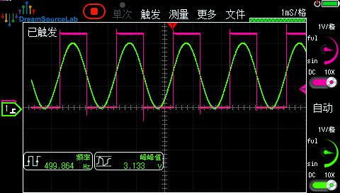

| Supported Targets | ESP32-H4 | ESP32-S31 |
| ----------------- | -------- | --------- |

# Analog Comparator ETM Periodic Scan Example

(See the README.md file in the upper level `examples` directory for more information about examples.)

This example shows how to use a GPTimer periodic ETM event to trigger the analog comparator scan task. The analog comparator uses the internal 50% VDD reference, and the comparator positive and negative crossing events set or clear a monitor GPIO through ETM. With an external sine wave connected to the source channel, the monitor GPIO becomes a square wave representation of the sampled input.

## Realization

This example builds the following ETM chain:

- GPTimer alarm event -> GPTimer enable-alarm task
- GPTimer alarm event -> Analog comparator start task
- Analog comparator positive cross event -> GPIO set task
- Analog comparator negative cross event -> GPIO clear task

The steady-state signal path runs without CPU intervention. The CPU is only used during one-time initialization.

## How to Use Example

### Hardware Requirement

* A development board with a supported Espressif SOC chip (see `Supported Targets` table above)
* A USB cable for power supply and programming
* A signal generator for generating the source sine wave
* An oscilloscope or logic analyzer to observe the source input and monitor GPIO

### Example Connection

The example uses a configurable comparator source input GPIO. The shipped default value matches the comparator pad0 GPIO for each supported target, and the example logs the actual source GPIO number at startup.

```
     +--------------+                +--------------+
     |   ESP Board  |                |  Signal Gen  |
     |              |  source signal |              |
+----+GPIO    Src In|<----+----------+OUT           |
|    |              |     |          |              |
|    |           GND+-----+----+-----+GND           |
|    |              |     |    |     |              |
|    +--------------+     |    |     +--------------+
|                         |    |
|    +--------------+     |    |
|    | Oscilloscope |     |    |
|    |              |     |    |
+--->|Probe1  Probe2|<----+    |
     |              |          |
     |           GND+----------+
     |              |
     +--------------+
```

Probe the source sine wave on the comparator source GPIO and probe the monitor GPIO at the same time.

### Configure the Project

Open the project configuration menu:

```bash
idf.py menuconfig
```

Under `Example Configuration`, you can configure:

- `Source GPIO number`
- `Monitor GPIO number`
- `Comparator scan period (us)`

The comparator reference voltage is fixed to the internal 50% VDD reference in this example.
The shipped default source GPIO value matches comparator pad0 on each supported target.

### Build and Flash

Build the project and flash it to the board, then run the monitor tool to view serial output:

```bash
idf.py -p PORT build flash monitor
```

(To exit the serial monitor, type `Ctrl-]`.)

See the Getting Started Guide for full steps to configure and use ESP-IDF to build projects.

## Example Output

```text
I (252) main_task: Started on CPU0
I (262) main_task: Calling app_main()
I (262) example: Monitor GPIO 4
I (262) example: Analog comparator source GPIO 37
I (262) example: Analog comparator internal reference 50% VDD
I (272) example: GPTimer scan period 50 us
I (282) example: Periodic ETM-driven comparator scan started
I (282) main_task: Returned from app_main()
```

The exact source GPIO number depends on the target and package.

## Expected Result On Hardware

Feed a sine wave into the comparator source channel. Because the comparator reference is fixed at 50% VDD, the monitor GPIO stays high while the sampled source voltage is above the threshold and low while it is below the threshold.

On an oscilloscope, the monitor GPIO appears as a square wave derived from the sampled sine wave.



## Troubleshooting

- This example only works on targets that support analog comparator channel scan and the ETM scan-task path.
- If the monitor GPIO does not change, reduce the input frequency or shorten the scan period.
- If the square wave looks unstable, confirm the input sine wave amplitude crosses the 50% VDD threshold.

For any technical queries, please open an [issue](https://github.com/espressif/esp-idf/issues) on GitHub. We will get back to you soon.
