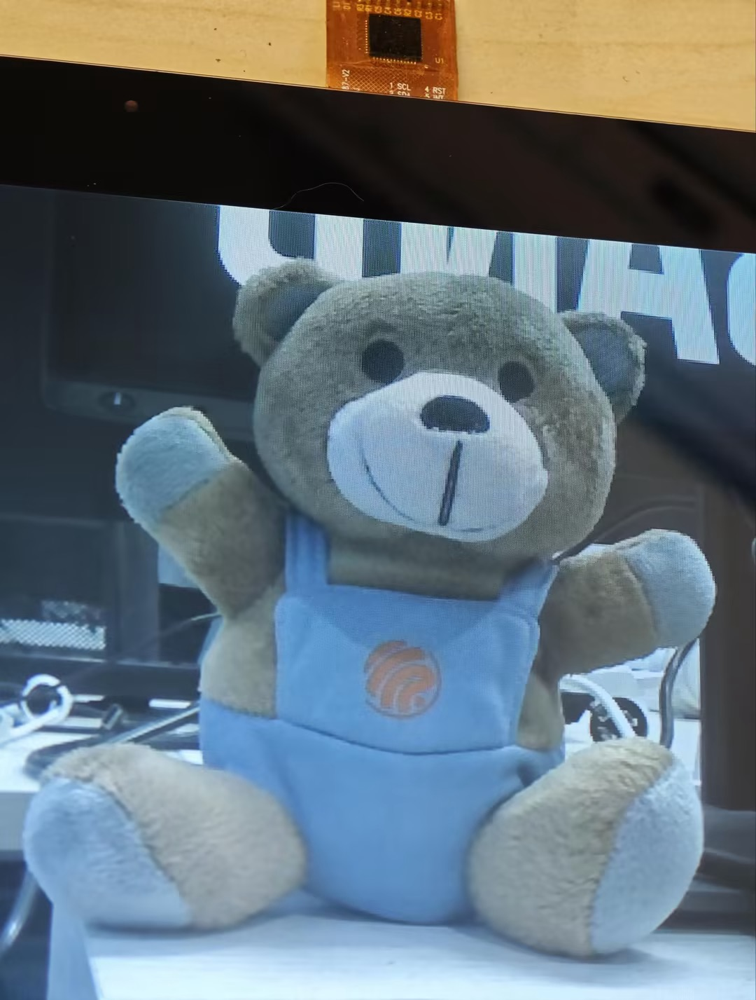

| Supported Targets | ESP32-P4 |
| ----------------- | -------- |


# Camera display plus ISP via DSI example

## Overview

This example demonstrates how to use the ISP (image signal processor) to work with esp_driver_cam component. This example will auto-detect camera sensors via [ESP camera sensor driver](https://components.espressif.com/components/espressif/esp_cam_sensor/versions/0.5.3) and capture camera sensor signals via CSI interface and display it via DSI interface. This example enables following ISP functions:

- ISP AWB (auto white balance) & WBG (white balance gain) feature
- ISP AF (auto-focus) feature
- ISP BF (bayer denoise) feature
- ISP BLC (black level correction) feature
- ISP Sharpen feature
- ISP Demosaic feature
- ISP GAMMA feature
- ISP Color feature
- ISP LSC feature
- ISP Crop feature (need to enable in `idf.py menuconfig`)

Additionally, this example also implements **Dual Frame Buffer (Ping-Pong Buffering)**, which eliminates screen tearing for smooth video display

## Usage

The subsections below give only absolutely necessary information. For full steps to configure ESP-IDF and use it to build and run projects, see [ESP-IDF Getting Started](https://docs.espressif.com/projects/esp-idf/en/latest/get-started/index.html#get-started).


### Hardware Required

This example requires:

- OV5647 or SC2336 camera sensor, or other camera sensors
- EK79007 or ILI9881C LCD screen
- ESP32P4 devkit

**Note:** OV5647 has its own ISP functions, whereas SC2336 is a camera sensor without ISP functions. You can use the ESP on-chip ISP functions to tune the image together with the sensor ISP functions, if the image quality is not as expected. The [esp-video](https://github.com/espressif/esp-video-components/tree/master/esp_video) component provides support for the ISP control algorithms, and some examples can be found in [esp_video/examples](https://github.com/espressif/esp-video-components/tree/master/esp_video/examples).

**Note:** For EK79007 you will need to connect following pins:
- 5V - 5V
- GND - GND
- RST_LCD - 3V3

You can also connect camera sensors and LCD screens from other vendors to the ESP chip, you can find corresponding camera or LCD drivers from [ESP Component Registry](https://components.espressif.com), or design your own customized drivers.

                                   GND                                                                   GND
                ┌────────────────────────────────────────────────┐             ┌─────────────────────────────────────────────────────────┐
                │                                                │             │                                                         │
                │                                                │             │                                                         │
                │                                                │             │                                                         │
                │                                                │             │                                                         │
                │                                                │             │                                                         │
                │                                                │             │                                                         │
                │                                                │             │                                                         │
                │                                                │             │                                                         │
                │                                ┌───────────────┴─────────────┴──────────────────┐                                      │
                │                                │                                                │                           ┌──────────┴───────────┐
                │                                │                                                │      DSI DATA 1P          │                      │
                │                                │                                                ├───────────────────────────┤                      │
    ┌───────────┴─────────┐ CSI DATA 1P          │                                                │                           │                      │
    │                     ├──────────────────────┤                                                │      DSI DATA 1N          │                      │
    │                     │                      │                                                ├───────────────────────────┤                      │
    │                     │ CSI DATA 1N          │                  ESP32-P4                      │                           │                      │
    │       Camera        ├──────────────────────┤                                                │      DSI CLK N            │      LCD Screen      │
    │                     │                      │                                                ├───────────────────────────┤                      │
    │                     │ CSI CLK N            │                                                │                           │                      │
    │                     ├──────────────────────┤                                                │      DSI CLK P            │                      │
    │                     │                      │                                                ├───────────────────────────┤                      │
    │                     │ CSI CLK P            │                                                │                           │                      │
    │                     ├──────────────────────┤                                                │      DSI DATA 0P          │                      │
    │                     │                      │                                                ├───────────────────────────┤                      │
    │                     │ CSI DATA 0P          │                                                │                           │                      │
    │                     ├──────────────────────┤                                                │      DSI DATA 0N          │                      │
    │                     │                      │                                                ├───────────────────────────┤                      │
    │                     │ CSI DATA 0N          │                                                │                           │                      │
    │                     ├──────────────────────┤                                                │                           └──────────────────────┘
    │                     │                      │                                                │
    └───────┬──┬──────────┘                      │                                                │
            │  │           I2C SCL               │                                                │
            │  └─────────────────────────────────┤                                                │
            │              I2C SDA               │                                                │
            └────────────────────────────────────┤                                                │
                                                 └────────────────────────────────────────────────┘


### Set Chip Target

First of all, your target must be supported by both:

- **By your ESP-IDF version**: For the full list of supported targets, run:
  ```
  idf.py --list-targets
  ```
- **By this example**: For the full list of supported targets,  refer to the supported targets table at the top of this README.

After you make sure that your target is supported, go to your example project directory and [set the chip target](https://docs.espressif.com/projects/esp-idf/en/latest/api-guides/tools/idf-py.html#select-the-target-chip-set-target):

```
idf.py set-target <target>
```

For example, to set esp32-P4 as the chip target, run:

```
idf.py set-target esp32p4
```


### Configure the Project

For information about Kconfig options, see [Project Configuration](https://docs.espressif.com/projects/esp-idf/en/latest/api-reference/kconfig.html) > _Name of relevant section(s)_.

To conveniently check or modify Kconfig options for this example in a project configuration menu, run:

```
idf.py menuconfig
```

```
Set CONFIG_CAMERA_OV5647 to y
Set CONFIG_CAMERA_SC2336 to y
```

Remember to select the LCD screen model and set corresponding correct horizontal/vertical resolution in ``menuconfig`` > ``Example DSI Configuration``.

Available options for the camera sensor output horizontal/vertical resolution can be seen in ``menuconfig`` > ``Example Configuration``. Note that the horizontal resolution for the camera should be the same as the LCD screen horizontal resolution.

#### Optional: Image Cropping Configuration

This example supports optional image cropping, which allows you to capture and display a specific region of the camera output. To enable this feature:

1. Navigate to `menuconfig` > `Example Configuration`
2. Enable `Enable ISP Image Cropping`
3. Configure the crop region:
   - `ISP Crop Top-Left Horizontal`: X coordinate of top-left corner
   - `ISP Crop Top-Left Vertical`: Y coordinate of top-left corner
   - `ISP Crop Bottom-Right Horizontal`: X coordinate of bottom-right corner
   - `ISP Crop Bottom-Right Vertical`: Y coordinate of bottom-right corner

**Note**: When cropping is enabled:
- The cropped image maintains its relative position on the screen
- A dedicated frame processing task handles the image transformation

### Build and Flash

Execute the following command to build the project, flash it to your development board, and run the monitor tool to view the serial output:

```
idf.py build flash monitor
```

This command can be reduced to `idf.py flash monitor`.

If the above command fails, check the log on the serial monitor which usually provides information on the possible cause of the issue.

To exit the serial monitor, use `Ctrl` + `]`.


## Example Output

If you see the following console output, your example should be running correctly:

```
I (1457) main_task: Calling app_main()
I (1457) example_dsi_init: Allocating DSI resources with 2 frame buffer(s)
I (1517) isp_dsi: Original CSI resolution: 800x640
I (1517) isp_dsi: Display resolution: 800x640, bits per pixel: 16
I (1517) isp_dsi: Frame buffers: fb0=0x48000a40, fb1=0x481f4a80
I (1517) ov5647: Detected Camera sensor PID=0x5647
I (1537) sensor_init: fmt[0].name:MIPI_2lane_24Minput_RAW8_800x1280_50fps
I (1537) sensor_init: fmt[1].name:MIPI_2lane_24Minput_RAW8_800x640_50fps
I (1537) sensor_init: fmt[2].name:MIPI_2lane_24Minput_RAW8_800x800_50fps
I (1547) sensor_init: fmt[3].name:MIPI_2lane_24Minput_RAW10_1920x1080_30fps
I (1547) sensor_init: fmt[4].name:MIPI_2lane_24Minput_RAW10_1280x960_binning_45fps
I (1617) sensor_init: Format in use:MIPI_2lane_24Minput_RAW8_800x640_50fps
I (1627) isp_pipeline: ISP processor initialized
I (1627) isp_pipeline: BLC module configured
I (1627) isp_pipeline: BF module configured
I (1627) isp_pipeline: LSC module configured
I (1627) isp_pipeline: DEMOSAIC module configured
I (1637) isp_pipeline: CCM module configured
I (1637) isp_pipeline: GAMMA module configured
I (1637) isp_pipeline: SHARPEN module configured
I (1647) isp_pipeline: COLOR module configured
I (1647) isp_pipeline: All ISP pipeline modules initialized
W (1657) ISP_AWB: subwindow size (480 x 384) is not divisible by AWB subwindow blocks grid (5 x 5).                     Resolution will be floored to the nearest divisible value.
I (1667) isp_wb: AWB and WBG module initialized
I (1677) isp_wb: White balance task started
I (1677) isp_wb: WB enabled: AWB statistics started, WBG module enabled, processing task created
I (1687) isp_af: AF module initialized
I (1687) isp_af: AF task started
I (1697) isp_af: AF task created
I (1757) ili9881c: ID1: 0x98, ID2: 0x81, ID3: 0x5c
I (1877) isp_dsi: ISP DSI example started
```

Below picture is from the video stream of OV5647 and ILI9881C. The camera module is auto-focused and calibrated by ESP on-chip ISP hardware. The edge is over-sharpened as example code configured.

This image is also used as a reference, you can check output image without ISP auto-focus and other pipelines in [Example MIPI Camera Display](../../camera/mipi_isp_dsi/).




## Reference

- Link to the ESP-IDF camera controller driver API reference, [ESP-IDF: Camera Controller Driver](https://docs.espressif.com/projects/esp-idf/en/latest/esp32p4/api-reference/peripherals/camera_driver.html)
- Link to the ESP-IDF ISP driver API reference, [ESP-IDF: Image Signal Processor](https://docs.espressif.com/projects/esp-idf/en/latest/esp32p4/api-reference/peripherals/isp.html)
- [ESP-IDF Getting Started](https://docs.espressif.com/projects/esp-idf/en/latest/get-started/index.html#get-started)
- [Project Configuration](https://docs.espressif.com/projects/esp-idf/en/latest/api-reference/kconfig.html) (Kconfig Options)
