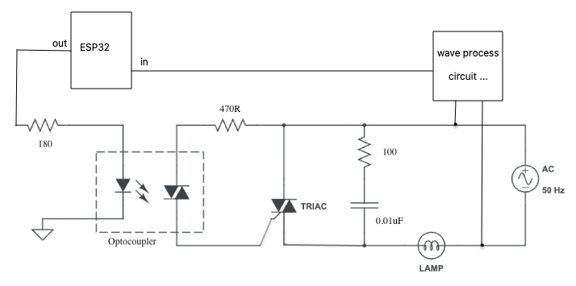
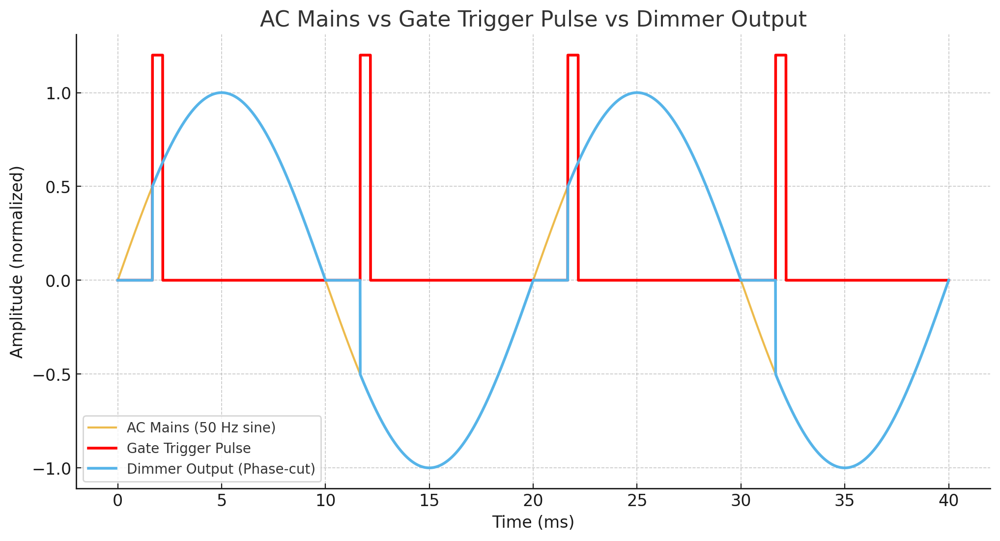

| Supported Targets | ESP32-C5 | ESP32-C6 | ESP32-C61 | ESP32-H2 | ESP32-H4 | ESP32-P4 |
| ----------------- | -------- | -------- | --------- | -------- | -------- | -------- |

# LEDC Dimmer Example

This example demonstrates how to generate TRIAC gate trigger pulses that are synchronized to the mains zero‑cross using LEDC and ETM. As a simplified demonstration, it simulates the 50 Hz zero‑cross AC mains detector input using a GPIO that toggles at 50 Hz, and uses ETM to reset the LEDC timer on each edge (every half-cycle) for synchronization. By shifting the LEDC `hpoint` (phase angle) after each reset, the gate pulse moves within the half‑cycle, achieving dimming.

## How to use example

### Hardware Required

* A development board with any Espressif SoC that has ETM functionality (e.g., ESP32C61-DevKitC etc.)
* A USB cable for power supply and programming

## Signals and pins

| Signal                                                          | GPIO                                                                        |
| --------------------------------------------------------------- | --------------------------------------------------------------------------- |
| Reference wave (50 Hz square from a AC mains detection circuit) | GPIO3 (configured as input/output in this demo to simulate the square wave) |
| Gate trigger pulse (LEDC output)                                | GPIO2                                                                       |

Expected observation if connect an oscilloscope or logic analyzer:

- A 50 Hz square wave on `GPIO3`.
- Short pulses on `GPIO2` that occur once each half‑cycle, moving left/right (earlier/later) every 2 seconds as the brightness ramps down and up.

## Build and flash

Build the project and flash it to the board, then run monitor tool to view serial output:

```bash
idf.py build
idf.py -p PORT flash monitor
```

(Replace PORT with the name of the serial port to use.)

(To exit the serial monitor, type ``Ctrl-]``.)

See the [ESP‑IDF Getting Started Guide](https://idf.espressif.com/) for full steps to configure and use ESP-IDF to build projects.

## Adapting to real mains dimming (advanced)

If you want to control a real TRIAC load (lamp):

1. Replace the simulated reference wave with a proper zero‑cross detector feeding an isolated input GPIO.
   - Configure `REFERENCE_WAVE_IO` as input only, remove the toggling task, and ensure ETM still triggers on both edges. Or to normalize the AC mains to some analog signal, and use analog comparator to trigger a ETM event.
2. Drive the TRIAC gate through an opto‑triac from the LEDC output GPIO with proper current‑limit resistor.

Here shows a simplified schematic for reference:



And here is an actual timing diagrams (AC mains + dimmer output waveforms with phase angle):



## Troubleshooting

- Pulse timing not updating on C6/C5/H2/P4/H4/H21 → Check the notes in the example source file. For such targets, LEDC timer period should be shorter than the half-cycle of the mains, so that timer overflow could happen to update the duty parameters.
- Please make sure (hpoint + duty) is always less than (2 ** timer_resolution), otherwise, behavior is unexpected.

For any technical queries, please open an [issue](https://github.com/espressif/esp-idf/issues) on GitHub. We will get back to you soon.
