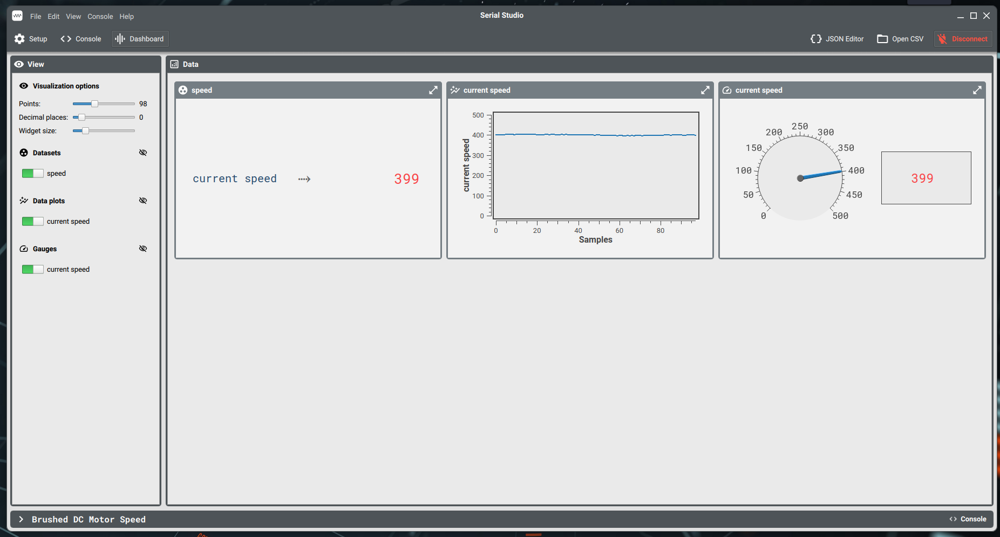

| Supported Targets | ESP32 | ESP32-C6 | ESP32-H2 | ESP32-P4 | ESP32-S3 |
| ----------------- | ----- | -------- | -------- | -------- | -------- |
# MCPWM Brushed DC Motor Example

(See the README.md file in the upper level 'examples' directory for more information about examples.)

This example mainly illustrates how to drive a brushed DC motor by generating two specific PWM signals. However the PWM signals from ESP chip can't drive motors directly as the motor usually consumes high current. So an H-bridge like [DRV8848](https://www.ti.com/product/DRV8848) should be used to provide the needed voltage and current for brushed DC motor. To simplify the DC motor control of MCPWM peripheral driver, there's a component called [bdc_motor](https://components.espressif.com/component/espressif/bdc_motor) which abstracts the common operations into a generic interface. The most useful operations are: `forward`, `reverse`, `coast` and `brake`.

To measure the speed of motor, a photoelectric encoder is used to generate the "speed feedback" signals (e.g. a pair of quadrature signal). In the example, we use the PCNT peripheral to decode that quadrature signals. For more information, please refer to [rotary encoder example](../../pcnt/rotary_encoder/README.md) as well.

The example uses a simple PID algorithm to keep the motor spin in a stable speed. Like the [bdc_motor](https://components.espressif.com/component/espressif/bdc_motor), the [PID component](https://components.espressif.com/component/espressif/pid_ctrl) is also managed by the component manager. These components' dependencies are listed in the [manifest file](main/idf_component.yml).

## How to Use Example

Before project configuration and build, be sure to set the correct chip target using `idf.py set-target <chip_name>`.

### Hardware Required

* A development board with any Espressif SoC which features MCPWM and PCNT peripheral (e.g., ESP32-DevKitC, ESP32-S3-Motor-Devkit, etc.)
* A USB cable for Power supply and programming
* A separate 12V power supply for brushed DC motor and H-bridge (the voltage depends on the motor model used in the example)
* A motor driving board to transfer pwm signal into driving signal
* A brushed DC motor, e.g. [25GA370](http://www.tronsunmotor.com/data/upload/file/201807/e03b98802b5c5390d6570939def525ba.pdf)
* A quadrature encoder to detect speed

Connection :
```
                                     Power(12V)
                                         |
      ESP                                v
+-------------------+             +--------------------+
|                   |             |      H-Bridge      |
|               GND +<----------->| GND                |      +--------------+
|                   |             |                    |      |              |
|  BDC_MCPWM_GPIO_A +----PWM0A--->| IN_A         OUT_A +----->|   Brushed    |
|                   |             |                    |      |     DC       |
|  BDC_MCPWM_GPIO_B +----PWM0B--->| IN_B         OUT_B +----->|    Motor     |
|                   |             |                    |      |              |
|                   |             +--------------------+      |              |
|                   |                                         +------+-------+
|                   |                                                |
|                   |             +--------------------+             |
|            VCC3.3 +------------>| VCC    Encoder     |             |
|                   |             |                    |             |
|               GND +<----------->|                    |<------------+
|                   |             |                    |
|BDC_ENCODER_GPIO_A |<---PhaseA---+ C1                 |
|                   |             |                    |
|BDC_ENCODER_GPIO_B |<---PhaseB---+ C2                 |
|                   |             |                    |
+-------------------+             +--------------------+
```

### Build and Flash

Run `idf.py -p PORT flash monitor` to build, flash and monitor the project.

(To exit the serial monitor, type ``Ctrl-]``.)

See the [Getting Started Guide](https://idf.espressif.com/) for full steps to configure and use ESP-IDF to build projects.


## Example Output

Run the example, you will see the following output log:

```
I (0) cpu_start: Starting scheduler on APP CPU.
I (308) example: Create DC motor
I (308) gpio: GPIO[7]| InputEn: 0| OutputEn: 1| OpenDrain: 0| Pullup: 1| Pulldown: 0| Intr:0
I (318) gpio: GPIO[15]| InputEn: 0| OutputEn: 1| OpenDrain: 0| Pullup: 1| Pulldown: 0| Intr:0
I (328) example: Init pcnt driver to decode rotary signal
I (328) gpio: GPIO[36]| InputEn: 1| OutputEn: 0| OpenDrain: 0| Pullup: 1| Pulldown: 0| Intr:0
I (338) gpio: GPIO[35]| InputEn: 1| OutputEn: 0| OpenDrain: 0| Pullup: 1| Pulldown: 0| Intr:0
I (348) gpio: GPIO[35]| InputEn: 1| OutputEn: 0| OpenDrain: 0| Pullup: 1| Pulldown: 0| Intr:0
I (358) gpio: GPIO[36]| InputEn: 1| OutputEn: 0| OpenDrain: 0| Pullup: 1| Pulldown: 0| Intr:0
I (368) example: Create PID control block
I (378) example: Create a timer to do PID calculation periodically
I (378) example: Enable motor
I (388) example: Forward motor
I (388) example: Start motor speed loop
```

### View velocity curve in [Serial Studio](https://github.com/Serial-Studio/Serial-Studio)

To help tune the PID parameters (i.e. `Kp`, `Ki` and `Kd` in the example), this example supports to log a short string frame of runtime motor speed. The string frame can be parsed by [Serial Studio](https://github.com/Serial-Studio/Serial-Studio). This example also provides the [communication description file](serial-studio-dashboard.json) out of the box, which can be loaded by Serial Studio and then plot the curves as follows:



## Troubleshooting

* Make sure your ESP board and H-bridge module have been connected to the same GND panel.
* The PID parameter set in ths example might not work well in all kinds of motors, because it's not adaptive. You need to fine tune the parameters again by yourself.

For any technical queries, please open an [issue](https://github.com/espressif/esp-idf/issues) on GitHub. We will get back to you soon.
