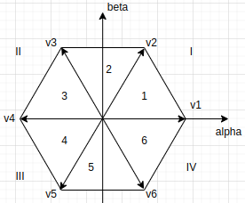
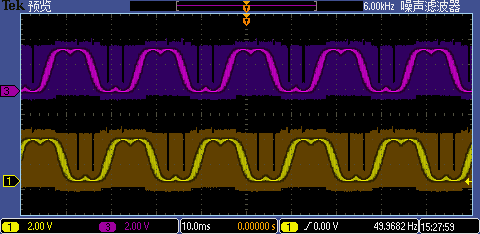
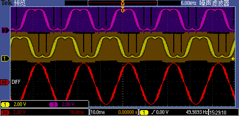

| Supported Targets | ESP32 | ESP32-C6 | ESP32-H2 | ESP32-P4 | ESP32-S3 |
| ----------------- | ----- | -------- | -------- | -------- | -------- |

# MCPWM FOC SVPWM Generation Open Loop Example

## Principle
This example shows how to use three pairs of PWM signals to realize FOC (Field-Oriented Control) via the MCPWM peripheral. With the internal dead time submodule, each pair of signals can drive one half-bridge circuit, so that they can be combined to drive a BLDC or PMSM motor, or a three-phase power inverter.

This example realizes an open-loop FOC algorithm to calculate the target voltages for three phases, and then modulates these voltages into three pairs of PWM signals to form the SVPWM signal (or SPWM if build with menu config `ESP_FOC_USE_SVPWM` off), and finally inputs this SVPWM into six power MOSFETs to get the three-phase power system.
```
            ┌─────────┐        ┌───────┐     Va
     Vq     │         │ Valpha │       ├──────►
     ──────►│ Inverse ├───────►│       │
            │         │        │ SVPWM │     Vb
     Vd     │         │ Vbeta  │       ├──────►
     ──────►│  Park   ├───────►│       │     Vc
            │         │        │       ├──────►
            └────▲────┘        └───────┘
                 │
                 │theta
```
The FOC sectors assignment and coord systems are as follow:


### Risks
These three-phase sine signals are generated at 50Hz by **open loop FOC**, please set a proper power supply, or don't let it work for a long time to avoid any potential **crash or damages** when using it to drive the motor.

## How to Use

### Hardware Required

1. An **ESP32-S3-Motor-DevKit**, or independent circuit module follows:
1.1. Any ESP board with MCPWM peripheral supported (e.g. ESP32S3, ESP32C6, ESP32H2 ,,,)
1.2. A three-phase gate driver, for example, the [DRV8302](https://www.ti.com.cn/product/zh-cn/DRV8302)
1.3. Six N-MOSFETs, for example, the [IRF540NS](https://www.infineon.com/cms/en/product/power/mosfet/12v-300v-n-channel-power-mosfet/irf540ns/)
2. A USB cable for programming
3. A Power supply at least 9V
4. Any 3-phases load (e.g. PMSM, ACIM, or transformer)

### Connection
Using only `delta/triangle` connect to the output.
```
                                               POWER
                                                 │
    ┌────────────────────────┐           ┌───────▼───────┐
    │                  Enable│           │               │
    │                        │           │               │           R1
    │ EXAMPLE_FOC_PWM_UH_GPIO├───────────┤ Bridge Driver │_________┌────┐____
    │                        │           │               │         └────┘    |
    │ EXAMPLE_FOC_PWM_UL_GPIO├───────────┤               │                   |
    │                        │           │     and       │           R2      |neutral line
    │ EXAMPLE_FOC_PWM_VH_GPIO├───────────┤               │_________┌────┐____|
    │                        │           │               │         └────┘    |
    │ EXAMPLE_FOC_PWM_VL_GPIO├───────────┤    MOSFET     │                   |
    │                        │           │               │           R3      |
    │ EXAMPLE_FOC_PWM_WH_GPIO├───────────┤               │_________┌────┐____|
    │                        │           │               │         └────┘
    │ EXAMPLE_FOC_PWM_WL_GPIO├───────────┤               │
    └────────────────────────┘           └───────────────┘
```


### Build and Flash

Select project Kconfig option `ESP_FOC_USE_SVPWM` by `idf.py menuconfig`:
- True: Using SVPWM modem, output saddle wave, the neutral point level is not const zero.
- False: Using SPWM modem, output standard sin wave, phases and lines level are all sin wave.

Run `idf.py -p PORT flash monitor` to build, flash and monitor the project.

(To exit the serial monitor, type ``Ctrl-]``.)

See the [Getting Started Guide](https://docs.espressif.com/projects/esp-idf/en/latest/get-started/index.html) for full steps to configure and use ESP-IDF to build projects.


## Example Output

Run the example, you will see the following output log:
```
...
Hi ESP_SV
I (327) bsp_mcpwm: Disable MOSFET gate
I (337) gpio: GPIO[46]| InputEn: 0| OutputEn: 1| OpenDrain: 0| Pullup: 0| Pulldown: 0| Intr:0
I (347) bsp_mcpwm: Create MCPWM timer
I (347) bsp_mcpwm: Create MCPWM operator
I (357) bsp_mcpwm: Connect operators to the same timer
I (357) bsp_mcpwm: Create comparators
I (367) bsp_mcpwm: Create PWM generators
I (367) gpio: GPIO[47]| InputEn: 0| OutputEn: 1| OpenDrain: 0| Pullup: 1| Pulldown: 0| Intr:0
I (377) gpio: GPIO[21]| InputEn: 0| OutputEn: 1| OpenDrain: 0| Pullup: 1| Pulldown: 0| Intr:0
I (387) gpio: GPIO[14]| InputEn: 0| OutputEn: 1| OpenDrain: 0| Pullup: 1| Pulldown: 0| Intr:0
I (397) gpio: GPIO[13]| InputEn: 0| OutputEn: 1| OpenDrain: 0| Pullup: 1| Pulldown: 0| Intr:0
I (407) gpio: GPIO[12]| InputEn: 0| OutputEn: 1| OpenDrain: 0| Pullup: 1| Pulldown: 0| Intr:0
I (417) gpio: GPIO[11]| InputEn: 0| OutputEn: 1| OpenDrain: 0| Pullup: 1| Pulldown: 0| Intr:0
I (427) bsp_mcpwm: Set generator actions
I (427) bsp_mcpwm: Setup deadtime
I (437) bsp_mcpwm: Start the MCPWM timer
I (437) bsp_mcpwm: Enable MOSFET gate
```

If you have an oscilloscope or a logic analyzer, you can see there are 7 segments in one PWM signal and all six PWM signals are center-aligned:


And if you monitor any output after the low-pass filter with the reference of the GROUND, there will be a saddle wave (or sin wave if build with the menu config `ESP_FOC_USE_SVPWM` off), two of them are as follow:


Do not surprise if you find it is not a `sin wave` while taking the GROUND as the reference, it is the characteristic of `SVPWM` modulation, because the voltage of `neutral line` is not zero for `SVPWM`. But if you monitor any `line-to-line` voltage (taking another signal as the reference) in this three-phase power system, you can still get the sin signal:


Please turn off config `ESP_FOC_USE_SVPWM` if the `neutral line` is required, then there will be a standard three-phase sin system.
