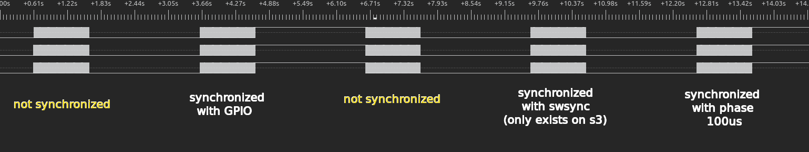
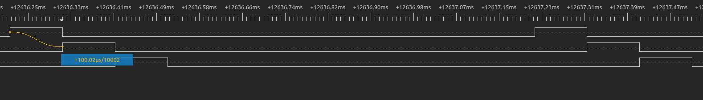

| Supported Targets | ESP32 | ESP32-S3 |
| ----------------- | ----- | -------- |

# MCPWM sync Example

(See the README.md file in the upper level 'examples' directory for more information about examples.)

This example aims to show howto sync those timers within the same MCPWM unit to produce fully synchronized output.

The example will:

- init MCPWM
- sync all three timers with the help of one extra GPIO
- mess the synchronized timers by stopping and restarting
- sync all three timers with software sync event, no GPIO required. (Only targets with `SOC_MCPWM_SWSYNC_CAN_PROPAGATE` ability can support).
- sync all three timers, but adding 10% delay between pulses from different channels

## How to Use Example

### Hardware Required

* An ESP32/ESP32S3 development board

It is recommended to have an oscilloscope or logic analyzer to verify the output pulse

Connection :

|     Pin     |        Func        |  Mode  |
| :---------: | :----------------: | :----: |
| GPIO_NUM_16 | MCPWM0.Timer0.GenA | Output |
| GPIO_NUM_17 | MCPWM0.Timer1.GenA | Output |
| GPIO_NUM_18 | MCPWM0.Timer2.GenA | Output |
| GPIO_NUM_21 |     GPIO_SYNC0     | INPUT  |
| GPIO_NUM_19 |   simulate input   | OUTPUT |

GPIO_NUM_21 and GPIO_NUM_19 **SHOULD** be wired together to provide simulated input.

Above pin selection can be changed within file `mcpwm_sync_example.c`.

### Build and Flash

Run `idf.py -p PORT flash monitor` to build, flash and monitor the project.

(To exit the serial monitor, type ``Ctrl-]``.)

See the [Getting Started Guide](https://docs.espressif.com/projects/esp-idf/en/latest/get-started/index.html) for full steps to configure and use ESP-IDF to build projects.

## Example Output

```
I (306) sync_example: MCPWM sync example
I (306) sync_example: PWM started, not synchronized
I (3316) sync_example: Sync timers with GPIO approach
I (3326) sync_example: Output should already be synchronized
I (6326) sync_example: force synchronous lost
I (9326) sync_example: Output should already be synchronized on esp32s3
I (12336) sync_example: Each output pulse should be placed with 10 percents of period
```

Overall pulse graph:



Sync:


Sync with phase:



## Troubleshooting

For any technical queries, please open an [issue] (https://github.com/espressif/esp-idf/issues) on GitHub. We will get back to you soon.
