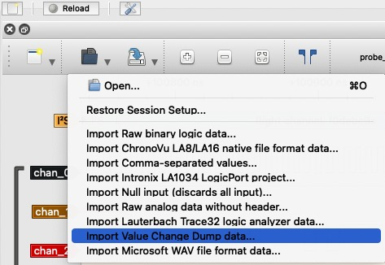
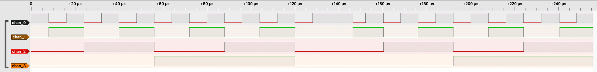
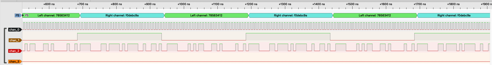

| Supported Targets | ESP32-C6 | ESP32-H2 |
| ----------------- | -------- | -------- |

# Logic Analyzer Example

(See the README.md file in the upper level 'examples' directory for more information about examples.)

This example demonstrates how to implement a logic analyzer via Parallel IO RX peripheral. The main implementation is extracted as `esp_probe` component for portability.

Parallel IO is a peripheral that can sample data on multiple GPIOs in parallel at a high rate, which in its basic form is exactly the functionality of a logic analyzer.

This example uses the "software delimiter mode" of the Parallel IO RX driver, so that the Parallel IO RX peripheral can be driven by the internal clock and keep sampling continuously.

## Example Overview

Under the default configuration, this example will probe the signals on several GPIOs, meanwhile these GPIOs will generate some signals by GPIO driver. The probed raw data will be stored temporary on the heap. When the allocated heap is run out or the probing time expires, the probing will stop and output the stored raw data to the output stream.

## How to Use Example

### Step 0: Requirement

#### Hardware

* A development board which has the parlio peripheral integrated, for supported chips see the table at the top
* A USB cable for power supply and programming
* Network connection if using TCP output stream

#### Extra Software on PC

* [PulseView](https://sigrok.org/wiki/Downloads) for visualizing the captured signal

### Step 1: Configure The Project

Run `idf.py menuconfig` under this example director to configure the example.

1. The `esp_probe` component can probe either internal signals or external signals, choose this configuration to select:

    * "Select signal source": to select where the signals come from.

        - "Probing the internal signals": the signals come from the chip itself (i.e., internal). The output signals on the GPIO will be feed back to the Parallel IO RX via GPIO matrix. This example only simulates some signals by GPIO driver, you can also modify the example code to probe the signals that produced by other peripherals (like I2C, I2S, SPI, etc).

        - "Probing the External signals": the signals come from external source that connected to the probing GPIOs.

2. The `esp_probe` component support Flash or TCP stream to output the raw data,  choose this configuration to select:

    * "Select ESP probe dump stream": to select the output stream

        - "Dump data into FLASH": the data will be dumped into the Flash, it requires you to allocate a FAT partition in the partition table. In this example, there is a `storage` partition for saving the probed raw data. Then we can use `esptool`to read this partition on the host side. Normally we read the whole `storage` partition, because we don't know the exact start address that the raw data saved.

        - "Dump data to the host using TCP": the data will be dumped to the host directly via the TCP stream. Target should support connecting to the network via WiFi or Ethernet.

3. To change the probing GPIOs, modify the `s_probe_gpio` array in the `logic_analyzer_example_main.c`

#### Flash Stream

If we choose to dump into flash, please make sure the data partition label we set in the menuconfig is same as what we set in the `partition.csv`

* "The label of the data storage partition": sets the partition label that specified in `partition.csv` file. Defaults to `storage`.

#### TCP Stream

If we choose to dump via TCP, please specify the WiFi or Ethernet configurations in the menu "Example Connection Configuration", and then specify the TCP server information in "ESP probe configurations > Select ESP probe dump stream" menu:

* "TCP server IP address": the IP address that TCP server bound
* "TCP server port": the port the TCP server is listening on (default 8888)

### Step 2: Build And Flash

(If you're using TCP stream, please go to Step 3 first)

Build the project and flash it to the board, then run monitor tool to view serial output:

```bash
idf.py -p PORT build flash monitor
```

And then waiting until the main task finished

```
I (2625) main_task: Returned from app_main()
```

(To exit the serial monitor, type ``Ctrl-]``.)

See the Getting Started Guide for full steps to configure and use ESP-IDF to build projects.

### Step 3: Convert Raw Data into VCD Format

Before conversion, we need to know how many channels in the raw data. In this example, we probed 4 GPIOs that set in `s_probe_gpio`, so we need to specify the channel number for the conversion.

#### Flash Stream

1. Exit the serial monitor and use `esptool` to read the flash partition to the host:

    For the default partition in this example:

    ```bash
    parttool.py -p <serial_port> -b 406800 -f partitions.csv read_partition -h -n storage --output probe_raw.dat
    ```
2. Convert the raw data into VCD format:

    (Run the following command under the example directory)
    ```bash
    python components/esp_probe/host/vcd_dumper.py -n 4 -i probe_raw.dat -o probe_vcd_data.vcd
    ```

    * `-n`: the channel number that probed
    * `-i`: the the input raw data file
    * `-o`: the output vcd file name (optional)

    Then you can get the VCD file on the host.

**Note:** This example converted the whole partition into VCD file for demonstration, you can also adopt some methods to extract the saved file in this partitions like:

- Download the whole partition into the host and mount it as FS on host by Loop Device or RAM Disk;
- Download the whole partition into the host and parse the FAT Root Directory and find the data offset of the file `/esp_probe/probe_raw.dat`;

#### TCP Stream

1. Start the TCP server on the host:

    (Run the following command under the example directory)
    ```bash
    python components/esp_probe/host/tcp_server -n 4 -p 8888 -o probe_vcd_data.vcd
    ```

    * `-n`: the channel number that probed
    * `-p`: the TCP port (default 8888)
    * `-o`: the output vcd file name (optional)

    Then you can see the TCP server is on, log printed like:

    ```
    TCP listening at 192.168.1.106:8888
    ```
2. Jump back to the Step 2 to flash and monitor the target

3. If the TCP client connected successfully, there will be data received, you can see the log like:

    ```
    Client 192.168.1.183:49626 joined
    data received 1440 bytes
    data received 1440 bytes
    data received 2880 bytes
    ...
    Client 192.168.1.183:49626 left
    ```

    Then you can get the VCD data on the host.

### Step 4: View The Signals on PulseView

Open PulseView and import the file `probe_vcd_data.vcd` with `Value Change Dump data` option:



#### Internal Signals That Simulated by GPIOs



#### External I2S Philips Signals with I2S Decoder



## Further More Introduction on `esp_probe`

### Data Mode

#### Stream Mode

Stream mode will output the raw data via the output stream without storing. Stream mode can be selected by the helper macro `ESP_PROBE_DEFAULT_STREAM_CONFIG` (the probe GPIOs need to be set additionally).

* Advantage is that don't need extra storage to store the raw data.
* Disadvantage is that, due to the received data must finish sending before the new data receives, the sample rate is limited by the output stream bandwidth. Normally it can only achieve a low sample rate to avoid data lost.

#### Buffer Mode (Recommended)

Buffer mode store the raw data on the heap storage temporary before sending them. Buffer mode can be selected by the helper macro `ESP_PROBE_DEFAULT_BUFFER_CONFIG` (the probe GPIOs need to be set additionally).

* Advantage is that, it can support a high sample rate.
* Disadvantage is that, the sampling time is limited by the available heap size. Normally the available heap size is only several hundreds KB, which can only hold raw data for several ms when sampling with a high rate. But buffer mode is still recommended as it is more useful in most of cases.

#### Buffer Stream Mode

Buffer Stream mode store the raw data on the heap storage temporary but the storage will be used as Ping-Pong buffer to send the data in the storage. Buffer Stream mode can be selected by the helper macro `ESP_PROBE_DEFAULT_BUFFER_STREAM_CONFIG` (the probe GPIOs need to be set additionally).

* Advantage is that, the sampling time is not limited. Comparing to the Stream mode, it can reach a relative higher sample rate.
* Disadvantage is that, we still need to guarantee the output stream can catch the new data generation, otherwise data will be still be dropped.

### Output Streams

Currently `esp_probe` supports `Flash` and `TCP` stream.

#### Flash Stream

Requires a built-in Flash or external Flash and a data partition in FAT format.

* Advantages:

    1. Support larger storage comparing to the heap;
    2. ESP modules always have Flash on it, and no additional WiFi environment required;

* Disadvantages:

    1. Low bandwidth. About several hundreds KB/s supported (e.g. 300+ KB/s on ESP32-H2);
    2. Have to use `esptool` to read the raw data from the partition and then dump it into VCD format additionally;
    3. This example convert the whole storage partition into VCD format, which includes some unrelated data. Or you have to get the file from the partition in some ways additionally.

#### TCP Stream

Requires WiFi or Ethernet supported on the target and accessible network.

* Advantages:

    1. High bandwidth. Nearly 30 MB/s throughput supported, which allows a higher sample rate. For example, the sample rate can reach `25MB/s` on C6 with `Buffer Mode`, and 700+ KB/s with `Stream mode` without data dropped;
    2. The TCP server can dump the raw data into VCD format directly without other operations;

* Disadvantages:

    1. WiFi or Ethernet is required on the target;
    2. Larger image size;

## Troubleshooting

* The TCP server will sometimes miss the client disconnection (i.e. no `Client 192.168.1.183:56208 left` log).
    - Just quit the progress by `Ctrl + C` and wait for a while util the port is released

For any technical queries, please open an [issue](https://github.com/espressif/esp-idf/issues) on GitHub. We will get back to you soon.

