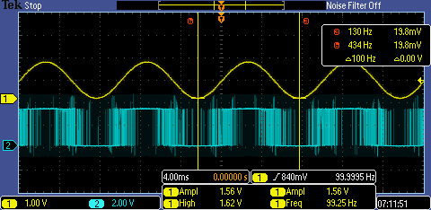

| Supported Targets | ESP32 | ESP32-C3 | ESP32-C5 | ESP32-C6 | ESP32-H2 | ESP32-H21 | ESP32-H4 | ESP32-P4 | ESP32-S2 | ESP32-S3 | ESP32-S31 |
| ----------------- | ----- | -------- | -------- | -------- | -------- | --------- | -------- | -------- | -------- | -------- | --------- |

# Sigma Delta Modulation DAC Example

(See the README.md file in the upper level 'examples' directory for more information about examples.)

This example uses the sigma-delta driver to generate modulated output on a GPIO. If you filter the output signal with an active or passive filter, you can get a 100 Hz sine wave.

## How to use example

### Hardware Required

* A development board with any supported Espressif SoC (e.g., ESP32-DevKitC, ESP-WROVER-KIT, etc.)
* A USB cable for Power supply and programming
* An active or passive low-pass filter. Connect them as below:

```
┌──────────────────────────────┐
│             ESP              │     ┌───────────────────┐
│                              │     │ Active or Passive │    Sine Wave
│ EXAMPLE_SIGMA_DELTA_GPIO_NUM ├────►│  Low-pass Filter  ├──────────────
└──────────────────────────────┘     └───────────────────┘
```

### Configure the project

The main configurations can be update by the macro that defined at the top of the [example source file](main/sdm_dac_example_main.c), including the output gpio, timer callback interval and the sine wave frequency and amplitude.

### Build and Flash

Build the project and flash it to the board, then run the monitor tool to view the serial output:

Run `idf.py -p PORT flash monitor` to build, flash and monitor the project.

(To exit the serial monitor, type ``Ctrl-]``.)

See the [Getting Started Guide](https://docs.espressif.com/projects/esp-idf/en/latest/get-started/index.html) for full steps to configure and use ESP-IDF to build projects.

## Example Output

Once the upload is complete and the board is reset, the program should start running. This is reported on the monitor as below:

```
...
I (299) main_task: Calling app_main()
I (309) gpio: GPIO[0]| InputEn: 0| OutputEn: 1| OpenDrain: 0| Pullup: 1| Pulldown: 0| Intr:0
I (309) sdm_dac: Sigma-delta output is attached to GPIO 0
I (319) sdm_dac: Timer allocated with resolution 1000000 Hz
I (329) sdm_dac: Timer callback registered, interval 100 us
I (329) sdm_dac: Timer enabled
I (339) sdm_dac: Output start
```

After the output stated, you can monitor the output signal by an oscilloscope.

If you monitor on the GPIO directly, you can see the raw SDM output, it consists of square waves (i.e. pulse) with different densities (see the blue wave in the figure), and if you monitor the signal after a low-pass filter, you can see the pulses are filtered into a sine wave already (see the yellow wave in the figure).



## Troubleshooting

For any technical queries, please open an [issue](https://github.com/espressif/esp-idf/issues) on GitHub. We will get back to you soon.

If a lot of glitches appear in the filtered sine wave, it might be the inappropriate GND that the probe connected, please try to choose the GND that nearby the filter.
