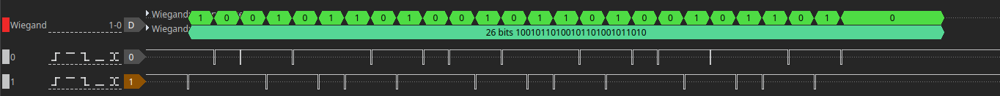

| Supported Targets | ESP32 | ESP32-C3 | ESP32-C5 | ESP32-C6 | ESP32-C61 | ESP32-H2 | ESP32-H21 | ESP32-H4 | ESP32-P4 | ESP32-S2 | ESP32-S3 | ESP32-S31 |
| ----------------- | ----- | -------- | -------- | -------- | --------- | -------- | --------- | -------- | -------- | -------- | -------- | --------- |

# Wiegand Interface Example

This example uses the **gptimer and gpio driver** to simulate Wiegand Interface. See the [Wiegand Interface](https://en.wikipedia.org/wiki/Wiegand_interface)  
In this example, we use two timers (one in one-shot mode and another in periodic mode) to trigger the interrupt and change the output state of the gpio in the interrupt.

### Note on timing requirements

Due to the tight timing requirements of wiegand protocol, the gpio control function, timer control function and timer isr handle should be placed in IRAM. This circumvents the timing variations caused by cache misses/invalidation when executing a function placed in flash.

Configure sdkconfig as follows:

```
CONFIG_GPIO_CTRL_FUNC_IN_IRAM=y
CONFIG_GPTIMER_CTRL_FUNC_IN_IRAM=y
CONFIG_GPTIMER_ISR_HANDLER_IN_IRAM=y

```

## How to Use Example

### Hardware Required

* A development board with ESP SoC (e.g., ESP32-DevKitC, ESP-WROVER-KIT, etc.)
* A USB cable for Power supply and programming

### Build and Flash

Run `idf.py -p PORT flash monitor` to build, flash and monitor the project.

(To exit the serial monitor, type ``Ctrl-]``.)

See the [ESP-IDF Getting Started Guide](https://idf.espressif.com/) for all the steps to configure and use the ESP-IDF to build projects.

## Example Output

```text
I (0) cpu_start: Starting scheduler on APP CPU.
I (319) example: Configure wiegand interface
I (319) gpio: GPIO[2]| InputEn: 0| OutputEn: 1| OpenDrain: 0| Pullup: 0| Pulldown: 0| Intr:0 
I (329) gpio: GPIO[15]| InputEn: 0| OutputEn: 1| OpenDrain: 0| Pullup: 0| Pulldown: 0| Intr:0 
I (339) example: send wiegand data
I (339) main_task: Returned from app_main()
```

The wiegand interface io will transfer data after the initialization. 

The wiegand data are as follow:


## Troubleshooting

For any technical queries, please open an [issue](https://github.com/espressif/esp-idf/issues) on GitHub. We will get back to you soon.
