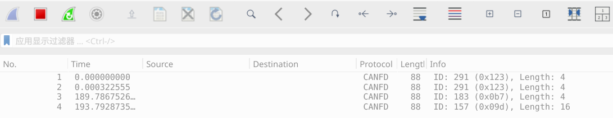

| Supported Targets | ESP32-H4 | ESP32-P4 | ESP32-S2 | ESP32-S3 | ESP32-S31 |
| ----------------- | -------- | -------- | -------- | -------- | --------- |

# USB TWAI Adapter Example

This example turns an ESP chip into a USB-CAN adapter compatible with the Linux `gs_usb` driver. After flashing, the board appears on the host as a CAN network interface and forwards frames between USB and the TWAI bus. CAN FD is enabled on chips that support TWAI FD.

## Hardware Required

- An ESP development board with USB device support and TWAI support.
- A TWAI FD capable chip is required for CAN FD operation.
- A TWAI transceiver, such as SN65HVD230 or TJA1050.
- A USB cable and jumper wires.

## Hardware Setup

Connect the ESP board to a TWAI transceiver:

```
ESP Pin       Transceiver    TWAI Bus
-------       -----------    --------
GPIO4 (TX) -> CTX
GPIO5 (RX) <- CRX
3.3V/5V    -> VCC
GND        -> GND
              TWAI_H      -> TWAI_H
              TWAI_L      -> TWAI_L
```

## Configure the Project

The example uses the following defaults:

- TWAI TX GPIO: `GPIO4`
- TWAI RX GPIO: `GPIO5`

To change pins or defaults, edit [candlelight_internal.h](main/candlelight_internal.h).

## Build and Flash

```bash
idf.py -p PORT flash monitor
```

## Use on Linux

After plugging the board into a Linux host via the chip's native USB device port, confirm the device enumerates (OpenMoko candleLight VID/PID so the in-tree `gs_usb` driver binds):

```bash
lsusb
# Bus 001 Device 011: ID 1d50:606f OpenMoko, Inc. Geschwister Schneider CAN adapter
```

Then check that a CAN interface appears:

```bash
ip link show
```

Bring the interface up, then use standard SocketCAN tools:

```bash
sudo ip link set can0 up type can bitrate 500000 dbitrate 2000000 fd on
candump can0
cansend can0 123##1DEADBEEF
```

For classic CAN only, omit the FD options:

```bash
sudo ip link set can0 up type can bitrate 500000
```

Monitor CAN frames transaction:

```bash
candump can0 -ex
```

Which should print the frames you have send or received like (where TX/RX shows directions):
```
~$ candump can0 -ex
    can0  TX B -  123  [04]  DE AD BE EF
    can0  RX - -  0B7  [04]  60 88 DE 53
    can0  RX - -  09D  [16]  8B A9 E4 1E 2E 07 13 58 8B A9 E4 1E 2E 07 13 58
```

Or monitor transactions from `wireshark`, it will show both send and echo frames:



Bring the interface down when finished:

```bash
sudo ip link set can0 down
```
