| Supported Targets | ESP32 | ESP32-C2 | ESP32-C3 | ESP32-C6 | ESP32-H2 | ESP32-S2 | ESP32-S3 |
| ----------------- | ----- | -------- | -------- | -------- | -------- | -------- | -------- |

Note: In this example, the ESP32 only supports the GPIO Control

# External Power Control Example

(See the README.md file in the upper level 'examples' directory for more information about examples.)

This example demonstrates how to use the [power management](https://docs.espressif.com/projects/esp-idf/en/latest/api-reference/system/power_management.html) function, through the [GPIO](https://docs.espressif.com/projects/esp-idf/en/latest/api-reference/peripherals/gpio.html#gpio-rtc-gpio), [UART](https://docs.espressif.com/projects/esp-idf/en/latest/api-reference/peripherals/uart.html#uart) control [power management lock](https://docs.espressif.com/projects/esp-idf/en/latest/api-reference/system/power_management.html) has realized the function of controlling the power consumption of the system, and provides a complete set of control logic.

1. The example supports GPIO-controlled power management and [auto light sleep](https://docs.espressif.com/projects/esp-idf/en/latest/api-reference/system/sleep_modes.html#api-reference) functions with two control modes.

   - Level control: The GPIO input level always corresponds to the chip state.

   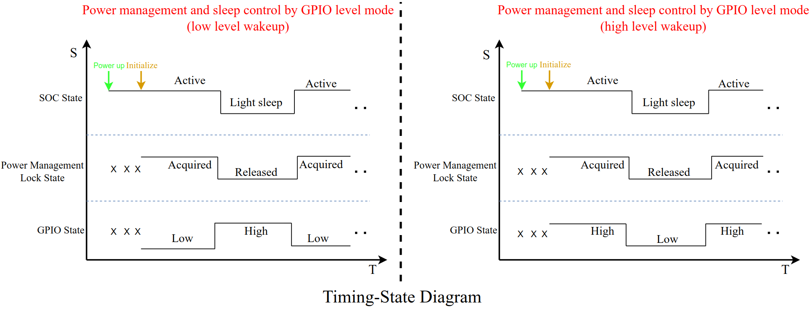

   - Pulse control: Trigger a complete pulse once and the chip state will change.

   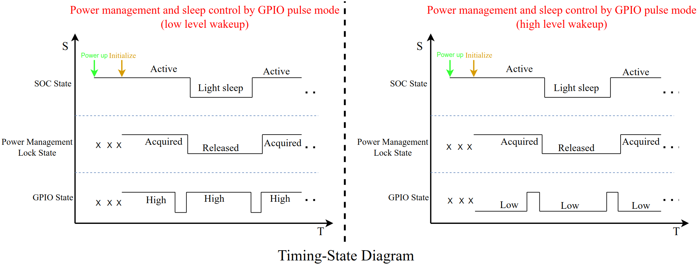

2. This example supports both UART-controlled power management and auto light sleep.

Note 1: The example can be configured via `menuconfig`. (See [Configure the project](##Configure the project) section)

Note 2: For an explanation of the example, see the [Example Breakdown](#Example Breakdown) section.

WARNING: This project uses power management features, so the  [CONFIG_PM_ENABLE](https://docs.espressif.com/projects/esp-idf/en/latest/api-reference/kconfig.html#config-pm-enable) option must be enabled. In addition, auto light sleep mode is based on the [FreeRTOS Tickless idle](https://freertos.org/low-power-tickless-rtos.html) feature, so the [CONFIG_FREERTOS_USE_TICKLESS_IDLE](https://docs.espressif.com/projects/esp-idf/en/latest/api-reference/kconfig.html#config-freertos-use-tickless-idle) option must be enabled when using the auto light sleep feature via `esp_pm_configure()`, otherwise `esp_pm_configure()` will return an ESP_ERR_NOT_SUPPORTED error.

## How to use example

### Hardware Required

This example will typically run on any popular ESP32 series development board.

### Configure the project

```
idf.py set-target esp32xx
```

(Use specific soc model instead of xx)

```
idf.py menuconfig
```

* GPIO Pin Configuration: `(Top) -> Example Configuration -> GPIO configuration -> Pin for gpio control`
* GPIO control mode configuration: `(Top) -> Example Configuration -> GPIO configuration -> Enable GPIO pulse control`
* GPIO control level configuration: `(Top) -> Example Configuration -> GPIO configuration -> Enable GPIO high-level control`
* GPIO pull-up and pull-down configurations: `(Top) -> Example Configuration -> GPIO configuration -> Use internal pull up and pull down`
* UART Configuration: `(Top) -> Example Configuration -> UART configuration -> Select the UART to use`
* UART's tx pin configuration: `(Top) -> Example Configuration -> UART configuration -> Select the UART tx io`
* UART's rx pin configuration: `(Top) -> Example Configuration -> UART configuration -> Select the UART rx io`
* UART's cts pin configuration: `(Top) -> Example Configuration -> UART configuration -> Select the UART cts io`
* UART's rts pin configuration: `(Top) -> Example Configuration -> UART configuration -> Select the UART rts io`
* UART wakeup threshold configuration: `(Top) -> Example Configuration -> UART configuration -> UART wakeup threshold`
* Timer Configuration: `(Top) -> Example Configuration -> UART configuration -> idle wait time (us)`
* Power management lock configuration: `(Top) -> Example Configuration -> power manager configuration -> Set pm lock`
* Power management configuration: `(Top) -> Example Configuration -> power manager configuration -> Set max freq in pm config`
* Power management configuration: `(Top) -> Example Configuration -> power manager configuration -> Set min freq in pm config`

An explanation of the above configuration options can be viewed via `manuconfig`.

Note: All of the above configuration options have default values, you can build the project directly after setting the target development board using `idf.py set-target esp32xx`.

### Build and Flash

Build the project and flash it to the board, then run monitor tool to view serial output:

```
idf.py -p PORT flash monitor
```

(Replace PORT with the name of the serial port to use.)

(To exit the serial monitor, type ``Ctrl-]``.)

See the [Getting Started Guide](https://docs.espressif.com/projects/esp-idf/en/latest/get-started/index.html) for full steps to configure and use ESP-IDF to build projects.

## Example Output

Since the example supports two types of GPIO control methods, level and pulse, and then combines the low level or high level wake-up, there are four types of control methods, but their outputs are similar, so only the output of the low level wake-up under the level control method is given here as an example.

Initialize Power Management, GPIO, and UART according to the set configuration:

```
...
I (315) app_start: Starting scheduler on CPU0
I (320) main_task: Started on CPU0
I (320) main_task: Calling app_main()
I (320) pm: Frequency switching config: CPU_MAX: 160, APB_MAX: 80, API (340) uart: queue free spaces: 5
I (340) uart_control: UART control initialization complete
I (340) pm: Frequency switching config: CPU_MAX: 160, APB_MAX: 80, APB_MIN: 40, Light sleep: ENABLED
I (350) power_config: Acquired lock at [0x4081303c], system remains active
I (360) gpio: GPIO[6]| InputEn: 1| OutputEn: 0| OpenDrain: 0| Pullup: 0| Pulldown: 1| Intr:0 
Waiting for [GPIO6] to go low...
I (370) ext_power_ctrl_main: All init success
I (380) main_task: Returned from app_main()
...
```

Based on the output, the example is waiting for the GPIO pin to go low, at which point the GPIO pin is set low:

```
...
I (4100) gpio_control: GPIO control initialization complete
...
```

### GPIO control

For this example, if Wake-up by high level is set, then a high input to the GPIO pin corresponds to the operation of acquiring the power management lock, and a low input corresponds to the operation of releasing the power management lock. On the other hand, if Wake-up low level is set, a low input to the GPIO pin corresponds to the operation of acquiring the lock, and a high input corresponds to the operation of releasing the lock.

In the level control mode, when the GPIO pin input is low during low level wake-up, the system will acquire the power management lock and keep it active; when the GPIO pin input is high, the system will release the power management lock, and if the system is idle at this time, it will enter auto light sleep.

The GPIO pin constantly inputs high and low levels and outputs as follows:

```
...
I (8370) gpio_control: Acquired lock at [0x4081303c], system remains active
I (9180) gpio_control: Released lock at [0x4081303c], system may sleep
I (10120) gpio_control: Acquired lock at [0x4081303c], system remains active
I (12230) gpio_control: Released lock at [0x4081303c], system may sleep
...
```

### UART control

For this example, the default UART is bound to the default console port (UART_NUM_0), and the chip is woken up from light sleep by entering a character at the keyboard. In this example, the UART wakes up and starts a timer that guarantees to release the power management lock if no UART data is received for a certain period of time.

Entering the character 'u' from the keyboard wakes up the chip and acquires the power management lock, after which no further action is taken, and after a certain period of time the timer times out and releases the lock. The output is as follows:

```
I(15260) uart_control: Acquired lock at [0x4087cd38], system remains active
I (23270) uart_control: Released lock at [0x4087cd38], system may sleep
I (24700) uart_control: Acquired lock at [0x4087cd38], system remains active
```

Note 1: In this example, the UART wake-up threshold is set to 3 by default, which means the ascii code of the input character should have at least 3 edges, for example, the ascii code of the character "0" is "0011 0000" in binary, which contains only 2 edges, so the character "0" is not enough to wake up the chip.

Note 2: Only UART0 and UART1 are supported to be configured as wake-up source. For ESP32, although it can be woken up by uart, there is no uart wakeup interrupt, so it can't perform the lock acquisition operation.

Note 3: The data received during light sleep is only used for wakeup and will not be received by the UART peripheral or passed to the driver.

## Troubleshooting

1. GPIO wakeup supports level mode, GPIO wakeup and GPIO interrupt use the same set of configuration registers, so if you use the "GPIO wakeup, control power management lock through GPIO interrupt" method, then GPIO interrupt can only be configured as level mode. In addition, the configurations of GPIO wakeup and GPIO interrupt should not be conflicting, for example, if you configure the GPIO wake-up to be high level first, and then configure the GPIO interrupt to be low level, then you can't wake up the chip by high level.

2. Can't do block thing in a task in gpio control.

   - Because the gpio interrupt has been disable in the GPIO interrupt service program, when the task is placed in the blocking queue before enabling the interrupt in the task because of blocking on an event, it is possible to execute the idle task, and at this time, it will cause the chip to enter the auto light sleep mode, but the GPIO interrupt has not yet been re-enabled, which will result in the wake-up again, it is not able to trigger the GPIO interrupt, and it will not be able to operate the power lock.

3. In order to ensure that the GPIO can successfully wake up the chip, it is necessary to configure the GPIO as a level-triggered mode and disable the GPIO interrupt source in the interrupt callback in time to prevent frequent interrupt triggering.

4. Leakage current problem

   - After testing, all the socs have the same phenomenon: the light sleep power consumption with pulse control is **about 80uA lower** than the light sleep power consumption with level control (all other configurations are the same). This is due to the internal pull-up or pull-down resistor of the IO configuration forming a path with the input level of the IO pin during light sleep in level control mode, and **the leakage current caused by the pull-up or pull-down resistor**.

   - Using the ESP32-S3 as an example, the four types of GPIO control are explained:

     | Control mode | Wakeup level | Current during light sleep (uA) | Internal pull-up or pull-down | Level at sleep |
     | ------------ | ------------ | ------------------------------- | ----------------------------- | -------------- |
     | Pulse        | LOW          | 180                             | pull-up resistor              | HIGH           |
     | Pulse        | HIGH         | 191                             | pull-down resistor            | LOW            |
     | Level        | LOW          | 262                             | pull-down resistor            | HIGH           |
     | Level        | HIGH         | 258                             | pull-up resistor              | LOW            |

     The leakage current is about 80 uA and the voltage 3.3 V. In turn, the resistance values of the pull-up and pull-down resistors can be calculated:

     **3.3 * 1000000 / 80 = 41250 Ω，So the inferred pull-up and pull-down resistor resistance is 41.3 KΩ**

   - The circuits during light sleep in the 4 GPIO control modes are as follows:

     - Pulse-Low level wakeup

       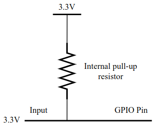

     - Pulse-High level wakeup

       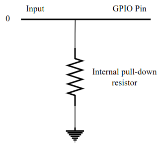

     - Level-Low level wakeup

       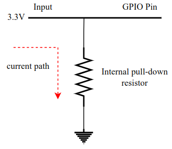

     - Level-High level wakeup

       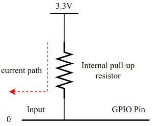

   - To avoid leakage currents due to pull-up and pull-down resistors, try the following two methods:

     1. No internal pull-up and pull-down resistors are used and the pin input levels are guaranteed by external circuitry.
     2. Use the [gpio_sleep_sel_dis()](https://docs.espressif.com/projects/esp-idf/en/latest/api-reference/peripherals/gpio.html#_CPPv418gpio_sleep_sel_dis10gpio_num_t) function to isolate the GPIO pin during light sleep so that external levels do not affect the pin.

5. Flash power down is not recommended

   - As a storage medium, flash has strict timing requirements for power-up and power-down. (You can check the details in the datasheet of the specific flash chip model.)
   - It takes some time for the flash to work properly after powering up, and accessing the flash immediately after powering up will result in an error.
   - In addition, the current of flash is not large enough to significantly affect the power consumption during light sleep, so the flash should not be powered down during the chip's light sleep.

6. Selection of UART clock source

   - There are several different options for the UART clock source in the IDF. Taking ESP32-S3 as an example, `UART_SCLK_DEFAULT` is the APB clock, but the frequency of APB is directly related to the CPU frequency. **When the CPU frequency is PLL, the APB frequency is 80 MHZ, otherwise it is the same frequency as the CPU**. When dynamic frequency cutting is enabled with Power Manager function, the CPU frequency will change, and the corresponding APB frequency will also change.

     At initialization, CPU runs at maximum frequency, APB frequency is 80 MHZ, then when UART is initialized, it configures the baud rate according to the APB frequency of 80 MHZ, at first, everything is normal, after releasing the lock, CPU may switch to the minimum frequency, at this time, the APB is the same as the CPU frequency (generally 40 MHZ, except for ESP32-H2), but UART does not know that the APB frequency has been changed, it still sets the baud rate according to the original 80 MHZ, but the actual frequency is 40 MHZ, so at this time, the baud rate is wrong, which leads to garbage. However, the UART does not know that the frequency of APB has been changed, it still sets the baud rate according to the original 80 MHZ, but the actual frequency is 40 MHZ, so the baud rate is wrong at this time, which leads to garbled code.

   - When setting the UART clock source, should set the clock source that is not affected by the dynamic frequency cut function.

7. If the power consumption during light sleep is high, you can set some configuration options in `menuconfig` to reduce the power consumption.

   - The CPU is powered down when light sleep is configured: `(Top) -> Component config -> Power Management -> Power down CPU in light sleep`
   - For the ESP32-C6 and ESP32-H2, digital peripheral power-down can be configured if the UART function is not used: `(Top) -> Component config -> Power Management -> Power down Digital Peripheral in light sleep (EXPERIMENTAL)`
   - Configure Wi-Fi and Bluetooth for MAC, baseband power down: `(Top) -> Component config -> PHY -> <ESP_PHY_MAC_BB_PD> Power down MAC and baseband of Wi-Fi and Bluetooth when PHY is disabled`
   - Configure PSRAM (if the SOC supports configuring PSRAM)
     1. `(Top) -> Component config -> ESP PSRAM -> Support for external, SPI-connected RAM`
     2. `(Top) -> Component config -> Hardware Settings -> Sleep Config -> Pull-up PSRAM CS pin in light sleep (NEW)`

8. Power consumption when the chip is active (need to check the real-time current with an ammeter)

   - If small current spikes occur periodically, consider that some task is being performed.
   - If the chip is not able to sleep, consider whether there is a task delay time less than the parameter `Minimum number of ticks to enter sleep mode for` setting. In addition, you also need to check whether the power management locks are still not released, you can turn on the menuconfig `Enable profiling counters for PM locks` option, in the program periodically call `esp_pm_dump_locks(stdout)` to view the current occupation time of the various management locks and other information, debug end, you need to turn off this option to reduce overhead. After debugging, you need to turn off this option to reduce the overhead. In addition, you can also turn on the `Enable debug tracing of PM using GPIOs` option for GPIO debugging, see [pm_trace.c](https://github.com/espressif/esp-idf/blob/master/components/esp_pm/pm_trace.c) for details.

9. Intermittent serial output in light sleep mode

   When the chip enters light sleep mode, the UART data buffer will not be flushed. Instead, the UART output will be paused and the remaining characters in the FIFO will be sent after the light sleep wakes up. You can add `uart_wait_tx_idle_polling()` after the position that needs to be sent to achieve the effect that it will sleep after sending is completed.

10. Abnormal application operation in low-power mode

    When Power Management is enabled, the system will dynamically switch between `max_freq_mhz` and `min_freq_mhz`. If the task has system performance requirements, it needs to create and maintain a power management lock that meets the task's needs, such as `ESP_PM_CPU_FREQ_MAX`.

## Example Breakdown

This example implements a complete set of power management control logic using [GPIO](https://docs.espressif.com/projects/esp-idf/en/latest/api-reference/peripherals/gpio.html#gpio-rtc-gpio) and [UART](https://docs.espressif.com/projects/esp-idf/en/latest/api-reference/peripherals/uart.html#uart) to demonstrate how to control the power consumption of the system by controlling the power management locks. The two main parts are GPIO control and UART control.

### GPIO Control

The general idea of GPIO control is that an interrupt is triggered by the GPIO input level, the interrupt service program throws an event to a GPIO task, and the task completes the operation of the power management lock.

The example implements two GPIO control modes, level and pulse (see below for specific explanation), and there are also two modes of GPIO wakeup, high level wakeup and low level wakeup, so there are four GPIO control modes when they are combined, respectively:

1. Level Mode-Low Level
2. Level Mode-High Level
3. Pulse Mode-Low Level
4. Pulse Mode-High Level

#### Level Mode

The level control mode is characterized by the fact that the GPIO input level always corresponds to the chip state.

The control flow of level mode mainly contains three processes. Firstly, initialization is carried out, and then when the GPIO input level changes at a certain moment, it triggers the release of the power management lock, and the chip enters the process of auto light sleep. When the GPIO input level changes again, it triggers to wake up the chip and get the power management lock, and the chip stays active.

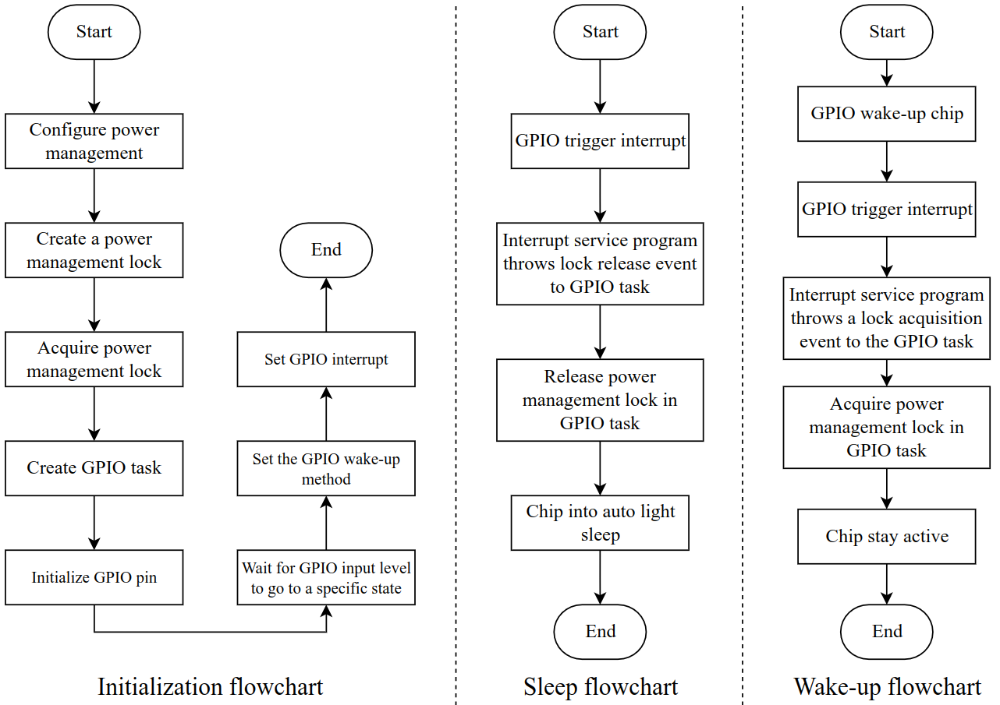

Note: The priority of the GPIO task is higher than level 0 because the priority of the idle task is level 0.

##### Low Level

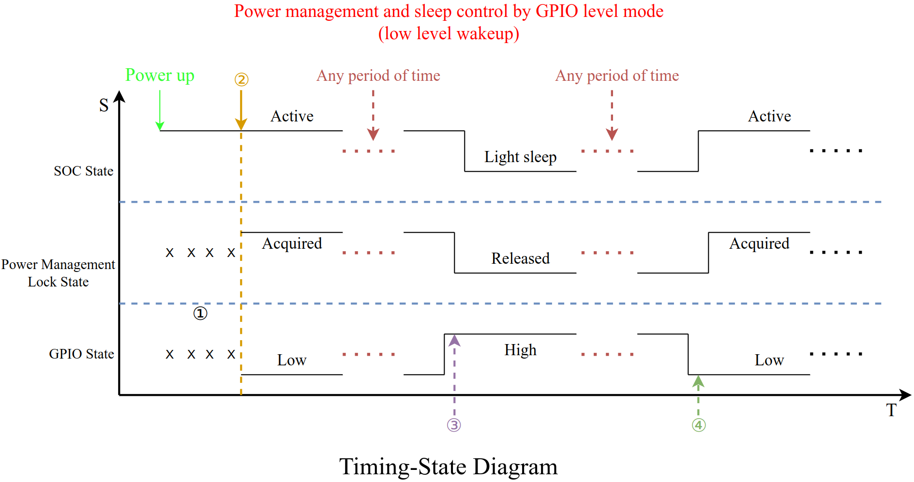

1. The development board has just been powered up and is not yet initialized, so the power management locks and GPIO states are uncertain.
2. Initialization
   1. Since the chip should remain active after power-up and the corresponding GPIO state is low, set the internal pull-down resistor (the example uses the internal pull-down resistor by default, or it can be configured not to use it) when the GPIO is initialized to ensure that the GPIO input is low.
   2. Set the GPIO wake-up level to low. Since the ESP-C6 and ESP-H2 support digital peripherals power-down, if digital peripherals power-down is configured, wake-up using lp io or ext1 should be used.
   3. Since a low level corresponds to the state of acquiring the lock, then a high level corresponds to the state of releasing the lock, so set the next GPIO interrupt to a high level interrupt.
3. Release lock
   1. The GPIO input high level, triggering the GPIO interrupt, and since the GPIO should acquire a lock when it goes low again, the next interrupt trigger type is immediately modified to low.
   2. The interrupt service program throws a lock release event to the GPIO task.
   3. The GPIO task completes the lock release operation, after which the chip enters auto light sleep.
4. Acquire lock
   1. The GPIO input goes low, the chip wakes up and triggers a GPIO interrupt. Since the lock should be released when the GPIO goes high again, the next interrupt trigger type is immediately modified to high.
   2. The interrupt service program throws a lock acquisition event to the GPIO task.
   3. The lock acquisition is done in the GPIO task and the chip stays active after that.

The software state machine for this mode, is as follows:


##### High Level

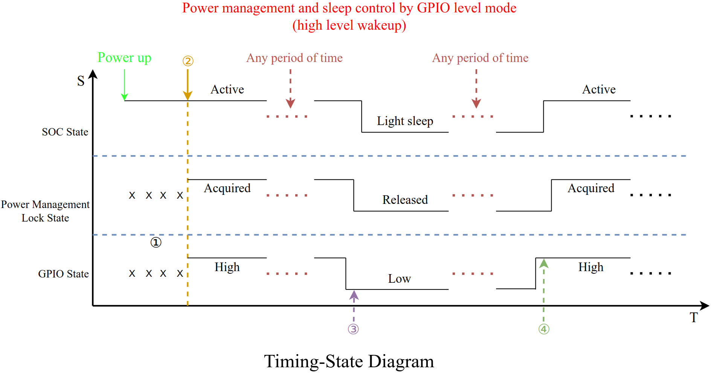

1. The development board has just been powered up and is not yet initialized, so the power management locks and GPIO states are uncertain.
2. Initialization
   1. Since the chip should remain active after power-up and the corresponding GPIO state is high, set the internal pull-up resistor (the example uses the internal pull-up and down resistor by default, or it can be configured not to use it) when the GPIO is initialized to ensure that the GPIO input is high.
   2. Set the GPIO wake-up level to high. Since the ESP-C6 and ESP-H2 support digital peripherals power-down, if digital peripherals power-down is configured, wake-up using lp io or ext1 should be used.
   3. Since a high level corresponds to the state of acquiring the lock, then a low level corresponds to the state of releasing the lock, so set the next GPIO interrupt to a low level interrupt.
3. Release lock
   1. The GPIO input goes low, triggering a GPIO interrupt. Since the lock should be acquired when the GPIO goes high again, the next interrupt trigger type is immediately modified to high.
   2. The interrupt service program throws a lock release event to the GPIO task.
   3. The GPIO task completes the lock release operation, after which the chip enters auto light sleep.
4. Acquire lock
   1. GPIO input goes high, the chip wakes up and triggers a GPIO interrupt. Since the lock should be released when the GPIO goes low again, the next interrupt trigger type is immediately modified to low.
   2. The interrupt service program throws a lock acquisition event to the GPIO task.
   3. The lock acquisition is done in the GPIO task and the chip stays active after that.

The software state machine for this mode, is as follows:

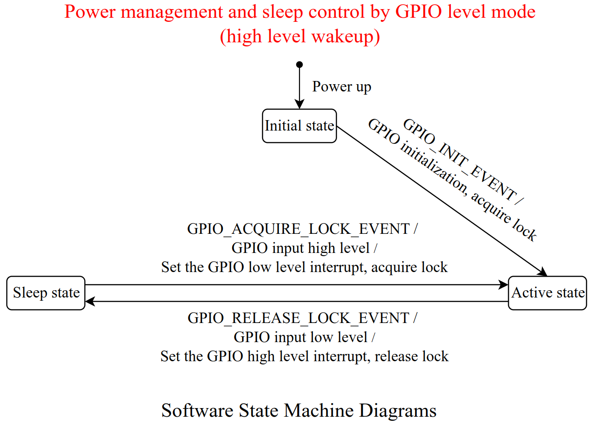

#### Pulse Mode

Pulse control mode is characterized by triggering a complete pulse once and the chip state changes.

The pulse control mode differs in two ways:

1. After the interrupt is triggered, the complete pulse needs to be detected before operating the power management lock.
2. The GPIO interrupt type remains unchanged at all times.

The control flow of pulse mode mainly contains three processes, firstly, initialization, and then at a certain moment when the GPIO inputs pulse, it triggers the release of the power management lock, and the chip enters the process of auto light sleep. When the GPIO inputs pulse again, it will trigger to wake up the chip, get the power management lock, and keep the chip active.

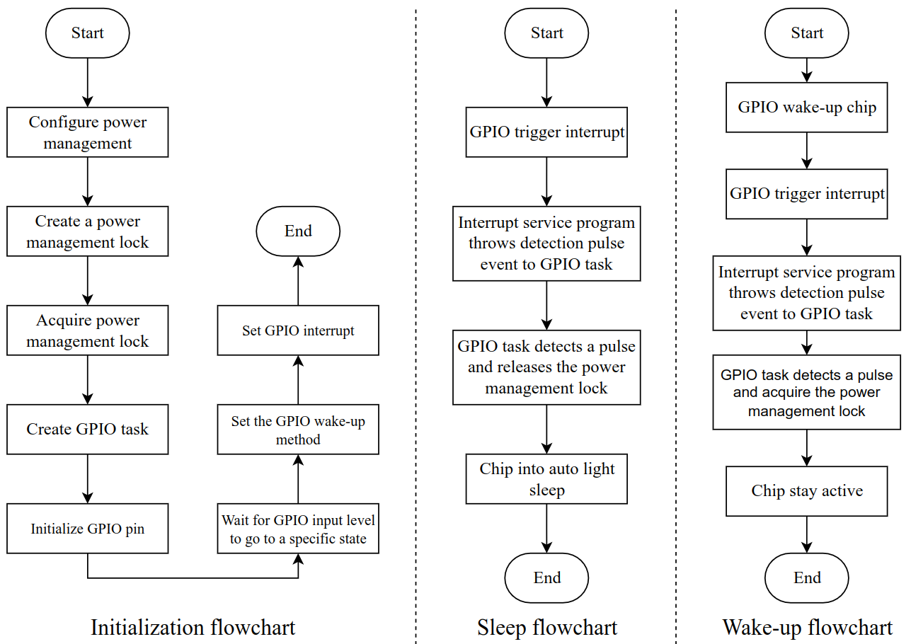

Note 1: The priority of GPIO task should be higher than level 0 because the priority of idle task is level 0.

Note 2: When using pulse mode, pay attention to de-jittering to prevent the complete pulse from being detected due to jitter.

##### Low Level

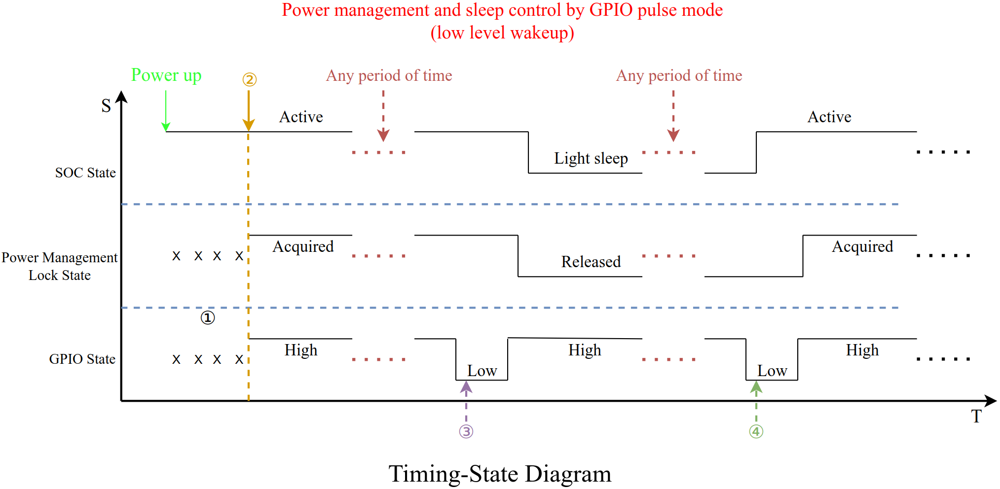

1. The development board has just been powered up and is not yet initialized, so the power management locks and GPIO states are uncertain.
2. Initialization
   1. Since the set low level triggers the interrupt, the GPIO is initialized with the internal pull-up resistor set (the example uses the internal pull-up and down resistors by default, or can be configured not to use them) to ensure that the GPIO input goes high.
   2. Set the GPIO wake-up level to low. Since the ESP-C6 and ESP-H2 support digital peripherals power-down, if digital peripherals power-down is configured, wake-up using lp io or ext1 should be used.
   3. Sets a low level interrupt.
3. Release lock
   1. The GPIO input goes low, triggering the GPIO interrupt, and the interrupt service program detects the event of the pulse into the GPIO task.
   2. The GPIO task detects the pulse and completes the lock release operation, after which the chip enters auto light sleep.
4. Acquire lock
   1. The GPIO input goes low, the chip wakes up and triggers the GPIO interrupt, and the interrupt service program detects the event of the pulse into the GPIO task.
   2. The GPIO task detects the pulse and completes the lock acquisition operation, after which the chip remains active.

The software state machine for this mode, is as follows:

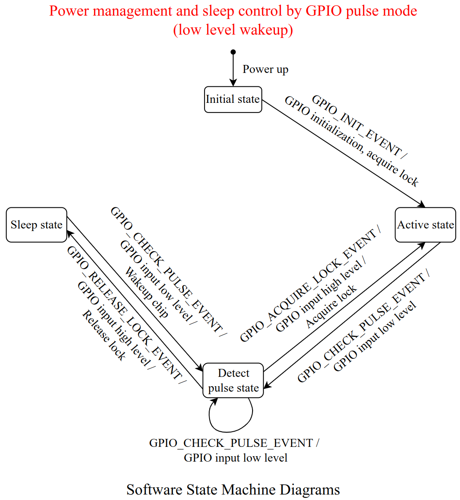

##### High Level

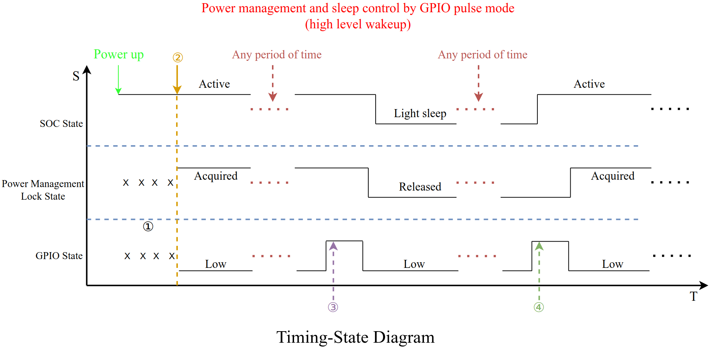

1. The development board has just been powered up and is not yet initialized, so the power management locks and GPIO states are uncertain.
2. Initialization
   1. Since the set high level triggers the interrupt, the GPIO is initialized with the internal pull-down resistor set (the example uses the internal pull-down resistor by default, or it can be configured not to use it) to ensure that the GPIO input is low.
   2. Set the GPIO wake-up level to high. Since the ESP-C6 and ESP-H2 support digital peripherals power-down, if digital peripherals power-down is configured, wake-up using lp io or ext1 should be used.
   3. Sets a high level interrupt.
3. Release lock
   1. The GPIO input goes high, triggering the GPIO interrupt, and the interrupt service program detects the event of the pulse into the GPIO task.
   2. The GPIO task detects the pulse and completes the lock release operation, after which the chip enters auto light sleep.
4. Acquire lock
   1. The GPIO input goes high, the chip wakes up and triggers the GPIO interrupt, and the interrupt service program detects the event of the pulse into the GPIO task.
   2. The GPIO task detects the pulse and completes the lock acquisition operation, after which the chip remains active.

The software state machine for this mode, is as follows:

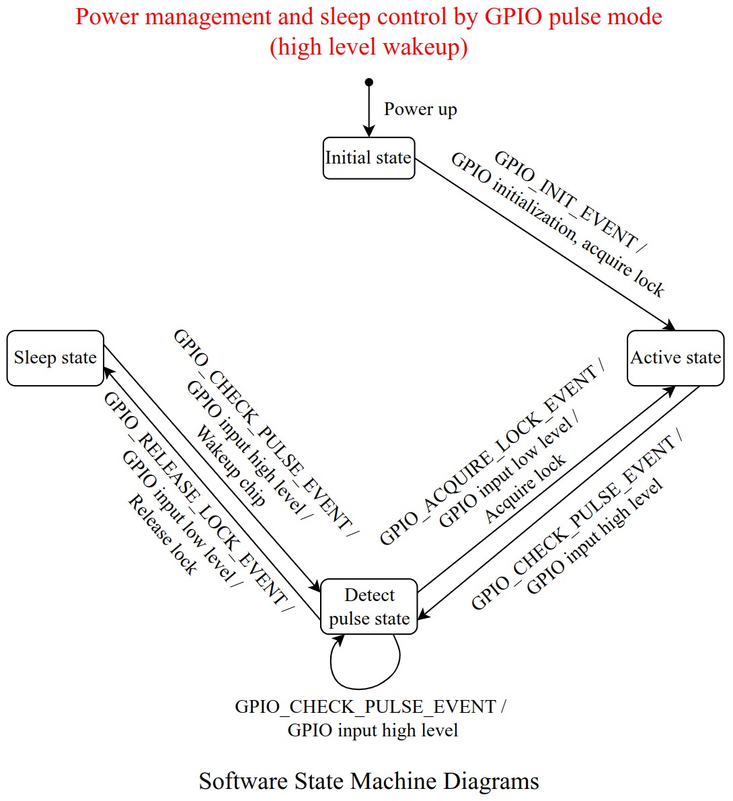

### UART Control

The general idea of UART control: wake up the chip through UART, get the power management lock, the chip stays active, and after a period of time of idle (no UART data received), then release the lock, and the chip enters auto light sleep.

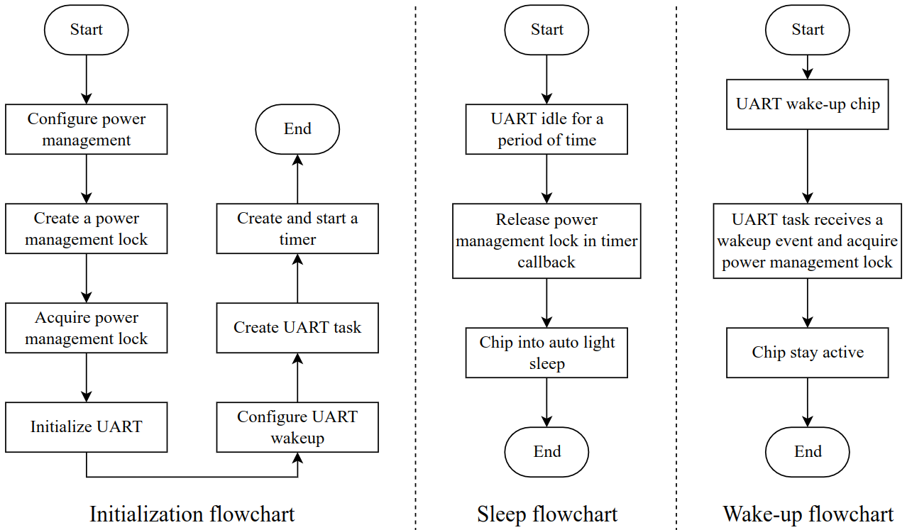

The software state machine for UART control is as follows:


