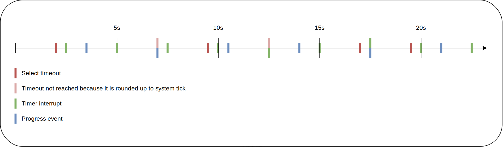

| Supported Targets | ESP32 | ESP32-C2 | ESP32-C3 | ESP32-C5 | ESP32-C6 | ESP32-H2 | ESP32-P4 | ESP32-S2 | ESP32-S3 |
| ----------------- | ----- | -------- | -------- | -------- | -------- | -------- | -------- | -------- | -------- |

# eventfd example

The example demonstrates the use of `eventfd()` to collect events from other tasks and ISRs in a
`select()` based main loop.  The example starts two tasks and installs a timer interrupt handler:
1. The first task writes to the first `eventfd` periodically.
2. The timer interrupt handler writes to the second `eventfd`.
3. The second task collects the event from two fds with a `select()` loop.

## How to use example

### Hardware Required

This example should be able to run on any commonly available ESP32, ESP32S2, ESP32S3 or ESP32C3 development board.

### Configure the project

```
idf.py menuconfig
```

The default config will work.

### Build and Flash

Build the project and flash it to the board, then run monitor tool to view serial output:

```
idf.py -p PORT flash monitor
```

(Replace PORT with the name of the serial port to use.)

(To exit the serial monitor, type ``Ctrl-]``.)

See the Getting Started Guide for full steps to configure and use ESP-IDF to build projects.

## Example Output

The following log output should appear when the example runs (note that the bootloader log has been omitted).

```
I (4340) eventfd_example: Elapsed since test start: 2003 ms
I (4340) eventfd_example: Select timeout
I (4830) eventfd_example: Elapsed since test start: 2499 ms
I (4830) eventfd_example: TimerEvent fd event triggered
I (5830) eventfd_example: Elapsed since test start: 3493 ms
I (5830) eventfd_example: Progress fd event triggered
I (7330) eventfd_example: Elapsed since test start: 4999 ms
I (7330) eventfd_example: TimerEvent fd event triggered
I (7330) eventfd_example: =================================
I (7340) eventfd_example: Select timeouted for 1 times
I (7340) eventfd_example: Timer triggered for 2 times
I (7350) eventfd_example: Progress triggered for 1 times
I (7360) eventfd_example: =================================
I (9330) eventfd_example: Elapsed since test start: 6993 ms
I (9330) eventfd_example: Progress fd event triggered
I (9830) eventfd_example: Elapsed since test start: 7499 ms
I (9830) eventfd_example: TimerEvent fd event triggered
I (11840) eventfd_example: Elapsed since test start: 9503 ms
I (11840) eventfd_example: Select timeout
I (12330) eventfd_example: Elapsed since test start: 9999 ms
I (12330) eventfd_example: TimerEvent fd event triggered
I (12330) eventfd_example: =================================
I (12340) eventfd_example: Select timeouted for 2 times
I (12340) eventfd_example: Timer triggered for 4 times
I (12350) eventfd_example: Progress triggered for 2 times
I (12360) eventfd_example: =================================
```

## Diagram

The following diagram shows, with a timeline, the order of the events:


